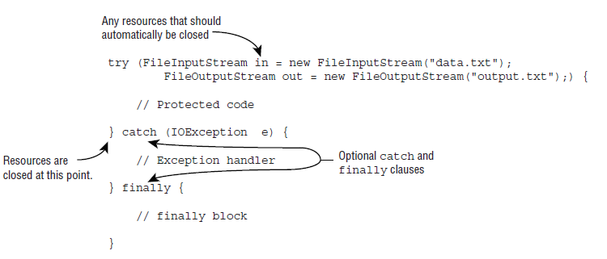

- [1. General](#1-general)
- [2. Java Building Blocks](#2-java-building-blocks)
- [3. Operators](#3-operators)
- [4. Making Decisions](#4-making-decisions)
- [5. Core Java APIs](#5-core-java-apis)
  - [5.1. Creating and Manipulating Strings](#51-creating-and-manipulating-strings)
  - [5.2. The String Pool](#52-the-string-pool)
  - [5.3. Java Arrays](#53-java-arrays)
  - [5.4. Wrapper classes](#54-wrapper-classes)
  - [5.5. Autoboxing and Unboxing](#55-autoboxing-and-unboxing)
  - [5.6. Creating Sets and Maps](#56-creating-sets-and-maps)
  - [5.7. Math APIs](#57-math-apis)
- [6. Lambda And Functional Interfaces](#6-lambda-and-functional-interfaces)
  - [6.1. Lambda](#61-lambda)
  - [6.2. Functional Interfaces](#62-functional-interfaces)
  - [6.3. Working with Variables in Lambdas](#63-working-with-variables-in-lambdas)
  - [6.4. Calling APIs with Lambdas](#64-calling-apis-with-lambdas)
- [7. Methods and Encapsulation](#7-methods-and-encapsulation)
  - [7.1. Methods](#71-methods)
  - [7.2. Applying Access Modifiers](#72-applying-access-modifiers)
  - [7.3. Applying the static Keyword](#73-applying-the-static-keyword)
  - [7.4. Overloading Methods](#74-overloading-methods)
- [8. Class Design](#8-class-design)
  - [8.1. Missing a Default No-Argument Constructor](#81-missing-a-default-no-argument-constructor)
  - [8.2. Constructors and final Fields](#82-constructors-and-final-fields)
  - [8.3. Overloaded Constructors](#83-overloaded-constructors)
  - [8.4. Order of Initialization](#84-order-of-initialization)
  - [8.5. Inheriting Members](#85-inheriting-members)
  - [8.6. Overriding a Generic Method](#86-overriding-a-generic-method)
  - [8.7. Hiding Static Methods](#87-hiding-static-methods)
  - [8.8. Creating final Methods](#88-creating-final-methods)
  - [8.9. Understanding Polymorphism](#89-understanding-polymorphism)
- [9. Advanced Class Design](#9-advanced-class-design)
  - [9.1. Abstract Classes](#91-abstract-classes)
  - [9.2. Interfaces](#92-interfaces)
  - [9.3. Polymorphism and Interfaces](#93-polymorphism-and-interfaces)
  - [9.4. Interface Definition Rules](#94-interface-definition-rules)
  - [9.5. Abstract Interface Method Rules](#95-abstract-interface-method-rules)
  - [9.6. Interface Variables Rules](#96-interface-variables-rules)
  - [9.7. Inner Class](#97-inner-class)
- [10. Exceptions](#10-exceptions)
  - [10.1. Checked Exceptions](#101-checked-exceptions)
  - [10.2. Unchecked Exceptions](#102-unchecked-exceptions)
  - [10.3. throw \& throws](#103-throw--throws)
  - [10.4. Recognizing Exception Classes](#104-recognizing-exception-classes)
  - [10.5. Handling Exceptions](#105-handling-exceptions)
- [11. Modules](#11-modules)
  - [11.1. Custom Java Builds](#111-custom-java-builds)
  - [11.2. Unique Package Enforcement](#112-unique-package-enforcement)
  - [11.3. Creating and Running a Modular Program](#113-creating-and-running-a-modular-program)
  - [11.4. Running Module](#114-running-module)
- [12. Java Fundamentals](#12-java-fundamentals)
  - [12.1. Applying the final Modifier](#121-applying-the-final-modifier)
  - [12.2. ENUMS](#122-enums)
  - [12.3. Nested Classes](#123-nested-classes)
  - [12.4. Understanding Interface Members](#124-understanding-interface-members)
  - [12.5. Introducing Functional Programming](#125-introducing-functional-programming)
- [13. Annotations](#13-annotations)
  - [13.1. Creating Custom Annotations](#131-creating-custom-annotations)
  - [13.2. Applying Annotations](#132-applying-annotations)
  - [13.3. Declaring Annotation‐Specific Annotations](#133-declaring-annotationspecific-annotations)
  - [13.4. Using Common Annotations](#134-using-common-annotations)
- [14. Generics And Collections](#14-generics-and-collections)
  - [14.1. Using Wrapper Classes](#141-using-wrapper-classes)
  - [14.2. Using the Diamond Operator](#142-using-the-diamond-operator)
  - [14.3. Using Lists, Sets, Maps, and Queues](#143-using-lists-sets-maps-and-queues)
  - [14.4. Sorting Data](#144-sorting-data)
  - [14.5. Working with Generics](#145-working-with-generics)
  - [14.6. **SUMMARY**](#146-summary)
- [15. Functional Programming](#15-functional-programming)
  - [15.1. Working with Built‐in Functional Interfaces](#151-working-with-builtin-functional-interfaces)
  - [15.2. Returning an Optional](#152-returning-an-optional)
  - [15.3. **Using Streams**](#153-using-streams)
  - [15.4. **Working with Primitive Streams**](#154-working-with-primitive-streams)
  - [15.5. **Working with Advanced Stream Pipeline Concepts**](#155-working-with-advanced-stream-pipeline-concepts)
  - [15.6. SUMMARY](#156-summary)
- [16. Exceptions, Assertions, and Localization](#16-exceptions-assertions-and-localization)
  - [16.1. Automating Resource Management](#161-automating-resource-management)
  - [16.2. Declaring Assertions](#162-declaring-assertions)
  - [16.3. Working with Dates and Times](#163-working-with-dates-and-times)
  - [16.4. Supporting Internationalization and Localization](#164-supporting-internationalization-and-localization)
  - [16.5. **Loading Properties with Resource Bundles**](#165-loading-properties-with-resource-bundles)
- [17. Module Advance](#17-module-advance)
- [18. Concurrency](#18-concurrency)
  - [18.1. Introduction](#181-introduction)
  - [18.2. Concurrency API](#182-concurrency-api)
  - [18.3. Writing Thread‐Safe Code](#183-writing-threadsafe-code)
  - [18.4. Using Concurrent Collections](#184-using-concurrent-collections)
  - [18.5. Threading Problems](#185-threading-problems)
  - [18.6. Parallel Streams](#186-parallel-streams)
- [19. I/O](#19-io)
  - [19.1. Files and Directories](#191-files-and-directories)
  - [19.2. I/O Streams](#192-io-streams)
  - [19.3. Common I/O Stream Operations](#193-common-io-stream-operations)
  - [19.4. Working with I/O Stream Classes](#194-working-with-io-stream-classes)
  - [19.5. SYSTEM STREAMS](#195-system-streams)
  - [19.6. CONSOLE](#196-console)
- [20. NIO](#20-nio)
  - [20.1. Path Create](#201-path-create)
  - [20.2. ABSOLUTE VS. RELATIVE PATHS](#202-absolute-vs-relative-paths)
  - [20.3. FILES.READALLLINES() VS. FILES.LINES()](#203-filesreadalllines-vs-fileslines)
  - [20.4. **Streams**](#204-streams)
  - [20.5. **RandomAccessFile**](#205-randomaccessfile)
  - [20.6. BufferWriter](#206-bufferwriter)
  - [20.7. **Exceptions**](#207-exceptions)
  - [20.8. **Files**](#208-files)
- [21. JDBC](#21-jdbc)


<br/> 

# 1. General

## 1.1. Identifying Benefits of Java

- Java is not procedural
- Java allows for functional programming within a class, but object-oriented is still the main organization of code.
- Java is an interpreted language
- Java is Robust. (Because of Garbage collector)
- It is simple by not providing pointers or operator overloading
- Java is secure because it runs inside a virtual machine.
- The language facilitates multithreaded programming and **strives** for backward compatibility.

### 1.1.1. Benefits of Java (summary)

- include object-oriented design,
- encapsulation,
- platform independence,
- robustness,
- simplicity,
- security,
- multithreading,
- backward compatibility


## 1.2. Classes vs. Files

- If a class is defined in its own .java file, java doesn't require that the class be public.
- Multiple classes can be defined in the same file, but only one of them is allowed to be public.
- The public class matches the name of the file.

**Animal.java**
```java
class Animal {
  private String name;
}
```
You can even put two classes in the same file.  
When you do so, at most one of the classes in the file is allowed to be public

**Animal.java**
```java
public class Animal {
  private String name;
}

class Animal2 {
}

```

## 1.3. main() Method
**main methot parameter**
```java
String[] options;  
String options [];  
String... options;
```
- You can use **final** for main method.

## 1.4. Package Declaration And Import
**java.lang.** package is special in that it is automatically imported.

## 1.5. JDK
- The Java Development Kit **(JDK)** is used to do software development.
- It contains the compiler **(javac)**, which turns source code into bytecode.
- It also contains the Java Virtual Machine **(JVM)** launcher (java).

## 1.6. java & javac Commands
- **javac -d** < directory >
- **java -cp** classes packageb.ClassB
- **java -classpath** classes packageb.ClassB
- **java --class-path** classes packageb.ClassB

## 1.7. Creating a JAR File

- **jar -cvf** myNewFile.jar **.**
- **jar --create --verbose --file** myNewFile.jar **.**
- **jar -cvf** myNewFile.jar **-C** < directory > **.**


<br/> <br/>   


# 2. Java Building Blocks

## 2.1. Understanding Data Types

Java has eight built-in data types, referred to as the Java primitive types.  
These eight data types represent the building blocks for Java objects, because all Java objects are just a complex collection of these primitive data types.  
That said, a primitive is not an object in Java nor does it represent an object. A primitive is just a single value in memory, such as a number or character.

| Keyword | Type | Example |
| ------------- | ------------- |------------|
| boolean | true or false | true|
| byte | 8-bit integral value | 123|
| short | 16-bit integral value | 123 |
| int | 32-bit integral value | 123  |
| long | 64-bit integral value | 123L |
| float | 32-bit integral value |123.45f  |
| double | 64-bit integral value | 123.456 |
| char | 16-bit integral value | 'a' |

**Example**

```java
short var1 = 'a';
int var2 = 'b';
char var3 = (int)100;
char var4 = (short)101;
char var5 = (double)102; // does not compile
char var6 = (short)-1; // does not compile. It must >= 0
short var7 = 32768; // does not compile. 

System.out.println("var1 = " + var1);
System.out.println("var2 = " + var2);
System.out.println("var3 = " + var3);
System.out.println("var4 = " + var4);
```

Print:
```
var1 = 97
var2 = 98
var3 = d
var4 = e
```

* var7 does not compile, because short is 16 bit. It indicates that it can take between
    and  (-32768 and 32767)


## 2.2. Writing Literals

* Octal (digits 0–7), which uses the number 0 as a prefix.  
  For example, 017

* Hexadecimal (digits 0–9 and letters A–F/a–f), which uses 0x or 0X as a prefix.  
  For example, 0xFF, 0xff, 0XFf. Hexadecimal is case insensitive so all of these examples mean the same value.

* Binary (digits 0–1), which uses the number 0 followed by b or B as a prefix.  
  For example, 0b10, 0B10

```java
System.out.println(017);  // 15
System.out.println(0x1F); // 31
System.out.println(0b10); // 2
```

### 2.2.1. Using Undercore
```java
double notAtStart = _1000.00;    // does not compile
double notAtEnd = 1000.00_;      // does not compile
double notByDecimal = 1000_.00;  // does not compile

double annoyingButLegal = 1_00_0.0_0; // compile
double reallyUgly = 1__________2;     // compile
int million2 = 1_000_000;             // compile
```

## 2.3. Declaring Variables

```java
int _a = 12;
long a_12 = 2;
String $ = "it is dollar";
String _ = "underscore"; // does not compile
String 12aa = "test"; // does not compile
byte hollywood@vine; // does not compile
```
<br/> 

### 2.3.1. Local Variables

When defining a local variable, make sure it’s initialized before it’s used.

```java
public int notValid() { 
  int y = 10;
  int x;              // compile
  int reply = x + y; // DOES NOT COMPILE
}
```

*Example for if statement :*
```java
  public void findAnswer(boolean check) {
        int answer;
        int otherAnswer;
        int onlyOneBranch;
        if (check) {
            onlyOneBranch = 1;
            answer = 1;
        } else {
            answer = 2;
        }
        System.out.println(answer);
        System.out.println(onlyOneBranch); // DOES NOT COMPILE
    }
}
```
<br/> 

### 2.3.2. Passing Constructor and Method Parameters
```java
public void findAnswer(boolean check) {

}

public void checkAnswer() {
  boolean value;
  findAnswer(value); // DOES NOT COMPILE
}
````

### 2.3.3. Defining Instance and Class Variables

*Default initialization values by type*
|Variable type | Default value|
|--------------|--------------|
| boolean | false |
| byte, short, int, long| 0 |
| float, double| 0.0 |
| char | '\u0000' (NUL)|
| all objects| null |

<br/> 


### 2.3.4. Introducing var

- Starting in Java 10, it is a option of using the keyword var instead of the type for local variables.

```java
public void whatTypeAmI() { 
  var name = "Hello";
  var size = 7;
}
```

- You can only use this feature for local variables.

```java
public class MyClass() { 
  var name = "Hello"; // DOES NOT COMPILE
  ...
}
```

#### 2.3.4.1. Type Inference of var
*reassignment :*
```java
public void reassignmentMethod() {
 var number = 7;
 number = 4;
 number = "five"; // DOES NOT COMPILE
}
```
*casting :*
```java
 var apples = (short)10;
 apples = (byte)5;
 apples = 1_000_000; // DOES NOT COMPILE
```

*you must initialize :*
```java
  var question; // DOES NOT COMPILE
  question = 1; 

  int a;      // compile
  a = 5;
```

*initializing details :*
```java
  var n = null; // DOES NOT COMPILE

  var a = 2, b = 3; // DOES NOT COMPILE
  int c = 5, d = 6; // compile
```

*init with String or primive :*

```java 
 var n = "myData";
 n = null;   // compile

 var m = 4;
 m = null;  // DOES NOT COMPILE

 var o = (String)null;  // compile
 var number = (Integer)null; // compile

 var var = "var";   // compile !!!!

 var squirrel = new Object();
 squirrel = "";     // compile

```

*you can use **var** as child instead of parent:*

```java 
 var squirrel = new Object();
 squirrel = "";     // compile

```

*function parameter error :*

```java 
public int addition(var a, var b) { // DOES NOT COMPILE 
return a + b;
}
```
*defining class error


```java
public class var {} // DOES NOT COMPILE 
```

<br/> 


**its compile !!**
```java
package var;

public class Var { 
  
  public void var() { 
    var var = "var";
  }

  public void Var() {
    Var var = new Var(); 
  }
}
```
<br/> 

### 2.3.5. Review of var Rules

- A var is used as a local variable in a constructor, method, or initializer block.
- A var cannot be used in constructor parameters, method parameters, instance vari- ables, or class variables.
-  A var is always initialized on the same line (or statement) where it is declared.
- The value of a var can change, but the type cannot.
- A var cannot be initialized with a null value without a type.
- A var is not permitted in a multiple-variable declaration.
- A var is a reserved type name but not a reserved word, meaning it can be used as an identifier except as a class, interface, or enum name.

## 2.4. Variable Scope

* Local variables: In scope from declaration to end of block
* Instance variables: In scope from declaration until object eligible for garbage collection
* Class variables: In scope from declaration until program ends

```java

public class MyClass { 
  
  final static int MAX_LENGTH = 5;  // class variable
  int length;                       // instance variable

  public void method() { 
    int inches = 40;                // local variable
  }
   
}

```
<br/> <br/>  

# 3. Operators
## 3.1. Understanding Java Operators

### 3.1.1. Types of Operators

- unary
- binary
- ternary

### 3.1.2. Operator Precedence

|Operator|Symbols and examples|
|--------|--------------------|
|Post-unary operators|expression++ , expression--|
|Pre-unary operators|++expression , --expression|
|Other unary operators|- , ! , ~ , + , (type)|
|Multiplication/division/modulus|* , / , %|
|Addition/subtraction| + , -|
|Shift operators|<< , >> ,  >>>|
|Relational operators|< , > , <= , >= ,  instanceof|
|Equal to/not equal to| == , !=|
|Logical operators|& , ^ ,  \| |
|Short-circuit logical operators| &&, \|\| |
|Ternary operators| boolean expression ? expression1 : expression2|
|Assignment operators| = , += , -= , *= , /= , %= , &= , ^= , \|= , <<= , >>= , >>>= |


## 3.2. Applying Unary Operators

|Operator|
|--------|
|!|
|+|
|-|
|++|
|--|
|(type) cast|

*using negation operator twice with parentheses ()*
```java
double zooTemperature = 1.21; 
System.out.println(zooTemperature); // 1.21 
zooTemperature = -zooTemperature; 
System.out.println(zooTemperature); // -1.21 
zooTemperature = -(-zooTemperature); 
System.out.println(zooTemperature); // -1.21 !!!!
zooTemperature = -zooTemperature; 
System.out.println(zooTemperature); // 1.21  
```

*lthe last working operator determines whether the variable is positive or negative*
```java
int number = 5;
number = -number;
System.out.println(number); // -5

number = -number;
System.out.println(number); // -5 again !

number = +number;
System.out.println(number); // 5

number = +-+-number;
System.out.println(number); // 5

number = -+-+-+number;
System.out.println(number); // -5 
```

### 3.2.1. Numeric Promotion

#### 3.2.1.1. Numeric Promotion Rules

1. If two values have different data types, Java will automatically promote one of the values to the larger of the two data types.
2. If one of the values is integral and the other is floatingpoint, Java will automatically promote the integral value to the floatingpoint value’s data type.
3. Smaller data types, namely, byte, short, and char, are first promoted to int any time they’re used with a Java binary arithmetic operator, even if neither of the operands is int.
4. After all promotion has occurred and the operands have the same data type, the resulting value will have the same data type as its promoted operands.

*Example1 :*
```java
int x = 1;
long y = 33;
var z = x * y;
System.out.println("z = " + z);  // 33 (int)

```

*Example2 :*
```java
double x = 39.21;
float y = 2.1f;
var z = x + y;
System.out.println("z = " + z1); //41.30999990463257 (double)
```

*Example3 :*
```java
short x = 10;
short y = 3;
var z = x * y;
System.out.println("z = " + z); // 30 (int)
```

*Example4 :*
```java
short w = 10;
float x = 4;
double y = 5;
var z = w * x / y;

System.out.println("z = " + z); // 8.0 (double)

```

*Example5 :*
```java
char x = 10;
char y = 'A';  // 65 ascii

System.out.println(x + y); // 75 (int)
```

### 3.2.2. Casting

*Example1 :*
```java
 int number = (int)(double)(float)(long)(int) 10; // compile !!
```

### 3.2.3. Casting Hierarchy

**double > float > long > int = char = short = byte**

```java

char c1 = (short)10;

short s1 = (char)10;
short s2 = (int)10;

int i1 = (char)10;

float f1 = (long)10 ; 
float f2 = (int)10;
float f3 = (short)10;
float f4 = (char)10;
float f5 = (double)10; // DOES NOT COMPILE

double d1 = (char)10;


 ```
*Example3 :*
```java
short s1 = 0000000000000000; // compile

short s2 = 1921222; // DOES NOT COMPILE because of over max value
short s3 = (short)1921222; // Stored as 20678

 ```

*Example4 :*

 ```java 
short mouse = 10;
short hamster = 3;
short capybara = mouse * hamster; // DOES NOT COMPILE because of arithmetic operator

short capybara2 = (short)(mouse * hamster); // compile

short capybara3 = 1 + (short)(mouse * hamster);  // DOES NOT COMPILE because of arithmetic operator

 ```

## 3.3. Assignment Operator Return Value

*Example1 :*
 ```java 
long wolf = 5;
long coyote = (wolf=3); 

System.out.println(wolf);   // 3 
System.out.println(coyote); // 3
 ```


*Example2 :*
```java 
boolean healthy = false; 

if(healthy = true)
    System.out.print("Good!");
 
```
Print
``` 
GOOD !
```

## 3.4. Comparing Values


```java 
System.out.println( 55 == 5_5.0 ); // true
System.out.println( null == null ); // true
```


### 3.4.1. instanceof Operator

```java 
System.out.print(null instanceof Object);
System.out.print(null instanceof String);
System.out.print(null instanceof null); // DOES NOT COMPILE
```


## 3.5. Logical Operators

|Operator| Description |
|--------|---|
|&| AND|
|\|| OR |
|^| XOR|


<br/> 
<br/> 


# 4. Making Decisions

## 4.1. Switch Data Types

* Prior to Java 5.0, this variable could only be int values or those values that could be promoted to int, specifically byte, short, char, or int, which we refer to as primitive numeric types.
* The switch statement also supports any of the wrapper class versions of these primitive numeric types, such as Byte, Short, Character, or Integer.

The following is a list of all data types supported by switch statements:
- int and Integer
- byte and Byte
- short and Short
- char and Character
-  String
- enum values
- var (if the type resolves to one of the preceding types)

**boolean, long, float, double, and each of their associated wrapper classes are not supported by switch statements.**

*Example1 :*
```java 
int dayOfWeek = 5;
switch (dayOfWeek) {
    default:
        System.out.println("Weekday"); // compile and print Weekday
        break;
    case 0:
        System.out.println("Sunday");
        break;
    case 6:
        System.out.println("Saturday");
        break;
}

```

*Example2 : if **value** is not available in conditions, **default** conditions run. And if f **break** is not available, next conditions run*
```java 
var dayOfWeek = 5;
switch (dayOfWeek) {
  case 1:
      System.out.println("Monday");
  default:
      System.out.println("Weekday");
  case 6:
      System.out.println("Saturday");;
      break;
}
```
*print:*
```
Weekday
Saturday
```
## 4.2. Acceptable Case Values

You can use only literals, enum constants, or final constant variables of the same data type.

```java
final int getCookies() {
    return 4;
}

void feedAnimals() {
    final int bananas = 1;
    int apples = 2;
    int numberOfAnimals = 3;
    final int cookies = getCookies();
    switch (numberOfAnimals) {
        case bananas:
        case apples: // DOES NOT COMPILES
        case getCookies(): // DOES NOT COMPILE 
        case cookies : // DOES NOT COMPILE 
        case 3 * 5 :
    }
}
```
-> The bananas variable is marked final, and its value is known at compile-time, so it is valid.  
-> The apples variable is not marked final, even though its value is known, so it is not permitted.  
-> The next two case statements, with values getCookies() and cookies, do not compile because methods are not evaluated until runtime, so they cannot be used as the value of a case statement, even if one of the values is stored in a final variable


```java 
 private int getSortOrder(String firstName, final String lastName) {
        String middleName = "Patricia";
        final String suffix = "JR";
        int id = 0;
        switch (firstName) {
            case "Test":
                return 52;
            case middleName: // DOES NOT COMPILE
                id = 5;
                break;
            case suffix:
                id = 0;
                break;
            case lastName:// DOES NOT COMPILE
                id = 8;
                break;
            case 5: // DOES NOT COMPILE
                id = 7;
                break;
            case 'J': // DOES NOT COMPILE
                id = 10;
                break;
            case java.time.DayOfWeek.SUNDAY: // DOES NOT COMPILE
                id = 15;
                break;
        }
        return id;
    }
```
- middleName is not a constant value
-  despite lastName being final, it is not constant as it is passed to the function
- The others are not String

### Numeric Promotion and Casting

```java 
short size = 4;
final int small = 15; 
final int big = 1_000_000; 

switch(size) {
    case small:
    case 1+2 :
    case 'b':
    case big: // DOES NOT COMPILE
    case (short)big: // COMPILE
}
```
- 1_000_000 is too large to fit inside of **short** without an explicit **cast**

### 4.2.1. For Loop

#### 4.2.1.1. Creating an Infinite Loop
```java
for( ; ; )
    System.out.println("Hello World");
 ```
#### 4.2.1.2. Adding Multiple Terms to the for Statement
```java 
int x = 0;
for (long y = 0, z = 4; x < 5 && y < 10; x++, y++) { // compile !
    System.out.print(y + " ");
}
System.out.print(x + " ");
```
#### 4.2.1.3. Using Incompatible Data Types in the Initialization Block

*The variables in the initialization block must all be of the same type.*
```java 
int x = 0;

for(long y = 0, int z = 4; x < 5; x++) { // DOES NOT COMPILE
  System.out.print(y + " "); 
}

```
🔴 **Note :**  *for-each statement must be a primitive array or any class that
implements java.lang.Iterable, which includes the Collection interface, although
not all Collections Framework classes*

### 4.2.2. Adding Optional Labels
*A label is an optional pointer to the head of a statement that allows the application flow to jump to it or break from it.*
```java
int[][] myComplexArray = {{5, 2, 1, 3}, {3, 9, 8, 9}, {5, 7, 12, 7}};
 _OUTER_LOOP: for (int[] mySimpleArray : myComplexArray) {
    INNER_LOOP: for (int i = 0; i < mySimpleArray.length; i++) {
                    System.out.print(mySimpleArray[i] + "\t");
                }
               System.out.println();
              }
 ```
*You can define multible variable anywhere for statements :)*
```java 
 int frog = 15;
  IF_1: IF_2: IF_3: if (frog > 10)
      EVEN_WORSE_IDEA: I_DEFINE_ANYWHERE:{
      frog++;
  }

```

*you can use label for **break** or **continue***
```java
PARENT_LOOP: for (int i = 0; i < 10; i++) {
          if (i % 2 == 0)
              break PARENT_LOOP;
           else
              continue PARENT_LOOP;
      }
 ```

**Break depend label !!!**

*Example 1:*
```java 
PARENT_LOOP: for (int i = 1; i < 5; i++)
  CHILD_LOOP: for (int j = 1; j < 5; j++) {
      System.out.println("i=" + i + " j=" + j );
      if (j % 2 == 0)
          break PARENT_LOOP;
  }
```
*Print*
```
i=1 j=1
i=1 j=2
```

*Example 2:*

```java 
 PARENT_LOOP: for (int i = 1; i < 5; i++)
        CHILD_LOOP: for (int j = 1; j < 5; j++) {
            System.out.println("i=" + i + " j=" + j );
            if (j % 2 == 0)
                break CHILD_LOOP;

        }
```
*Print*
```
i=1 j=1
i=1 j=2
i=2 j=1
i=2 j=2
i=3 j=1
i=3 j=2
i=4 j=1
i=4 j=2
```

<br/> 


# 5. Core Java APIs

## 5.1. Creating and Manipulating Strings

### 5.1.1. Concatenation
**(+)s operation**
* If both operands are numeric, + means numeric addition.
* If either operand is a String, + means concatenation.
* The expression is evaluated left to right.

```java
System.out.println(1 + 2);          // 3
System.out.println("a" + "b");      // ab
System.out.println("a" + "b" + 3);  // ab3
System.out.println(1 + 2 + "c");    // 3c
System.out.println("c" + 1 + 2);    //c12

```  

### 5.1.2. Immutability
**String class is immutable**

<br/> 


### 5.1.3. Important String Methods
#### 5.1.3.1. indexOf()
```java
int indexOf(int ch)
int indexOf(int ch, int fromIndex)
int indexOf(String str)
int indexOf(String str, int fromIndex)
```    

#### 5.1.3.2. substring()
```java
String substring(int beginIndex)
String substring(int beginIndex, int endIndex)
```  

#### 5.1.3.3. equals() and equalsIgnoreCase()
```java
boolean equals(Object obj)
boolean equalsIgnoreCase(String str)
```  
#### 5.1.3.4. replace()

```java
String replace(char oldChar, char newChar)
String replace(CharSequence target, CharSequence replacement)
```  

#### 5.1.3.5. contains()
```java
boolean contains(CharSequence charSeq)
``` 
#### 5.1.3.6. trim(), strip(), stripLeading(), and stripTrailing()

- The strip() method is new in Java 11. It does everything that trim() does, but it supports Unicode.
- Additionally, the stripLeading() and stripTrailing() methods were added in Java 11.
- The stripLeading() method removes whitespace from the beginning of the String and leaves it at the end.
- The stripTrailing() method does the opposite. It removes whitespace from the end of the String and leaves it at the beginning.
```java
System.out.println("abc".strip()); // abc
System.out.println("\t a b c\n".strip()); // a b c

String text = " abc\t ";
System.out.println(text.trim().length()); // 3
System.out.println(text.strip().length());    //3
System.out.println(text.stripLeading().length()); // 5 
System.out.println(text.stripTrailing().length());// 4

System.out.println("\t".length()); // 1
System.out.println("\n".length()); // 1
System.out.println("\r".length()); // 1
``` 

#### 5.1.3.7. intern()
The intern() method returns the value from the string pool if it is there. Otherwise, it adds the value to the string pool.
<br/>
<br/>

### 5.1.4. StringBuilder
StringBuilder is not immutable

**two variables are still referring to that same object**
```java
StringBuilder a = new StringBuilder("abc");
StringBuilder b = a.append("de");
b = b.append("f").append("g");
System.out.println("a=" + a); // abcdefg
System.out.println("b=" + b); // abcdefg
```  
<br/> 

#### 5.1.4.1. insert()
The insert() method adds characters to the StringBuilder at the requested index and returns a reference to the current StringBuilder.
```java
StringBuilder insert(int offset, String str)
```  
*Example*
```java
StringBuilder sb = new StringBuilder("animals");
sb.insert(7, "-");  // sb = animals-
sb.insert(0, "-");  // sb = -animals-
sb.insert(4, "-");  // sb = -ani-mals-
```  
<br/> 

### 5.1.5. delete() and deleteChartAt()


The delete() method is the opposite of the insert() method. It removes characters from the sequence and returns a reference to the current StringBuilder. The deleteCharAt() method is convenient when you want to delete only one character.
```java
StringBuilder delete(int startIndex, int endIndex)  
StringBuilder deleteCharAt(int index)
```  
*Example*
```java
StringBuilder sb = new StringBuilder("abcdef");
sb.delete(1, 3); // sb = adef 
sb.deleteCharAt(5); // throws an exception
sb.delete(1, 100); // sb = a
```  
<br/> 

#### 5.1.5.1. replace()

```java
StringBuilder replace(int startIndex, int endIndex, String newString)
```  
*Example*
```java
StringBuilder builder = new StringBuilder("pigeon dirty");  
builder.replace(3, 6, "sty"); // pigsty dirty
builder.replace(3, 100, "");  // pig
```  
<br/> 


### 5.1.6. Comparing
*Example1*
```java
StringBuilder one = new StringBuilder(); 
StringBuilder two = new StringBuilder(); 
StringBuilder three = one.append("a"); 
System.out.println(one == two); // false 
System.out.println(one == three); // true
```  
*Example2*
```java
String string = "a";
StringBuilder builder = new StringBuilder("a");
System.out.println(string.equals(builder)); // false
System.out.println(string == builder); //DOES NOT COMPILE
```  

## 5.2. The String Pool

Strings are everywhere in Java, they use up a lot of memory. In some production applications, they can use a large amount of memory in the entire program. Java realizes that many strings repeat in the program and solves this issue by reusing common ones

*Example1*
```java
String x = "Hello World";
String y = "Hello World"; 
System.out.println(x == y); // true
```  
*Example2*
```java
String x = "Hello World";
String z = " Hello World".trim();  
System.out.println(x == z); // false
```
We don’t have two of the same String literal.

<br/> 


*Example3*
```java
String singleString = "hello world";
String oneLine = "hello " + "world";
String concat = " hello";
concat += "world"; 
System.out.println(singleString == oneLine); // true
System.out.println(singleString == concat); // false
```  
Concatenation is just like calling a method and results in a new String.

<br/> 

*Example4*
```java
String x = "Hello World";
String y = new String("Hello World"); 
System.out.println(x == y); // false
```  
The first one use the string pool normally. The second says “No, JVM, I really don’t want you to use the string pool. Please create a new object for me even though it is less efficient.”

<br/> 

*Example 5*
```java
String name = "Hello World";
String name2 = new String("Hello World").intern(); 
System.out.println(name == name2); // true
```  
Opposite to Example4 you can tell Java to use the string pool with **intern()** method.

<br/> 


*Example 6*
```java
String firstVar = "rat" + 1;
String secondVar = "r" + "a" + "t" + "1";
String thirdVar = "r" + "a" + "t" + new String("1");
System.out.println(firstVar == secondVar);          // true
System.out.println(firstVar == secondVar.intern()); // true
System.out.println(firstVar == thirdVar);           // false
System.out.println(firstVar == thirdVar.intern());  // true
```  
**thirdVar** have a String constructor. This means we no longer have a compile-time constant, and **thirdVar** does not point to a reference in the string pool.


## 5.3. Java Arrays

**Valid definetions**
```java
int[] numbers1 = new int[3];
int[] numbers2 = new int[] {42, 55, 99};
int[] numbers3 = {42, 55, 99};

int[] ids, types; // both are array
int ids[], types; // only ids is array
``` 

### 5.3.1. Sorting

- String sorts in alphabetic order.
- Numbers sort before letters.
- Uppercase sorts before lowercase.

*Example*
```java
String[] strings = { "10", "9", "100" }; 
Arrays.sort(strings); // print 10 100 9
```  
### 5.3.2. Searching
Java needs to subtract 1 to give us the answer of –1, if item not include in array.

```java
int[] numbers = {2, 4, 6, 8};
System.out.println(Arrays.binarySearch(numbers, 2)); // 0
System.out.println(Arrays.binarySearch(numbers, 4)); // 1
System.out.println(Arrays.binarySearch(numbers, 1)); // -1
System.out.println(Arrays.binarySearch(numbers, 3)); // -2
System.out.println(Arrays.binarySearch(numbers, 9)); // -5
```  

### 5.3.3. Comparing

#### 5.3.3.1. compare()

**bunch of rules of compare() :**

- A negative number means the first array is smaller than the second.
- A zero means the arrays are equal.
- A positive number means the first array is larger than the second.

**rules of comparing arrays of different lengths:**

- If both arrays are the same length and have the same values in each spot in the same order, return zero.
- If all the elements are the same but the second array has extra elements at the end, return a negative number.
- If all the elements are the same but the first array has extra elements at the end, return a positive number.
- If the first element that differs is smaller in the first array, return a negative number.
- If the first element that differs is larger in the first array, return a positive number.

**what does smaller mean?**
- null is smaller than any other value.
- For numbers, normal numeric order applies.
- For strings, one is smaller if it is a prefix of another.
- For strings/characters, numbers are smaller than letters.
- For strings/characters, uppercase is smaller than lowercase.


**null < number < bigLetter < smallLetter**  
Example :
*null < 50 < 9 < A < a*

|First|Second|Result|
|---|---|-|
|new int[] {1, 2}| new int[] {1}| pozitive number|
|new int[] {1, 2}| new int[] {1,2}| zero|
|new String[] {"a"}| new String[] {"ab"}| negative number|
|new String[] {"a"}| new String[] {"A"}| pozitif number|
|new String[] {"a"}| new String[] {null}| pozitif number|

#### 5.3.3.2. mismatch()
If the arrays are equal, mismatch() returns -1. Otherwise, it returns the first index where they differ.

```java
Arrays.mismatch(new int[] {1}, new int[] {1});          // -1
Arrays.mismatch(new String[] {"a"},new String[] {"A"}); // 0
Arrays.mismatch(new int[] {1, 2}, new int[] {1});       // 1
```  
In the second one, the first indexs are different, so print 0,
In the third one, the second indexs are different, so print 1

## 5.4. Wrapper classes
- Wrapper classes are immutable.
- **parseXxx** functions for primitive variable,  
  **valueOf** functions for wrapper class

*Example :*
```java
int primitive = Integer.parseInt("123"); 
Integer wrapper = Integer.valueOf("123");
```  

## 5.5. Autoboxing and Unboxing

Java convert primitive value to the relevant wrapper class. This is called **autoboxing**.  
The reverse conversion of wrapper class to primitive value is called **unboxing**.

*Example 1:*
```java
List<Integer> weights = new ArrayList<>();
Integer w = 50;                   // Autoboxing
double first = weights.get(0);    // Unboxing
```  

*Example 2:*
```java
List<Integer> numbers = new ArrayList<>();  
numbers.add(1);
numbers.add(2);
numbers.remove(1); 
System.out.println(numbers);
```  
**prints 1** !!!  
We then request the element with index 1 be removed. That’s right: index 1. Because there’s already a remove() method that takes an int parameter, Java calls that method rather than auto- boxing. If you want to remove the 1, you can write numbers.remove(new Integer(1)) to force wrapper class use.


<br/> 

### 5.5.1. Converting Between array and List

#### 5.5.1.1. Arrays.asList()
*it is immutable, and it doesn't changed to original values of array :*
```java
String[] array = { "hawk", "robin" };
List<String> list1 = Arrays.asList(array);
list1.add("newItem1"); // throws UnsupportedOperationException
list1.set(1, "newItem2");  
``` 
#### 5.5.1.2. Arrays.asList()
*it is immutable, but it changed to original values of array :*
  ```java
String[] array = { "hawk", "robin" };
List<String> list1 = Arrays.asList(array);
list1.add("new");  // throws UnsupportedOperationException
list1.set(1, "new");
System.out.println(list1);                  // [hawk, new]
System.out.println(Arrays.toString(array)); //[hawk, new] !!!!

```  


<br/> 

## 5.6. Creating Sets and Maps

### 5.6.1. Sets

```java
Set<Integer> set = new HashSet<>();
System.out.println(set.add(66)); // true 
System.out.println(set.add(66)); // false
System.out.println(set.size()); // 1
```  

### 5.6.2. Maps
```java
V getOrDeafult(Object key, V other)
```

## 5.7. Math APIs
### 5.7.1. round()
The round() method gets rid of the decimal portion of the value, choosing the next higher number if appropriate. If the fractional part is .5 or higher, we round up.

```java
long low = Math.round(123.45); // 123
long high = Math.round(123.50); // 124
int fromFloat = Math.round(123.45f); // 123
```  
### 5.7.2. random()

The random() method returns a value greater than or equal to 0 and less than 1.

```java
double num = Math.random();
```  


# 6. Lambda And Functional Interfaces

## 6.1. Lambda
Invalid Lambda definetion

|Invalid Lambda|Reason|
|-|-|
|a, b -> a.startsWith("test") | Missing parentheses|
|a -> { a.startsWith("test"); }|Missing return|
|Missing return|Missing semicolon|

## 6.2. Functional Interfaces

Lambdas work with interfaces that have only one abstract method. These are called *functional interfaces*.  
**(SAM)** rule: Single Abstract Method

### 6.2.1. @FunctionalInterface annotation
Java provides an annotation **@FunctionalInterface** on some, but not all, functional interfaces. This annotation means the authors of the interface promise it will be safe to use in a lambda in the future. However, just because you don’t see the annotation doesn’t mean it’s not a functional interface. Remember that having exactly one abstract method is what makes it a functional interface, not the annotation.


### 6.2.2. Predicate

boolean test(T t);

*Example :*
```java
Predicate<String> isStartWithA = i -> i.startsWith("a"); 
isStartWithA.test("anadolu"); // true
isStartWithA.test("marmara"); // false
```


### 6.2.3. Consumer

void accept(T t);


* Why might you want to receive a value and not return it?  
  A common reason is when
  printing a message:

*Example:*
```java 
Consumer<String> consumer = x -> System.out.println(x);
consumer.accept("Hello !");   // print:  Hello !
```  

### 6.2.4. Supplier

* A good use case for a Supplier is when generating values.

T get()

```java
Supplier<Integer> number = () -> 42;
numberi.get();  // 42

Supplier<Integer> random = () -> new Random().nextInt();
random.get();  // 1156488379
```  

### 6.2.5. Comparator

int compare(T o1, T o2)

* negative : first value is smaller
* zero : values are equal
* pozitive : first value is bigger

🔴 **Note ! :** The Comparator interface existed prior to lambdas being added to Java. As a result, it is in a different package. You can find Comparator in java.util.


```java
Comparator<Integer> ints = (i1, i2) -> i1 - i2;

Comparator<String> ascStrings = (s1, s2) -> s1.compareTo(s2);  // ascending
Comparator<String> descStrings = (s1, s2) -> s2.compareTo(s1);  // descending
Comparator<String> moreStrings = (s1, s2) -> - s1.compareTo(s2);// descending

ascStrings.compare("aa", "bb");   // negative

Comparator<String> ascStringsFunc = String::compareTo;  // another definition

```  

*Basic functional interfaces:*

|Functional interface| method: parameter / return type|
|-|-|
|Comparator|int compare(T o1, T o2);|
|Consumer|  void accept(T t);|
|Predicate| boolean test(T t);|
|Supplier| T get(); |


## 6.3. Working with Variables in Lambdas

### 6.3.1. var


*Valid using:*
```java
Predicate<String> p = x -> true; 
Predicate<String> p = (var x) -> true; 
Predicate<String> p = (String x) -> true;
```  

*Example 2:*    (its compile !)
```java
public void whatAmI() {
    consume((var x) -> System.out.print(x), 123);
}

public void consume(Consumer<Integer> c, int num) {
    c.accept(num);
}
```  

*Example 3:*    (its compile !)
```java
public void counts(List<Integer> list) { 
  list.sort((var x, var y) -> x.compareTo(y));
}
```  
### 6.3.2. Local Variables inside the Lambda Body


```java
(a, b) -> { int c = 0; return 5;}  // valid 

(a, b) -> { int a = 0; return 5;} // DOES NOT COMPILE
```  

*Trick example, does it compile ? :*
```java
11:  public void variables(int a) {
12:      int b = 1;
13:      Predicate<Integer> p1 = a -> {
14:          int b = 0;
15:          int c = 0;
16:          return b == c; }
17:  }
```  
There are three syntax errors.
* The first is on line 13. The variable a was already used in this scope as a method parameter, so it cannot be reused.
* The next syntax error comes on line 14 where the code attempts to redeclare local variable b.
* The third syntax error is quite subtle and on line 16. The variable p1 is missing a semicolon at the end.
  <br/>


### 6.3.3. Variables Referenced from the Lambda Body

- *lambda can access an instance variable, method parameter, or local variable under certain conditions.*

*Example :*   (its compile !)
```java
public class Crow {
    private String color;
    public void caw(String name) {
        String volume = "loudly";
        Consumer<String> consumer = s ->
                System.out.println(name + " says "
                        + volume + " that she is " + color);
    }
}
```  


*Example2 :*

```java
    public class Crow3 {
        private String color;
        public void caw(String name) {
            String volume = "loudly";
            name = "Caty";
            color = "black";

            Consumer<String> consumer = s -> {
                System.out.println(name);   // doesn't compile 
                System.out.println(volume); // doesn't compile 
                System.out.println(color);
                volume = "softly";          // doesn't compile 
            };
        }
    }
``` 

#### 6.3.3.1. Access variable rule
|Variable type| Rule|
|-|-|
|Instance variable|Allowed|
|Static variable|Allowed|
|Local variable|Allowed if effectively final|
|Method parameter|Allowed if effectively final|
|Lambda parameter|Allowed|

## 6.4. Calling APIs with Lambdas

### 6.4.1. removeIf()

* List and Set declare a removeIf() method that takes a **Predicate**.

```java
List<String> bunnies = new ArrayList<>();
bunnies.add("long ear");
bunnies.add("floppy");
bunnies.add("hoppy");
bunnies.removeIf(i -> i.charAt(0) != 'h');
bunnies.forEach(System.out::println);    // hoppy
```  

### 6.4.2. sort()

* The sort() method takes **Comparator** that provides the sort order.

* **Set is not an ordered Collection. Since it does not have a sort() method**

```java
bunnies.sort((b1, b2) -> b1.compareTo(b2)); // [floppy, hoppy, long ear]
```  

### 6.4.3. forEach()

* It takes a **Consumer** and calls that lambda for each element encountered.


```java
bunnies.forEach(b -> System.out.println(b));
// or
bunnies.forEach(System.out::println);
```  


# 7. Methods and Encapsulation

## 7.1. Methods
### 7.1.1. Method Name

- an identifier may only contain letters, numbers, $, or _
- the first character is not allowed to be a number, and reserved words are not allowed.
-  single underscore character is not allowed.

```java
public void $() { }
public void _() { }       // DOES NOT COMPILE
public void _a() { }
public void 1abc() { }    // DOES NOT COMPILE
public void var() { }
public void int () {}     // DOES NOT COMPILE
public void String() {}
```  
*var() and String() compile ! Because these aren't reserved words in java.*

### 7.1.2. Varargs

* varargs parameter must be the last in the list


```java
public void walk1(int... nums) {}
public void walk2(int start, int... nums) {}
public void walk3(int... nums, int start) {} // DOES NOT COMPILE
public void walk4(int... start, int... nums) {} // DOES NOT COMPILE
```  

## 7.2. Applying Access Modifiers


## 7.3. Applying the static Keyword

*Java doesn’t care that k happens to be null. Since we are looking for a static, it doesn’t matter.*

*Example:*
```java
Koala k = new Koala();
System.out.println(k.count); // k is a Koala
k = null;
System.out.println(k.count); // k is still a Koala
```  
<br/> 

*Example2:*
```java
Koala.count = 4;
Koala koala1 = new Koala(); 
Koala koala2 = new Koala(); 
koala1.count = 6;
koala2.count = 5; 
System.out.println(Koala.count);   // 4
```  
All the Koala variables are just distractions.

*Example3:*

```java
public class Person {
    public static int count = 0;

    public Person() {
        count ++;
    }
}

public class App {
    public run () {
        Person p1 = new Person();
        Person p2 = new Person();
        System.out.println(Person.count);   // 2
        System.out.println(p1.count);       // 2
        p1.count ++;
        System.out.println(p2.count);       // 3 !!
    }
}
```  

*Example 4:*
```java
    private static final ArrayList<String> values = new ArrayList<>();

    public static void main(String[] args) {
        values.add("changed");        // compile !!!
        System.out.println(values);   // [changed]
    }
```  

**It actually does compile since values is a reference variable.**


### 7.3.1. Static Initialization

*Example 1 legal definition :*
```java
private static final int SECOND;
private static final int MINUTE;
private static final int HOUR;

static {
    SECOND = 60;
    MINUTE = 60; 
}
static {
    HOUR = SECOND * MINUTE;

}
```  

*Example 2 :*

```java
private static int one;
private static final int two;
private static final int three = 3;
private static final int four; // DOES NOT COMPILE ! because it never used

static {
    one = 1;
    two = 2;
    three = 3;  // DOES NOT COMPILE !  it assigned already
    two = 4;    // DOES NOT COMPILE !  it assigned already
}
```  

### 7.3.2. Static Imports


*Example 1:*
```java
import java.util.List;
import static java.util.Arrays.asList;

public class StaticImport {
    public static void main(String[] args) {
        List<String> list = asList("one", "two"); // no Arrays.
    }
}
```  

*Example 2:*
```java
import static java.util.Arrays; // DOES NOT COMPILE  
import static java.util.Arrays.asList;
static import java.util.Arrays.*; // DOES NOT COMPILE

public class BadStaticImports {
    public static void main(String[] args) {
        Arrays.asList("one"); // DOES NOT COMPILE 
    }
}
``` 

*Static imports are only for importing static members. Therefore **Arrays.asList("one")** does not compile*

```java
import static statics.A.TYPE;
import static statics.B.TYPE; // DOES NOT COMPILE because same name
```  

## 7.4. Overloading Methods

* You can only overload method by change parameter type or count.

### 7.4.1. Varargs
```java
public void fly(int[] lengths) {}
public void fly(int... lengths) {} // DOES NOT COMPILE because same
```  

### 7.4.2. Autoboxing

*Example: It's Compile !!!*
```java
public void fly(int numMiles) {} 
public void fly(Integer numMiles) {}
```  


### 7.4.3. Reference Types

```java
public void fly(String s) {
    System.out.print("string");
}

public void fly(Object o) {
    System.out.print("object");
}

public void fly(CharSequence o) {
    System.out.print("charsquence");
}

public void run() {
    fly("test");      // string
    fly(56);          // object
}
```  

### 7.4.4. Generics

```java
public void walk(List<String> strings) {}
public void walk(List<Integer> integers) {} // DOES NOT COMPILE
```  

### 7.4.5. Putting It All Together

```java
public String glide(String s) {
    return "1";
}

public String glide(String... s) {
    return "2";
}

public String glide(String s, String t) {
    return "3";
}

public void run() {
    glide("a");              // 1
    glide("a", "b");         // 3
    glide("a", "b", "c");    // 2
}
```


# 8. Class Design

*Example: define and extend many classes within the same Java file*   
Groundhog.java
```java 
class Rodent {}

public class Groundhog extends Rodent {} // compile
```

## 8.1. Missing a Default No-Argument Constructor
```java 

public class Mammal {
    public Mammal(int age) {}
}
public class Elephant extends Mammal { // DOES NOT COMPILE }
```

## 8.2. Constructors and final Fields
*final field must be initialize*

```java 
public class MouseHouse {
	private final String type;

	public MouseHouse() { // DOES NOT COMPILE

	}
}
```

## 8.3. Overloaded Constructors

*Example 1:*
```java
public Hamster(int weight) {
    Hamster(weight, "brown");       // DOES NOT COMPILE
}

public Hamster(int weight) {
    new Hamster(weight, "brown");   // Compiles, but incorrect
}
```  

*Example 2:  
When this() is used with parentheses, Java calls another constructor on the same instance of the class.*

```java
public Hamster(int weight) { 
    this(weight, "brown");
}
```  
*Example 3:  
the this() call must be the first statement in the constructor*

```java
public Hamster(int weight) {
    System.out.println("in constructor");
    // Set weight and default color
    this(weight, "brown"); // DOES NOT COMPILE
```  

*Example 4 : **Recursive Constructor Error***
```java
public class Human {
    int age;

    public Human(int age){ // DOESN'T COMPILE !!!
       this(1); 
    }
}
```  

*Example 5 : **Recursive Constructor Error***

```java
public class Human {
    int age;

    public Human(){
        this(1);        // DOESN'T COMPILE !!!
    }
    public Human(int age){
        this();         // DOESN'T COMPILE !!!
    }
}
```  
## 8.4. Order of Initialization

### 8.4.1. Class Initialization


#### 8.4.1.1. Initialize Class X

-  If there is a superclass Y of X, then initialize class Y first.
- Process all static variable declarations in the order they appear in the class.
- Process all static initializers in the order they appear in the class.

```java
public class Animal {
	static {
		System.out.print("A");
	}
}

public class Hippo extends Animal {
	static {
		System.out.print("B");
	}

	public static void main(String[] grass) {
		System.out.print("C");
		new Hippo();
		new Hippo();
		new Hippo();
	}
}
```  
It prints ABC exactly once. Since the main() method is inside the Hippo class, the class will be initialized first, starting with the superclass and printing AB. Afterward, the main() method is executed, printing C. Even though the main() method creates three instances, the class is loaded only once.


```java
public class HippoFriend {
	public static void main(String[] grass) {
		System.out.print("C");
		new Hippo();
	}
}
```  
*print **CAB***

#### 8.4.1.2. Instance Initialization


```java
public class Cuttlefish {
	private String name = "swimmy";
	
	{ System.out.println(name); }
	
	private static int COUNT = 0;
	
	static { System.out.println(COUNT);}
	
	{	
		COUNT++;
		System.out.println(COUNT);
	}

	public Cuttlefish() {
		System.out.println("Constructor");
	}

	public static void main(String[] args) {
		System.out.println("Ready");
		new Cuttlefish();
	}
}
```  
*print:*
```java
0  
Ready   
swimmy  
1   
Constructor
```


<br/> 


*Example2:*

**Animal.java**
```java
class Animal {
	static {
		System.out.println("Animal Static Block");
	}
	{
		System.out.println("Animal Normal Block");
	}
	
	public Animal() {
		System.out.println("Animal Default Cons");
	}

	public Animal(String name) {
		this(1);
		System.out.println("Animal String Cons");
	}

	public Animal(int stripes) {
		System.out.println("Animal int Cons");
	}
}
```  
**Monkey.java**
```java
public class Monkey extends Animal {
	static {
		System.out.println("Monkey Static Block");
	}
	
	{
		System.out.println("Monkey Normal Block");
	}

	public Monkey() {
		System.out.println("Monkey Default Cons");
	}

	public Monkey(int stripes) {
		super("stripes");
		System.out.println("Monkey Int Cons");
	}
	
	public Monkey(String name) {
		super("Roar");
		System.out.println("Monkey String Cons");
	}

	public static void main(String[] grass) {
		new Monkey();
		System.out.println("--------------------");
		new Monkey(1);
		System.out.println("--------------------");
		new Monkey("TestName");
	}
}
```  
**Print:**
```java
Animal Static Block
Monkey Static Block
Animal Normal Block
Animal Default Cons
Monkey Normal Block
Monkey Default Cons
--------------------
Animal Normal Block
Animal int Cons
Animal String Cons
Monkey Normal Block
Monkey Int Cons
--------------------
Animal Normal Block
Animal int Cons
Animal String Cons
Monkey Normal Block
Monkey String Cons
```  


**Reviewing Constructor Rules**


* The first statement of every constructor is a call to an overloaded constructor via this(), or a direct parent constructor via super().
* If the first statement of a constructor is not a call to this() or super(), then the compiler will insert a no-argument super() as the first statement of the constructor.
* Calling this() and super() after the first statement of a constructor results in a compiler error.
* If the parent class doesn’t have a no-argument constructor, then every constructor in the child class must start with an explicit this() or super() constructor call.
* If the parent class doesn’t have a no-argument constructor and the child doesn’t define any constructors, then the child class will not compile.
* If a class only defines private constructors, then it cannot be extended by a top-level class.
* All final instance variables must be assigned a value exactly once by the end of the constructor. Any final instance variables not assigned a value will be reported as a compiler error on the line the constructor is declared.

## 8.5. Inheriting Members

### 8.5.1. Inheriting Methods

#### 8.5.1.1. Overriding a Method

To override a method, you must follow a number of rules. The compiler performs the following checks when you override a method:
1. The method in the child class must have the same signature as the method in the parent class.
2. The method in the child class must be at least as accessible as the method in the parent class.
3. The method in the child class may not declare a checked exception that is new or broader than the class of any exception declared in the parent class method.
4. If the method returns a value, it must be the same or a subtype of the method in the parent class, known as covariant return types.


<br/> 


**Overloading vs. Overriding**

```java
public class Bird {
    public void fly() {
        System.out.println("Bird is flying");
    }

    public void eat(int food) {
        System.out.println("Bird is eating " + food + " units of food");
    }
}

public class Eagle extends Bird {
    public int fly(int height) {
        System.out.println("Bird is flying at " + height + " meters");
        return height;
    }

    public int eat(int food) { // DOES NOT COMPILE 
        System.out.println("Bird is eating "+food+" units of food");
        return food;
    }
}
``` 

*The eat() method is overridden in the subclass Eagle, since the signature is the same as
it is in the parent class Bird*


<br/> 


**access modifiers**

```java
public class Camel {
    public int getNumberOfHumps() {
        return 1;
    }
}

public class BactrianCamel extends Camel {
    private int getNumberOfHumps() { // DOES NOT COMPILE
        return 2;
    }
}
```  
*access modifier private is more restrictive than the one defined in the parent version of the method*


<br/> 

**Exceptions**
```java
public class Reptile {
    protected void sleepInShell() throws IOException {
    }

    protected void hideInShell() throws NumberFormatException {
    }

    protected void exitShell() throws FileNotFoundException {
    }
}

public class GalapagosTortoise extends Reptile {
    public void sleepInShell() throws FileNotFoundException {
    }

    public void hideInShell() throws IllegalArgumentException {
    }

    public void exitShell() throws IOException {  // DOES NOT COMPILE
    }
}
```  
**exitShell()* does not compile because child class exception (**IOException**) is broader than parent class exception (**FileNotFoundException**)*

<br/> 


**covariant return types**

```java
public class Rhino {
    protected CharSequence getName() {
        return "rhino";
    }

    protected String getColor() {
        return "grey, black, or white";
    }
}

class JavanRhino extends Rhino {
    public String getName() {
        return "javan rhino";
    }

    public CharSequence getColor() { // DOES NOT COMPILE 
        return "grey";
    }
}
``` 
*String implements the CharSequence interface, making String a subtype of CharSequence*

*The overridden getColor() method does not compile because CharSequence is not a subtype of String*


## 8.6. Overriding a Generic Method

You cannot overload methods by changing the generic type due to type erasure.

```java
public class LongTailAnimal {
    protected void chew(List<Object> input) {}

    protected void chew(List<Double> input) {} // DOES NOT COMPILE
}
```  

*For the same reason, you also can’t overload a generic method in a parent class.*
```java
public class LongTailAnimal {
    protected void chew(List<Object> input) {}
}

public class Anteater extends LongTailAnimal {
    protected void chew(List<Double> input) {} // DOES NOT COMPILE
}
```  

```java
public class LongTailAnimal {
    protected void chew(List<Object> input) {}
}

public class Anteater extends LongTailAnimal {
    protected void chew(ArrayList<Double> input) {} // COMPILE
}
``` 

### 8.6.1. Generic Return Types


```java
public class Mammal {
    public List<CharSequence> play() { ... }
    public CharSequence sleep() { ... }
}

public class Monkey extends Mammal {
    public ArrayList<CharSequence> play() { ... }
}

public class Goat extends Mammal {
    public List<String> play() { ... } // DOES NOT COMPILE
    public String sleep() { ... }
}
```  
*The Monkey class compiles because ArrayList is a subtype of List. The play() method in the Goat class does not compile, though. For the return types to be covariant, the generic type parameter must match. Even though String is a subtype of CharSequence, it does not exactly match the generic type defined in the Mammal class. Therefore, this is considered an invalid override.*

### 8.6.2. Redeclaring private Methods

```java
public class Camel {
    private String getNumberOfHumps() {
        return "Undefined";
    }
}

public class DromedaryCamel extends Camel {
    private int getNumberOfHumps() {
        return 1;
    }
}
```  

*Child class method is not override of parent class method, it redeclared so it compile without issue. If parent class method were public or protected child class would not compile.*

## 8.7. Hiding Static Methods

**The method defined in the child class must be marked as static if it is marked as static in a parent class.**


```java
public class Bear {
    public static void sneeze() {
        System.out.println("Bear is sneezing");
    }

    public void hibernate() {
        System.out.println("Bear is hibernating");
    }

    public static void laugh() {
        System.out.println("Bear is laughing");
    }
    public static void eat() {
        System.out.println("Bear is eating");
    }
}

public class Panda extends Bear {
    public void sneeze() { // DOES NOT COMPILE
        System.out.println("Panda sneezes quietly");
    }

    public static void hibernate() { // DOES NOT COMPILE 
        System.out.println("Panda is going to sleep");
    }

    protected static void laugh() { // DOES NOT COMPILE
        System.out.println("Panda is laughing");
    }

    public static void eat() {  // COMPILE !!
        System.out.println("Panda is chewing");
    }
}
```  

*Child souldn't has a more restrictive access modifier than the one it inherits.*

## 8.8. Creating final Methods

```java```

*You cannot hide a static method in a child class if it is marked final in the parent class.*


## 8.9. Understanding Polymorphism

**Interface Primer**

- An interface can define abstract methods.
- A class can implement any number of interfaces.
- A class implements an interface by overriding the inherited abstract methods.
- An object that implements an interface can be assigned to a reference for that
  interface.
- Understand the rules for method overriding.
- Understand the rules for hiding methods and variables.
- Recognize the difference between method overriding and method overloading
- Understand polymorphism.


# 9. Advanced Class Design
## 9.1. Abstract Classes


```java
class Bird {
    public String getName() {
        return null;
    }
    public void printName() {
        System.out.print(getName());
    }
}
public class Stork extends Bird {
    public String getName() {
        return "Stork!";
    }
    public static void main(String[] args) {
        new Stork().printName();
    }
}
```  


*This program prints **Stork!** at runtime. Notice that the getName() method is overridden in the subclass. Even though the implementation of printName() is defined in the Bird Creating Abstract Classes 365 class, the fact that getName() is overridden in the subclass means it is replaced everywhere, even in the parent class.*


🔴 **Note** : It is not possible to define an abstract method that has a body, or default implementation. You can still define a method with a body—you just can’t mark it as abstract . As long as you do not mark the method as final , the subclass has the option to override an inherited method.


### 9.1.1. Constructor Classes

**Example 1:**

```java
abstract class Bear {
	abstract CharSequence chew();

	public Bear() {
		System.out.println(chew()); // Does this compile?
	}
}

public class Panda extends Bear {
	String chew() {
		return "yummy!";
	}

	public static void main(String[] args) {
		new Panda();
	}
}
```  

*The Bear constructor is only called when the abstract class is being initialized through a subclass; therefore, there is an implementation of   chew() at the time the constructor is called.*   
*The primary difference between a constructor in an abstract class and a nonabstract class is that a constructor in abstract class can be called only when it is being initialized by a nonabstract subclass. This makes sense, as abstract classes cannot be instantiated.*

<br/> 


**Example 2:**
```java

abstract class Bear {
	abstract CharSequence chew();

	public Bear() {
		System.out.println("non parameter constructer"); 
	}

	public Bear(int i) {
		System.out.println("int constructer");  
	}
	 
}

public class Panda extends Bear {

	public static void main(String[] args) {
		new Panda(1);   // DOES NOT COMPILE
	}
}
```  
*You can define multible constructor, but only default constructor work when you initialate subclass, other constructor never work. new Panda(1) does not compile because there isn't Panda constructor which have int parameter.*

**Example 3:**
```java

abstract class Bear {
	abstract CharSequence chew();

	public Bear() {
		System.out.println("non parameter constructer"); 
	}

	public Bear(int i) {
		System.out.println("int constructer");  
	}
	 
}

public class Panda extends Bear {

    Panda(int i){
		
	}

	public static void main(String[] args) {
		new Panda(1);   
	}
}
```  
*It complie success and print **"non parameter constructer"** !!  
-> You can define multible constructor, but only default constructor work when you initialate subclass, other constructor never work.*


### 9.1.2. Declarations

* **Java does not permit a class or method to be marked both abstract and final .**

```java
public abstract final class Tortoise { // DOES NOT COMPILE
	public abstract final void walk(); // DOES NOT COMPILE
}
```  
* **it is not possible to declare a method abstract and private.**
```java
public abstract class Whale {
	private abstract void sing(); // DOES NOT COMPILE
}
```  
* **Static method cannot be overridden. If a static method cannot be overridden, then it follows that it also cannot be marked abstract since it can never be implemented.**
```java
abstract class Hippopotamus {
    abstract static void swim(); // DOES NOT COMPILE
}
```  

### 9.1.3. Creating a Concrete Class


```java
public abstract class Animal {
	public abstract String getName();
}

public class Walrus extends Animal { // DOES NOT COMPILE
}
```  

*Since Walrus is the first concrete subclass, it must implement all inherited abstract methods.*

<br/> 


```java
abstract class Mammal {
	abstract void showHorn();
	abstract void eatLeaf();
}

abstract class Rhino extends Mammal {
	void showHorn() {
	}
}

public class BlackRhino extends Rhino {
	void eatLeaf() {
	}
}
```  
*Since the parent class, Rhino, provides an implementation of showHorn(), the method is inherited in the BlackRhino as a nonabstract method. For this reason, the BlackRhino class is permitted but not required to override the showHorn() method.*

*Codes are correctly defined and compile*

<br/> 


### 9.1.4. Abstract Class Definition Rules

1. Abstract classes cannot be instantiated.
2. All top-level types, including abstract classes, cannot be marked **protected** or **private**.
3. Abstract classes cannot be marked **final**.
4. Abstract classes may include zero or more abstract and nonabstract methods.
5. An abstract class that extends another abstract class inherits all of its abstract methods.
6. The first concrete class that extends an abstract class must provide an implementation
   for all of the inherited abstract methods.
7. Abstract class constructors follow the same rules for initialization as regular constructors, except they can be called only as part of the initialization of a subclass.

These rules for abstract methods apply regardless of whether the abstract method is
defined in an abstract class or interface.


### 9.1.5. Abstract Method Definition Rules

1. Abstract methods can be defined only in abstract classes or interfaces.
2. Abstract methods cannot be declared private or final.
3. Abstract methods must not provide a method body/implementation in the abstract
   class in which they are declared.
4. Implementing an abstract method in a subclass follows the same rules for overriding a
   method, including covariant return types, exception declarations, etc.

<br/> 


## 9.2. Interfaces

* Definition
```java
public abstract interface WalksOnTwoLegs {}
public final interface WalksOnEightLegs {} // DOES NOT COMPILE
private interface WalksOnEightLegs {} // DOES NOT COMPILE
```  

* Like a class, an interface can extend another interface using the extends keyword.

```java
interface Nocturnal {}
public interface HasBigEyes extends Nocturnal {}
```  

* Unlike a class, which can extend only one class, an interface can extend multiple interfaces.

```java
interface Nocturnal {}
interface CanFly {}

public interface HasBigEyes extends Nocturnal, CanFly {}
```  

### 9.2.1. Inserting Implicit Modifiers

* Interfaces are assumed to be abstract.
* Interface variables are assumed to be public, static, and final.
* Interface methods without a body are assumed to be abstract and public.

```java
public interface Soar {
	int MAX_HEIGHT = 10;
	final static boolean UNDERWATER = true;
	void fly(int speed);
	abstract void takeoff();
	public abstract double dive();
}
```  
*We’ve marked in comment line the implicit modifiers that the compiler automatically inserts.*

```java
public /*abstract*/ interface Soar {
	/*public static final */ int MAX_HEIGHT = 10;
	/*public*/ final static boolean UNDERWATER = true;
	/*public abstract */ void fly(int speed);
	/*public*/ abstract void takeoff();
	/*public*/ abstract double dive();
}
```

### 9.2.2. Conflicting Modifiers


```java
public interface Dance {
    private int count = 4; // DOES NOT COMPILE
    protected void step(); // DOES NOT COMPILE
}
```  

### 9.2.3. Differences between Interfaces and Abstract Classes


```java
abstract class Husky {
    abstract void play();
}

interface Poodle {
    void play();
}
```  
- *Both of these method definitions are considered abstract. That said, the Husky class will not compile if the play() method is not marked abstract, whereas the method in the Poodle interface will compile with or without the abstract modifier.*

- *Even though neither has an access
  modifier, they do not have the same access level. The play() method in Husky class is considered default (package-private), whereas the method in the Poodle interface is assumed to be public.*


```java
class Webby extends Husky {
    void play() {}
}
class Georgette implements Poodle {
    void play() {}
}
```  
*The Webby class compiles, but the Georgette class does not. The play() method in the Georgette class breaks the rules of method overriding.
The play() method in interface is assummed to be **public**, but in Georgette is **default**(package-private) *


**Correct implementation :**
```java
class Georgette implements Poodle {
    public void play() {}
}
```  


### 9.2.4. Inheriting an Interface

An interface can be inherited in one of three ways.
* An interface can extend another interface.
* A class can implement an interface.
* A class can extend another class whose ancestor implements an interface.

When an interface is inherited, all of the abstract methods are inherited.
If the type inheriting the interface is also abstract, such as an interface
or abstract class, it is not required to implement the interface methods.

```java
public interface HasTail {
	public int getTailLength();
}

public interface HasWhiskers {
	public int getNumberOfWhiskers();
}

public abstract class HarborSeal implements HasTail, HasWhiskers {
}

public class CommonSeal extends HarborSeal { // DOES NOT COMPILE
}
```  
*The HarborSeal class is not required to implement any of the abstract methods because it is marked abstract.*

*CommonSeal calss does not compile because it is required to implement all inherited abstract methods*

### 9.2.5. Mixing Class and Interface Keywords

```java
class1 extends class2
interface1 extends interface2, interface3, ...
class1 implements interface2, interface3, ...
```  


### 9.2.6. Duplicate Interface Method Declarations
**Example 1:**
```java
public interface Herbivore {
	public void eatPlants();
}

public interface Omnivore {
	public void eatPlants();
}

public class Bear implements Herbivore, Omnivore {
	public void eatPlants() {
		System.out.println("Eating plants");
	}
}
``` 
*In this scenario, the signatures for the two interface methods eatPlants() are duplicates. As they have identical method declarations, they are also considered compatible. By compatibility, we mean that the compiler can resolve the differences between the two declarations without finding any conflicts.*

<br/> 


**Example 2:**
```java
interface Dances {
	String swingArms();
}

interface EatsFish {
	CharSequence swingArms();
}

public class Penguin implements Dances, EatsFish {
	public String swingArms() {
		return "swing!";
	}
}
```  

*It compiles successfuly. The EatsFish version of swingArms() is also
overridden as String and CharSequence are covariant return types.*

<br/> 

**Example 3: If return types are not covariant, it doesn't compile !**

```java
interface Dances {
	int countMoves();
}

interface EatsFish {
	boolean countMoves();
}

public class Penguin implements Dances, EatsFish { // DOES NOT COMPILE
```  

## 9.3. Polymorphism and Interfaces

```java
interface Canine {
}

class Dog implements Canine {
}

class Wolf implements Canine {
}

public class BadCasts {
	public static void main(String[] args) {
		Canine canine = new Wolf();
		Canine badDog = (Dog) canine;
	}
}
```  
*It allows the invalid cast and code compiles but throws a ClassCastException
at runtime.*

### 9.3.1. Interfaces and the instanceof Operator

* The compiler will report an error if you attempt to use the instanceof operator with two unrelated classes


## 9.4. Interface Definition Rules
1. Interfaces cannot be instantiated.
2. All top-level types, including interfaces, cannot be marked protected or private.
3. Interfaces are assumed to be abstract and cannot be marked final.
4. Interfaces may include zero or more abstract methods.
5. An interface can extend any number of interfaces.
6. An interface reference may be cast to any reference that inherits the interface, although this may produce an exception at runtime if the classes aren’t related.
7. The compiler will only report an unrelated type error for an instanceof operation with an interface on the right side if the reference on the left side is a final class that does not inherit the interface.
8. An interface method with a body must be marked default, private, static, or
   private static.

## 9.5. Abstract Interface Method Rules
1. Abstract methods can be defined only in abstract classes or interfaces.
2. Abstract methods cannot be declared private or final.
3. Abstract methods must not provide a method body/implementation in the abstract class in which is it declared.
4. Implementing an abstract method in a subclass follows the same rules for overriding a method, including covariant return types, exception declarations, etc.
5. Interface methods without a body are assumed to be abstract and public.
   Notice anything? The first four rules for abstract methods, whether they be defined in abstract classes or interfaces, are exactly the same! The only new rule you need to learn for interfaces is the last one.


## 9.6. Interface Variables Rules
1. Interface variables are assumed to be public, static, and final.
2. Because interface variables are marked final, they must be initialized with a value when they are declared.


## 9.7. Inner Class

**four types of nested classes:**
- inner classes,
- local classes,
- anonymous classes,
- static nested classes

```java
public class Zoo {
    private interface Paper {}
    public class Ticket implements Paper {}
}
```  

**IMPORTANT !!!!!**

*If a inner class is abstract, it can mark as **private** or **static***

```java
abstract class Cinema {
	abstract private static class Ticket {

	}
}
```  
<br/> -

# 10. Exceptions


Error means something went so horribly wrong that your program should not attempt to recover from it. For example, the disk drive “disappeared” or the program ran out of memory. These are abnormal conditions that you aren’t likely to encounter and cannot recover from.


## 10.1. Checked Exceptions

A checked exception is an exception that must be declared or handled by the application code where it is thrown.


## 10.2. Unchecked Exceptions
An unchecked exception is any exception that does not need to be declared or handled by the application code where it is thrown. Unchecked exceptions are often referred to as runtime exceptions, although in Java, unchecked exceptions include any class that inherits RuntimeException or Error.

## 10.3. throw & throws


```java
Exception e = new RuntimeException();
throw e;                    // COMPILE
System.out.println("Hello"); // DOES NOT COMPILE
```  
*line 3 can never be reached during runtime. The compiler
recognizes this and reports an unreachable code error.*


**Types of exceptions and errors**

|Type|How to recognize| Ok for program to catch ?| Is program required to handle or declare ?|
|---|---|---|---|
|Runtime exception|Subclass of RuntimeException |Yes |No|
|Checked exception|Subclass of Exception(but not subclass of RuntimeException) |Yes |Yes|
|Error |Subclass of Error |No |No|

## 10.4. Recognizing Exception Classes

### 10.4.1. RuntimeException Classes

RuntimeException and its subclasses are unchecked exceptions that don’t have to be handled or declared. They can be thrown by the programmer or by the JVM.

Common RuntimeException classes include the following:

* **ArithmeticException :** Thrown when code attempts to divide by zero
* **ArrayIndexOutOfBoundsException :** Thrown when code uses an illegal index to access an array
* **ClassCastException :** Thrown when an attempt is made to cast an object to a class of which it is not an instance
* **NullPointerException :** Thrown when there is a null reference where an object is required
* **IllegalArgumentException :** Thrown by the programmer to indicate that a method has been passed an illegal or inappropriate argument
* **NumberFormatException :** Subclass of IllegalArgumentException thrown when an attempt is made to convert a string to a numeric type but the string doesn’t have an appropriate format  
  ***Exp :** Integer.parseInt("abc");*

### 10.4.2. Checked Exception Classes
Checked exceptions have Exception in their hierarchy but not RuntimeException. They must be handled or declared.

Common checked exceptions include the following:
* **IOException** Thrown programmatically when there’s a problem reading or writing a file
* **FileNotFoundException** Subclass of IOException thrown programmatically when code tries to reference a file that does not exist


### 10.4.3. Error Classes

Errors are unchecked exceptions that extend the Error class. They are thrown by the JVM and should not be handled or declared.

Errors are rare, but you might see these:

* **ExceptionInInitializerError** Thrown when a static initializer throws an exception and doesn’t handle it
* **StackOverflowError** Thrown when a method calls itself too many times (This is called infinite recursion because the method typically calls itself without end.)
* **NoClassDefFoundError** Thrown when a class that the code uses is available at compile time but not runtime


####  10.4.3.1. ExceptionInInitializerError
Java runs static initializers the first time a class is used. If one of the static initializers throws an exception, Java can’t start using the class.

```java
static {
	int[] countsOfMoose = new int[3];
	int num = countsOfMoose[-1];
}

public static void main(String... args) {}
```  
**Print :**
```
Exception in thread "main" java.lang.ExceptionInInitializerError
Caused by: java.lang.ArrayIndexOutOfBoundsException: -1 out of bounds for length 3
```

#### 10.4.3.2. StackOverflowError
When Java calls methods, it puts parameters and local variables on the stack. After doing this a very large number of times, the stack runs out of room and overflows. This is called a StackOverflowError


```java
public static void doNotCodeThis(int num) {
    doNotCodeThis(1);
}
```
**Print :**
```
Exception in thread "main" java.lang.StackOverflowError
```  
#### 10.4.3.3. NoClassDefFoundError
A NoClassDefFoundError occurs when Java can’t find the class at runtime. Generally, this means a library available when the code was compiled is not available when the code is executed.


## 10.5. Handling Exceptions
*If you catch **checked exception**, you must throw it on last of function*
```java 
public void Test() {	 
	try {
		System.out.println("Is it OK ?");
	} catch (IOException e) {  // DOES NOT COMPILE
		 
	}
}
```

*Unreachable catch block for IOException. This exception is never thrown from the try statement body*

### 10.5.1. **Chaining catch Blocks**


```java

class AnimalsOutForAWalk extends RuntimeException {	}

class ExhibitClosed extends RuntimeException {	}

class ExhibitClosedForLunch extends ExhibitClosed { }

public void visitMonkeys() {
    try {

    } catch (ExhibitClosed e) {
        System.out.print("not today");
    } catch (ExhibitClosedForLunch e) { // DOES NOT COMPILE
        System.out.print("try back later");
    }
}
```  
*It does not compile because ExhibitClosedForLunch is subclass of ExhibitClosed*   
*Unreachable catch block for **ExhibitClosedForLunch**. It is already handled by the catch block for **ExhibitClosed***

```java 
public void visitSnakes() {
    try {
    } catch (IllegalArgumentException e) {
    } catch (NumberFormatException e) { // DOES NOT COMPILE
    }
}
```  
*Similar exception like previous example, NumberFormatException is subclass of  IllegalArgumentException*

### 10.5.2. **Applying a Multi-catch Block**

```java
try {
    System.out.println(Integer.parseInt(args[1]));
} catch (ArrayIndexOutOfBoundsException e) {
    System.out.println("Missing or invalid input");
} catch (NumberFormatException e) {
    System.out.println("Missing or invalid input");
}
```  

**In brief:**
```java
try {
    System.out.println(Integer.parseInt(args[1]));
} catch (ArrayIndexOutOfBoundsException | NumberFormatException e) {
    System.out.println("Missing or invalid input");
}
```  

<br/> 


**The syntax of a multi-catch block**
```java
catch(Exception1 | Exception2 | Exception3 e)      
catch(Exception1 e | Exception2 e | Exception3 e) // DOES NOT COMPILE
catch(Exception1 e1 | Exception2 e2 | Exception3 e3) // DOES NOT COMPILE

```  
<br/> 


**Java intends multi-catch to be used for exceptions that aren’t related**


```java
try {
    throw new IOException();
} catch (FileNotFoundException | IOException p) {  // DOES NOT COMPILE
}
```  
*It does not compile because FileNotFoundException is subclass of IOException*  
*The exception FileNotFoundException is already caught by the alternative IOException*

<br/> 


```java
public void doesNotCompile() { // METHOD DOES NOT COMPILE
	 try {
		 mightThrow();
	 } catch (FileNotFoundException | IllegalStateException e) {
	 } catch (InputMismatchException e | MissingResourceException e) {  //line 15
	 } catch (FileNotFoundException | IllegalArgumentException e) {     //line 16
	 } catch (Exception e) {                                            //line 17
	 } catch (IOException e) {
	 }
 }

private void mightThrow() throws DateTimeParseException, IOException {}
```  


- Line 15 has an extra variable name. Remember that there can be only one exception
  variable per catch block.
- Line 16 cannot catch FileNotFoundException because that exception was already
  caught on line 14. You can’t list the same exception type more than once in the same
  try statement, just like with “regular” catch blocks.
- Lines 17 and 18 are reversed. The more general superclasses must be caught after
  their subclasses.

### 10.5.3. **finally Block**
```java
int goHome() {
	try {
		// Optionally throw an exception here
		System.out.print("1");
		return -1;
	} catch (Exception e) {
		System.out.print("2");
		return -2;
	} finally {
		System.out.print("3");
		return -3;
	}
}
```  
*If an exception is not thrown, It print "13"*
*If an exception is  thrown, It print "23"*

<br/> 

**System.exit()**

```java
try{
    System.exit(0);
}finally{
    System.out.print("Never going to get here"); // Not printed
}
```  

### 10.5.4. **Finally Closing Resources**


```java
public void readFile(String file) {
	FileInputStream is = null;
	try {
		is = new FileInputStream("myfile.txt");
		// Read file data
	} catch (Exception e) {
		e.printStackTrace();
	} finally {
		if (is != null) {
			try {
				is.close();
			} catch (IOException e2) {
				e2.printStackTrace();
			}
		}
	}
}
```  

**In brief :**
```java
public void readFile(String file) {
    try (FileInputStream is = new FileInputStream("myfile.txt")) {
        // Read file data
    } catch (IOException e) {
        e.printStackTrace();
    }
}
```  
*Functionally, they are both quite similar.*  
**finally blocks is Implicit there**

### 10.5.5. **Basics of Try-with-Resources**

When there are multiple resources opened, they
are closed in the reverse order from which they were created.  
Semicolons are used to separate the declarations.

**The syntax of a basic try-with-resources**


<br/> 

**The syntax of try-with-resources including catch / finally**



<br/> 

**Legal vs. illegal configurations with a traditional try statement**

| |0 finally blocks | 1 finally block |2 or more finally blocks|
|-|-|-|-|
|0 catch blocks |Not legal| Legal | Not legal|
|1 or more catch blocks| Legal| Legal| Not legal|


<br/> 


**Legal vs. illegal configurations with a try-with-resources statement**

| |0 finally blocks | 1 finally block |2 or more finally blocks|
|-|-|-|-|
|0 catch blocks |legal| Legal | Not legal|
|1 or more catch blocks| Legal| Legal| Not legal|

<br/> 

### 10.5.6. **AutoCloseable**

You can’t just put any random class in a try-with-resources statement. Java requires classes used in a try-with-resources implement the AutoCloseable interface, which includes a void close() method.

### 10.5.7. **Declaring Resources**

**Example 1**
```java
try (var f = new BufferedInputStream(new FileInputStream("it.txt"))) {
// Process file
}
```  

*İt compile successfully*

### 10.5.8. **Scope of Try-with-Resources**


```java
try (Scanner s = new Scanner(System.in)) {
    s.nextLine();
} catch(Exception e) {
    s.nextInt(); // DOES NOT COMPILE
} finally {
    s.nextInt(); // DOES NOT COMPILE
}
```


### 10.5.9. **Following Order of Operation**

- Resources are closed after the try clause ends and before any catch/finally clauses.
- Resources are closed in the reverse order from which they were created.


```java
public class MyFileClass implements AutoCloseable {
    private final int num;

    public MyFileClass(int num) {
        this.num = num;
    }

    public void close() {
        System.out.println("Closing: " + num);
    }
}

public static void main(String... xyz) {
    try (MyFileClass a1 = new MyFileClass(1); MyFileClass a2 = new MyFileClass(2)) {
        throw new RuntimeException();
    } catch (Exception e) {
        System.out.println("ex");
    } finally {
        System.out.println("finally");
    }
}

```  
**Print :**
```
Closing: 2
Closing: 1
ex
finally
```  
--

### 10.5.10. **Try-with-Resources Guarantees**
<br/> 


🔴 *No !!! The try-with-resources statement guarantees only the close() method will be called.*

<br/> 

### 10.5.11. **Throwing Additional Exceptions**

```java
try {
    throw new RuntimeException();   //line 27
} catch (Exception e) {             //line 28
    System.out.println("exception");
    throw new RuntimeException();   
} finally {
    System.out.println("finally");
    throw new RuntimeException();   //line 33
}
```  
**Print:**
```
exception
finally

Exception in thread "main" java.lang.RuntimeException example.java:33
```  


*Line 27 throws an exception, which is caught on line 28. The catch block then throws an exception on line 29. If there were no finally block, the exception from line 29 would be thrown. However, the finally block runs after the catch block. Since the finally block throws an exception of its own on line 33, this one gets thrown. The exception from the catch block gets forgotten about. This is why you often see another try/catch inside a finally block—to make sure it doesn’t mask the exception from the catch block.*

```java
public String exceptions() {
	StringBuilder result = new StringBuilder();
	String v = null;
	try {
		try {
			result.append("before_");
			v.length();
			result.append("after_");
		} catch (NullPointerException e) {
			result.append("catch_");
			throw new RuntimeException();
		} finally {
			result.append("finally_");
			throw new Exception();
		}
	} catch (Exception e) {
		result.append("done");
	}
	return result.toString();
}
```   
**Print:**
```
before_catch_finally_done
```  


### 10.5.12. **Calling Methods That Throw Exceptions**

```java

private void eatCarrot() {
}

public void bad() {
    try {
        eatCarrot();
    } catch (Error e) {             // COMPILE
        System.out.print("sad rabbit");
    }

    try {
        eatCarrot();
    } catch (Exception e) {         // COMPILE
        System.out.print("sad rabbit");
    }

    try {
        eatCarrot();
    } catch (RuntimeException e) {  // COMPILE
        System.out.print("sad rabbit");
    }

    try {
        eatCarrot();
    } catch (IOException e) {  // DOES NOT COMPILE !
        System.out.print("sad rabbit");
    }
}

```
*Unreachable catch block for IOException. This exception is never thrown from the try statement body*


### 10.5.13. **Declaring and Overriding Methods with Exceptions**
**Example 1:**
```java
class Hopper {
    public void hop() { }
}
class Bunny extends Hopper {
    public void hop() throws CanNotHopException { } // DOES NOT COMPILE
}
```  
<br/> 


**Example 2:**

```java
class Hopper {
    public void hop() throws CanNotHopException { }
}
class Bunny extends Hopper {
    public void hop() { }
}
```  
*It compile succesfully*

<br/> 


**Example 3:**
```java 
class Hopper {
    public void hop() throws Exception { }
}
class Bunny extends Hopper {
    public void hop() throws CanNotHopException { }
}
```  
*It compile succesfully*   
*Bunny could declare that it throws Exception directly, or it could declare that it throws a more specific type of Exception. It could even declare that it throws nothing at all. This rule applies only to checked exceptions.*

<br/> 


**Example 4:** The following code is legal because it has
an unchecked exception in the subclass’s version:

```java
class Hopper {
    public void hop() { }
}
class Bunny extends Hopper {
    public void hop() throws IllegalStateException { }
}
```  
*The reason that it’s okay to declare new unchecked exceptions in a subclass method is that the declaration is redundant.*


# 11. Modules
## 11.1. Custom Java Builds

A tool called jlink is used to create this runtime image.

## 11.2. Unique Package Enforcement
A package is only allowed to be supplied by one module.

## 11.3. Creating and Running a Modular Program

### 11.3.1. Creating the Files

There are a few key differences between a module-info file and a regular Java class:

- The module-info file must be in the root directory of your module. Regular Java classes should be in packages.
- The module-info file must use the keyword module instead of class, interface, or enum.
- The module name follows the naming rules for package names. It often includes periods (.) in its name. Regular class and package names are not allowed to have dashes(-). Module names follow the same rule.
  That’s a lot of rules for the simplest possible file.
- A module-info.java File can be empty.


### 11.3.2. Compiling Our First Module

```
javac --module-path mods -d feeding feeding/zoo/animal/feeding/*.java feeding/module-info.java

```  

*The syntax --module-path and -p are equivalent.*

```
javac -p mods -d feeding feeding/zoo/animal/feeding/*.java feeding/*.java
```  
<br/> 


**Options you need to know for using modules with javac**
|Use for| Abbreviation| Long form|
|-|-|-|
|Directory for class files |-d <dir> |n/a|
|Module path |-p <path> |--module-path <path>|

<br/> 
<br/> 

## 11.4. Running Module


```
java --module-path feeding --module zoo.animal.feeding/zoo.animal.feeding.Task
```
**Print**
```
All fed!
```  
Same:
```
java -p feeding -m zoo.animal.feeding/zoo.animal.feeding.Task
```  

<br/> 

|Use for |Abbreviation |Long form|
|-|-|-|
|Module name |-m <name>| --module <name>|
|Module path |-p <path> |--module-path <path>|


<br/> 
<br/> 


# 12. Java Fundamentals

## 12.1. Applying the final Modifier

Marking a variable final means the value cannot be changed after it is assigned. Marking a method or class final means it cannot be overridden or extended, respectively

**Example 1:**
```java
final String cobra = "sss";
cobra = "ssssss"; //DOES NOT COMPILE
```  
<br/> 


**Example 2:**
```java
final StringBuilder cobra = new StringBuilder();
cobra.append("Hssssss");
cobra.append("Hssssss!!!");
cobra = new StringBuilder(); //DOES NOT COMPILE
```  
*The object reference is constant, but that doesn't mean the data in the class is constant.*

<br/> 


**Example 3:**
```java
public class Panda {
   final static String name = "Ronda";
   static final int bamboo;
   static final double height; // DOES NOT COMPILE
   static { bamboo = 5;}
}
```    

<br/> 

### 12.1.1. Writing Final Methods


**Example 1:**
```java
public abstract class Animal {
   abstract void chew();
}
   
public class Hippo extends Animal {
   final void chew() {}
}
   
public class PygmyHippo extends Hippo {
   void chew() {} // DOES NOT COMPILE
}
```  
<br/> 

**Example 2:**
```java
abstract class ZooKeeper {
   public abstract final void openZoo(); // DOES NOT COMPILE
}
``` 
### 12.1.2. Marking Classes Final

**Example 1:**
```java
public final class Reptile {}
   
public class Snake extends Reptile {} // DOES NOT COMPILE
```    

<br/> 

**Example 2:**
```java
public abstract final class Eagle {} // DOES NOT COMPILE
   
public final interface Hawk {} // DOES NOT COMPILE
```  
<br/> 


## 12.2. ENUMS

Using an enum is much better than using a bunch of constants because it provides type‐safe checking.

With numeric or String constants, you can pass an invalid value and not find out until runtime.


```java
public enum OnlyOne {
   ONCE(true);
   private OnlyOne(boolean b) {
      System.out.print("constructing,");
   }   
}
 
public class PrintTheOne {
   public static void main(String[] args) {
      System.out.print("begin,");
      OnlyOne firstCall = OnlyOne.ONCE;  // prints constructing,
      OnlyOne secondCall = OnlyOne.ONCE; // doesn't print anything
      System.out.print("end");
   }
}
```  
**Print:**
```
begin,constructing,end
```   

<br/> 


**The enum itself has an abstract method**

```java 
public enum Season {
   WINTER {
      public String getHours() { return "10am-3pm"; }
   },
   SPRING {
      public String getHours() { return "9am-5pm"; }
   },
   SUMMER {
      public String getHours() { return "9am-7pm"; }
   },
   FALL {
      public String getHours() { return "9am-5pm"; }
   };
   public abstract String getHours();
}
```  

<br/> 


If we don't want each and every enum value to have a method, we can create a default implementation and override it only for the special cases.


```java
public enum Season {
   WINTER {
      public String getHours() { return "10am-3pm"; }
   },
   SUMMER {
      public String getHours() { return "9am-7pm"; }
   },
   SPRING, FALL;
   public String getHours() { return "9am-5pm"; }
}
```  

<br/> 


## 12.3. Nested Classes


* **Inner class:** A non‐ static type defined at the member level of a class
* **Static nested class:** A static type defined at the member level of a class
* **Local class:** A class defined within a method body
* **Anonymous class:** A special case of a local class that does not have a name

Interfaces and enums can be declared as both inner classes and static nested classes, but not as local or anonymous classes.

### 12.3.1. **INNER CLASS**

* Can be declared *public*, *protected*, *package‐private (default)*, or *private*
* Can extend any class and implement interfaces
* Can be marked *abstract* or *final*
* Cannot declare *static* fields or methods, except for *static final* fields
* Can access members of the outer class including *private* members

**Create Inner Class**
```java
 Outer outer = new Outer();
 Inner inner1 = new Inner();
 Inner inner2 = outer.new Inner(); // create the inner class
```   


```java
public class Fox {
    private class Den {}
    public void goHome() {
        new Den();
    }
    public static void visitFriend() {
        new Den();  // DOES NOT COMPILE
    }
}

public class Squirrel {
    public void visitFox() {
        new Den();  // DOES NOT COMPILE
    }
}
```  
*The second call does not compile because it is called inside a static method.  
The last constructor call does not compile for two reasons. Even though it is an instance method, it is not an instance method inside the Fox class. Adding a Fox reference would not fix the problem entirely, though. Den is private and not accessible in the Squirrel class.*


### 12.3.2. **STATIC NESTED CLASS**
A static nested class is a static type defined at the member level.   
Unlike an inner class, a static nested class can be instantiated without an instance of the enclosing class.

- The nesting creates a namespace because the enclosing class name must be used to refer to it.
- It can be made private or use one of the other access modifiers to encapsulate it.
- The enclosing class can refer to the fields and methods of the static nested class.

**Example 1: Inner Class**
```java 
public class Enclosing {
	int upperInt = 5;

	class Nested {
		public int price = 6;

		int getUpperInt() {
			return Enclosing.this.upperInt;  // Can access outclass variable
		}
	}

	public static void main(String[] args) {
		Enclosing e = new Enclosing();
		System.out.println(e.new Nested().price);  // Print 6
        System.out.println(new Nested().price);    // DOES NOT COMPILE !
	}
}
```  
***Error:** No enclosing instance of type Enclosing is accessible. Must qualify the allocation with an enclosing instance of type Enclosing (e.g. x.new A() where x is an instance of Enclosing).*

**Example 2: Static Nested Class**
```java 
public class Enclosing {
	int upperInt = 5;

	static class Nested {
		public int price = 6;

		int getUpperInt() {
			return Enclosing.this.upperInt; // DOES NOT COMPILE !
		}
	}

	public static void main(String[] args) {
		Enclosing e = new Enclosing();		
		System.out.println(e.new Nested().price);	// DOES NOT COMPILE !
        System.out.println(new Nested().price); // Print 6	
	}
}
```  
***Error 1:** No enclosing instance of the type Enclosing is accessible in scope*  
static nested  classes cant access outclass variables directly.

***Error 2:** Illegal enclosing instance specification for type Enclosing.Nested*

### 12.3.3. **LOCAL CLASS**

A local class is a nested class defined within a method.

- They do not have an access modifier.
- They cannot be declared static and cannot declare static fields or methods, except for static final fields.
- They have access to all fields and methods of the enclosing class (when defined in an instance method).
- They can access local variables if the variables are final or effectively final.


```java
public class PrintNumbers {
	private int length = 5;

	public void calculate() {
		final int width = 20;
		class MyLocalClass {
			public void multiply() {
				System.out.print(length * width);
			}
		}
		MyLocalClass local = new MyLocalClass();
		local.multiply();
	}

	public static void main(String[] args) {
		PrintNumbers outer = new PrintNumbers();
		outer.calculate();
	}
}
```
**Print: 100**

<br/> 


```java
public void processData() {
   final int length = 5;
   int width = 10;
   int height = 2;
   class VolumeCalculator {
      public int multiply() {
         return length * width * height; // DOES NOT COMPILE
      }
   }
   width = 2;
}
```  
*The length and height variables are final and effectively final, respectively, so neither causes a compilation issue. On the other hand, the width variable is reassigned during the method so it cannot be effectively final. For this reason, the local class declaration does not compile.*

### 12.3.4. **ANONYMOUS CLASS**

An anonymous class is a specialized form of a local class that does not have a name.   
Anonymous classes are required to extend an existing class or implement an existing interface.

**Example 1:**
```java
public class ZooGiftShop {
	abstract class SaleTodayOnly {
		abstract int dollarsOff();
	}

	public int admission(int basePrice) {
		SaleTodayOnly sale = new SaleTodayOnly() {
			int dollarsOff() {
				return 3;
			}
		};
		return basePrice - sale.dollarsOff();
	}
}
``` 
<br/> 


**Example 2:** Convert this same example to implement an interface instead of extending an abstract class.

```java 
public class ZooGiftShop {
	interface SaleTodayOnly {
		int dollarsOff();
	}

	public int admission(int basePrice) {
		SaleTodayOnly sale = new SaleTodayOnly() {
			public int dollarsOff() {
				return 3;
			}
		};
		return basePrice - sale.dollarsOff();
	}
}
```
*public instead of using default access since interfaces require public methods.*

<br/> 

**Example 2** You can define them right where they are needed, even if that is an argument to another method.

```java 
public class ZooGiftShop {
	interface SaleTodayOnly {
		int dollarsOff();
	}

	public int pay() {
		return admission(5, new SaleTodayOnly() {
			public int dollarsOff() {
				return 3;
			}
		});
	}

	public int admission(int basePrice, SaleTodayOnly sale) {
		return basePrice - sale.dollarsOff();
	}
}
```    
<br/> 

**Example 3** : You can even define anonymous classes outside a method body.

```java
public class Gorilla {
   interface Climb {}
   Climb climbing = new Climb() {};
}
```
<br/> 


#### 12.3.4.1. **ANONYMOUS CLASSES AND LAMBDA EXPRESSIONS**


**Example 1:** Without lambda expression.
```java 
Button redButton = new Button();
redButton.setOnAction(new EventHandler<ActionEvent>() {
    public void handle(ActionEvent e) {
        System.out.println("Red button pressed!");
    }
});
```  
<br/> 

**Example 2:** Using lambda expression.
```java
Button redButton = new Button();
redButton.setOnAction(e -> System.out.println("Red button pressed!"));
```  
The only restriction is that the variable type must be a functional interface.

<br/> 


### 12.3.5. **REVIEWING NESTED CLASSES**

**1- Modifiers in nested classes**


<br/> 

**2- Members in nested classes**


<br/> 

**3- Nested class access rules**


## 12.4. Understanding Interface Members

### 12.4.1. **DEFAULT INTERFACE METHOD**
- A *default* method may be declared only within an interface.
- A *default* method must be marked with the *default* keyword and include a method body.
- A *default* method is assumed to be *public*.
- A *default* method cannot be marked *abstract*, *final*, or *static*.
- A *default* method may be overridden by a class that implements the interface.
- If a class inherits two or more *default* methods with the same method signature, then the class must override the method.

#### 12.4.1.1. **Inheriting Duplicate default Methods**

```java
public interface Walk {
   public default int getSpeed() { return 5; }
}
 
public interface Run {
   public default int getSpeed() { return 10; }
}
 
public class Cat implements Walk, Run {  // DOES NOT COMPILE
   public static void main(String[] args) {
      System.out.println(new Cat().getSpeed());
   }
}
```  
<br/> 

*By overriding the conflicting method, the ambiguity about which version of the method to call has been removed.*
```java
public class Cat implements Walk, Run {   // COMPILE !!
   public int getSpeed() { return 1; }
 
   public static void main(String[] args) {
      System.out.println(new Cat().getSpeed());
   }
}
```    
<br/> 

#### 12.4.1.2. **Calling a Hidden default Method**

```java 
public class Cat implements Walk, Run {
   public int getSpeed() {
      return 1;
   }
 
   public int getWalkSpeed() {
      return Walk.super.getSpeed();  // COMPILE
   }
 
   public static void main(String[] args) {
      System.out.println(new Cat().getWalkSpeed());
   }
}
```  

### 12.4.2. **STATIC INTERFACE METHODS**

- A static method must be marked with the static keyword and include a method body.
- A static method without an access modifier is assumed to be public.
- A static method cannot be marked abstract or final.
- A static method is not inherited and cannot be accessed in a class implementing the interface without a reference to the interface name.

```java
public interface Hop {
   static int getJumpHeight() {
      return 8;
   }
}
```  
```java
public class Bunny implements Hop {
   public void printDetails() {
      System.out.println(getJumpHeight());  // DOES NOT COMPILE
   }
}
```  
```java
public class Bunny implements Hop {
   public void printDetails() {
      System.out.println(Hop.getJumpHeight()); // COMPILE !
   }
}
```  
### 12.4.3. **PRIVATE INTERFACE METHODS**
The answer is that private interface methods can be used to reduce code duplication. For example, let's say we had a Schedule interface with a bunch of default methods. In each default method, we want to check some value and log some information based on the hour value. We could copy and paste the same code into each method, or we could use a private interface method.

```java
public interface Schedule {
   default void wakeUp()        { checkTime(7);  }
   default void haveBreakfast() { checkTime(9);  }
   default void haveLunch()     { checkTime(12); }
   default void workOut()       { checkTime(18); }
   private void checkTime(int hour) {
      if (hour> 17) {
         System.out.println("You're late!");
      } else {
         System.out.println("You have "+(17-hour)+" hours left "
               + "to make the appointment");
      }
   }
}
```

- A private interface method must be marked with the private modifier and include a method body.
- A private interface method may be called only by default and private (non‐ static) methods within the interface definition.

### 12.4.4. **PRIVATE STATIC INTERFACE METHODS**
The purpose of private static interface methods is to reduce code duplication in static methods within the interface declaration. Furthermore, because instance methods can access *static* methods within a class, they can also be accessed by *default* and *private* methods.

```java
public interface Swim {
   private static void breathe(String type) {
      System.out.println("Inhale");
      System.out.println("Performing stroke: " + type);
      System.out.println("Exhale");
   }
   static void butterfly()        { breathe("butterfly");  }
   public static void freestyle() { breathe("freestyle");  }
   default void backstroke()      { breathe("backstroke"); }
   private void breaststroke()    { breathe("breaststroke"); }
}
```  

- A *private static* method must be marked with the *private* and *static* modifiers and include a method body.
- A *private static* interface method may be called only by other methods within the interface definition.
- Both *private* and *private static* methods can be called from *default* and *private* methods.

### 12.4.5. **REVIEWING INTERFACE MEMBERS**


<br/> 


## 12.5. Introducing Functional Programming

A *functional interface* is an interface that contains a single abstract method.

### 12.5.1. **DEFINING A FUNCTIONAL INTERFACE**
* **Adding the annotation to a functional interface is optional**
```java
@FunctionalInterface
public interface Sprint {
   public void sprint(int speed);
}
 
public class Tiger implements Sprint {
   public void sprint(int speed) {
      System.out.println("Animal is sprinting fast! " + speed);
   }
}
```  
*In this example, the Sprint interface is a functional interface, because it contains exactly one abstract method, and the Tiger class is a valid class that implements the interface.*


<br/> 


**Example:** which of the following are functional interfaces?

```java
public interface Sprint {
   public void sprint(int speed);
}
 
public interface Dash extends Sprint {}
 
public interface Skip extends Sprint {
   void skip();
}
 
public interface Sleep {
   private void snore() {}
   default int getZzz() { return 1; }
}
 
public interface Climb {
   void reach();
   default void fall() {}
   static int getBackUp() { return 100; }
   private static boolean checkHeight() { return true; }
}
```  
The Dash interface is a functional interface because it extends the Sprint interface and inherits the single abstract method sprint().

The Skip interface is not a valid functional interface because it has two abstract methods: the inherited sprint() method and the declared skip() method.

The Sleep interface is also not a valid functional interface. Neither snore() nor getZzz() meet the criteria of a single abstract method.

Climb interface is a functional interface. Despite defining a slew of methods, it contains only one abstract method: reach().


### 12.5.2. FUNCTIONAL INTERFACE WITH OBJECT METHODS


*If a functional interface includes an abstract method with the same signature as a public method found in Object, then those methods do not count toward the single abstract method test*

* String toString()
* boolean equals(Object)
* int hashCode()

**Example 1:** Is the Soar class a functional interface?

```java
public interface Soar {
   abstract String toString();
}
```
***It is not.** Since toString() is a public method implemented in Object, it does not count toward the single abstract method test.*

<br/> 

**Example 2:**
```java
public interface Dive {
   String toString();
   public boolean equals(Object o);
   public abstract int hashCode();
   public void dive();
}
```  
*The dive() method is the single abstract method, so it is a functional interface.*


<br/> 

**OVERRIDING TOSTRING(), EQUALS(OBJECT), AND HASHCODE()**   
As a professional Java developer, it is important for you to know at least the basic rules for overriding each of these methods.

**toString():** The toString() method is called when you try to print an object or concatenate the object with a String. It is commonly overridden with a version that prints a unique description of the instance using its instance fields.

**equals(Object):** The equals(Object) method is used to compare objects, with the default implementation just using the == operator. You should override the equals(Object) method anytime you want to conveniently compare elements for equality, especially if this requires checking numerous fields.

**hashCode():** Any time you override equals(Object), you must override hashCode() to be consistent. This means that for any two objects, if a.equals(b) is true, then a.hashCode()==b.hashCode() must also be true. If they are not consistent, then this could lead to invalid data and side effects in hash‐based collections such as HashMap and HashSet.

All of these methods provide a default implementation in Object, but if you want to make intelligent use out of them, then you should override them.

<br/>   

### 12.5.3. **IMPLEMENTING FUNCTIONAL INTERFACES WITH LAMBDAS**

Lambda expressions rely on the notion of deferred execution. Deferred execution means that code is specified now but runs later.  
**Any functional interface can be implemented as a lambda expression.**

**Lambda definetion 1**


<br/> 

**Lambda definetion 2**


* As a fun fact, **s ‐> {}** is a valid lambda. If the return type of the functional interface method is void, then you don't need the semicolon or return statement.

**Example 1:** Valid definetions
```java
() -> new Duck()
d -> {return d.quack();}
(Duck d) -> d.quack()
(Animal a, Duck d) -> d.quack()
```  

<br/> 


**Example 2:** Invalid definetions
```java
3: a, b -> a.startsWith("test")         // DOES NOT COMPILE
4: Duck d -> d.canQuack();              // DOES NOT COMPILE
5: a -> { a.startsWith("test"); }       // DOES NOT COMPILE
6: a -> { return a.startsWith("test") } // DOES NOT COMPILE
7: (Swan s, t) -> s.compareTo(t) != 0   // DOES NOT COMPILE
```  
*Lines 3 and 4 require parentheses around each parameter list. Remember that the parentheses are optional only when there is one parameter and it doesn't have a type declared.*

*Line 5 is missing the return keyword, which is required since we said the lambda must return a boolean. Line 6 is missing the semicolon inside of the braces, {}. *

*Finally, line 7 is missing the parameter type for t. If the parameter type is specified for one of the parameters, then it must be specified for all of them.*

<br/> 


#### 12.5.3.1. **Parameter List**
* ***var** can be used in a lambda parameter list*

```java
Predicate<String> p = x -> true;
Predicate<String> p = (var x) -> true;
Predicate<String> p = (String x) -> true;
```  

<br/>  

#### 12.5.3.2. **Restrictions on Using *var* in the Parameter List**

While you can use **var** inside a lambda parameter list, there is a rule you need to be aware of. If **var** is used for one of the types in the parameter list, then it must be used for all parameters in the list.

```java
3: (var num) -> 1
4: var w -> 99
5: (var a, var b) -> "Hello"
6: (var a, Integer b) -> true
7: (String x, var y, Integer z) -> true
8: (var b, var k, var m) -> 3.14159
9: (var x, y) -> "goodbye"
```  

*Line 3 compiles and is similar to our previous examples.*

*Line 4 does not compile because parentheses, (), are required when using the parameter name.*

*Lines 5 and 8 compile because all of the parameters in the list use var.*

*Lines 6 and 7 do not compile, though, because the parameter types include a mix of var and type names.*

*Line 9 does not compile because the parameter type is missing for the second parameter, y.*

*Even when using var for all the parameter types, each parameter type must be written out.*

--- 

#### 12.5.3.3. **Variables Referenced from the Lambda Body**
Lambda bodies are allowed to use static variables, instance variables, and local variables if they are *final* or *effectively final*.  
Lambdas follow the same rules for access as local and anonymous classes!

**Example 1:**
```java
 class Crow {
     private String color;
     public void caw(String name) {
        String volume = "loudly";
       Predicate<String> p = s -> (name+volume+color).length()==10;
    }
 }
```   

**Example 2:**
```java 
4:  public class Crow {
5:     private String color;
6:     public void caw(String name) {
7:        String volume = "loudly";
8:        color = "allowed";
9:        name = "not allowed";
10:       volume = "not allowed";
11:       Predicate<String> p =
12:          s -> (name+volume+color).length()==9; // DOES NOT COMPILE
13:    }
14: }
```  
*The values of name and v
annotations establish relationships that make it easier to manage data about our application.olume are assigned new values on lines 9 and 10. For this reason, the lambda expression declared on lines 11 and 12 does not compile since it references local variables that are not final or effectively final. If lines 9 and 10 were removed, then the class would compile.*

<br/> <br/>  


# 13. Annotations

*A **marker annotation** is one that does not contain any elements.*

- Annotations function a lot like interfaces.
- Annotations establish relationships that make it easier to manage data about our application.
- An annotation ascribes custom information on the declaration where it is defined.
- Annotations are optional metadata and by themselves do not do anything


<br/> 

## 13.1. Creating Custom Annotations

When declaring an annotation, any element without a default value is considered required.

```java
public @interface Exercise {
   int hoursPerDay();
}
```  
```java
@Exercise(hoursPerDay=3) public class Cheetah {}
 
@Exercise hoursPerDay=0 public class Sloth {}     // DOES NOT COMPILE
 
@Exercise public class ZooEmployee {}             // DOES NOT COMPILE
```  

<br/> 


### 13.1.1. **PROVIDING AN OPTIONAL ELEMENT**

```java
public @interface Exercise {
   int hoursPerDay();
   int startHour() default 6;
}
```  
```java
@Exercise(startHour=5, hoursPerDay=3) public class Cheetah {}
 
@Exercise(hoursPerDay=0) public class Sloth {}
 
@Exercise(hoursPerDay=7, startHour="8")  // DOES NOT COMPILE
public class ZooEmployee {}
```
*ZooEmployee does not compile, becouse statHour element value must be integer.*

<br/> 

### 13.1.2. **DEFINING A DEFAULT ELEMENT VALUE**

The default value of an annotation cannot be just any value. Similar to case statement values, the default value of an annotation must be a non‐ null **constant expression**.

```java
public @interface BadAnnotation {
    String name() default new String("");   // DOES NOT COMPILE
    String address() default "";
    String title() default null;            // DOES NOT COMPILE
    int age() default Integer.parseInt("1") // DOES NOT COMPILE
    int count() default Integer.MAX_VALUE
}
```  
<br/> 

### 13.1.3. **SELECTING AN ELEMENT TYPE**

Similar to a default element value, an annotation element cannot be declared with just any type. It must be a primitive type, a String, a Class, an enum, another annotation, or an array of any of these types.

```java
public class Bear {}
 
public enum Size {SMALL, MEDIUM, LARGE}
 
public @interface Panda {
   Integer height();                    // DOES NOT COMPILE
   String[][] generalInfo();            // DOES NOT COMPILE
   Size size() default Size.SMALL;
   Bear friendlyBear();                 // DOES NOT COMPILE
   Exercise exercise() default @Exercise(hoursPerDay=2);
}
```    

The *height()* element does not compile. While primitive types like int and long are supported, wrapper classes like Integer and Long are not.

The *generalInfo()* element also does not compile. The type *String[]* is supported, as it is an array of String values, but *String[][]* is not.

The *friendlyBear()* element does not compile. The type of* friendlyBear()* is *Bear* (not Class).

To set a default value for *exercise()*, we use the *@Exercise* annotation. Remember, this is the only way to create an annotation value. Unlike instantiating a class, the *new* keyword is never used to create an annotation.

<br/> 

### 13.1.4. **APPLYING ELEMENT MODIFIERS**
Like abstract interface methods, annotation elements are implicitly **abstract** and **public**.


```java
public @interface Material {}
 
public @interface Fluffy {
   int cuteness();
   public abstract int softness() default 11;
   protected Material material();  // DOES NOT COMPILE
   private String friendly();      // DOES NOT COMPILE
   final boolean isBunny();        // DOES NOT COMPILE
}
```  
<br/> 

### 13.1.5. **ADDING A CONSTANT VARIABLE**

Annotations can include constant variables that can be accessed by other classes without actually creating the annotation.


```java
public @interface ElectricitySource {
   public int voltage();
   int MIN_VOLTAGE = 2;
   public static final int MAX_VOLTAGE = 18;
}
```  
.
```java
@ElectricitySource(voltage = 0)
public class House {
	public static void main(String... a) {
        System.out.println(Exercise.MIN_VOLTAGE);   // print 2
		System.out.println(Exercise.MAX_VOLTAGE);   // print 18
	}
}

```  
<br/> 

**Example 2:**
```java
public @interface WaterSource {
   private int MIN_LEVEL = 2;                   // DOES NOT COMPILE !!
   protected static final int MAX_LEVEL = 18;  // DOES NOT COMPILE !!
}
```  
*Does not compile because only allowed **public** or **default-access**.*

<br/> 

### 13.1.6. **REVIEWING ANNOTATION RULES**

**1- Annotation declaration :**  


..

**2- Using an annotation :**  


..  
..


## 13.2. Applying Annotations

### 13.2.1. **USING ANNOTATIONS IN DECLARATIONS**

It can be applied to :

* Classes, interfaces, enums, and modules
* Variables ( static, instance, local)
* Methods and constructors
* Method, constructor, and lambda parameters
* Cast expressions
* Other annotations

**Example :**
```java
1:  @FunctionalInterface interface Speedster {
2:     void go(String name);
3:  } 
4:  @LongEars
5:  @Soft @Cuddly public class Rabbit {
6:     @Deprecated public Rabbit(@NotNull Integer size) {}
7:     
8:     @Speed(velocity="fast") public void eat(@Edible String input) {
9:        @Food(vegetarian=true) String m = (@Tasty String) "carrots";
10:        
11:       Speedster s1 = new @Racer Speedster() {
12:          public void go(@FirstName @NotEmpty String name) {
13:             System.out.print("Start! "+name);
14:          }
15:       };
16:       
17:       Speedster s2 = (@Valid String n) -> System.out.print(n);
18:    }
19: }
```  
..  
..

### 13.2.2. **MIXING REQUIRED AND OPTIONAL ELEMENTS**
```java
public @interface Swimmer {
   int armLength = 10;
   String stroke();
   String name();
   String favoriteStroke() default "Backstroke";
}
```  
```java
@Swimmer class Amphibian {}         // DOES NOT COMPILE
 
@Swimmer(favoriteStroke="Breaststroke", name="Sally") class Tadpole {}   // DOES NOT COMPILE
 
@Swimmer(stroke="FrogKick", name="Kermit") class Frog {}
 
@Swimmer(stroke="Butterfly", name="Kip", armLength=1) class Reptile {}  // DOES NOT COMPILE
 
@Swimmer(stroke="", name="", favoriteStroke="") class Snake {}          // DOES NOT COMPILE
```  

***Frog** provides all of the required elements and none of the optional ones, so it compiles. **Reptile** does not compile since **armLength** is a constant, not an element, and cannot be included in an annotation*

..  
..

### 13.2.3. **CREATING A *VALUE()* ELEMENT**

- The annotation declaration must contain an element named value(), which may be optional or required.
- The annotation declaration must not contain any other elements that are required.
- The annotation usage must not provide values for any other elements.

**Example:**
```java
public @interface Injured {
   String veterinarian() default "unassigned";
   String value() default "foot";
   int age() default 1;
}
```  
```java
public abstract class Elephant {
   @Injured("Legs") public void fallDown() {}
   @Injured(value="Legs") public abstract int trip();
   @Injured String injuries[];
}
```  

..

*Annotation is not valid as it provides more than one value*  :

```java
@Injured("Fur",age=2) public class Bear {}  // DOES NOT COMPILE
```  

..  
..

### 13.2.4. **PASSING AN ARRAY OF VALUES**
```java
public @interface Music {
   String[] genres();
}
```  
If we want to provide only one value to the array, we have a choice of two ways to write the annotation.
```java
public class Giraffe {
   @Music(genres={"Rock and roll"}) String mostDisliked;
   @Music(genres="Classical") String favorite;
}
```  
```java
public class Reindeer {
   @Music(genres="Blues","Jazz") String favorite;  // DOES NOT COMPILE
   @Music(genres=) String mostDisliked;            // DOES NOT COMPILE
   @Music(genres=null) String other;               // DOES NOT COMPILE
   @Music(genres={}) String alternate;
   @Music(genres="") String alternate2;
}
```  

..  
..

#### 13.2.4.1. **COMBINING SHORTHAND NOTATIONS**


```java
public @interface Rhythm {
    String[] value();
}
```  
Each of the following four annotations is valid:
```java
public class Capybara {
    @Rhythm(value={"Swing"}) String favorite;
    @Rhythm(value="R&B") String secondFavorite;
    @Rhythm({"Classical"}) String mostDisliked;
    @Rhythm("Country") String lastDisliked;
}
```  

..  
..


## 13.3. Declaring Annotation‐Specific Annotations

### 13.3.1. **@Target**

It help to liminig usage .
Values for the @Target annotation  :

|ElementType |valueApplies to|
|-|-|
|TYPE	|Classes, interfaces, enums, annotations|
|FIELD	|Instance and static variables, enum values|
|METHOD	|Method declarations|
|PARAMETER	|Constructor, method, and lambda parameters|
|CONSTRUCTOR	|Constructor declarations|
|LOCAL_VARIABLE	|Local variables|
|ANNOTATION_TYPE	|Annotations|
|PACKAGE *	|Packages declared in package‐info.java|
|TYPE_PARAMETER *	|Parameterized types, generic declarations|
|TYPE_USE	|Able to be applied anywhere there is a Java type declared or used|
|MODULE *	|Modules|

\*  Applying these with annotations is out of scope for the exam.

**Even though the java.lang package is imported automatically by the compiler, the java.lang.annotation package is not.**

..  
..


### 13.3.2. **@Retention**

It detects how class storing.

|RetentionPolicy value| Description|
|-|-|
|SOURCE|	Used only in the source file, discarded by the compiler|
|CLASS|	Stored in the .class file but not available at runtime (default compiler behavior)|
|RUNTIME|	Stored in the .class file and available at runtime|

**Example :**
 ```java
 @interface Plumber {
	String value() default "Mario";
}

public class Team {
 
	@Plumber("")
	private String foreman = "Mario";
	@Plumber
	private String worker = "Kelly";
	@Plumber("Kelly")
	private String trainee;

	public static void main(String[] args) {
		var t = new Team();
		var fields = t.getClass().getDeclaredFields();
		for (Field field : fields)
			if (field.isAnnotationPresent(Plumber.class))
				System.out.print(field.getAnnotation(Plumber.class).value());
	}
}
 ``` 
**Print :** (nothing)  
It print anything because;
The default retention policy for all annotations is RetentionPolicy.CLASS. This means the annotation information is discarded at compile time and not available at runtime.

If *@Retention(RetentionPolicy.RUNTIME)* were added to the declaration of Plumber;  
**Print :**
```
MarioKelly
```

..  
..

### 13.3.3. **@Documented**
It help to generate javadoc

**JAVA VS. JAVADOC ANNOTATIONS**

```java
public class ZooLightShow {

    /**
    * Performs a light show at the zoo.
    * 
    * @param      distance   length the light needs to travel.
    * @return     the result of the light show operation.
    * @author     Grace Hopper
    * @since      1.5
    * @deprecated Use EnhancedZooLightShow.lights() instead.
    */
    @Deprecated(since="1.5") public static String perform(int distance) {
        return "Beginning light show!";
    }
}
```   
The first, *@deprecated*, is a Javadoc annotation used inside a comment, while *@Deprecated* is a Java annotation applied to a class. Traditionally, Javadoc annotations are all lowercase, while Java annotations start with an uppercase letter.

..  
..


### 13.3.4. **@INHERITED**

When this annotation is applied to a class, subclasses will inherit the annotation information found in the parent class.

```java
// Vertebrate.java
import java.lang.annotation.Inherited;

@Inherited public @interface Vertebrate {} 
 
// Mammal.java
@Vertebrate public class Mammal {}
 
// Dolphin.java
public class Dolphin extends Mammal {}
```   
In this example, the *@Vertebrate* annotation will be applied to both *Mammal* and *Dolphin* objects. Without the *@Inherited* annotation, *@Vertebrate* would apply only to *Mammal* instances.
..  
..


### 13.3.5. **@REPEATABLE**

The @Repeatable annotation is used when you want to specify an annotation more than once on a type. Generally, you use repeatable annotations when you want to apply the same annotation with different values.


```java
public class Zoo {
   public static class Monkey {}
 
   @Risk(danger="Silly")
   @Risk(danger="Aggressive",level=5)
   @Risk(danger="Violent",level=10)
   private Monkey monkey;
}
```  

```java
public @interface Risk {
   String danger();
   int level() default 1;
}
```  
The Zoo class does not compile.
* **Without the @Repeatable annotation, an annotation can be applied only once.**

..

```java
import java.lang.annotation.Repeatable;
 
@Repeatable  // DOES NOT COMPILE
public @interface Risk {
   String danger();
   int level() default 1;
}
```  

This code also does not compile, but this time because the @Repeatable annotation is not declared correctly.

* **To declare a @Repeatable annotation, you must define a containing annotation type value.**

A containing annotation type is a separate annotation that defines a **value()** array element.  
..  
..

```java
public @interface Risks {
   Risk[] value();
}
```  
```java
import java.lang.annotation.Repeatable;
 
@Repeatable(Risks.class)
public @interface Risk {
   String danger();
   int level() default 1;
}
```
*Zoo class will now compile.*
- The repeatable annotation must be declared with @Repeatable and contain a value that refers to the containing type annotation.
- The containing type annotation must include an element named value(), which is a primitive array of the repeatable annotation type.

..   
..


**REPEATABLE ANNOTATIONS VS. AN ARRAY OF ANNOTATIONS**
```java
    @Risks({
       @Risk(danger="Silly"),
       @Risk(danger="Aggressive",level=5),
       @Risk(danger="Violent",level=10)
    })
    private Monkey monkey;
```  
*With this implementation, @Repeatable is not required in the Risk annotation declaration. The @Repeatable annotation is the preferred approach now, as it is easier than working with multiple nested statements.*

..   
..


### 13.3.6. **REVIEWING ANNOTATION‐SPECIFIC ANNOTATIONS**

|Annotation|Marker annotation | Type of value() |Default compiler behavior (if annotation not present)|
|--|--|--|--|
|@Target	| No| Array of ElementType|	Annotation able to be applied to all locations except TYPE_USE and TYPE_PARAMETER|
|@Retention | No |RetentionPolicy |	RetentionPolicy.CLASS
|@Documented|Yes|—|Annotations are not included in the generated Javadoc.
|@Inherited	|Yes|—|Annotations in supertypes are not inherited.
|@Repeatable	|No|Annotation|	Annotation cannot be repeated.|

..  
..
--- - 

## 13.4. Using Common Annotations

### 13.4.1. **@OVERRIDE**
The @Override is a marker annotation that is used to indicate a method is overriding an inherited method.

The overriding method must have the same signature, the same or broader access modifier, and a covariant return type, and not declare any new or broader checked exceptions.

..


### 13.4.2. **@FUNCTIONALINTERFACE**
The @FunctionalInterface marker annotation can be applied to any valid functional interface.

The compiler will report an error, though, if applied to anything other than a valid functional interface.

```java
@FunctionalInterface abstract class Reptile {
   abstract String getName();
}
 
@FunctionalInterface interface Slimy {}
 
@FunctionalInterface interface Scaley {
   boolean isSnake();
}
 
@FunctionalInterface interface Rough extends Scaley {
   void checkType();
}
 
@FunctionalInterface interface Smooth extends Scaley {
   boolean equals(Object unused);
}
```  

The *Reptile* declaration does not compile, because the *@FunctionalInterface* annotation can be applied only to interfaces.

The *Slimy* interface does not compile, because it does not contain any abstract methods.

The *Scaley* interface compiles, as it contains exactly one abstract method.

The *Rough* interface does not compile, because it contains two abstract methods, one of which it inherits from *Scaley*.

The *Smooth* interface contains two abstract methods, although since one matches the signature of a method in *java.lang.Object*, it does compile.

..  
..

### 13.4.3. **@DEPRECATED**
It detects retiring code.  
The *@Deprecated* annotation does support two optional values: String *since()* and boolean *forRemoval()*.

###  13.4.4. **@SUPPRESSWARNINGS**

Enter @SuppressWarnings. Applying this annotation to a class, method, or type basically tells the compiler, “I know what I am doing; do not warn me about this.”

@SuppressWarnings requires a value.

It requires a String[] value() parameter:
|Value | Description |
|--|--|
|"deprecation"	|Ignore warnings related to types or methods marked with the @Deprecated annotation.|
|"unchecked"	|Ignore warnings related to the use of raw types, such as List instead of List<String>.|

### 13.4.5. **@SAFEVARARGS**

The @SafeVargs marker annotation indicates that a method does not perform any potential unsafe operations on its varargs parameter.  
The annotation can be applied only to methods that contain a varargs parameter and are not able to be overridden.(aka methods marked private, static, or final).

*@SafeVarargs* annotation can be applied to a *constructor* or *private*, *static*, or *final* method.  
The @SafeVarargs annotation does not take a value.


```java
@SafeVarargs
public static void eat(int meal) {}         // DOES NOT COMPILE
 
@SafeVarargs
protected void drink(String… cup) {}      // DOES NOT COMPILE
 
@SafeVarargs void chew(boolean… food) {}  // DOES NOT COMPILE
```  

The eat() method is missing a varargs parameter, while the drink() and chew() methods are not marked static, final, or private.

### 13.4.6. **REVIEWING COMMON ANNOTATIONS**

|Annotation |Marker annotation|Type of value()|Optional members|
|--|--|--|--|
|@Override	|Yes|—|—|
|@FunctionalInterface |Yes|—|—|
|@Deprecated|No|—|String since(), boolean forRemoval()|
|@SuppressWarnings|No|String[]|—|
|@SafeVarargs|Yes|—|—|

..

**Applying common annotations**


|Annotation|Applies to|Compiler error when|
|--|--|--|
|@Override|Methods|Method signature does not match the signature of an inherited method
|@FunctionalInterface	|Interfaces|Interface does not contain a single abstract method
|@Deprecated	|Most Java declarations|—
|@SuppressWarnings	|Most Java declarations|—
|@SafeVarargs	|Methods, constructors |Method or constructor does not contain a varargs parameter or is applied to a method not marked *private, static, or final*

# 14. Generics And Collections

**Some Functional interfaces :**

|Functional interfaces|Return type|Method name|# parameters|
|--- |--- |--- |--- |
|Supplier<T>|T|get()|0|
|Consumer<T>|void|accept(T)|1 (T)|
|BiConsumer<T, U>|void|accept(T,U)|2 (T, U)|
|Predicate<T>|boolean|test(T)|1 (T)|
|BiPredicate<T, U>|boolean|test(T, U)|2 (T, U)|
|Function<T, R>|R|apply(T)|1 (T)|
|BiFunction<T, U, R>|R|apply(T,U)|2 (T, U)|
|UnaryOperator<T>|T|apply(T)|1 (T)|

..
..

### 14.0.1. Using Method References
```java
@FunctionalInterface
public interface LearnToSpeak {
   void speak(String sound);
}
```   
```java
public class DuckHelper {
   public static void teacher(String name, LearnToSpeak trainer) {
      trainer.speak(name);
   }
}
```   
```java
public class Duckling {
   public static void makeSound(String sound) {
      LearnToSpeak learner = s -> System.out.println(s);
      DuckHelper.teacher(sound, learner);
   }
}
```   
There's a bit of redundancy;

```java
LearnToSpeak learner = System.out::println; 
```     
..

---


There are four formats for method references:

* Static methods
* Instance methods on a particular instance
* Instance methods on a parameter to be determined at runtime
* Constructors

..


### 14.0.2. CALLING STATIC METHODS

The Consumer functional interface takes one parameter and does not return anything.
```java
Consumer<List<Integer>> methodRef = Collections::sort;
Consumer<List<Integer>> lambda = x -> Collections.sort(x);
```    

..


### 14.0.3. CALLING INSTANCE METHODS ON A PARTICULAR OBJECT


```java
var str = "abc";
Predicate<String> methodRef = str::startsWith;
Predicate<String> lambda = s -> str.startsWith(s);
```    

A method reference doesn't have to take any parameters.

```java
var random = new Random();
Supplier<Integer> methodRef = random::nextInt;
Supplier<Integer> lambda = () -> random.nextInt();
```    

### 14.0.4. CALLING INSTANCE METHODS ON A PARAMETER


```java
23: Predicate<String> methodRef = String::isEmpty;
24: Predicate<String> lambda = s -> s.isEmpty();
```   
Line 23 says the method that we want to call is declared in String. It looks like a static method, but it isn't.

```java
26: BiPredicate<String, String> methodRef = String::startsWith;
27: BiPredicate<String, String> lambda = (s, p) -> s.startsWith(p);
```    

Since the functional interface takes two parameters, Java has to figure out what they represent.

..


### 14.0.5. CALLING CONSTRUCTORS

It is common for a constructor reference to use a Supplier as shown here:
```java
30: Supplier<List<String>> methodRef = ArrayList::new;
31: Supplier<List<String>> lambda = () -> new ArrayList();
```     

Method references can be tricky. In our next example, we will use the Function functional interface, which takes one parameter and returns a result.
```java
32: Function<Integer, List<String>> methodRef = ArrayList::new;
33: Function<Integer, List<String>> lambda = x -> new ArrayList(x); 
```  
*This means you can't always determine which method can be called by looking at the method reference.*

### 14.0.6. REVIEWING METHOD REFERENCES

**Method references:**

|Type|Before colon|After colon|Example|
|--- |--- |--- |--- |
|Static methods|Class name|Method name|Collections::sort|
|Instance methods on a particular object|Instance variable name|Method name|str::startsWith|
|Instance methods on a parameter|Class name|Method name|String::isEmpty|
|Constructor|Class name|new|ArrayList::new|  

..

#### 14.0.6.1. NUMBER OF PARAMETERS IN A METHOD REFERENCE


```java
public class Penguin {
    public static Integer countBabies(Penguin… cuties) {
        return cuties.length;
    }
}
```  
```java
10: Supplier<Integer> methodRef1 = Penguin::countBabies;
11: Supplier<Integer> lambda1 = () -> Penguin.countBabies();
12: 
13: Function<Penguin, Integer> methodRef2 = Penguin::countBabies;
14: Function<Penguin, Integer> lambda2 = (x) -> Penguin.countBabies(x);
15: 
16: BiFunction<Penguin, Penguin, Integer> methodRef3 = Penguin::countBabies;
17: BiFunction<Penguin, Penguin, Integer> lambda3 =
18:    (x, y) -> Penguin.countBabies(x, y); 
```  

*Lines 10 and 11 do not take any parameters because the functional interface is a Supplier. Lines 13 and 14 take one parameter. Lines 16 and 17 take two parameters. All six lines return an Integer from the method reference or lambda.*

## 14.1. Using Wrapper Classes

- **autoboxing** : the compiler automatically converts a primitive to the corresponding wrapper.
- **unboxing** is the process in which the compiler automatically converts a wrapper class back to a primitive.

**Example 1:**
```java
12: Integer pounds = 120;
13: Character letter = "robot".charAt(0);
14: char r = letter;
```   

line 12 : *autoboxing*   
line 13 : *autoboxing*  
line 14 : *unboxing*

..  
..

**Example 2:**
```java
23: List<Integer> numbers = new ArrayList<Integer>();
24: numbers.add(1);
25: numbers.add(Integer.valueOf(3));
26: numbers.add(Integer.valueOf(5));
27: numbers.remove(1);
28: numbers.remove(Integer.valueOf(5));
29: System.out.println(numbers);
```   

**Print:**
```java
 [1]
```  
Line 27 contains the second trick. The remove() method is overloaded. One signature takes an int as the index of the element to remove. The other takes an Object that should be removed.

Line 28 calls the other remove() method, and it removes the matching object.

## 14.2. Using the Diamond Operator

```java
List<Integer> list = new ArrayList<Integer>();
List<Integer> list = new ArrayList<>();
```   
Both them are equivalent.

..

The diamond operator cannot be used as the type in a variable declaration. It can be used only on the right side of an assignment operation.

```java
List<> list = new ArrayList<Integer>();      // DOES NOT COMPILE
Map<> map = new HashMap<String, Integer>();  // DOES NOT COMPILE

class InvalidUse {
   void use(List<> data) {}                  // DOES NOT COMPILE
}

List list = new ArrayList<Integer>();        // Compile
```    

..

**Example :** two statements compile and are equivalent ?

```java
var list = new ArrayList<Integer>();
var list = new ArrayList<>();
```   
They are not equivalent;

- The first one creates an **ArrayList\<Integer\>**.
- The second one creates an **ArrayList\<Object\>**.

..

..

## 14.3. Using Lists, Sets, Maps, and Queues

*The Java Collections Framework*is a set of classes in **java.util** for storing collections.

There are four main interfaces in the *Java Collections Framework*:

- **List :** A list is an ordered collection of elements that allows duplicate entries. Elements in a list can be accessed by an int index.
- **Set :** A set is a collection that does not allow duplicate entries.
- **Queue :** A queue is a collection that orders its elements in a specific order for processing. A typical queue processes its elements in a first‐in, first‐out order, but other orderings are possible.
- **Map :** The elements in a map are key/value pairs. No duplicate keys allowed.

..


**Collection and Map interfaces**


..

..

### 14.3.1. **COMMON COLLECTIONS METHODS**

#### 14.3.1.1. **add()**

```java
boolean add(E element)
```    
```java
Collection<String> list = new ArrayList<>();
System.out.println(list.add("Sparrow")); // true
System.out.println(list.add("Sparrow")); // true

Collection<String> set = new HashSet<>();
System.out.println(set.add("Sparrow")); // true
System.out.println(set.add("Sparrow")); // false
```   
*A List allows duplicates, making the return value **true** each time. A Set does not allow duplicates and return **false***

..

#### 14.3.1.2. **remove()**

```java
boolean remove(Object object)
```    
```java
Collection<String> birds = new ArrayList<>();
birds.add("hawk");                            // [hawk]
birds.add("hawk");                            // [hawk, hawk]
System.out.println(birds.remove("cardinal")); // false
System.out.println(birds.remove("hawk"));     // true
```   

🔴 **NOTE :** *Since calling **remove()** on a List with an int uses the index, an index that doesn't exist will **throw an exception**. For example, **birds.remove(100);** throws an **IndexOutOfBoundsException.***


**DELETING WHILE LOOPING**  
Java does not allow removing elements from a list while using the enhanced for loop.


```java
Collection<String> birds = new ArrayList<>();
birds.add("bird1");
birds.add("bird2");
    
for (String bird : birds) // ConcurrentModificationException
    birds.remove(bird);
```  

..

#### 14.3.1.3. **isEmpty() and size()**


```java
boolean isEmpty()
int size()
```  

..

#### 14.3.1.4. **clear()**

Easy way to discard all elements of the *Collection*.

```java
void clear()
```  

..

#### 14.3.1.5. **contains()****

```java
boolean contains(Object object)
```  

..


#### 14.3.1.6. **removeIf()**

The removeIf() method removes all elements that match a condition.

```java
boolean removeIf(Predicate<? super E> filter)
```  

**Example 1 :**
```java
Collection<String> list = new ArrayList<>();
list.add("Magician");
list.add("Assistant");
System.out.println(list);     // [Magician, Assistant]
list.removeIf(s -> s.startsWith("A"));
System.out.println(list);     // [Magician]
```  
..


**Example 2 :**
```java
11: Collection<String> set = new HashSet<>();
12: set.add("Wand");
13: set.add("");
14: set.removeIf(String::isEmpty); // s -> s.isEmpty()
15: System.out.println(set);       // [Wand]
```  

..

#### 14.3.1.7. **forEach()**

It uses a *Consumer* that takes a single parameter and doesn't return anything.

```java
void forEach(Consumer<? super T> action)
```   

**Example :**
```java
Collection<String> cats = Arrays.asList("Annie", "Ripley");
cats.forEach(System.out::println);
cats.forEach(c -> System.out.println(c));
```   

### 14.3.2. **USING THE LIST INTERFACE**

#### 14.3.2.1. **Comparing List Implementations**

The main benefit of an ArrayList is that you can look up any element in constant time. Adding or removing an element is slower than accessing an element. This makes an ArrayList a good choice when you are reading more often than (or the same amount as) writing to the ArrayList.

A LinkedList is special because it implements both List and Queue. The main benefits of a LinkedList are that you can access, add, and remove from the beginning and end of the list in constant time. The trade‐off is that dealing with an arbitrary index takes linear time. This makes a LinkedList a good choice when you'll be using it as Queue.

#### 14.3.2.2. **Creating a List with a Factory**

|Method|Description|Can add elements?|Can replace element?|Can delete elements?|
|--- |--- |--- |--- |--- |
|Arrays.asList(varargs)|Returns fixed size list backed by an array|No|Yes|No|
|List.of(varargs)|Returns immutable list|No|No|No|
|List.copyOf(collection)|Returns immutable list with copy of original collection's values|No|No|No|

..


**Example :**

```java
16: String[] array = new String[] {"a", "b", "c"};
17: List<String> asList = Arrays.asList(array); // [a, b, c]
18: List<String> of = List.of(array);           // [a, b, c]
19: List<String> copy = List.copyOf(asList);    // [a, b, c]
20: 
21: array[0] = "z";             // PAY ATTENTION HERE !!!!
22:
23: System.out.println(asList); // [z, b, c]
24: System.out.println(of);     // [a, b, c]
25: System.out.println(copy);   // [a, b, c]
26:
27: asList.set(0, "x");
28: System.out.println(Arrays.toString(array)); // [x, b, c]
29:
30: copy.add("y");  // throws UnsupportedOperationException
```    


#### 14.3.2.3. **Working with List Methods**

|Method|Description|
|--- |--- |
|boolean add(E element)|Adds element to end (available on all Collection APIs)|
|void add(int index, E element)|Adds element at index and moves the rest toward the end|
|E get(int index)|Returns element at index|
|E remove(int index)|Removes element at index and moves the rest toward the front|
|void replaceAll(UnaryOperator<E> op)|Replaces each element in the list with the result of the operator|
|E set(int index, E e)|Replaces element at index and returns original. Throws IndexOutOfBoundsException if the index is larger than the maximum one set|

..


**Example 1:**
```java
3:  List<String> list = new ArrayList<>();
4:  list.add("SD");                  // [SD]
5:  list.add(0, "NY");               // [NY,SD]
6:  list.set(1, "FL");               // [NY,FL]
7:  System.out.println(list.get(0)); // NY
8:  list.remove("NY");               // [FL]
9:  list.remove(0);                  // []
10: list.set(0, "?");                // IndexOutOfBoundsException
```   

..


**Example 2:**
```java
List<Integer> numbers = Arrays.asList(1, 2, 3);
numbers.replaceAll(x -> x*2);
System.out.println(numbers);   // [2, 4, 6]
```    


### 14.3.3. **USING THE SET INTERFACE**

You use a set when you don't want to allow duplicate entries.

#### 14.3.3.1. **Comparing Set Implementations**

A **HashSet** stores its elements in a hash table, which means the keys are a hash and the values are an *Object*. This means that it uses the *hashCode()* method of the objects to retrieve them more efficiently.

The main benefit is that adding elements and checking whether an element is in the set both have constant time. The trade‐off is that you lose the order in which you inserted the elements. Most of the time, you aren't concerned with this in a set anyway, making HashSet the most common set.


A **TreeSet** stores its elements in a sorted tree structure. The main benefit is that the set is always in sorted order.

The trade‐off is that adding and checking whether an element exists take longer than with a HashSet, especially as the tree grows larger.

**Example 1:** Using HashSet

```java
3: Set<Integer> set = new HashSet<>();
4: boolean b1 = set.add(66);    // true
5: boolean b2 = set.add(10);    // true
6: boolean b3 = set.add(66);    // false
7: boolean b4 = set.add(8);     // true
8: set.forEach(System.out::println);
```   

**Print :**

```
66
8
10
```  

\* *It is not sorted*

..


**Example 2:** Same example with using TreeSet


```java
3: Set<Integer> set = new TreeSet<>();
4: boolean b1 = set.add(66); // true
5: boolean b2 = set.add(10); // true
6: boolean b3 = set.add(66); // false
7: boolean b4 = set.add(8);    // true
8: set.forEach(System.out::println);
```   

**Print :**

```
8
10
66
```  

### 14.3.4. **USING THE QUEUE INTERFACE**
You use a queue when elements are added and removed in a specific order. Queues are typically used for sorting elements prior to processing them.

A queue is assumed to be FIFO.

#### 14.3.4.1. **Comparing Queue Implementations**

*LinkedList* is a double‐ended queue. A double‐ended queue is different from a regular queue in that you can insert and remove elements from both the front and back of the queue.

The main benefit of a *LinkedList* is that it implements both the List and Queue interfaces. The trade‐off is that it isn't as efficient as a “pure” queue.

#### 14.3.4.2. **Working with Queue Methods**

|Method|Description|Throws exception on failure|
|--- |--- |--- |
|boolean add(E e)|Adds an element to the back of the queue and returns true or throws an exception|Yes|
|E element()|Returns next element or throws an exception if empty queue|Yes|
|boolean offer(E e)|Adds an element to the back of the queue and returns whether successful|No|
|E remove()|Removes and returns next element or throws an exception if empty queue|Yes|
|E poll()|Removes and returns next element or returns null if empty queue|No|
|E peek()|Returns next element or returns null if empty queue|No|

..

**Example :**
```java
Queue<Integer> queue = new LinkedList<>();
System.out.println(queue.offer(10)); // true
System.out.println(queue.offer(4));  // true
System.out.println(queue.peek());    // 10
System.out.println(queue.poll());    // 10
System.out.println(queue.poll());    // 4
System.out.println(queue.peek());    // null
```  

### 14.3.5. **USING THE MAP INTERFACE**

TreeMap is sorted.

**MAP.OF() AND MAP.COPYOF()**

```java
Map.of("key1", "value1", "key2", "value2");
```  
```java
Map.of("key1", "value1", "key2"); // INCORRECT
```  
```java
Map.ofEntries(
   Map.entry("key1", "value1"),
   Map.entry("key1", "value1"));
```   

..

#### 14.3.5.1. **Comparing Map Implementations**

*HashMap* stores the keys in a hash table. This means that it uses the *hashCode()* method of the keys to retrieve their values more efficiently.

The main benefit is that adding elements and retrieving the element by key both have constant time. The trade‐off is that you lose the order in which you inserted the elements.


A *TreeMap* stores the keys in a sorted tree structure. The main benefit is that the keys are always in sorted order. Like a *TreeSet*, the trade‐off is that adding and checking whether a key is present takes longer as the tree grows larger.

#### 14.3.5.2. **Working with Map Methods**

|Method|Description|
|--- |--- |
|void clear()|Removes all keys and values from the map.|
|boolean containsKey(Object key)|Returns whether key is in map.|
|boolean containsValue(Object value)|Returns whether value is in map.|
|Set<Map.Entry<K,V>> entrySet()|Returns a Set of key/value pairs.|
|void forEach(BiConsumer(K key, V value))|Loop through each key/value pair.|
|V get(Object key)|Returns the value mapped by key or null if none is mapped.|
|V getOrDefault(Object key, V defaultValue)|Returns the value mapped by the key or the default value if none is mapped.|
|boolean isEmpty()|Returns whether the map is empty.|
|Set<K> keySet()|Returns set of all keys.|
|V merge(K key, V value, Function(<V, V, V> func))|Sets value if key not set. Runs the function if the key is set to determine the new value. Removes if null.|
|V put(K key, V value)|Adds or replaces key/value pair. Returns previous value or null.|
|V putIfAbsent(K key, V value)|Adds value if key not present and returns null. Otherwise, returns existing value.|
|V remove(Object key)|Removes and returns value mapped to key. Returns null if none.|
|V replace(K key, V value)|Replaces the value for a given key if the key is set. Returns the original value or null if none.|
|void replaceAll(BiFunction<K, V, V> func)|Replaces each value with the results of the function.|
|int size()|Returns the number of entries (key/value pairs) in the map.|
|Collection<V> values()|Returns Collection of all values.|

..  
..

#### 14.3.5.3. **forEach() and entrySet()**

..

**Example :**
```java
map.forEach((k, v) -> System.out.println(v));

map.values().forEach(System.out::println);

map.entrySet().forEach(e -> 
   System.out.println(e.getKey() + e.getValue()));
```   

..


#### 14.3.5.4. **replace() and replaceAll()**

..

**Example :**
```java
Map<Integer, Integer> map = new HashMap<>();
map.put(1, 2);
map.put(2, 4);
Integer original = map.replace(2, 10); // 4
System.out.println(map);               // {1=2, 2=10}
map.replaceAll((k, v) -> k + v);
System.out.println(map);               // {1=3, 2=12}
```   

..

#### 14.3.5.5. **putIfAbsent()**

The putIfAbsent() method sets a value in the map but skips it if the value is already set to a non‐ null value.

**Example :**
```java
Map<String, String> favorites = new HashMap<>();

favorites.put("Jenny", "Bus Tour");
favorites.put("Tom", null);

favorites.putIfAbsent("Jenny", "Tram");
favorites.putIfAbsent("Tom", "Tram");
favorites.putIfAbsent("Sam", "Tram");

System.out.println(favorites); // {Tom=Tram, Jenny=Bus Tour, Sam=Tram}
```   
*Jenny's value is not updated because one was already present.*

..

#### 14.3.5.6. **merge()**  ????

..


### 14.3.6. **COMPARING COLLECTION TYPES**

**Java Collections Framework types**
|Type|Can contain duplicate elements?|Elements always ordered?|Has keys and values?|Must add/remove in specific order?|
|--- |--- |--- |--- |--- |
|List|Yes|Yes (by index)|No|No|
|Map|Yes (for values)|No|Yes|No|
|Queue|Yes|Yes (retrieved in defined order)|No|Yes|
|Set|No|No|No|No|

..

..

**Collection attributes**

|Type|Java Collections Framework interface|Sorted?|Calls hashCode?|Calls compareTo?|
|--- |--- |--- |--- |--- |
|ArrayList|List|No|No|No|
|HashMap|Map|No|Yes|No|
|HashSet|Set|No|Yes|No|
|LinkedList|List, Queue|No|No|No|
|TreeMap|Map|Yes|No|Yes|
|TreeSet|Set|Yes|No|Yes|


..

🔴 **NOTE :**  The data structures that involve sorting do not allow null values.

..


##  14.4. Sorting Data

🔴 **Note:** Numbers sort before letters, and uppercase letters sort before lowercase letters.


### 14.4.1. **COMPARABLE CLASS**


```java
public interface Comparable<T> {
   int compareTo(T o);
}
```   

**Example :**
```java
public class Duck implements Comparable {
   private String name;
   public int compareTo(Duck d) {
      return name.compareTo(d.name);
   }
}
```  


🔴 **Note:** We don't specify a generic type for Comparable, Java assumes that we want an Object.

return value of compareTo().

- **0 :**  current object is equivalent to the argument.
- **negative :** current object is smaller than the argument
- **positive :** current object is larger than the argument

🔴 **Note:** Only if, x.equals(y) is true whenever x.compareTo(y) equals 0.

..


### 14.4.2. **COMPARATOR**

```java
Comparator<Duck> byWeight = new Comparator<Duck>() {
    public int compare(Duck d1, Duck d2) {
        return d1.getWeight()-d2.getWeight();
    }
};
```    
```java
Comparator<Duck> byWeight = (d1, d2) -> d1.getWeight()-d2.getWeight();
```   
```java
Comparator<Duck> byWeight = Comparator.comparing(Duck::getWeight);
```    


🔴 **Note:** Comparator is a *functional interface* because it has a single abstract method.

..

### 14.4.3. **COMPARING COMPARABLE AND COMPARATOR**

**Package Info**

Comparator --> **java.util**   
Comparable --> **java.lang**

|Difference|Comparable|Comparator|
|--- |--- |--- |
|Package name|java.lang|java.util|
|Interface must be implemented by class comparing?|Yes|No|
|Method name in interface|compareTo()|compare()|
|Number of parameters|1|2|
|Common to declare using a lambda|No|Yes|


..


..


**Trick Question**

```java
var byWeight = new Comparator<Duck>() { // DOES NOT COMPILE
   public int compareTo(Duck d1, Duck d2) {
      return d1.getWeight()-d2.getWeight();
   }
};
```  

A *Comparator* must implement a method named *compare()*. But in example it is compareTo()  🙂


### 14.4.4. **COMPARING MULTIPLE FIELDS**

```java
Comparator<Squirrel> c = Comparator.comparing(Squirrel::getSpecies)
   .thenComparingInt(Squirrel::getWeight);
```    


<br/> 

<br/>


📺 Helper static methods for building a Comparator

|Method|Description|
|--- |--- |
|comparing(function)|Compare by the results of a function that returns any Object (or object autoboxed into an Object).|
|comparingDouble(function)|Compare by the results of a function that returns a double.|
|comparingInt(function)|Compare by the results of a function that returns an int.|
|comparingLong(function)|Compare by the results of a function that returns a long.|
|naturalOrder()|Sort using the order specified by the Comparable implementation on the object itself.|
|reverseOrder()|Sort using the reverse of the order specified by the Comparable implementation on the object itself.|

<br/> 
<br/> 

📺 Helper default methods for building a Comparator

|Method|Description|
|--- |--- |
|reversed()|Reverse the order of the chained Comparator.|
|thenComparing(function)|If the previous Comparator returns 0, use this comparator that returns an Object or can be autoboxed into one.|
|thenComparingDouble(function)|If the previous Comparator returns 0, use this comparator that returns a double. Otherwise, return the value from the previous Comparator.|
|thenComparingInt(function)|If the previous Comparator returns 0, use this comparator that returns an int. Otherwise, return the value from the previous Comparator.|
|thenComparingLong(function)|If the previous Comparator returns 0, use this comparator that returns a long. Otherwise, return the value from the previous Comparator.|


<br/> 


<br/> 


### 14.4.5. **SORTING AND SEARCHING**

The **Collections.sort()** method uses the **compareTo()** method to sort. It expects the objects to be sorted to be *Comparable*.

```java
static class Rabbit {int id;}

public static void main(String[] args) {
    List<Rabbit> rabbits = new ArrayList<>();
    rabbits.add(new Rabbit());
    Collections.sort(rabbits); // DOES NOT COMPILE
}
```   
Java knows that the Rabbit class is not *Comparable*.

If we implement Comparable then it compile :

```java
static class Rabbit implements Comparable {
    @Override
    public int compareTo(Object o) {
        return 0;
    }
}

public static void main(String[] args) {
    List<Rabbit> rabbits = new ArrayList<>();
    rabbits.add(new Rabbit());
    Collections.sort(rabbits);
}
```

<br/> 


Also we can use *Comparator* to passing sort().


```java
Comparator<Rabbit> c = (r1, r2) -> r1.id - r2.id;
Collections.sort(rabbits, c);
```  


Try to add it to a **TreeSet** without implement *Comparable*.

**Example 1:** İf you add item to *ThreeSet*, The class must be implements *Comparable* !!!

```java
static class Rabbit{ int id; }
public static void main(String[] args) {
    TreeSet<Rabbit> rabbits = new TreeSet<>();
    rabbits.add(new Rabbit());              // DOES NOT COMPILE !
}
```  

<br/> 


**Example 2:** If you assigne *TreeSet* to *Set*, you can pass to compile error but you encounter **run time error**.

```java
static class Rabbit{ int id; }
public static void main(String[] args) {
    Set<Rabbit> rabbits = new TreeSet<>();
    rabbits.add(new Rabbit());              // Run time errorr
}
```  

**Error :** Rabbit cannot be cast to class *java.lang.Comparable*.

👉👉👉 **You must be implement *Comparable* interface if you use *TreeSet* and *add()* !!!!!** 👈👈👈

<br/> 


Or you can use  a specific **Comparator** :

```java
Set<Rabbit> rabbits = new TreeSet<>((r1, r2) -> r1.id-r2.id);
rabbits.add(new Rabbit());
```  

<br/> 

<br/> 


## 14.5. Working with Generics
Why do we need generics in Java?

Generics is a concept in Java where you can enable a class, interface and, method, accept all (reference) types as parameters. In other words it is the concept which enables the users to choose the reference type that a method, constructor of a class accepts, dynamically.

```java
class Student{
   Integer age;
   Student(Integer age){
      this.age = age;
   }
   public void display() {
      System.out.println("Value of age: "+this.age);
   }
}
public class GenericsExample {
   public static void main(String args[]) {
      Student std = new Student(25);
      std.display();
   }
}
```  

**Print:**
```
Value of age: 25
```   
<br/> 


If try it with String :
```java
Student std = new Student("25");
std.display();
```  
**ERROR:**
```
Error: incompatible types: String cannot be converted to Integer 
Student std = new Student("25");
                           ^
```   

<br/> 


If you want to pass a value of another object you need to change the constructor as:

```java
class Student{
   String age;
   Student(String age){
      this.age = age;
   }
}
Or,
class Student{
   Float age;
   Student(Float age){
      this.age = age;
   }
}
```

<br/>

**When you use Generics**

```java
class Student<T>{
   T age;
   Student(T age){
      this.age = age;
}
   public void display() {
      System.out.println("Value of age: "+this.age);
   }
}
public class GenericsExample {
   public static void main(String args[]) {
      Student<Float> std1 = new Student<Float>(25.5f);
      std1.display();
      Student<String> std2 = new Student<String>("25");
      std2.display();
      Student<Integer> std3 = new Student<Integer>(25);
      std3.display();
   }
}

```   
**Print :**
```
Value of age: 25.5
Value of age: 25
Value of age: 25
```    

<br/>

**Advantage of Using Generics**

- **Type check at compile time −** usually, when you use types (regular objects), when you pass an incorrect object as a parameter, it will prompt an error at the run time.

- Whereas, when you use generics the error will be at the compile time which is easy to solve.

- **Code reuse −** You can write a method or, Class or, interface using generic type once and you can use this code multiple times with various parameters.

- For certain types, with formal types, you need to cast the object and use. Using generics (in most cases) you can directly pass the object of required type without relying on casting.

- Using generic types you can implement various generic algorithms.


### 14.5.1. GENERIC CLASSES


```java
public class Crate<T> {
   private T contents;
   public T emptyCrate() {
      return contents;
   }
   public void packCrate(T contents) {
      this.contents = contents;
   }
}
```   

**NAMING CONVENTIONS FOR GENERICS**

- **E** for an element
- **K** for a map key
- **V** for a map value
- **N** for a number
- **T** for a generic data type
- **S, U, V,** and so forth for multiple generic types


<br/> 


Generic classes aren't limited to having a single type parameter.

```java
public class SizeLimitedCrate<T, U> {
   private T contents;
   private U sizeLimit;
   public SizeLimitedCrate(T contents, U sizeLimit) {
      this.contents = contents;
      this.sizeLimit = sizeLimit;
   } }
```    
```java
Elephant elephant = new Elephant();
Integer numPounds = 15_000;
SizeLimitedCrate<Elephant, Integer> c1 
   = new SizeLimiteCrate<>(elephant, numPounds);
```   


<br/> 


**WHAT IS TYPE ERASURE ?**

Behind the scenes, the compiler replaces all references to T in Crate with Object.

The Crate class looks like the following at runtime:


```java
public class Crate {
    private Object contents;
    public Object emptyCrate() {
        return contents;
    }
    public void packCrate(Object contents) {
        this.contents = contents;
    }
}
```  

<br/> 


For example, you type the following:
```java
Robot r = crate.emptyCrate();
```  


The compiler turns it into the following:

```java
Robot r = (Robot) crate.emptyCrate();  
```  

### 14.5.2. **GENERIC INTERFACES**


```java
public interface Shippable<T> {
   void ship(T t);
}
```  
```java
class ShippableRobotCrate implements Shippable<Robot> {
   public void ship(Robot t) { }
}
```


The following concrete class allows the caller to specify the type of the generic:

```java
class ShippableAbstractCrate<U> implements Shippable<U> {
   public void ship(U t) { }
}
```


###  14.5.3. **RAW TYPES**

The final way is to not use generics at all.

```java
class ShippableCrate implements Shippable {
   public void ship(Object t) { }
}
```   

#### 14.5.3.1. **WHAT YOU CAN'T DO WITH GENERIC TYPES**

There are some limitations on what you can do with a generic type. Most of the limitations are due to type erasure.

Here are the things that you can't do with generics:

- **Calling a constructor:** Writing *new T()* is not allowed because at runtime it would be *new Object()*.
- **Creating an array of that generic type:** This one is the most annoying, but it makes sense because you'd be creating an array of *Object* values.
- **Calling *instanceof*:** This is not allowed because at runtime *List<Integer>* and *List<String>* look the same to Java thanks to type erasure.
- **Using a primitive type as a generic type parameter:** This isn't a big deal because you can use the wrapper class instead. If you want a type of int, just use *Integer*.
- **Creating a static variable as a generic type parameter:** This is not allowed because the type is linked to the instance of the class.


### 14.5.4. **GENERIC METHODS**

**Example 1:**
```java
public class Handler {
   public static <T> void prepare(T t) {
      System.out.println("Preparing " + t);
   }
   public static <T> Crate<T> ship(T t) {
      System.out.println("Shipping " + t);
      return new Crate<T>();
   }
}
```   

<br/> 


**Example 2:**
```java
2: public class More {
3:    public static <T> void sink(T t) { }
4:    public static <T> T identity(T t) { return t; }
5:    public static T noGood(T t) { return t; } // DOES NOT COMPILE
6: }
```    
Line 3 shows the formal parameter type immediately before the return type of void. Line 4 shows the return type being the formal parameter type. It looks weird, but it is correct. Line 5 omits the formal parameter type, and therefore it does not compile.


<br/> 


**Example 3:**

```java
public class Crate<T> {
    public <T> T tricky(T t) {
        return t;
    }
}
``` 

```java
Crate<Robot> crate = new Crate<>();
Robot tricky = crate.tricky(new Robot());
String tricky2 = crate.tricky("test");    // it return String !
```   


### 14.5.5. **BOUNDING GENERIC TYPES**


📺 *Types of bounds :*

|Type of bound|Syntax|Example|
|--- |--- |--- |
|Unbounded wildcard|?|List<?> a = new ArrayList<String>();|
|Wildcard with an upper bound|? extends type|List<? extends Exception> a = new ArrayList<RuntimeException>();|
|Wildcard with a lower bound|? super type|List<? super Exception> a = new ArrayList<Object>();|


<br/> 


#### 14.5.5.1. **Unbounded Wildcards**
An unbounded wildcard represents any data type. You use **?** when you want to specify that any type is okay with you.


```java
public static void printList(List<Object> list) {
for (Object x: list) 
   System.out.println(x);
}
public static void main(String[] args) {
   List<String> keywords = new ArrayList<>();
   keywords.add("java");
   printList(keywords); // DOES NOT COMPILE

   List<Object> objects = keywords; // DOES NOT COMPILE
}
```   

<br/> 


Fix to problem :
```java
public static void printList(List<?> list) {
for (Object x: list)
   System.out.println(x);
}
public static void main(String[] args) {
   List<String> keywords = new ArrayList<>();
   keywords.add("java");
   printList(keywords);
}
```    

<br/> 


Two statements are equivalent?
```java
List<?> x1 = new ArrayList<>();
var x2 = new ArrayList<>();
```   

They are not.  
First, *x1* is of type *List*, while *x2* is of type *ArrayList*.    
Additionally, we can only assign *x2* to a *List\<Object>*.


<br/> 


#### 14.5.5.2. **Upper‐Bounded Wildcards**

```java
ArrayList<Number> list = new ArrayList<Integer>(); // DOES NOT COMPILE
```  

Instead, we need to use a wildcard.


```java
List<? extends Number> list = new ArrayList<Integer>();
```   

*The upper‐bounded wildcard says that any class that extends Number or Number itself can be used as the formal parameter type.*

<br/> 


**Example :**


```java
public static long total(List<? extends Number> list) {
   long count = 0;
   for (Number number: list)
      count += number.longValue();
   return count;
}
```  

Java convert this as :

```java
public static long total(List list) {
   long count = 0;
   for (Object obj: list) {
      Number number = (Number) obj;
      count += number.longValue();
   }
   return count;
}
```  

After the *upper bounds* or *unbounded* wildcards, the list becomes logically immutable and therefore cannot be modified.

```java
class Sparrow extends Bird { }
class Bird { }

List<? extends Bird> birds = new ArrayList<Bird>();
birds.add(new Sparrow()); // DOES NOT COMPILE
birds.add(new Bird());    // DOES NOT COMPILE
```   
*The problem stems from the fact that Java doesn't know what type **List<? extends Bird>** really is. It could be **List\<Bird>** or **List\<Sparrow>** or some other generic type that hasn't even been written yet.*


<br/> 


<br/> 


### 14.5.6. **Lower‐Bounded Wildcards**

<br/> 


```java
public static void addSound(List list) {
    list.add("quack");
}
```


```java
List<String> strings = new ArrayList<String>();
strings.add("tweet");		 

List<Object> objects = new ArrayList<Object>(strings);
addSound(strings);
addSound(objects);

System.out.println(strings);	// [tweet, quack]
System.out.println(objects);	// [tweet, quack]
```   


<br/> 


**Example :** Use Lower‐Bounded to limit parent

```java
List<? super String> strings = new ArrayList<String>();

strings.add("tweet");	
strings.add(new Object());  // DOES NOT COMPILE
```   

<br/> 


📺*Why we need a lower bound :*

|public static void addSound(______list) {list.add("quack");} |Method compiles|Can pass a List\<String>|Can pass a List\<Object>|
|--- |--- |--- |--- |
|List<?>|No (unbounded generics are immutable)|Yes|Yes|
|List<? extends Object>|No (upper‐bounded generics are immutable)|Yes|Yes|
|List\<Object>|Yes|No (with generics, must pass exact match)|Yes|
|List<? super String>|Yes|Yes|Yes|


<br/> 


<br/> 


### 14.5.7. **PUTTING IT ALL TOGETHER**

<br/> 


#### 14.5.7.1. **Combining Generic Declarations**


**Example 1:**

```java
class A {}
class B extends A {}
class C extends B {}
```   


```java
6: List<?> list1 = new ArrayList<A>();
7: List<? extends A> list2 = new ArrayList<A>();
8: List<? super A> list3 = new ArrayList<A>();
```   

Line 6 creates an ArrayList that can hold instances of class A. It is stored in a variable with an unbounded wildcard.

Line 7 tries to store a list in a variable declaration with an upper‐bounded wildcard. This is okay. You can have ArrayList\<A>, ArrayList\<B>, or ArrayList\<C> stored in that reference.

Line 8 is also okay. This time, you have a lower‐bounded wildcard. The lowest type you can reference is A.

<br/> 


**Example 2:**

```java
9:  List<? extends B> list4 = new ArrayList<A>(); // DOES NOT COMPILE
10: List<? super B> list5 = new ArrayList<A>();
11: List<?> list6 = new ArrayList<? extends A>(); // DOES NOT COMPILE
```    
Line 9 has an upper‐bounded wildcard that allows *ArrayList\<B>* or *ArrayList\<C>* to be referenced.

Line 10 has a lower‐bounded wildcard, which allows a reference to *ArrayList\<A>*, *ArrayList\<B>*, or *ArrayList\<Object>*.


Line 11 allows a reference to any generic type since it is an unbounded wildcard.(You should't limit to unbounded wilcard).


<br/> 


<br/> 


#### 14.5.7.2. **Passing Generic Arguments**
**Example 1:**
```java
<T> T first(List<? extends T> list) {
   return list.get(0);
}
```   

<br/> 


**Example 2:**
```java
<T> <? extends T> second(List<? extends T> list) { // DOES NOT COMPILE
   return list.get(0);
}
```    
***return** type isn't actually a type. You don't get to specify this as a wildcard.*

<br/> 


**Example 3:**
```java
<B extends A> B third(List<B> list) {
   return new B(); // DOES NOT COMPILE
}
```    

**\<B extends A>* says that you want to use *B* as a type parameter just for this method and that it needs to extend the *A* class.*

B is also the name of a class. It isn't a coincidence. It's an evil trick. Within the scope of the method, B can represent class A, B, or C, because all extend the A class. Since B no longer refers to the B class in the method, you can't instantiate it.

<br/> 


**Example 4:**

```java
<X extends A> B third(List<X> list) {
        return new B();  
    }
}
```   
*It compiles !*

<br/> 


**Example 5:**
```java
void fourth(List<? super B> list) {}
```  

*You can pass the types **List\<B>**, **List\<A>**, or **List\<Object>**.*


<br/> 


**Example 6:**

```java
<X> void fifth(List<X super B> list) { // DOES NOT COMPILE
}
```   

This last method, fifth(), does not compile because it tries to mix a method‐specific type parameter with a wildcard. A wildcard must have a ? in it.


## 14.6. **SUMMARY**

- **List:** An ordered collection of elements that allows duplicate entries
- **ArrayList:** Standard resizable list
- **LinkedList**: Can easily add/remove from beginning or end
- **Set**: Does not allow duplicates
- **HashSet**: Uses hashCode() to find unordered elements
- **TreeSet**: Sorted. Does not allow null values
- **Queue**: Orders elements for processing
- **Map**: Maps unique keys to values
- **HashMap**: Uses hashCode() to find keys
- **TreeMap**: Sorted map. Does not allow null keys


<br/> 


- The Comparable interface declares the compareTo() method.

<br/> 


- The Arrays and Collections classes have methods for sort() and binarySearch().

<br/> 


- Generics allow you to specify wildcards. <?> is an unbounded wildcard that means any type. <? extends Object> is an upper bound that means any type that is Object or extends it. <? extends MyInterface> means any type that implements MyInterface. <? super Number> is a lower bound that means any type that is Number or a superclas


<br/> 


<br/> 


# 15. Functional Programming


## 15.1. Working with Built‐in Functional Interfaces


📺 *Common functional interfaces*

|Functional interface|Return type|Method name|# of parameters|
|--- |--- |--- |--- |
|Supplier<T>|T|get()|0|
|Consumer<T>|void|accept(T)|1 (T)|
|BiConsumer<T, U>|void|accept(T,U)|2 (T, U)|
|Predicate<T>|boolean|test(T)|1 (T)|
|BiPredicate<T, U>|boolean|test(T,U)|2 (T, U)|
|Function<T, R>|R|apply(T)|1 (T)|
|BiFunction<T, U, R>|R|apply(T,U)|2 (T, U)|
|UnaryOperator<T>|T|apply(T)|1 (T)|
|BinaryOperator<T>|T|apply(T,T)|2 (T, T)|


<br/> 


🔴 **Note :** Many functional interfaces are defined in the *java.util.function* package.

<br/> <br/> 

###  15.1.1. **SUPPLIER**


```java
@FunctionalInterface
public interface Supplier<T> {
   T get();
}
```   

<br/> 


**Example 1:**
```java
Supplier<LocalDate> s1 = LocalDate::now;
Supplier<LocalDate> s2 = () -> LocalDate.now();
 
LocalDate d1 = s1.get();
LocalDate d2 = s2.get();
 
System.out.println(d1);     // 2021–04–04
System.out.println(d2);     // 2021–04–04
```  

<br/> 


**Example 2:**
```java
Supplier<ArrayList<String>> s3 = ArrayList<String>::new;
ArrayList<String> a1 = s3.get();
a1.add("Hello");

System.out.println(a1);     // [Hello]
```   

<br/> 


### 15.1.2. **CONSUMER AND BICONSUMER**


```java
@FunctionalInterface
public interface Consumer<T> {
   void accept(T t);
}
```   
```java
@FunctionalInterface
public interface BiConsumer<T, U> {
   void accept(T t, U u);
}
```  


<br/> 


**Example 1:**
```java
Consumer<String> c1 = System.out::println;
Consumer<String> c2 = x -> System.out.println(x);
 
c1.accept("Annie");     // Annie
c2.accept("Annie");     // Annie
```     

<br/> 


**Example 2:**

```java
var map = new HashMap<String, String>();
BiConsumer<String, String> b1 = map::put;
BiConsumer<String, String> b2 = (k, v) -> map.put(k, v);
 
b1.accept("chicken", "Cluck");
b2.accept("chick", "Tweep");
 
System.out.println(map);        // {chicken=Cluck, chick=Tweep},
```   


<br/>    


### 15.1.3. **PREDICATE AND BIPREDICATE**


```java
@FunctionalInterface
public interface Predicate<T> {
   boolean test(T t);
}
```  
```java
@FunctionalInterface
public interface BiPredicate<T, U> {
   boolean test(T t, U u);
}
```   


<br/> 


**Example 1:**
```java
Predicate<String> p1 = String::isEmpty;
Predicate<String> p2 = x -> x.isEmpty();
 
System.out.println(p1.test(""));  // true
System.out.println(p2.test(""));  // true
```   


<br/> 


**Example 2:**
```java
BiPredicate<String, String> b1 = String::startsWith;
BiPredicate<String, String> b2 = (string, prefix) -> string.startsWith(prefix);
 
System.out.println(b1.test("chicken", "chick"));     // true
System.out.println(b2.test("chicken", "chick"));     // true

BiPredicate<String, String> b3 = String::contains;
System.out.println(b3.test("Hello World", "ell"));   // true
```  

<br/>     


### 15.1.4. **FUNCTION AND BIFUNCTION**

```java
@FunctionalInterface
public interface Function<T, R> {
   R apply(T t);
}
```   
```java
@FunctionalInterface
public interface BiFunction<T, U, R> {
   R apply(T t, U u);
}
```   

<br/> 


**Example 1:**
```java
Function<String, Integer> f1 = String::length;
Function<String, Integer> f2 = x -> x.length();
 
System.out.println(f1.apply("cluck"));      // 5
System.out.println(f2.apply("cluck"));      // 5
```  

<br/> 


**Example 2:**
```java
BiFunction<String, String, String> b1 = String::concat;
BiFunction<String, String, String> b2 = (string, toAdd) -> string.concat(toAdd);
 
System.out.println(b1.apply("baby ", "chick")); // baby chick
System.out.println(b2.apply("baby ", "chick")); // baby chick
```   


### 15.1.5. **UNARYOPERATOR AND BINARYOPERATOR**

```java
@FunctionalInterface
public interface UnaryOperator<T> extends Function<T, T> { }
```      
```java
@FunctionalInterface
public interface BinaryOperator<T> extends BiFunction<T, T, T> { 
}
```  

*UnaryOperator* and *BinaryOperator* are a special case of a *Function*. They require all type parameters to be the same type.

A *UnaryOperator* transforms its value into one of the same type.  
For example, incrementing by one is a unary operation.  
*UnaryOperator* extends *Function*.

A *BinaryOperator* merges two values into one of the same type. Adding two numbers is a binary operation.   
*BinaryOperator* extends *BiFunction*.


This means that method signatures look like this:

```java
T apply(T t);         // UnaryOperator
 
T apply(T t1, T t2);  // BinaryOperator
```   


<br/> 


**Example 1:**

```java
UnaryOperator<String> u1 = String::toUpperCase;
UnaryOperator<String> u2 = x -> x.toUpperCase();
 
System.out.println(u1.apply("chirp"));  // CHIRP
System.out.println(u2.apply("chirp"));  // CHIRP  
```   

<br/> 


**Example 2:**
```java
UnaryOperator<Double> areaOfCirle = (r) -> 3.14 * (r * r);
System.out.println(areaOfCirle.apply(10.0));        // 314.0
```   


<br/> 


**Example 3:**
```java
BinaryOperator<String> b1 = String::concat;
BinaryOperator<String> b2 = (string, toAdd) -> string.concat(toAdd);
 
System.out.println(b1.apply("baby ", "chick")); // baby chick
System.out.println(b2.apply("baby ", "chick")); // baby chick
```  

<br/>     


### 15.1.6. **CONVENIENCE METHODS ON FUNCTIONAL INTERFACES**

|Interface instance|Method return type|Method name|Method parameters|
|--- |--- |--- |--- |
|Consumer|Consumer|andThen()|Consumer|
|Function|Function|andThen()|Function|
|Function|Function|compose()|Function|
|Predicate|Predicate|and()|Predicate|
|Predicate|Predicate|negate()|—|
|Predicate|Predicate|or()|Predicate|


<br/> 


**Example 1 :** Without use convenience method

```java
Predicate<String> brownEggs = s -> s.contains("egg") && s.contains("brown");
Predicate<String> otherEggs = s -> s.contains("egg") && ! s.contains("brown");
```   


<br/> 


**Example 1.2 :** Apply convenience method :
```java
Predicate<String> brownEggs = egg.and(brown);
Predicate<String> otherEggs = egg.and(brown.negate());
```   


<br/> 


**Example 2 :**
```java
Consumer<String> c1 = x -> System.out.print("1: " + x);
Consumer<String> c2 = x -> System.out.print(",2: " + x);
 
Consumer<String> combined = c1.andThen(c2);
combined.accept("Annie");                    // 1: Annie,2: Annie
```  


<br/> 


**Example 3 :**

```java
Function<Integer, Integer> before = x -> x + 1;
Function<Integer, Integer> after = x -> x * 2;
 
Function<Integer, Integer> combined = after.compose(before);
System.out.println(combined.apply(3));   // 8
```   

<br/> 


<br/> 


## 15.2. Returning an Optional

An Optional is created using a factory. You can either request an empty Optional or pass a value for the Optional to wrap.


```java
public static Optional<Double> average(int... scores) {
    if (scores.length == 0)
        return Optional.empty();
    int sum = 0;
    for (int score : scores)
        sum += score;
    return Optional.of((double) sum / scores.length);
}
```   


<br/> 


**Example 1 :**

```java
System.out.println(average(90, 100)); // Optional[95.0]
System.out.println(average());        // Optional.empty
```  

<br/>

**Example 2 :**
```java
Optional<Double> opt = average();
System.out.println(opt.get()); // NoSuchElementException
```   
**Error:**
```
java.util.NoSuchElementException: No value present
```   

<br/>

When creating an Optional, it is common to want to use empty() when the value is null. You can do this with an if statement or ternary operator
```java
Optional o = (value == null) ? Optional.empty() : Optional.of(value);
```  
Java provides a factory method to do the same thing.
```java
Optional o = Optional.ofNullable(value);
```   

<br/> 


**Optional instance methods**

|Method|When Optional is empty|When Optional contains a value|
|--- |--- |--- |
|get()|Throws an exception|Returns value|
|ifPresent(Consumer c)|Does nothing|Calls Consumer with value|
|isPresent()|Returns false|Returns true|
|orElse(T other)|Returns other parameter|Returns value|
|orElseGet(Supplier s)|Returns result of calling Supplier|Returns value|
|orElseThrow()|Throws NoSuchElementException|Returns value|
|orElseThrow(Supplier s)|Throws exception created by calling Supplier|Returns value|   


<br/> 


**Example 3 :**
```java
Optional<Double> opt = average(90, 100);
opt.ifPresent(System.out::println);
```   

<br/> 


<br/> 


### 15.2.1. **DEALING WITH AN EMPTY OPTIONAL**


<br/> 


**Example 4 :**

```java
Optional<Double> opt = average();
System.out.println(opt.orElse(Double.NaN));
System.out.println(opt.orElseGet(() -> Math.random()));
```  
**Print :**
```
NaN
0.49775932295380165
```   
<br/> 


**Example 5 :** Alternatively, we can have the code throw an exception if the Optional is empty.
```java
Optional<Double> opt = average();
System.out.println(opt.orElseThrow());
```   
**Print :**
```
Exception in thread "main" java.util.NoSuchElementException: 
   No value present
   at java.base/java.util.Optional.orElseThrow(Optional.java:382)
```   
Alternatively, we can have the code throw a custom exception if the Optional is empty.

```java
Optional<Double> opt = average();
 System.out.println(opt.orElseThrow(
    () -> new IllegalStateException()));
```   
**Print :**
```
Exception in thread "main" java.lang.IllegalStateException
   at optionals.Methods.lambda$orElse$1(Methods.java:30)
   at java.base/java.util.Optional.orElseThrow(Optional.java:408)
```  

<br/> 


**Example 6 :**
```java
System.out.println(opt.orElseGet(
   () -> new IllegalStateException())); // DOES NOT COMPILE
```  
The opt variable is an **Optional\<Double>**.

<br/> 


**Example 7 :**
```java
Optional<Double> opt = average(90, 100);
System.out.println(opt.orElse(Double.NaN));
System.out.println(opt.orElseGet(() -> Math.random()));
System.out.println(opt.orElseThrow());
```   
*It prints out 95.0 three times.*


<br/> 


### 15.2.2. **IS OPTIONAL THE SAME AS NULL?**

There wasn't a clear way to express that null might be a special value. By contrast, returning an Optional is a clear statement in the API that there might not be a value in there.

Another advantage of Optional is that you can use a functional programming style with ifPresent() and the other methods rather than needing an if statement.


<br/> 


<br/> 


## 15.3. **Using Streams**

A stream in Java is a sequence of data.

### 15.3.1. **UNDERSTANDING THE PIPELINE FLOW**


Steps of Streams :

- **Source:** Where the stream comes from.
- **Intermediate operations:** Transforms the stream into another one. Since streams use *lazy evaluation*, the intermediate operations do not run until the terminal operation runs.
- **Terminal operation:** Actually produces a result. The stream is no longer valid after a terminal operation completes.


🔴 **Note:** Once a terminal operation has been run, the stream cannot be used again.


<br/> 


📺 Intermediate vs. terminal operations

|Scenario|Intermediate operation|Terminal operation|
|--- |--- |--- |
|Required part of a useful pipeline?|No|Yes|
|Can exist multiple times in a pipeline?|Yes|No|
|Return type is a stream type?|Yes|No|
|Executed upon method call?|No|Yes|
|Stream valid after call?|Yes|No|


<br/> 


### 15.3.2. **CREATING STREAM SOURCES**

Represented by the Stream\<T> interface, defined in the *java.util.stream package*.

#### 15.3.2.1. **Creating Finite Streams**

```java
Stream<String> empty = Stream.empty();          // count = 0
Stream<Integer> singleElement = Stream.of(1);   // count = 1
Stream<Integer> fromArray = Stream.of(1, 2, 3); // count = 3
```   

Converting a Collection to a stream.
```java
var list = List.of("a", "b", "c");
Stream<String> fromList = list.stream();
```  

<br/> 


#### 15.3.2.2. **Creating Infinite Streams**

```java
Stream<Double> randoms = Stream.generate(Math::random);
Stream<Integer> oddNumbers = Stream.iterate(1, n -> n + 2);
```   

<br/> 


**Example 1 :**
What if you wanted just odd numbers less than 100?
```java
 Stream<Integer> oddNumberUnder100 = Stream.iterate(
    1,                // seed
    n -> n < 100,     // Predicate to specify when done
    n -> n + 2);      // UnaryOperator to get next value
```   

#### 15.3.2.3. **Reviewing Stream Creation Methods**

|Method|Finite or infinite?|Notes|
|--- |--- |--- |
|Stream.empty()|Finite|Creates Stream with zero elements|
|Stream.of(varargs)|Finite|Creates Stream with elements listed|
|coll.stream()|Finite|Creates Stream from a Collection|
|coll.parallelStream()|Finite|Creates Stream from a Collection where the stream can run in parallel|
|Stream.generate(supplier)|Infinite|Creates Stream by calling the Supplier for each element upon request|
|Stream.iterate(seed,  unaryOperator)|Infinite|Creates Stream by using the seed for the first element and then calling the UnaryOperator for each subsequent element upon request|
|Stream.iterate(seed,  predicate, unaryOperator)|Finite or infinite|Creates Stream by using the seed for the first element and then calling the UnaryOperator for each subsequent element upon request. Stops if the Predicate returns false|


<br/> 


<br/> 


### 15.3.3. **USING COMMON TERMINAL OPERATIONS**

|Method|What happens for infinite streams|Return value|Reduction|
|--- |--- |--- |--- |
|count()|Does not terminate|long|Yes|
|min()  max()|Does not terminate|Optional<T>|Yes|
|findAny()  findFirst()|Terminates|Optional<T>|No|
|allMatch()  anyMatch()  noneMatch()|Sometimes terminates|boolean|No|
|forEach()|Does not terminate|void|No|
|reduce()|Does not terminate|Varies|Yes|
|collect()|Does not terminate|Varies|Yes|

<br/>  

#### 15.3.3.1. **count()**

```java
long count()
```  

```java
Stream<String> s = Stream.of("monkey", "gorilla", "bonobo");
System.out.println(s.count());   // 3
```  

<br/> 


#### 15.3.3.2. **min() and max()**

```java
Optional<T> min(Comparator<? super T> comparator)
Optional<T> max(Comparator<? super T> comparator)
```   

```java
Stream<String> s = Stream.of("monkey", "ape", "bonobo");
Optional<String> min = s.min((s1, s2) -> s1.length()-s2.length());
min.ifPresent(System.out::println); // ape
```

<br/> 


#### 15.3.3.3. **findAny() and findFirst()**

The *findAny()* and *findFirst()* methods return an element of the stream unless the stream is empty. If the stream is empty, they return an empty *Optional*.

```java
Optional<T> findAny()
Optional<T> findFirst()
```   
```java
Stream<String> s = Stream.of("monkey", "gorilla", "bonobo");
Stream<String> infinite = Stream.generate(() -> "chimp");
 
s.findAny().ifPresent(System.out::println);        // monkey (usually)
infinite.findAny().ifPresent(System.out::println); // chimp
```  

<br/> 

#### 15.3.3.4. **allMatch(), anyMatch(), and noneMatch()**

These methods search a stream and return information about how the stream pertains to the predicate.
These may or may not terminate for infinite streams. It depends on the data.

```java
boolean anyMatch(Predicate <? super T> predicate)
boolean allMatch(Predicate <? super T> predicate)
boolean noneMatch(Predicate <? super T> predicate)
```   
```java
var list = List.of("monkey", "2", "chimp");
Stream<String> infinite = Stream.generate(() -> "chimp");
Predicate<String> pred = x -> Character.isLetter(x.charAt(0));
 
System.out.println(list.stream().anyMatch(pred));  // true
System.out.println(list.stream().allMatch(pred));  // false
System.out.println(list.stream().noneMatch(pred)); // false
System.out.println(infinite.anyMatch(pred));       // true
```  
*This shows that we can reuse the same predicate.*

<br/> 


🔴 **Note:** allMatch(), anyMatch(), and noneMatch() return a *boolean*. By contrast, the find methods return an *Optional* because they return an element of the stream.

<br/> 


#### 15.3.3.5. **forEach()**

forEach() on an infinite stream does not terminate. Since there is no return value, it is not a reduction.

```java
void forEach(Consumer<? super T> action)
```   
```java
Stream<String> s = Stream.of("Monkey", "Gorilla", "Bonobo");
s.forEach(System.out::print); // MonkeyGorillaBonobo
```  

<br/> 


You can't use a traditional for loop on a stream.
```java
Stream<Integer> s = Stream.of(1);
for (Integer i  : s) {} // DOES NOT COMPILE
```  
🔴 **Note:**  You can call *forEach()* directly on a *Collection* or on a *Stream*.

<br/> 


#### 15.3.3.6. **reduce()**
The *reduce()* method combines a stream into a single object. It is a reduction, which means it processes all elements.

The **accumulator** combines the current result with the current value in the stream.

```java
T reduce(T identity, BinaryOperator<T> accumulator)
 
Optional<T> reduce(BinaryOperator<T> accumulator)
 
<U> U reduce(U identity, 
   BiFunction<U,? super T,U> accumulator, 
   BinaryOperator<U> combiner)
```   
```java
var array = new String[] { "w", "o", "l", "f" };
var result = "";
for (var s: array) result = result + s;
System.out.println(result); // wolf
```  

```java
Stream<String> stream = Stream.of("w", "o", "l", "f");
String word = stream.reduce("xx", (s, c) -> s + c);
System.out.println(word); // xxwolf
```

```java
Stream<String> stream = Stream.of("w", "o", "l", "f");
String word = stream.reduce("yy", String::concat);
System.out.println(word); // yywolf
```

```java
Stream<Integer> stream = Stream.of(3, 5, 6);
System.out.println(stream.reduce(1, (a, b) -> a*b));  // 90
```

🔴 **Note:** There are three choices for what is in the *Optional* :

- If the stream is empty, an empty *Optional* is returned.
- If the stream has one element, it is returned.
- If the stream has multiple elements, the accumulator is applied to combine them.

```java
BinaryOperator<Integer> op = (a, b) -> a * b;
Stream<Integer> empty = Stream.empty();
Stream<Integer> oneElement = Stream.of(3);
Stream<Integer> threeElements = Stream.of(3, 5, 6);
 
empty.reduce(op).ifPresent(System.out::println);         // no output
oneElement.reduce(op).ifPresent(System.out::println);    // 3
threeElements.reduce(op).ifPresent(System.out::println); // 90
```

<br/> 


**Example :** ?????????????????????
```java
Stream<String> stream = Stream.of("w", "o", "l", "f!");
int length = stream.reduce(0, (i, s) -> i+s.length(), (a, b) -> a+b);
System.out.println(length); // 5
```

<br/> 


#### 15.3.3.7. **collect()**

The collect() method is a special type of reduction called a **mutable reduction**.  
It is more efficient than a regular reduction because we use the same mutable object while accumulating. Common mutable objects include StringBuilder and ArrayList.

```java
<R> R collect(Supplier<R> supplier, 
   BiConsumer<R, ? super T> accumulator, 
   BiConsumer<R, R> combiner)
 
<R,A> R collect(Collector<? super T, A,R> collector)
```   
```java
Stream<String> stream = Stream.of("w", "o", "l", "f");
 
StringBuilder word = stream.collect(
   StringBuilder::new,
   StringBuilder::append, 
   StringBuilder::append)
 
System.out.println(word); // wolf
```  

<br/> 


**Example 2:**


```java
Stream<String> stream = Stream.of("w", "o", "l", "f");
 
TreeSet<String> set = stream.collect(
   TreeSet::new, 
   TreeSet::add,
   TreeSet::addAll);
 
System.out.println(set); // [f, l, o, w]
```   
<br/> 


**Example 3:**
```java
Stream<String> stream = Stream.of("w", "o", "l", "f");
TreeSet<String> set = 
   stream.collect(Collectors.toCollection(TreeSet::new));
System.out.println(set); // [f, l, o, w]
```   

**Example 4:**
```java
Stream<String> stream = Stream.of("w", "o", "l", "f");
Set<String> set = stream.collect(Collectors.toSet());
System.out.println(set); // [f, w, l, o]
```  
*Set() makes no guarantees as to which implementation of Set you'll get*


<br/> 


<br/> 


### 15.3.4. **USING COMMON INTERMEDIATE OPERATIONS**

#### 15.3.4.1. **filter()**
```java
Stream<T> filter(Predicate<? super T> predicate)
```   
```java
Stream<String> s = Stream.of("monkey", "gorilla", "bonobo");
s.filter(x -> x.startsWith("m"))
   .forEach(System.out::print); // monkey
```   

<br/> 


#### 15.3.4.2. **distinct()**
```java
Stream<T> distinct()
```  
```java
Stream<String> s = Stream.of("duck", "duck", "duck", "goose");
s.distinct()
   .forEach(System.out::print); // duckgoose
```   

<br/> 


#### 15.3.4.3. **limit() and skip()**

The limit() and skip() methods can make a Stream smaller, or they could make a finite stream out of an infinite stream.
```java
Stream<T> limit(long maxSize)
Stream<T> skip(long n)
```  
```java
Stream<Integer> s = Stream.iterate(1, n -> n + 1);
s.skip(5)
   .limit(2)
   .forEach(System.out::print); // 67
```  
*The skip() operation returns an infinite stream starting with the numbers counting from 6, since it skips the first five elements*

<br/> 


#### 15.3.4.4. **map()**
```java
<R> Stream<R> map(Function<? super T, ? extends R> mapper)
```  
```java
Stream<String> s = Stream.of("monkey", "gorilla", "bonobo");
s.map(String::length)
   .forEach(System.out::print); // 676
```  

<br/> 


#### 15.3.4.5. **flatMap()**
This is helpful when you want to remove empty elements from a stream or you want to combine a stream of lists
```java
<R> Stream<R> flatMap(
   Function<? super T, ? extends Stream<? extends R>> mapper)
```  
```java
List<String> zero = List.of();
var one = List.of("Bonobo");
var two = List.of("Mama Gorilla", "Baby Gorilla");
Stream<List<String>> animals = Stream.of(zero, one, two);
 
animals.flatMap(m -> m.stream())
   .forEach(System.out::println);
```  
**Print :**
```  
Bonobo
Mama Gorilla
Baby Gorilla
```  

<br/> 


#### 15.3.4.6. **sorted()**
```java
Stream<T> sorted()
Stream<T> sorted(Comparator<? super T> comparator)
```  

<br/>

**Example 1:**
```java
Stream<String> s = Stream.of("brown-", "bear-");
s.sorted()
   .forEach(System.out::print); // bear-brown-
```

<br/> 


**Example 2:**
```java
Stream<String> s = Stream.of("brown bear-", "grizzly-");
s.sorted(Comparator.reverseOrder())
   .forEach(System.out::print); // grizzly-brown bear-
```

<br/> 

**Example 3:**
```java
s.sorted(Comparator::reverseOrder); // DOES NOT COMPILE
```
Take a look at the method signatures again. Comparator is a functional interface. This means that we can use method references or lambdas to implement it. The Comparator interface implements one method that takes two String parameters and returns an int. However, Comparator::reverseOrder doesn't do that. It is a reference to a function that takes zero parameters and returns a Comparator
<br/>


#### 15.3.4.7. **peek()**
It is useful for debugging because it allows us to perform a stream operation without actually changing the stream.
```java
Stream<T> peek(Consumer<? super T> action)
```  
```java
var stream = Stream.of("black bear", "brown bear", "grizzly");
long count = stream.filter(s -> s.startsWith("g"))
   .peek(System.out::println).count();              // grizzly
System.out.println(count);                          // 1
```

<br/> 


##### 15.3.4.7.1. **DANGER: CHANGING STATE WITH PEEK()**


```java
var numbers = new ArrayList<>();
var letters = new ArrayList<>();
numbers.add(1);
letters.add('a');

Stream<List<?>> stream = Stream.of(numbers, letters);
stream.map(List::size).forEach(System.out::print); // 11
```  
```java
Stream<List<?>> bad = Stream.of(numbers, letters);
bad.peek(x -> x.remove(0))
    .map(List::size)
    .forEach(System.out::print); // 00
```

<br/> <br/> 

## 15.4. **Working with Primitive Streams**

<br/> 

- **IntStream:** Used for the primitive types int, short, byte, and char
- **LongStream:** Used for the primitive type long
- **DoubleStream:** Used for the primitive types double and float

<br/> 

<table border="1">
<thead>
<tr>
<td><b>Method</b></td>
<td><b>Primitive stream</b></td>
<td><b>Description</b></td> </tr> </thead>
<tbody>
<tr>
<td >
<code>OptionalDouble average()</code> </td>
<td >
<code>IntStream</code> <br> <code>LongStream</code> <br> <code>DoubleStream</code> </td>
<td >The arithmetic mean of the elements</td> </tr>
<tr>
<td >
<code>Stream&lt;T&gt; boxed()</code> </td>
<td >
<code>IntStream</code> <br> <code>LongStream</code> <br> <code>DoubleStream</code> </td>
<td >A <code>Stream&lt;T&gt;</code> where <code>T</code> is the wrapper class associated with the primitive value</td> </tr>
<tr>
<td >
<code>OptionalInt max()</code> </td>
<td >
<code>IntStream</code> </td>
<td  rowspan="3">The maximum element of the stream</td> </tr>
<tr>
<td >
<code>OptionalLong max()</code> </td>
<td >
<code>LongStream</code> </td> </tr>
<tr>
<td >
<code>OptionalDouble max()</code> </td>
<td >
<code>DoubleStream</code> </td> </tr>
<tr>
<td >
<code>OptionalInt min()</code> </td>
<td >
<code>IntStream</code> </td>
<td  rowspan="3">The minimum element of the stream </td> </tr>
<tr>
<td >
<code>OptionalLong min()</code> </td>
<td >
<code>LongStream</code> </td> </tr>
<tr>
<td >
<code>OptionalDouble min()</code> </td>
<td >
<code>DoubleStream</code> </td> </tr>
<tr>
<td >
<code>IntStream range(int a, int b)</code> </td>
<td >
<code>IntStream</code> </td>
<td  rowspan="2">Returns a primitive stream from <code>a</code> (inclusive) to <code>b</code> (exclusive) </td> </tr>
<tr>
<td >
<code>LongStream range(long a, long b)</code> </td>
<td >
<code>LongStream</code> </td> </tr>
<tr>
<td >
<code>IntStream rangeClosed(int a, int b)</code> </td>
<td >
<code>IntStream</code> </td>
<td  rowspan="2">Returns a primitive stream from <code>a</code> (inclusive) to <code>b</code> (inclusive) </td> </tr>
<tr>
<td >
<code>LongStream rangeClosed(long a, long b)</code> </td>
<td >
<code>LongStream</code> </td> </tr>
<tr>
<td >
<code>int sum()</code> </td>
<td >
<code>IntStream</code> </td>
<td  rowspan="3">Returns the sum of the elements in the stream </td> </tr>
<tr>
<td >
<code>long sum()</code> </td>
<td >
<code>LongStream</code> </td> </tr>
<tr>
<td >
<code>double sum()</code> </td>
<td >
<code>DoubleStream</code> </td> </tr>
<tr>
<td >
<code>IntSummaryStatistics summaryStatistics()</code> </td>
<td >
<code>IntStream</code> </td>
<td  rowspan="3">Returns an object containing numerous stream statistics such as the average, min, max, etc. </td> </tr>
<tr>
<td >
<code>LongSummaryStatistics summaryStatistics()</code> </td>
<td >
<code>LongStream</code> </td> </tr>
<tr>
<td >
<code>DoubleSummaryStatistics summaryStatistics()</code> </td>
<td >
<code>DoubleStream</code> <span epub:type="pagebreak" id="Page_710" role="doc-pagebreak"></span></td>  </tr> </tbody> </table>


<br/>
<br/>
<br/>

### 15.4.1. **MAPPING STREAMS**

<br/>

📺 Mapping methods between types of streams

|Source stream class|To create Stream|To create DoubleStream|To create IntStream|To create LongStream|
|--- |--- |--- |--- |--- |
|Stream<T>|map()|mapToDouble()|mapToInt()|mapToLong()|
|DoubleStream|mapToObj()|map()|mapToInt()|mapToLong()|
|IntStream|mapToObj()|mapToDouble()|map()|mapToLong()|
|LongStream|mapToObj()|mapToDouble()|mapToInt()|map()|

<br/>

**Example :**
```java
Stream<String> objStream = Stream.of("penguin", "fish");
IntStream intStream = objStream.mapToInt(s -> s.length());
``` 

<br/> 

📺 Function parameters when mapping between types of streams

|Source stream class|To create Stream|To create DoubleStream|To create IntStream|To create LongStream|
|--- |--- |--- |--- |--- |
|Stream\<T>|Function<T,R>|ToDoubleFunction\<T>|ToIntFunction\<T>|ToLongFunction\<T>|
|DoubleStream|Double Function\<R>|DoubleUnary Operator|DoubleToInt Function|DoubleToLong Function|
|IntStream|IntFunction\<R>|IntToDouble Function|IntUnary Operator|IntToLong Function|
|LongStream|Long Function\<R>|LongToDouble Function|LongToInt Function|LongUnary Operator|


<br/> 
<br/> 

### 15.4.2. **Using Optional with Primitive Streams**


**Example :**
```java
var stream = IntStream.rangeClosed(1,10);
OptionalDouble optional = stream.average();

optional.ifPresent(System.out::println);                  // 5.5
System.out.println(optional.getAsDouble());               // 5.5
System.out.println(optional.orElseGet(() -> Double.NaN)); // 5.5
``` 

<br/> 

📺 Optional types for primitives

||OptionalDouble|OptionalInt|OptionalLong|
|--- |--- |--- |--- |
|Getting as a primitive|getAsDouble()|getAsInt()|getAsLong()|
|orElseGet() parameter type|DoubleSupplier|IntSupplier|LongSupplier|
|Return type of max() and min()|OptionalDouble|OptionalInt|OptionalLong|
|Return type of sum()|double|int|long|
|Return type of average()|OptionalDouble|OptionalDouble|OptionalDouble|

<br/> 
<br/> 
<br/> 

### 15.4.3. **LEARNING THE FUNCTIONAL INTERFACES FOR PRIMITIVES**
<br/> 

#### 15.4.3.1. **Functional Interfaces for boolean**

<br/> 

```java
boolean getAsBoolean()
``` 

<br/> 

**Example :**
```java
BooleanSupplier b1 = () -> true;
BooleanSupplier b2 = () -> Math.random()> .5;
System.out.println(b1.getAsBoolean());  // true
System.out.println(b2.getAsBoolean());  // false
``` 

<br/> 

#### 15.4.3.2. **Functional Interfaces for double, int, and long**

<br/>

📺Common functional interfaces for primitives
<table border="1">
<thead>
<tr>
<td>Functional interfaces</td>
<td># parameters</td>
<td>Return type</td>
<td>Single abstract method</td> </tr> </thead>
<tbody>
<tr>
<td>
<code>DoubleSupplier</code> <br> <code>IntSupplier</code> <br> <code>LongSupplier</code> </td>
<td>0</td>
<td>
<code>double</code> <br> <code>int</code> <br> <code>long</code> </td>
<td>
<code>getAsDouble</code> <br> <code>getAsInt</code> <br> <code>getAsLong</code> </td> </tr>
<tr>
<td>
<code>DoubleConsumer</code> <br> <code>IntConsumer</code> <br> <code>LongConsumer</code> </td>
<td>1 (
<code>double</code>)<br> 1 (
<code>int</code>)<br> 1 (
<code>long</code>) </td>
<td>
<code>void</code> </td>
<td>
<code>accept</code> </td> </tr>
<tr>
<td>
<code>DoublePredicate</code> <br> <code>IntPredicate</code> <br> <code>LongPredicate</code> </td>
<td>1 (
<code>double</code>)<br> 1 (
<code>int</code>)<br> 1 (
<code>long</code>) </td>
<td>
<code>boolean</code> </td>
<td>
<code>test</code> </td> </tr>
<tr>
<td>
<code>DoubleFunction&lt;R&gt;</code> <br> <code>IntFunction&lt;R&gt;</code> <br> <code>LongFunction&lt;R&gt;</code> </td>
<td>1 (
<code>double</code>)<br> 1 (
<code>int</code>)<br> 1 (
<code>long</code>) </td>
<td>
<code>R</code> </td>
<td>
<code>apply</code> </td> </tr>
<tr>
<td>
<code>DoubleUnaryOperator</code> <br> <code>IntUnaryOperator</code> <br> <code>LongUnaryOperator</code> </td>
<td>1 (
<code>double</code>)<br> 1 (
<code>int</code>)<br> 1 (
<code>long</code>) </td>
<td>
<code>double</code> <br> <code>int</code> <br> <code>long</code> </td>
<td>
<code>applyAsDouble</code> <br> <code>applyAsInt</code> <br> <code>applyAsLong</code> </td> </tr>
<tr>
<td>
<code>DoubleBinaryOperator</code> <br> <code>IntBinaryOperator</code> <br> <code>LongBinaryOperator</code> </td>
<td>2 (
<code>double, double</code>)<br> 2 (
<code>int</code>, <code>int</code>)<br> 2 (
<code>long</code>, <code>long</code>) </td>
<td>
<code>double</code> <br> <code>int</code> <br> <code>long</code> </td>
<td>
<code>applyAsDouble</code> <br> <code>applyAsInt</code> <br> <code>applyAsLong</code> </td> </tr> </tbody> </table>

<br/> 
<br/> 

📺 Primitive‐specific functional interfaces
<table border="1">
<thead>
<tr>
<td>Functional interfaces</td>
<td># parameters</td>
<td>Return type</td>
<td>Single abstract method</td> </tr> </thead>
<tbody>
<tr>
<td>
<code>ToDoubleFunction&lt;T&gt;</code> <br> <code>ToIntFunction&lt;T&gt;</code> <br> <code>ToLongFunction&lt;T&gt;</code> </td>
<td>1 (
<code>T</code>)</td>
<td>
<code>double</code> <br> <code>int</code> <br> <code>long</code> </td>
<td>
<code>applyAsDouble</code> <br> <code>applyAsInt</code> <br> <code>applyAsLong</code> </td> </tr>
<tr>
<td>
<code>ToDoubleBiFunction&lt;T, U&gt;</code> <br> <code>ToIntBiFunction&lt;T, U&gt;</code> <br> <code>ToLongBiFunction&lt;T, U&gt;</code> </td>
<td>2 (
<code>T</code>, <code>U</code>)</td>
<td>
<code>double</code> <br> <code>int</code> <br> <code>long</code> </td>
<td>
<code>applyAsDouble</code> <br> <code>applyAsInt</code> <br> <code>applyAsLong</code> </td> </tr>
<tr>
<td>
<code>DoubleToIntFunction</code> <br> <code>DoubleToLongFunction</code> <br> <code>IntToDoubleFunction</code> <br> <code>IntToLongFunction</code> <br> <code>LongToDoubleFunction</code> <br> <code>LongToIntFunction</code> </td>
<td>1 (
<code>double</code>)<br> 1 (
<code>double</code>)<br> 1 (
<code>int</code>)<br> 1 (
<code>int</code>)<br> 1 (
<code>long</code>)<br> 1 (
<code>long</code>) </td>
<td>
<code>int</code> <br> <code>long</code> <br> <code>double</code> <br> <code>long</code> <br> <code>double</code> <br> <code>int</code> </td>
<td>
<code>applyAsInt</code> <br> <code>applyAsLong</code> <br> <code>applyAsDouble</code> <br> <code>applyAsLong</code> <br> <code>applyAsDouble</code> <br> <code>applyAsInt</code> </td> </tr>
<tr>
<td>
<code>ObjDoubleConsumer&lt;T&gt;</code> <br> <code>ObjIntConsumer&lt;T&gt;</code> <br> <code>ObjLongConsumer&lt;T&gt;</code> </td>
<td>2 <code>(T</code>, <code>double)</code><br> 2 <code>(T</code>, <code>int)</code><br> 2 <code>(T</code>, <code>long)</code> </td>
<td>
<code>void</code> </td>
<td>
<code>accept</code> </td> </tr> </tbody> </table>


<br/> 
<br/> 

## 15.5. **Working with Advanced Stream Pipeline Concepts**


**Example :**
```java
var cats = new ArrayList<String>();
cats.add("Annie");
cats.add("Ripley");
var stream = cats.stream();
cats.add("KC");
System.out.println(stream.count()); // 3
``` 

<br/> 

### 15.5.1. **COLLECTING RESULTS**

<br/> 


📺 Examples of grouping/partitioning collectors
<table border="4">
<thead>
<tr>
<td>Collector</td>
<td>Description</td>
<td>Return value when passed to <code>collect</code></td> </tr> </thead>
<tbody>
<tr>
<td>
<code>averagingDouble(ToDoubleFunction f)</code> <br> <code>averagingInt(ToIntFunction f)</code> <br> <code>averagingLong(ToLongFunction f)</code> </td>
<td>Calculates the average for our three core primitive types</td>
<td>
<code>Double</code> </td> </tr>
<tr>
<td>
<code>counting()</code> </td>
<td>Counts the number of elements</td>
<td>
<code>Long</code> </td> </tr>
<tr>
<td>
<code>groupingBy(Function f)</code> <br> <code>groupingBy(Function f, Collector dc)</code> <br> <code>groupingBy(Function f, Supplier s, Collector dc)</code> </td>
<td>Creates a map grouping by the specified function with the optional map type supplier and optional downstream collector</td>
<td>
<code>Map&lt;K, List&lt;T&gt;&gt;</code> </td> </tr>
<tr>
<td>
<code>joining(CharSequence cs)</code> </td>
<td>Creates a single <code>String</code> using <code>cs</code> as a delimiter between elements if one is specified</td>
<td>
<code>String</code> </td> </tr>
<tr>
<td>
<code>maxBy(Comparator c)</code> <br> <code>minBy(Comparator c)</code> </td>
<td>Finds the largest/smallest elements</td>
<td>
<code>Optional&lt;T&gt;</code> </td> </tr>
<tr>
<td>
<code>mapping(Function f, Collector dc)</code> </td>
<td>Adds another level of collectors</td>
<td>
<code>Collector</code> </td> </tr>
<tr>
<td>
<code>partitioningBy(Predicate p)</code> <br> <code>partitioningBy(Predicate p, Collector dc)</code> </td>
<td>Creates a map grouping by the specified predicate with the optional further downstream collector</td>
<td>
<code>Map&lt;Boolean, List&lt;T&gt;&gt;</code> </td> </tr>
<tr>
<td>
<code>summarizingDouble(ToDoubleFunction f)</code> <br> <code>summarizingInt(ToIntFunction f)</code> <br> <code>summarizingLong(ToLongFunction f)</code> </td>
<td>Calculates average, min, max, and so on</td>
<td>
<code>DoubleSummaryStatistics IntSummaryStatistics LongSummaryStatistics</code> </td> </tr>
<tr>
<td>
<code>summingDouble(ToDoubleFunction f)</code> <br> <code>summingInt(ToIntFunction f)</code> <br> <code>summingLong(ToLongFunction f)</code> </td>
<td>Calculates the sum for our three core primitive types</td>
<td>
<code>Double</code> <br> <code>Integer</code> <br> <code>Long</code> </td> </tr>
<tr>
<td>
<code>toList()</code> <br> <code>toSet()</code> </td>
<td>Creates an arbitrary type of list or set</td>
<td>
<code>List</code> <br> <code>Set</code> </td> </tr>
<tr>
<td>
<code>toCollection(Supplier s)</code> </td>
<td>Creates a <code>Collection</code> of the specified type</td>
<td>
<code>Collection</code> </td> </tr>
<tr>
<td>
<code>toMap(Function k, Function v)</code> <br> <code>toMap(Function k, Function v, BinaryOperator m)</code> <br> <code>toMap(Function k, Function v, BinaryOperator m, Supplier s)</code> </td>
<td>Creates a map using functions to map the keys, values, an optional merge function, and an optional map type supplier</td>
<td>
<code>Map</code> <span epub:type="pagebreak" id="Page_722" role="doc-pagebreak"></span> <span epub:type="pagebreak" id="Page_723" role="doc-pagebreak"></span> </td> </tr> </tbody> </table>


<br/> 
<br/> 

### 15.5.2. **Collecting Using Basic Collectors**


<br/> 

**Example 1:**
```java
var ohMy = Stream.of("lions", "tigers", "bears");
String result = ohMy.collect(Collectors.joining("_"));
System.out.println(result); // lions_tigers_bears
```

<br/> 

**Example 2:**
```java
var ohMy2 = Stream.of("lions", "tigers", "bears", "tamtam");
TreeSet<String> result = ohMy2
        .filter(s -> s.startsWith("t"))
        .collect(Collectors.toCollection(TreeSet::new));
System.out.println(result);     // [tamtam, tigers]
```

<br/> 


### 15.5.3. **Collecting into Maps**

<br/> 

**Example 2:**
```java
var ohMy3 = Stream.of("lions", "tigers", "bears", "tamtam");
Map<String, Integer> map = ohMy3.collect(
        Collectors.toMap(s -> s, String::length));
System.out.println(map); // {lions=5, bears=5, tamtam=6, tigers=6}
```


<br/> 

**Example :** Collect and grouping by length
```java
var ohMy4 = Stream.of("lions", "tigers", "bears", "monkey","cat","dog","horse");
TreeMap<Integer, String> map2 = ohMy4.collect(Collectors.toMap(
        String::length,
        k -> k,
        (s1, s2) -> s1 + "__" + s2,
        TreeMap::new));
System.out.println(map2); 

// Prints :
// {3=cat__dog, 5=lions__bears__horse, 6=tigers__monkey}
```


<br/> 

### 15.5.4. **Collecting Using Grouping, Partitioning, and Mapping**


<br/> 

**Example :**
```java
var myStream = Stream.of("lions", "tigers", "bears", "monkey","cat","dog","horse");
Map<Integer, List<String>> map3 = myStream.collect(
        Collectors.groupingBy(String::length));
System.out.println(map3);

// Prints :
// {3=[cat, dog], 5=[lions, bears, horse], 6=[tigers, monkey]}
```

<br/> 


**Example :** Suppose that we don't want a *List* as the value in the map and prefer a *Set* instead.

```java
Map<Integer, Set<String>> map4 = myStream.collect(
            Collectors.groupingBy(
                    String::length,
                    Collectors.toSet()));
System.out.println(map4);

// Prints :
// {3=[cat, dog], 5=[lions, bears, horse], 6=[tigers, monkey]}
```

<br/> 

**Example :** We can even change the type of Map
```java
TreeMap<Integer, Set<String>> map5 = myStream.collect(
    Collectors.groupingBy(
        String::length, 
        TreeMap::new, 
        Collectors.toSet()));

System.out.println(map5);

// Prints :
// {3=[cat, dog], 5=[lions, bears, horse], 6=[tigers, monkey]}
```
<br/> 

**Example :** Keep as List
```java
TreeMap<Integer, List<String>> map4 = myStream.collect(
                Collectors.groupingBy(
                        String::length,
                        TreeMap::new,
                        Collectors.toList()));
System.out.println(map4);

// Prints :
// {3=[cat, dog], 5=[lions, bears, horse], 6=[tigers, monkey]}
```


🔴 **Note :** The function you call in *groupingBy()* cannot return null. It does not allow null keys.


#### 15.5.4.1. **Partitioning**

*Partitioning* is a special case of grouping. With partitioning, there are only two possible groups—true and false. *Partitioning* is like splitting a list into two parts.


<br/> 

**Example :**
```java
var ohMy = Stream.of("lions", "tigers", "bears");
Map<Boolean, List<String>> map = ohMy.collect(
   Collectors.partitioningBy(s -> s.length() <= 5));
System.out.println(map);    

// Prints :
// {false=[tigers], true=[lions, bears]}
```


<br/> 
<br/> 

## 15.6. SUMMARY

There are three optional types for primitives: OptionalDouble, OptionalInt, and OptionalLong. These have the methods getAsDouble(), getAsInt(), and getAsLong(), respectively.

<br/> 

**Intermediate operations :**
- filter()
- map()
- flatMap()
- sorted()

<br/> 


**Terminal operations :**
- allMatch()
- count()
- forEach()

<br/> 
<br/> 
<br/> 
<br/> 


# 16. Exceptions, Assertions, and Localization


## 16.1. Automating Resource Management


```java
try (String reptile = "lizard") {
}

```   
Inheriting AutoCloseable requires implementing a compatible close() method.
```java
interface AutoCloseable {
   public void close() throws Exception;
}
```  

**Example 1:**
```java
public class MyFileReader implements AutoCloseable {
   private String tag;
   public MyFileReader(String tag) { this.tag = tag;}
   
   @Override public void close() {
      System.out.println("Closed: "+tag);
   }
}
```   

```java
try (var bookReader = new MyFileReader("monkey")) {
   System.out.println("Try Block");
} finally {
   System.out.println("Finally Block");
}
```   
**Print :**
```
Try Block
Closed: monkey
Finally Block
```  

<br/> 


**Example 2:**
```java
try (var bookReader = new MyFileReader("1");
     var movieReader = new MyFileReader("2");
     var tvReader = new MyFileReader("3");) {
   System.out.println("Try Block");
} finally {
   System.out.println("Finally Block");
}
```   
**Print :**
```
Try Block
Closed: 3
Closed: 2
Closed: 1
Finally Block
```    

<br/> 


**Example 3:** Scope !

```java
try (Scanner s = new Scanner(System.in)) {
    s.nextLine();
} catch(Exception e) {
    s.nextInt(); // DOES NOT COMPILE
} finally {
    s.nextInt(); // DOES NOT COMPILE
}
```  

<br/> 


**Example 4:**
```java
public void relax() {
	final var bookReader = new MyFileReader("4");
	MyFileReader movieReader = new MyFileReader("5");
	try (bookReader; var tvReader = new MyFileReader("6"); movieReader) {
		System.out.println("Try Block");
	} finally {
		System.out.println("Finally Block");
	}
}
```

Variable *bookReader* declare as a **final**,
Variable *movieReader* declare an **effectively final**.

Both of these resources can be used in a try‐with‐resources statement.

**Print :**
```
Try Block
Closed: 5
Closed: 6
Closed: 4
Finally Block
```   
<br/> 


**Example 5:**
```java
31: var writer = Files.newBufferedWriter(path);
32: try(writer) {  // DOES NOT COMPILE
33:    writer.append("Welcome to the zoo!");
34: }
35: writer = null;
```  
The *writer* variable is reassigned on line 35, resulting in the compiler not considering it *effectively final*.


<br/> 


**Example 5:** Trick question


```java
var writer = Files.newBufferedWriter(path);
writer.append("This write is permitted but a really bad idea!");
try(writer) {
    writer.append("Welcome to the zoo!");
}
writer.append("This write will fail!");  // IOException
```   
This code compiles but throws an exception on last line with the message Stream closed.

<br/> 


### 16.1.1. **UNDERSTANDING SUPPRESSED EXCEPTIONS**

```java
public class JammedTurkeyCage implements AutoCloseable {
	public void close() throws IllegalStateException {
		throw new IllegalStateException("Cage door does not close");
	}

	public static void main(String[] args) {
		try (JammedTurkeyCage t = new JammedTurkeyCage()) {
			throw new IllegalStateException("Turkeys ran off");
		} catch (IllegalStateException e) {
			System.out.println("Caught: " + e.getMessage());
			for (Throwable t : e.getSuppressed())
				System.out.println("Suppressed: " + t.getMessage());
		}
	}
}
```   
**Print :**
```
Caught: Turkeys ran off
Suppressed: Cage door does not close
``` 

<br/> 


**Example 1:**

```java
public static void main(String[] args) {
    try (JammedTurkeyCage t = new JammedTurkeyCage()) {
        throw new RuntimeException("Turkeys ran off");
    } catch (IllegalStateException e) {
        System.out.println("caught: " + e.getMessage());
    }
}
```
The primary exception is a *RuntimeException*. Since this does not match the catch clause.

**Print :**
```java
Exception in thread "main" java.lang.RuntimeException: Turkeys ran off
   at JammedTurkeyCage.main(JammedTurkeyCage.java:7)
   Suppressed: java.lang.IllegalStateException: 
         Cage door does not close
      at JammedTurkeyCage.close(JammedTurkeyCage.java:3)
      at JammedTurkeyCage.main(JammedTurkeyCage.java:8)
```   

<br/> 


**Example 2:**
```java
6:  try (JammedTurkeyCage t = new JammedTurkeyCage()) {
7:      throw new IllegalStateException("Turkeys ran off");
8:  } finally {
9:      throw new RuntimeException("and we couldn't find them");
10  }
```  
Line 7 throws an exception. Then Java tries to close the resource and adds a suppressed exception to it. Now we have a problem. The finally block runs after all this. Since line 9 also throws an exception, the previous exception from line 7 is lost, with the code printing the following:

```
Exception in thread "main" java.lang.RuntimeException:
   and we couldn't find them
   at JammedTurkeyCage.main(JammedTurkeyCage.java:9)
```   

<br/> 

🟡 **Example 3:**
```java
public class FamilyCar {
	static class Door implements AutoCloseable {
		public void close() {
			System.out.println("IN DOOR");
			throw new IllegalAccessError();
		}
	}

	static class Window implements Closeable {
		public void close() {
			System.out.println("IN WINDOW");
			throw new ClassCastException();
		}
	}

	public static void main(String[] args) {
		var d = new Door();
		try (d; var w = new Window()) {
			System.out.println("IN TRY");
			int i = 1/0;
		} catch (Exception e) {		 
			e.printStackTrace();
			System.out.println("IN CATCH");
		} finally {
			System.out.println("IN FINALLY");
		}
	}
}
```
**Print :**
```java
IN WINDOW
IN DOOR
java.lang.ArithmeticException: / by zero
	at exam.unit16.exceptions.FamilyCar.main(FamilyCar.java:24)
	Suppressed: java.lang.ClassCastException
		at exam.unit16.exceptions.FamilyCar$Window.close(FamilyCar.java:16)
		at exam.unit16.exceptions.FamilyCar.main(FamilyCar.java:25)
	Suppressed: java.lang.IllegalAccessError
		at exam.unit16.exceptions.FamilyCar$Door.close(FamilyCar.java:9)
		at exam.unit16.exceptions.FamilyCar.main(FamilyCar.java:25)
IN CATCH
IN FINALLY
```


<br/> 


## 16.2. Declaring Assertions

An *assertion* is a boolean expression that you place at a point in your code where you expect something to be true. An assert statement contains this statement along with an optional message.


An assertion allows for detecting defects in the code.


*The syntax of assert statements :*


When assertions are enabled and the boolean expression evaluates to false, then an AssertionError will be thrown at runtime.

**Example 1 :**
```java
assert 1 == age;
assert(2 == height);
assert 100.0 == length : "Problem with length";
assert ("Cecelia".equals(name)): "Failed to verify user data";
```   

**Example 2 :** Invalid definitions :
```java
assert(1);
assert x -> true;
assert 1==2 ? "Accept" : "Error";
assert.test(5> age);
```  

<br/> 


☝ *The three possible outcomes of an assert statement are as follows:*

- If assertions are disabled, Java skips the assertion and goes on in the code.
- If assertions are enabled and the boolean expression is true, then our assertion has been validated and nothing happens. The program continues to execute in its normal manner.
- If assertions are enabled and the boolean expression is false, then our assertion is invalid and an AssertionError is thrown.


<br/>


**Example 1:** Presuming assertions are enabled, an assertion is a shorter way of writing the following:
```java
if (!boolean_expression) 
    throw new AssertionError(error_message);
```   

<br/> 


**Example 2:**
```java
public class Party {
    public static void main(String[] args) {
        int numGuests = -5;
        assert numGuests> 0;
        System.out.println(numGuests);
    }
}
```   
```java
java –ea Party.java
```  
**Print :**
```java
Exception in thread "main" java.lang.AssertionError 
   at asserts.Assertions.main(Assertions.java:4)
```   

<br/> 


### 16.2.1. **ENABLING ASSERTIONS**


```java
java -enableassertions Rectangle
```   
```java
java -ea Rectangle
```  

```java
java -ea:com.demos… my.programs.Main
```   
The ellipsis ( …) means any class in the specified package or subpackages.

<br/> 


```java
java -ea:com.demos.TestColors my.programs.Main
```   
<br/> 


### 16.2.2. **DISABLING ASSERTIONS**

Java offers the ‐disableassertions or ‐da flag for just such an occasion.
```java
java -ea:com.demos… -da:com.demos.TestColors my.programs.Main
```  

<br/> 

## 16.3. Working with Dates and Times

### 16.3.1. **FORMATTING DATES AND TIMES**

<br/> 


**Example 1:**
```java
LocalDate date = LocalDate.of(2020, Month.OCTOBER, 20);
System.out.println(date.getDayOfWeek());  // TUESDAY
System.out.println(date.getMonth());      // OCTOBER
System.out.println(date.getYear());       // 2020
System.out.println(date.getDayOfYear());  // 294
```   
<br/> 


**Example 2:**
```java
LocalDate date = LocalDate.of(2020, Month.OCTOBER, 20);
LocalTime time = LocalTime.of(11, 12, 34);
LocalDateTime dt = LocalDateTime.of(date, time);
 
System.out.println(date.format(DateTimeFormatter.ISO_LOCAL_DATE));
System.out.println(time.format(DateTimeFormatter.ISO_LOCAL_TIME));
System.out.println(dt.format(DateTimeFormatter.ISO_LOCAL_DATE_TIME));
```   

**Print :**
```
2020-10-20
11:12:34
2020-10-20T11:12:34
```    

The DateTimeFormatter will throw an exception if it encounters an incompatible type.
```java
System.out.println(date.format(DateTimeFormatter.ISO_LOCAL_TIME)); // throw exception
System.out.println(time.format(DateTimeFormatter.ISO_LOCAL_DATE)); // throw exception
```   

#### 16.3.1.1. **DateTimeFormatter**

```java
var f = DateTimeFormatter.ofPattern("MMMM dd, yyyy 'at' hh:mm");
System.out.println(dt.format(f));  // October 20, 2020 at 11:12  
``` 

<br/> 


#### 16.3.1.2. **What about the number of symbols?**
The number often dictates the format of the date/time part. Using M by itself outputs the minimum number of characters for a month, such as 1 for January, while using MM always outputs two digits, such as 01. Furthermore, using MMM prints the three‐letter abbreviation, such as Jul for July, while MMMM prints the full month name.

<br/> 


#### 16.3.1.3. **THE DATE AND SIMPLEDATEFORMAT CLASSES**

```java
DateFormat s = new SimpleDateFormat("MMMM dd, yyyy 'at' hh:mm");
System.out.println(s.format(new Date()));  // October 20, 2020 at 06:15
```  

🔴 For the exam, the rules for defining a custom *DateTimeFormatter* and *SimpleDateFormat* symbols are the same.


<br/> 


📺 **Common date/time symbols**
|Symbol|Meaning|Examples|
|--- |--- |--- |
|y|Year|20, 2020|
|M|Month|1, 01, Jan, January|
|d|Day|5, 05|
|h|Hour|9, 09|
|m|Minute|45|
|s|Second|52|
|a|a.m./p.m.|AM, PM|
|z|Time Zone Name|Eastern Standard Time, EST|
|Z|Time Zone Offset|‐0400|


<br/> <br/> 


📺 **Supported date/time symbols**

|Symbol|LocalDate|LocalTime|LocalDateTime|ZonedDateTime|
|--- |--- |--- |--- |--- |
|y|√||√|√|
|M|√||√|√|
|d|√||√|√|
|h||√|√|√|
|m||√|√|√|
|s||√|√|√|
|a||√|√|√|
|z||||√|
|Z||||√|

<br/> 


**Example :**
```java
var dt = LocalDateTime.of(2020, Month.OCTOBER, 20, 6, 15, 30);

var formatter2 = DateTimeFormatter.ofPattern("MM_yyyy_-_dd");
System.out.println(dt.format(formatter2));
 
var formatter3 = DateTimeFormatter.ofPattern("h:mm z");
System.out.println(dt.format(formatter3));
```  
**Print :**
```java
10_2020_-_20
Exception in thread "main" java.time.DateTimeException:
   Unable to extract ZoneId from temporal 2020-10-20T06:15:30
```    

The *formatter3* throws an exception at runtime because the underlying *LocalDateTime* does not have a time zone specified.


<br/> 


#### 16.3.1.4. **Selecting a format() Method**

*Date/time* classes contain a *format()*, also  *formatter* classes contain a *format()*.

```java
var dateTime = LocalDateTime.of(2020, Month.OCTOBER, 20, 6, 15, 30);
var formatter = DateTimeFormatter.ofPattern("MM/dd/yyyy hh:mm:ss");
 
System.out.println(dateTime.format(formatter)); // 10/20/2020 06:15:30
System.out.println(formatter.format(dateTime)); // 10/20/2020 06:15:30
```  

<br/> 


#### 16.3.1.5. **Adding Custom Text Values**


<br/> 


**Example :1**
```java
var dt = LocalDateTime.of(2020, Month.OCTOBER, 20, 6, 15, 30);
 
var f1 = DateTimeFormatter.ofPattern("MMMM dd, yyyy ");
var f2 = DateTimeFormatter.ofPattern(" hh:mm");
System.out.println(dt.format(f1) + "at" + dt.format(f2));  
```      
<br/> 


**Example :2** You can escape the text by surrounding it with a pair of single **quotes ( ')**.
```java
var f = DateTimeFormatter.ofPattern("MMMM dd, yyyy 'at' hh:mm");
System.out.println(dt.format(f));  // October 20, 2020 at 06:15
```  

<br/> 


**Example :3**
```java
var g1 = DateTimeFormatter.ofPattern("MMMM dd', Party''s at' hh:mm");
System.out.println(dt.format(g1)); // October 20, Party's at 06:15
 
var g2 = DateTimeFormatter.ofPattern("'System format, hh:mm: 'hh:mm");
System.out.println(dt.format(g2)); // System format, hh:mm: 06:15
 
var g3 = DateTimeFormatter.ofPattern("'NEW! 'yyyy', yay!'");
System.out.println(dt.format(g3)); // NEW! 2020, yay!
```    
<br/> 


**Example :4** Without escaping the text values with single quotes, an exception will be thrown at runtime.
```java
DateTimeFormatter.ofPattern("The time is hh:mm");  // Exception thrown
DateTimeFormatter.ofPattern("'Time is: hh:mm: ");  // Exception thrown
```  


##  16.4. Supporting Internationalization and Localization

### 16.4.1. **PICKING A LOCALE**

*Locale formats*


<br/>


These Locale identifiers is invalid
```
US    // Cannot have country without language
enUS  // Missing underscore
US_en // The country and language are reversed
EN    // Language must be lowercase
```    

<br/> 


**Examples :**
```java
System.out.println(Locale.GERMAN);  // de
System.out.println(Locale.GERMANY); // de_DE
```  
```java
System.out.println(new Locale("fr"));       // fr
System.out.println(new Locale("hi", "IN")); // hi_IN
```    
```java
Locale l1 = new Locale.Builder()
            .setLanguage("tr")
            .setRegion("TR")
            .build();

System.out.println(l1);  // tr_TR
```  

<br/>
<br/>  


### 16.4.2. LOCALIZING NUMBERS

Dollar Format->  $2.15   
Euro Format-> 2,15€

Luckily, the java.text package includes classes to save the day.

```java
int attendeesPerYear = 3_200_000;
int attendeesPerMonth = attendeesPerYear / 12;
    
var us = NumberFormat.getInstance(Locale.US);
System.out.println(us.format(attendeesPerMonth));
    
var gr = NumberFormat.getInstance(Locale.GERMANY);
System.out.println(gr.format(attendeesPerMonth));
    
var ca = NumberFormat.getInstance(Locale.CANADA_FRENCH);
System.out.println(ca.format(attendeesPerMonth));
```      
**Print :**
```
266,666
266.666
266 666
```    
```java
double price = 48;
var myLocale = NumberFormat.getCurrencyInstance();
System.out.println(myLocale.format(price));
```    

If default locale of *en_US* for the United States, it outputs **$48.00**.  
Or default locale of *en_GB* for Great Britain, it outputs **£48.00**.


<br/> 


### 16.4.3. **Parsing Numbers**

```java
String s = "40.45";
 
var en = NumberFormat.getInstance(Locale.US);
System.out.println(en.parse(s));  // 40.45
 
var fr = NumberFormat.getInstance(Locale.FRANCE);
System.out.println(fr.parse(s));  // 40
```  

<br/> 


### 16.4.4. **Writing a Custom Number Formatter**

📺 *DecimalFormat symbols*
|Symbol|Meaning|Examples|
|--- |--- |--- |
|#|Omit the position if no digit exists for it.|$2.2|
|0|Put a 0 in the position if no digit exists for it.|$002.20|


```java
double d = 1234567.467;
NumberFormat f1 = new DecimalFormat("###,###,###.0");
System.out.println(f1.format(d)); // 1,234,567.5

NumberFormat f2 = new DecimalFormat("000,000,000.00000");
System.out.println(f2.format(d)); // 001,234,567.46700

NumberFormat f3 = new DecimalFormat("$#,###,###.##");
System.out.println(f3.format(d)); // $1,234,567.47
``` 

<br/> 


### 16.4.5. **LOCALIZING DATES**
```java
public static void print(DateTimeFormatter dtf, LocalDateTime dateTime, Locale locale) {
   System.out.println(dtf.format(dateTime) + ", " + dtf.withLocale(locale).format(dateTime));
}
public static void main(String[] args) {
   Locale.setDefault(new Locale("en", "US"));
   var italy = new Locale("it", "IT");
   var dt = LocalDateTime.of(2020, Month.OCTOBER, 20, 15, 12, 34);
 
   // 10/20/20, 20/10/20
   print(DateTimeFormatter.ofLocalizedDate(SHORT),dt,italy);
   
   // 3:12 PM, 15:12
   print(DateTimeFormatter.ofLocalizedTime(SHORT),dt,italy);
 
   // 10/20/20, 3:12 PM, 20/10/20, 15:12
   print(DateTimeFormatter.ofLocalizedDateTime(SHORT,SHORT),dt,italy);  
}
```  

### 16.4.6. **SPECIFYING A LOCALE CATEGORY**

📺 Locale.Category values

|Value|Description|
|--- |--- |
|DISPLAY|Category used for displaying data about the locale|
|FORMAT|Category used for formatting dates, numbers, or currencies|

<br/> 


```java
var spain = new Locale("es", "ES");
var money = 1.23;

// Print with default locale
Locale.setDefault(new Locale("en", "US"));
printCurrency(spain, money);  // $1.23, Spanish

// Print with default locale and selected locale display
Locale.setDefault(Category.DISPLAY, spain);
printCurrency(spain, money);  // $1.23, espaÑol

// Print with default locale and selected locale format
Locale.setDefault(Category.FORMAT, spain);
printCurrency(spain, money);  // 1,23 €, espaÑol

public static void printCurrency(Locale locale, double money) {
    System.out.println(NumberFormat.getCurrencyInstance().format(money) + ", " + locale.getDisplayLanguage());
}
```    

<br/> 


## 16.5. **Loading Properties with Resource Bundles**

### 16.5.1. **CREATING A RESOURCE BUNDLE**

```properties
Zoo_en.properties
hello=Hello
open=The zoo is open
 
Zoo_tr.properties
hello=Merhaba
open=Hayvanat bahçesi acildi
```     


```java
public static void printWelcomeMessage(Locale locale) {
    var rb = ResourceBundle.getBundle("Zoo", locale);
    System.out.println(rb.getString("hello") + ", " + rb.getString("open"));
}

var us = new Locale("en", "US");
var tr = new Locale("tr", "TR");
printWelcomeMessage(us); // Hello, The zoo is open
printWelcomeMessage(tr); // Merhaba, Hayvanat bahçesi acildi
```    

<br/> 


PICKING A RESOURCE BUNDLE

```java
ResourceBundle.getBundle("name");
ResourceBundle.getBundle("name", locale);
``` 
The first one uses the default locale.

<br/>

**Example :** Find the appropriate resource bundle with the following code
```java
Locale.setDefault(new Locale("hi"));
ResourceBundle rb = ResourceBundle.getBundle("Zoo", new Locale("en"));
```  

**Answer :**   
Zoo_en.properties  
Zoo_hi.properties   
Zoo.properties


<br/> 

### 16.5.2. **SELECTING RESOURCE BUNDLE VALUES**

|Matching resource bundle|Properties files keys can come from|
|--- |--- |
|Zoo_fr_FR|Zoo_fr_FR.properties <br/> 
Zoo_fr.properties <br/>
Zoo.properties|
|||

<br/> 

**Example :**
```properties
Zoo.properties
name=Vancouver Zoo
 
Zoo_en.properties
hello=Hello
open=is open
 
Zoo_en_US.properties
name=The Zoo
 
Zoo_en_CA.properties
visitors=Canada visitor
```  
```java
11: Locale.setDefault(new Locale("en", "US"));
12: Locale locale = new Locale("en", "CA");
13: ResourceBundle rb = ResourceBundle.getBundle("Zoo", locale);
14: System.out.print(rb.getString("hello"));
15: System.out.print(". ");
16: System.out.print(rb.getString("name"));
17: System.out.print(" ");
18: System.out.print(rb.getString("open"));
19: System.out.print(" ");
20: System.out.print(rb.getString("visitors"));
```    

The default locale is *en_US*, and the requested locale is *en_CA*. First, Java goes through the available resource bundles to find a match. It finds one right away with *Zoo_en_CA.properties*. This means the default locale of *en_US* is irrelevant.

*Line 14* doesn't find a match for the key hello in *Zoo_en_CA.properties*, so it goes up the hierarchy to *Zoo_en.properties*. *Line 16* doesn't find a match for name in either of the first two properties files, so it has to go all the way to the top of the hierarchy to *Zoo.properties*. *Line 18* has the same experience as *line 14*, using *Zoo_en.properties*. Finally, *line 20* has an easier job of it and finds a matching key in *Zoo_en_CA.properties*.


🔴 If a property is not found in any resource bundle, Then, an exception is thrown. **MissingResourceException** at runtime.


### 16.5.3. **FORMATTING MESSAGES**
**properties file**
```properties
helloByName=Hello, {0} and {1}
```  
```java
String format = rb.getString("helloByName");
System.out.print(MessageFormat.format(format, "Tammy", "Henry"));
```    
**Print :**
```java
Hello, Tammy and Henry
```  

<br/>
<br/>

### 16.5.4. **USING THE PROPERTIES CLASS**

<br/>  

```java
import java.util.Properties;
public class ZooOptions {
   public static void main(String[] args) {
      var props = new Properties();
      props.setProperty("name", "Our zoo");
      props.setProperty("open", "10am");
   }
}
```    
<br/>

The Properties class is commonly used in handling values that may not exist.
```java
System.out.println(props.getProperty("camel"));         // null
System.out.println(props.getProperty("camel", "Bob"));  // Bob
```  
*If a key were passed that actually existed, both statements would have printed it.*

<br/>

<br/>

*The Properties class also includes a get() method, but only getProperty() allows for a default value.*
```java
props.get("open");                               // 10am
 
props.get("open", "The zoo will be open soon");  // DOES NOT COMPILE
```    


<br/>
<br/>


# 17. Module Advance

## 17.1. COMPILING MODULE
<br/>

🔴 **Note :** order matters when compiling a module. Suppose we list the module-info file first when trying to compile:

```java
 module zoo.animal.care {
    exports zoo.animal.care.medical;
    requires zoo.animal.feeding;
}
```
```java
javac -p mods
   -d care
   care/module-info.java
   care/zoo/animal/care/details/*.java
   care/zoo/animal/care/medical/*.java
```

The compiler complains that it doesn’t know anything about the package zoo.animal.care.medical.


<br/>

## 17.2. EXPORT

<br/>

🔴 You are free to name your variable *exports*. 


```java
module zoo.animal.talks {
   exports zoo.animal.talks.content to zoo.staff;
   exports zoo.animal.talks.media;
   exports zoo.animal.talks.schedule;
 
   requires zoo.animal.feeding;
   requires zoo.animal.care;
}

```

<br/>

## 17.3. REQUIRES TRANSITIVE


 *requires transitive moduleName*, means that any module that requires this module will also depend on *moduleName*.


<br/>

### 17.3.1. Duplicate requires Statements


<br/>

**Example :** Does not compile !
```java
module bad.module {
   requires zoo.animal.talks;
   requires transitive zoo.animal.talks;
}
```

<br/>

## 17.4. PROVIDES, USES, AND OPENS

<br/>

### 17.4.1. Provide 

The **provides** keyword specifies that a class provides an implementation of a service.

```java
provides zoo.staff.ZooApi with zoo.staff.ZooImpl
```

<br/>

### 17.4.2. Uses 

The *uses* keyword specifies that a module is relying on a service. 

```java
uses zoo.staff.ZooApi
```

<br/>

### 17.4.3. Opens

Opens keyword allows to reflections.

```java
opens zoo.animal.talks.schedule;
opens zoo.animal.talks.media to zoo.staff;
```

<br/>

<br/>

## 17.5. THE JAVA COMMAND

### 17.5.1. Describing a Module

```java
module zoo.animal.feeding {
   exports zoo.animal.feeding;
}
```

```
java -p mods -d zoo.animal.feeding
 
java -p mods --describe-module zoo.animal.feeding
```

**Print**
```console
zoo.animal.feeding file:///absolutePath/mods/zoo.animal.feeding.jar
exports zoo.animal.feeding
requires java.base mandated
```

<br/>

<br/>

**Example 2:**
```java
module zoo.animal.care {
   exports zoo.animal.care.medical to zoo.staff;
   requires transitive zoo.animal.feeding;
}
```


```
java -p mods -d zoo.animal.care
```
**Print :**
```  
zoo.animal.care file:///absolutePath/mods/zoo.animal.care.jar
requires zoo.animal.feeding transitive
requires java.base mandated
qualified exports zoo.animal.care.medical to zoo.staff
contains zoo.animal.care.details
```

<br/>

### 17.5.2. Listing Available Modules

<br/>

```
 java -p mods --list-modules
```
**Print :**
```
zoo.animal.care file:///absolutePath/mods/zoo.animal.care.jar
zoo.animal.feeding file:///absolutePath/mods/zoo.animal.feeding.jar
zoo.animal.talks file:///absolutePath/mods/zoo.animal.talks.jar
zoo.staff file:///absolutePath/mods/zoo.staff.jar
```

<br/>

### 17.5.3. Showing Module Resolution

```java
 java --show-module-resolution
   -p feeding
   -m zoo.animal.feeding/zoo.animal.feeding.Task
```
**Print :**
```
root zoo.animal.feeding file:///absolutePath/feeding/
java.base binds java.desktop jrt:/java.desktop
java.base binds jdk.jartool jrt:/jdk.jartool
...
jdk.security.auth requires java.naming jrt:/java.naming
jdk.security.auth requires java.security.jgss jrt:/java.security.jgss
...
All fed!
```


## 17.6. THE JAR COMMAND

Like the java command, the jar command can describe a module. Both of these commands are equivalent:

```
jar -f mods/zoo.animal.feeding.jar -d
jar --file mods/zoo.animal.feeding.jar --describe-module
```
**Print :**
```
zoo.animal.feeding jar:file:///absolutePath/mods/zoo.animal.feeding.jar /!module-info.class
exports zoo.animal.feeding
requires java.base mandated
```

## 17.7. THE JDEPS COMMAND

### 17.7.1. summary 
<br/>

**For Jar**
``` 
jdeps -s mods/zoo.animal.feeding.jar

jdeps -summary mods/zoo.animal.feeding.jar
``` 
**Print :**
``` 
zoo.animal.feeding -> java.base
``` 
<br/>

**For Module**
``` 
jdeps -s --module-path mods  mods/zoo.animal.care.jar

jdeps -summary --module-path mods  mods/zoo.animal.care.jar
``` 

<br/>


## 17.8. THE JMOD COMMAND

 JMOD files are recommended only when you have native libraries or something that can’t go inside a JAR file

<br/>

|Operation|Description|
|--- |--- |
|create|Creates a JMOD file.|
|extract|Extracts all files from the JMOD. Works like unzipping.|
|describe|Prints the module details such as requires.|
|list|Lists all files in the JMOD file.|
|hash|Shows a long string that goes with the file|


<br/>

## 17.9. Command-Line Options

<br/>

<table border="1">
<thead>
<tr>
<td><b>Description</b></td>
<td><b>Syntax</b></td>
</tr>
</thead>
<tbody>
<tr>
<td><span>Compile nonmodular code</span></td>
<td><p><b>javac -cp</b> <i>classpath</i> -d <i>directory classesToCompile</i></p> 
<p><b>javac --class-path</b> <i>classpath</i> -d <i>directory classesToCompile</i></p> 
<p><b>javac -classpath</b> <i>classpath</i> -d <i>directory classesToCompile</i></p></td>
</tr>
<tr>
<td><span>Run nonmodular code</span></td>
<td><p><b>java -cp</b> <i>classpath package</i>.<i>className</i></p> 
<p><b>java -classpath</b> <i>classpath package</i>.<i>className</i></p> 
<p><b>java --class-path</b> <i>classpath package</i>.<i>className</i></p></td>
</tr>
<tr>
<td><span>Compile a module</span></td>
<td><p><b>javac -p</b> <i>moduleFolderName</i> -d <i>directory classesToCompileIncludingModuleInfo</i></p> 
<p><b>javac --module-path</b> <i>moduleFolderName</i> -d directory <i>classesToCompileIncludingModuleInfo</i></p></td>
</tr>
<tr>
<td><span>Run a module</span></td>
<td><p><b>java -p</b> <i>moduleFolderName</i> <b>-m</b> <i>moduleName/package.className</i></p> 
<p><b>java --module-path</b> <i>moduleFolderName</i> <b>--module</b> <i> moduleName/package.className</i></p></td>
</tr>
<tr>
<td><span>Describe a module</span></td>
<td><p><b>java -p</b> <i>moduleFolderName</i> -<b>d</b> <i>moduleName</i></p> 
<p><b>java --module-path</b> <i>moduleFolderName</i> <b>--describe-module</b> <i>moduleName</i></p> 
<p><b>jar</b> --file <i>jarName</i> <b>--describe-module</b></p> 
<p><b>jar</b> -f <i>jarName</i> <b>-d</b></p></td>
</tr>
<tr>
<td><span>List available modules</span></td>
<td><p><b>java --module-path</b> <i>moduleFolderName</i> <b>--list-modules</b></p> 
<p><b>java -p</b> <i>moduleFolderName</i> <b>--list-modules</b></p> 
<p><b>java --list-modules</b></p></td>
</tr>
<tr>
<td><span>View dependencies</span></td>
<td><p><b>jdeps -summary --module-path</b> <i>moduleFolderName jarName</i></p> 
<p><b>jdeps -s --module-path</b> <i>moduleFolderName jarName</i></p></td>
</tr>
<tr>
<td><span>Show module resolution</span></td>
<td><p><b>java --show-module-resolution -p</b> <i>moduleFolderName</i> -<b>m</b> <i>moduleName</i></p> 
<p><b>java --show-module-resolution --module-path</b> <i>moduleFolderName</i> <b>--module</b> <i>moduleName</i></p></td>
</tr>
</tbody>
</table>


<br/>
<br/>

### 17.9.1. **javac options**

<table border="1">
<thead>
<tr>
<td><span >Option</span></td>
<td><span >Description</span></td>
</tr>
</thead>
<tbody>
<tr>
<td><p><span class="codeLabel">-cp &lt;classpath&gt;</span></p> 
<p><span class="codeLabel">-classpath &lt;classpath&gt;</span></p> 
<p><span class="codeLabel">--class-path &lt;classpath&gt;</span></p></td>
<td><span >Location of JARs in a nonmodular program</span></td>
</tr>
<tr>
<td><span ><span class="codeLabel">-d &lt;dir&gt;</span></span></td>
<td><span >Directory to place generated class files</span></td>
</tr>
<tr>
<td><p><span class="codeLabel">-p &lt;path&gt;</span></p> 
<p><span class="codeLabel">--module-path &lt;path&gt;</span></p></td>
<td><span >Location of JARs in a modular program</span></td>
</tr>
</tbody>
</table>


<br/>
<br/>

### 17.9.2. **java options**

<table border="1">
<thead>
<tr>
<td><span >Option</span></td>
<td><span >Description</span></td>
</tr>
</thead>
<tbody>
<tr>
<td><p><span class="codeLabel">-c</span></p> 
<p><span class="codeLabel">--create</span></p></td>
<td><span >Create a new JAR file</span></td>
</tr>
<tr>
<td><p><span class="codeLabel">-v</span></p> 
<p><span class="codeLabel">--verbose</span></p>
<p></p></td>
<td><span >Prints details when working with JAR files</span></td>
</tr>
<tr>
<td><p><span class="codeLabel">-f</span></p> 
<p><span class="codeLabel">--file</span></p></td>
<td><span >JAR filename</span></td>
</tr>
<tr>
<td><span ><span class="codeLabel">-C</span></span></td>
<td><span >Directory containing files to be used to create the JAR</span></td>
</tr>
<tr>
<td><p><span class="codeLabel">-d</span></p> 
<p><span class="codeLabel">--describe-module</span></p></td>
<td><span >Describes the details of a module</span></td>
</tr>
</tbody>
</table>
<br/>
<br/>

### 17.9.3. **jdeps options**

<table border="1">
<thead>
<tr>
<td><span >Option</span></td>
<td><span >Description</span></td>
</tr>
</thead>
<tbody>
<tr>
<td><span ><span class="codeLabel">--module-path &lt;path&gt;</span></span></td>
<td><span >Location of JARs in a modular program</span></td>
</tr>
<tr>
<td><p><span class="codeLabel">-s</span></p> 
<p><span class="codeLabel">-summary</span></p></td>
<td><span >Summarizes output</span></td>
</tr>
</tbody>
</table>

<br/>

## 17.10. Examples
Run Java Module
```css
java -p out\production -m FirstModuleInfo/com.cihan.HelloWorld
```
or 
```css
java -p . -m FirstModuleInfo
```


Create Runnable Jar From Module

```css
jar --create --file MyNewApp.jar --main-class com.cihan.HelloWorld
-C out\production\FirstModule\ .
```

List Jar

```css
jar -f MyNewApp.jar --list
```

```
META-INF/
META-INF/MANIFEST.MF
module-info.class
com/
com/cihan/
com/cihan/HelloWorld.class

```
## 17.11. Descripe Module

### 17.11.1. Descripe Module Alternative 1
```
jar -f MyNewApp.jar -d
```

```css
FirstModuleInfo jar:file:///C:/Users/z0049ymw/Documents/ModuleTest/MyNewApp.jar/!module-info.class
requires java.base mandated
contains com.cihan
main-class com.cihan.HelloWorld
```

### 17.11.2. Descripe Module-Alternative 2

```css
java --module-path . --describe-module FirstModuleInfo
```
Or
```css
java -p . -d FirstModuleInfo
```
```java
FirstModuleInfo file:///C:/Users/z0049ymw/Documents/ModuleTest/./MyNewApp.jar
requires java.base mandated
contains com.cihan

```

## 17.12. jdeps

```css
jdeps MyNewApp.jar
```

```java
FirstModuleInfo
 [file:///C:/Users/z0049ymw/Documents/ModuleTest/MyNewApp.jar]
   requires mandated java.base (@11.0.10)
FirstModuleInfo -> java.base
   com.cihan                                          -> java.io
  java.base
   com.cihan                                          -> java.lang
  java.base
```

<br/>
<br/>


## 17.13. Modular Applications

📺 **Common module directives**

<table border="1">
<thead>
<tr>
<td>Derivative</td>
<td>Description</td> </tr> </thead>
<tbody>
<tr>
<td>
<code>exports</code> <i>
<code>&lt;package&gt;</code></i></td>
<td>Allows all modules to access the package</td> </tr>
<tr>
<td>
<code>exports</code> <i>
<code>&lt;package&gt;</code></i> <code>to</code> <i>
<code>&lt;module&gt;</code></i></td>
<td>Allows a specific module to access the package</td> </tr>
<tr>
<td>
<code>requires</code> <i>
<code>&lt;module&gt;</code></i></td>
<td>Indicates module is dependent on another module</td> </tr>
<tr>
<td>
<code>requires transitive</code> <i>
<code>&lt;module&gt;</code></i></td>
<td>Indicates the module and that all modules that use this module are dependent on another module</td> </tr>
<tr>
<td>
<code>uses</code> <i>
<code>&lt;interface&gt;</code></i></td>
<td>Indicates that a module uses a service</td> </tr>
<tr>
<td>
<code>provides</code> <i>
<code>&lt;interface&gt;</code></i> <code>with</code> <i>
<code>&lt;class&gt;</code></i></td>
<td>Indicates that a module provides an implementation of a service</td> </tr> </tbody> </table>

<br/>

<br/>

## 17.14. Types of Modules
### 17.14.1. NAMED MODULES


A **named module** is one containing a module‐info file.

<br/>

### 17.14.2. AUTOMATIC MODULES

An **automatic module** appears on the module path but does not contain a module‐info file

<br/>

### 17.14.3. UNNAMED MODULES
An **unnamed module** appears on the classpath. Like an automatic module, it is a regular JAR.

<br/>

📺 **Properties of modules types**

|Property|Named|Automatic|Unnamed|
|--- |--- |--- |--- |
|A ______ module contains a module‐info file?|Yes|No|Ignored if present|
|A ______ module exports which packages to other modules?|Those in the module‐info file|All packages|No packages|
|A ______ module is readable by other modules on the module path?|Yes|Yes|No|
|A ______ module is readable by other JARs on the classpath?|Yes|Yes|Yes|


 


# 18. Concurrency

## 18.1. Introduction
<br/>

### 18.1.1. **RUNNABLE**

<br/>

```java
@FunctionalInterface public interface Runnable {
   void run();
}
```

<br/>

**Example :**
```java
Runnable sloth = () -> System.out.println("Hello World");
Runnable snake = () -> {int i=10; i++;};
Runnable beaver = () -> {return;};
Runnable coyote = () -> {};
```

<br/>

**Example :** Runnable doesn't return value
```java
Runnable capybara = () -> "";                 // DOES NOT COMPILE
Runnable Hippopotamus = () -> 5;              // DOES NOT COMPILE
Runnable emu = () -> {return new Object();};  // DOES NOT COMPILE
```

<br/>

**Another Way To Implement Runnable:**
```java
public class CalculateAverage implements Runnable {
       public void run() {
          // Define work here
       }
    }
```


<br/>

### 18.1.2. **THREAD**

package is : *java.lang.Thread*  

Java does not provide any guarantees about the order in which a thread will be processed once it is started.

<br/>


Defining the task that a Thread instance will execute can be done two ways in Java:

- Provide a *Runnable* object or lambda expression to the *Thread* constructor.
- Create a class that extends *Thread* and overrides the *run()* method.

```java
public class PrintData implements Runnable {
   @Override public void run() { // Overrides method in Runnable
      for(int i = 0; i < 3; i++)
         System.out.println("Printing record: "+i);
   }
   public static void main(String[] args) {
      (new Thread(new PrintData())).start();
   }
}
 
public class ReadInventoryThread extends Thread {
   @Override public void run() { // Overrides method in Thread
      System.out.println("Printing zoo inventory");
   }
   public static void main(String[] args) {
      (new ReadInventoryThread()).start();
   }
}
```

<br/>

**Example :**
```java
public static void main(String[] args) {
    System.out.println("begin");
    (new ReadInventoryThread()).start();
    (new Thread(new PrintData())).start();
    (new ReadInventoryThread()).start();
    System.out.println("end");
}
```
**Prints :** The answer is that it is unknown until runtime. The following is just one possible output:
```
begin
Printing zoo inventory
Printing record: 0
end
Printing zoo inventory
Printing record: 1
Printing record: 2
```

<br/>


#### 18.1.2.1. **CALLING RUN() INSTEAD OF START()**

**Example :**
```java
System.out.println("begin");
(new ReadInventoryThread()).run();
(new Thread(new PrintData())).run();
(new ReadInventoryThread()).run();
System.out.println("end");
```
Unlike the previous example, each line of this code will wait until the run() method is complete before moving on to the next line
**Example :**
```java

```

<br/>

## 18.2. Concurrency API

The *Concurrency API* includes the *ExecutorService* interface, which defines services that create and manage threads for you.


**Example :**
```java
import java.util.concurrent.*;
public class ZooInfo {
   public static void main(String[] args) {
      ExecutorService service = null;
      Runnable task1 = () ->
         System.out.println("Printing zoo inventory");
      Runnable task2 = () -> {for(int i = 0; i < 3; i++)
            System.out.println("Printing record: "+i);};
      try {
         service = Executors.newSingleThreadExecutor();
         System.out.println("begin");
         service.execute(task1);
         service.execute(task2);
         service.execute(task1);
         System.out.println("end");
      } finally {
         if(service != null) service.shutdown();
      }
   }
}
```
**One of possible output :**
```
begin
Printing zoo inventory
Printing record: 0
Printing record: 1
end
Printing record: 2
Printing zoo inventory
```
With a single‐thread executor, results are guaranteed to be executed sequentially. Why last output is not sequentially? This is because the *main()* method is still an independent thread from the *ExecutorService*.

<br/>

📺 **ExecutorService methods :**
|Method name|Description|
|--- |--- |
|void execute(Runnable command)|Executes a Runnable task at some point in the future|
|Future\<?> submit(Runnable task)|Executes a Runnable task at some point in the future and returns a Future representing the task|
|\<T> Future\<T> submit(Callable\<T> task)|Executes a Callable task at some point in the future and returns a Future representing the pending results of the task|
|\<T> List\<Future\<T>> invokeAll(Collection\<? extends Callable\<T>> tasks) throws InterruptedException|Executes the given tasks and waits for all tasks to complete. Returns a List of Future instances, in the same order they were in the original collection|
|\<T> T invokeAny(Collection<? extends Callable\<T>> tasks) throws InterruptedException, ExecutionException|Executes the given tasks and waits for at least one to complete. Returns a Future instance for a complete task and cancels any unfinished tasks|


<br/>
<br/>


### 18.2.1. **WAITING FOR RESULTS**

```java
Future<?> future = service.submit(() -> System.out.println("Hello"));
```
<br/>

📺 **Future methods :**

|Method name|Description|
|--- |--- |
|boolean isDone()|Returns true if the task was completed, threw an exception, or was cancelled|
|boolean isCancelled()|Returns true if the task was cancelled before it completed normally|
|boolean cancel(boolean mayInterruptIfRunning)|Attempts to cancel execution of the task and returns true if it was successfully cancelled or false if it could not be cancelled or is complete|
|V get()|Retrieves the result of a task, waiting endlessly if it is not yet available|
|V get(long timeout, TimeUnit unit)|Retrieves the result of a task, waiting the specified amount of time. If the result is not ready by the time the timeout is reached, a checked TimeoutException will be thrown.|
<br/>
<br/>

### 18.2.2. **Callable**

The *java.util.concurrent.Callable* functional interface is similar to *Runnable* except that its *call()* method returns a value and can throw a checked exception.

```java
@FunctionalInterface public interface Callable<V> {
   V call() throws Exception;
}
```
<br/>

### 18.2.3. **Runnable Vs Callable :**
```java
ExecutorService service = null;
try {
    Runnable runnable = () -> System.out.println("");   // no return value
    Callable callable = () -> 30*20;                    // Return <T>

    service = Executors.newSingleThreadExecutor();

    Future<?> submitRunnable = service.submit(runnable);
    Future<Integer> submitCallable = service.submit(callable);

    System.out.println(submitRunnable.get());   // always null
    System.out.println(submitCallable.get());   //  600
} finally {
    if(service != null) service.shutdown();
}
```

<br/>

### 18.2.4. **Waiting for All Tasks to Finish**

First, we shut down the thread executor using the *shutdown()* method. Next, we use the *awaitTermination()* method available for all thread executors.

The method waits the specified time to complete all tasks, returning sooner if all tasks finish or an *InterruptedException* is detected.  

```java
ExecutorService service = null;
try {
   service = Executors.newSingleThreadExecutor();
   // Add tasks to the thread executor
   …
} finally {
   if(service != null) service.shutdown();
}
if(service != null) {
   service.awaitTermination(1, TimeUnit.MINUTES);
 
   // Check whether all tasks are finished
   if(service.isTerminated()) System.out.println("Finished!");
   else System.out.println("At least one task is still running");
}
```
If *awaitTermination()* is called before *shutdown()* within the same thread, then that thread will wait the full timeout value sent with* awaitTermination()*.

<br/>

### 18.2.5. **SUBMITTING TASK COLLECTIONS**

**invokeAll() , invokeAny()**: Execute synchronously and take a Collection of tasks. These methods will wait until the results are available before returning control to the enclosing program

```java
ExecutorService service = null;
try {
    Callable<String> call1 = () -> "Call 1";
    Callable<String> call2 = () -> "Call 2";
    Callable<String> call3 = () -> "Call 3";
    List<Callable<String>> callList = List.of(call1, call2, call3);

    System.out.println("begin");

    service = Executors.newSingleThreadExecutor();
    List<Future<String>> futureList = service.invokeAll(callList);

    for (Future future : futureList) {
        System.out.println("future.get() = " + future.get());
    }

    String any = service.invokeAny(callList);
    System.out.println("any = " + any);

    System.out.println("End");
} finally {
    if (service != null) service.shutdown();
}
```
**Print :**
```java
begin
future.get() = Call 1
future.get() = Call 2
future.get() = Call 3
any = Call 1
End
```

<br/>

### 18.2.6. **SCHEDULING TASKS**
<br/>

 The *ScheduledExecutorService*, which is a subinterface of *ExecutorService*, can be used for just such a task.
 We might even need to schedule the task to happen repeatedly, at some set interval.


```java
ScheduledExecutorService service = Executors.newSingleThreadScheduledExecutor();
```
<br/>

📺 **ScheduledExecutorService methods :**

|Method Name|Description|
|--- |--- |
|schedule(Callable\<V> callable, long delay, TimeUnit unit)|Creates and executes a Callable task after the given delay|
|schedule(Runnable command, long delay, TimeUnit unit)|Creates and executes a Runnable task after the given delay|
|scheduleAtFixedRate(Runnable command, long initialDelay, long period, TimeUnit unit)|Creates and executes a Runnable task after the given initial delay, creating a new task every period value that passes|
|scheduleWithFixedDelay(Runnable command, long initialDelay, long delay, TimeUnit unit)|Creates and executes a Runnable task after the given initial delay and subsequently with the given delay between the termination of one execution and the commencement of the next|

<br/>

<br/>

**Example :**
```java
ScheduledExecutorService service = Executors.newSingleThreadScheduledExecutor();
Runnable task1 = () -> System.out.println("Hello Zoo");
Callable<String> task2 = () -> "Monkey";
ScheduledFuture<?> r1 = service.schedule(task1, 10, TimeUnit.SECONDS);
ScheduledFuture<?> r2 = service.schedule(task2, 8,  TimeUnit.MINUTES);
```
The first task is scheduled 10 seconds in the future, whereas the second task is scheduled 8 minutes in the future.

<br/>
<br/>

**Example 2:** *The scheduleAtFixedRate()* method creates a new task and submits it to the executor every period, regardless of whether the previous task finished

```java
service.scheduleAtFixedRate(command, 5, 1, TimeUnit.MINUTES);
```
The *scheduleAtFixedRate()* method is useful for tasks that need to be run at specific intervals, such as checking the health of the animals once a day.

<br/>

<br/>

### 18.2.7. **INCREASING CONCURRENCY WITH POOLS**
<br/>


📺 **Executors factory methods :**
|Method|Description|
|--- |--- |
|ExecutorService   newSingleThreadExecutor()|Creates a single‐threaded executor that uses a single worker thread operating off an unbounded queue. Results are processed sequentially in the order in which they are submitted.|
|ScheduledExecutorService   newSingleThreadScheduledExecutor()|Creates a single‐threaded executor that can schedule commands to run after a given delay or to execute periodically|
|ExecutorService   newCachedThreadPool()|Creates a thread pool that creates new threads as needed but will reuse previously constructed threads when they are available|
|ExecutorService   newFixedThreadPool(int)|Creates a thread pool that reuses a fixed number of threads operating off a shared unbounded queue|
|ScheduledExecutorService   newScheduledThreadPool(int)|Creates a thread pool that can schedule commands to run after a given delay or to execute periodically|

<br/>
<br/>

 - While a *single‐thread* executor will wait for a thread to become available before running the next task, a *pooled‐thread* executor can execute the next task concurrently. 

- Calling *newFixedThreadPool()* with a value of 1 is equivalent to calling *newSingleThreadExecutor()*. 

- The *newCachedThreadPool()* method will create a thread pool of unbounded size, allocating a new thread anytime one is required or all existing threads are busy.

- The *newScheduledThreadPool()* is identical to the *newFixedThreadPool()* method, except that it returns an instance of *ScheduledExecutorService* and is therefore compatible with scheduling tasks.
<br/>
<br/>

## 18.3. Writing Thread‐Safe Code
<br/>

### 18.3.1. **ATOMIC CLASSES**

<br/>

📺 **Atomic classes :**
|Class Name|Description|
|--- |--- |
|AtomicBoolean|A boolean value that may be updated atomically|
|AtomicInteger|An int value that may be updated atomically|
|AtomicLong|A long value that may be updated atomically|

<br/>


📺 **Common atomic methods :**

|Method name|Description|
|--- |--- |
|get()|Retrieves the current value|
|set()|Sets the given value, equivalent to the assignment = operator|
|getAndSet()|Atomically sets the new value and returns the old value|
|incrementAndGet()|For numeric classes, atomic pre‐increment operation equivalent to ++value|
|getAndIncrement()|For numeric classes, atomic post‐increment operation equivalent to value++|
|decrementAndGet()|For numeric classes, atomic pre‐decrement operation equivalent to ‐‐value|
|getAndDecrement()|For numeric classes, atomic post‐decrement operation equivalent to value‐‐|

<br/>

<br/>

### 18.3.2. **SYNCHRONIZED**
<br/>

**Example :**  Two method definitions are equivalent.
```java
private void incrementAndReport() {
   synchronized(this) {
      System.out.print((++sheepCount)+" ");
   }
}
private synchronized void incrementAndReport() {
   System.out.print((++sheepCount)+" ");
}
```

<br/>

### 18.3.3. **LOCK FRAMEWORK**
<br/>

#### 18.3.3.1. <u>**ReentrantLock Interface**</u>
<br/>

*ReentrantLock* class supports the same features as a synchronized block, while adding a number of improvements.

- Ability to request a lock without blocking
- Ability to request a lock while blocking for a specified amount of time
- A lock can be created with a fairness property, in which the lock is granted to threads in the order it was requested.

<br/>

**Implementation #1 with a synchronized block :** 
<br/>

```java
Object object = new Object();
synchronized(object) {
   
// Protected code
}
```  
<br/>

**Implementation #2 with a Lock**
```java
Lock lock = new ReentrantLock();
try {
   lock.lock();
   
// Protected code
} finally {
   lock.unlock();
}
```
<br/>

📺 **Lock Methods**  
|Method|Description|
|--- |--- |
|void lock()|Requests a lock and blocks until lock is acquired|
|void unlock()|Releases a lock|
|boolean tryLock()|Requests a lock and returns immediately. Returns a boolean indicating whether the lock was successfully acquired|
|boolean tryLock(long,TimeUnit)|Requests a lock and blocks up to the specified time until lock is required. Returns a boolean indicating whether the lock was successfully acquired|

<br/>
<br/>

#### 18.3.3.2. **Duplicate Lock Requests**

```java
Lock lock = new ReentrantLock();
if(lock.tryLock()) {
   try {
      lock.lock();
      System.out.println("Lock obtained, entering protected code");
   } finally {
      lock.unlock();
   }
}
```
The thread obtains the lock twice but releases it only once.


### 18.3.4. **CYCLICBARRIER**

CyclicBarrier class coordinate to the tasks.

**Example 1:** Without CyclicBarrier
```java
public class LionPenManager {
    private void removeLions() {
        System.out.println("Removing lions");
    }

    private void cleanPen() {
        System.out.println("Cleaning the pen");
    }

    private void addLions() {
        System.out.println("Adding lions");
    }

    public void performTask() {
        removeLions();
        cleanPen();
        addLions();
    }

    public static void main(String[] args) {
        ExecutorService service = null;
        try {
            service = Executors.newFixedThreadPool(4);
            var manager = new LionPenManager();
            for (int i = 0; i < 4; i++)
                service.submit(() -> manager.performTask());
        } finally {
            if (service != null) service.shutdown();
        }
    }
}
```
**sample output :**
```
Removing lions
Removing lions
Cleaning the pen
Removing lions
Cleaning the pen
Adding lions
Removing lions
Cleaning the pen
Adding lions
Adding lions
Cleaning the pen
Adding lions
```
<br/>

**Example 2:** Uses *CyclicBarrier*
```java
public class LionPenManager {
    private void removeLions() {
        System.out.println("Removing lions");
    }

    private void cleanPen() {
        System.out.println("Cleaning the pen");
    }

    private void addLions() {
        System.out.println("Adding lions");
    }

    public void performTask(CyclicBarrier c1, CyclicBarrier c2) {
        try {
            removeLions();
            c1.await();
            cleanPen();
            c2.await();
            addLions();
        } catch (InterruptedException | BrokenBarrierException e) {
            // Handle checked exceptions here
        }
    }

    public static void main(String[] args) {
        ExecutorService service = null;
        try {
            service = Executors.newFixedThreadPool(4);
            var manager = new LionPenManager();
            var c1 = new CyclicBarrier(4);
            var c2 = new CyclicBarrier(4,
                    () -> System.out.println("*** Pen Cleaned!"));
            for (int i = 0; i < 4; i++)
                service.submit(() -> manager.performTask(c1, c2));
        } finally {
            if (service != null) service.shutdown();
        }
    }
}
```
<br/>

**Output :**
```
Removing lions
Removing lions
Removing lions
Removing lions
Cleaning the pen
Cleaning the pen
Cleaning the pen
Cleaning the pen
*** Pen Cleaned!
Adding lions
Adding lions
Adding lions
Adding lions
```

<br/>
<br/>

#### 18.3.4.1. **THREAD POOL SIZE AND CYCLIC BARRIER LIMIT**

Number of available threads must to be at least as large as  CyclicBarrier limit value. If not, the code will hang indefinitely. The barrier would never be reached as the only threads available in the pool are stuck waiting for the barrier to be complete. This would result in a deadlock.

```java
ExecutorService service = Executors.newFixedThreadPool(2);
var c1 = new CyclicBarrier(4);
```

<br/>

#### 18.3.4.2. **REUSING CYCLICBARRIER** 

If CyclicBarrier limit is 5 and have 15 threads that call await(), then the CyclicBarrier will be activated a total of three times.

<br/>
<br/>

## 18.4. Using Concurrent Collections

### 18.4.1. MEMORY CONSISTENCY ERRORS

When two threads try to modify the same nonconcurrent collection, the JVM may throw a *ConcurrentModificationException* at runtime.

Tt can happen with a single thread.

```java
var foodData = new HashMap<String, Integer>();
foodData.put("penguin", 1);
foodData.put("flamingo", 2);
for(String key: foodData.keySet())
   foodData.remove(key);
```
**Print :**
```java
Exception in thread "main" java.util.ConcurrentModificationException
	at java.base/java.util.HashMap$HashIterator.nextNode(HashMap.java:1493)
	at java.base/java.util.HashMap$KeyIterator.next(HashMap.java:1516)
	at concurrency.collections.App1.main(App1.java:10)
```

It throw ConcurrentModificationException while second iteration of loop, since the iterator on keySet() is not properly updated after the first element is removed. 

Changing the first line to use a ConcurrentHashMap will prevent the code from throwing an exception at runtime. 

<br/>

```java
var foodData = new ConcurrentHashMap<String, Integer>();
foodData.put("penguin", 1);
foodData.put("flamingo", 2);
for(String key: foodData.keySet())
    foodData.remove(key);
```

*ConcurrentHashMap* is ordering read/write access such that all access to the class is consistent. The iterator created by *keySet()* is updated as soon as an object is removed from the *Map*. 

<br/>
<br/>

### 18.4.2. **CONCURRENT CLASSES**
<br/>

🟡 **Note :** Immutable objects can be accessed by any number of threads and do not require synchronization. By definition, they do not change, so there is no chance of a memory consistency error.


📺 **Concurrent collection classes**

|Class name|Java Collections Framework interfaces|Elements ordered?|Sorted?|Blocking?|
|--- |--- |--- |--- |--- |
|ConcurrentHashMap|ConcurrentMap|No|No|No|
|ConcurrentLinkedQueue|Queue|Yes|No|No|
|ConcurrentSkipListMap|ConcurrentMap SortedMap NavigableMap|Yes|Yes|No|
|ConcurrentSkipListSet|SortedSet NavigableSet|Yes|Yes|No|
|CopyOnWriteArrayList|List|Yes|No|No|
|CopyOnWriteArraySet|Set|No|No|No|
|LinkedBlockingQueue|BlockingQueue|Yes|No|Yes|

<br/>
<br/>

**Example :**
```java
Map<String,Integer> map = new ConcurrentHashMap<>();
map.put("zebra", 52);
map.put("elephant", 10);
System.out.println(map.get("elephant"));  // 10
 
Queue<Integer> queue = new ConcurrentLinkedQueue<>();
queue.offer(31);
System.out.println(queue.peek());  // 31
System.out.println(queue.poll());  // 31
```
<br/>
<br/>

### 18.4.3. **SkipList Collections**
<br/>

The SkipList classes, ConcurrentSkipListSet and ConcurrentSkipListMap, are concurrent versions of their sorted counterparts, TreeSet and TreeMap, respectively.

**Example 1:**
```java
Set<String> gardenAnimals = new ConcurrentSkipListSet<>();
gardenAnimals.add("rabbit");
gardenAnimals.add("cat");
gardenAnimals.add("gopher");
System.out.println(gardenAnimals.stream().collect(Collectors.joining(",")));
```
**Print :**
```
cat,gopher,rabbit
```
<br/>

**Example 2:**
```java
Map<String, String> rainForestAnimalDiet = new ConcurrentSkipListMap<>();
rainForestAnimalDiet.put("koala", "bamboo");
rainForestAnimalDiet.put("cat", "kukoo");
rainForestAnimalDiet.entrySet()
        .stream()
        .forEach((e) -> System.out.println(e.getKey() + "-" + e.getValue()));  
```
**Print :**
```
cat-kukoo
koala-bamboo
```

🟡 When see *SkipList* or *SkipSet*, just think “sorted” concurrent collections, and the rest should follow naturally.
<br/>
<br/>


### 18.4.4. **CopyOnWrite Collections**
<br/>

 - *CopyOnWriteArrayList*  
 - *CopyOnWriteArraySet*


<br/>

**Example 1:**
```java
List<Integer> favNumbers = new CopyOnWriteArrayList<>(List.of(4,3,42));

for(var n: favNumbers) {
   System.out.print(n + " ");
   favNumbers.add(9);
}
 
System.out.println("\nSize: " + favNumbers.size());
```
<br/>

**Print :**
```java
4 3 42
Size: 6
```
<br/>

**Example 2:**
```java
Set<Character> favLetters = new CopyOnWriteArraySet<>(List.of('a','t'));

for(char c: favLetters) {
   System.out.print(c+" ");
   favLetters.add('s');
}

System.out.println("\nSize: "+ favLetters.size());
```
<br/>

**Print :**
```java
a t 
Size: 3
```
<br/>

### 18.4.5. **Blocking Queues**
<br/>

The *BlockingQueue* is just like a regular Queue, except that it includes methods that will wait a specific amount of time to complete an operation.

|Method name|Description|
|--- |--- |
|offer(E e, long timeout, TimeUnit unit)|Adds an item to the queue, waiting the specified time and returning false if the time elapses before space is available|
|poll(long timeout, TimeUnit unit)|Retrieves and removes an item from the queue, waiting the specified time and returning null if the time elapses before the item is available|

<br/>
<br/>

**Example :**
```java
try {
   var blockingQueue = new LinkedBlockingQueue<Integer>();
   blockingQueue.offer(39);
   blockingQueue.offer(3, 4, TimeUnit.SECONDS);
   System.out.println(blockingQueue.poll());
   System.out.println(blockingQueue.poll(10, TimeUnit.MILLISECONDS));
} catch (InterruptedException e) {
   // Handle interruption
}
```
<br/>

**Print :**
```
39
3
```
<br/>


### 18.4.6. **SYNCHRONIZED COLLECTIONS**

<br/>

📺 **Synchronized collections methods**

||
|--- |
|synchronizedCollection(Collection\<T> c)|
|synchronizedList(List\<T> list)|
|synchronizedMap(Map\<K,V> m)|
|synchronizedNavigableMap(NavigableMap\<K,V> m)|
|synchronizedNavigableSet(NavigableSet\<T> s)|
|synchronizedSet(Set\<T> s)|
|synchronizedSortedMap(SortedMap\<K,V> m)|
|synchronizedSortedSet(SortedSet\<T> s)|

<br/>

<br/>

**Example :**
```java
var foodData = new HashMap<String, Object>();
foodData.put("penguin", 1);
foodData.put("flamingo", 2);
var synFoodData = Collections.synchronizedMap(foodData);
for(String key: synFoodData.keySet())
   synFoodData.remove(key);
```
This loop throws a *ConcurrentModificationException*, whereas our example that used *ConcurrentHashMap* did not.

<br/>

```java 
Exception in thread "main" java.util.ConcurrentModificationException
	at java.base/java.util.HashMap$HashIterator.nextNode(HashMap.java:1493)
	at java.base/java.util.HashMap$KeyIterator.next(HashMap.java:1516)
	at concurrency.collections.App4.main(App4.java:12)
```
<br/>
<br/>

## 18.5. Threading Problems

### 18.5.1. **LIVENESS**

*Liveness* is the ability of an application to be able to execute in a timely manner.

#### 18.5.1.1. **Deadlock**

*Deadlock* occurs when two or more threads are blocked forever, each waiting on the other

```java 
class Food {
}

class Water {
}

public class Fox {
    public void eatAndDrink(Food food, Water water) {
        synchronized (food) {
            System.out.println("Got Food!");
            move();
            synchronized (water) {
                System.out.println("Got Water!");
            }
        }
    }

    public void drinkAndEat(Food food, Water water) {
        synchronized (water) {
            System.out.println("Got Water!");
            move();
            synchronized (food) {
                System.out.println("Got Food!");
            }
        }
    }

    public void move() {
        try {
            Thread.sleep(100);
        } catch (InterruptedException e) {
            // Handle exception
        }
    }

    public static void main(String[] args) {
        // Create participants and resources
        Fox foxy = new Fox();
        Fox tails = new Fox();
        Food food = new Food();
        Water water = new Water();
        // Process data
        ExecutorService service = null;
        try {
            service = Executors.newScheduledThreadPool(10);
            service.submit(() -> foxy.eatAndDrink(food, water));
            service.submit(() -> tails.drinkAndEat(food, water));
        } finally {
            if (service != null) service.shutdown();
        }
    }
}
```
<br/>

The result is that our program outputs the following, and it hangs indefinitely:
```
Got Food!
Got Water!
```


<br/>

#### 18.5.1.2. **Starvation**

Starvation occurs when a single thread is perpetually denied access to a shared resource or lock. The thread is still active, but it is unable to complete its work as a result of other threads constantly taking the resource that they are trying to access.


<br/>

#### 18.5.1.3. **Livelock**
Livelock occurs when two or more threads are conceptually blocked forever, although they are each still active and trying to complete their task. Livelock is a special case of resource starvation in which two or more threads actively try to acquire a set of locks, are unable to do so, and restart part of the process. 

Livelock is often a result of two threads trying to resolve a deadlock. 

<br/>
<br/>

## 18.6. Parallel Streams

### 18.6.1. **CREATING PARALLEL STREAMS**

<br/>

```java 
Stream<Integer> s1 = List.of(1,2).stream();
Stream<Integer> s2 = s1.parallel();

``` 
```java
Stream<Integer> s3 = List.of(1,2).parallelStream();
```

<br/>

🟡 The Stream interface includes a method *isParallel()* that can be used to test if the instance of a stream supports parallel processing.


#### 18.6.1.1. **forEachOrdered()**
Similier foreach() but it forces a parallel stream to process the results in order at the cost of performance.

```java
List.of(1,2,3,4,5)
        .parallelStream()
        .map(w -> doWork(w))
        .forEachOrdered(s -> System.out.print(s + " "));
```
**Prints :**
```java
1 2 3 4 5 
```

<br/>


### 18.6.2. **PARALLEL REDUCTIONS**

<br/>

```java
System.out.print(List.of(1,2,3,4,5,6)
   .stream()
   .findAny().get());
```
The result is that the output could be 4, 1, or really any value in the stream. You can see that with parallel streams, the results of findAny() are not as predictable.


This code frequently outputs the first value in the serial stream, 1, although this is not guaranteed. The findAny() method is free to select any element on either serial or parallel streams.

<br/>

### 18.6.3. **Combining Results with reduce()**

<br/>


```java
<U> U reduce(U identity, 
   BiFunction<U,? super T,U> accumulator, 
   BinaryOperator<U> combiner)
```

<br/>

**Example:**
```java
System.out.println(List.of('w', 'o', 'l', 'f')
   .parallelStream()                                   
   .reduce("", 
      (s1,c) -> s1 + c, 
      (s2,s3) -> s2 + s3));  // wolf
```
On parallel streams, the reduce() method works by applying the reduction to pairs of elements within the stream to create intermediate values and then combining those intermediate values to produce a final result. Put another way, in a serial stream, wolf is built one character at a time. In a parallel stream, the intermediate values wo and lf are created and then combined.

<br/>


**Example**:  Using a problematic accumulator. 

```java
System.out.println(List.of(1,2,3,4,5,6)
    .parallelStream()
    .reduce(0, (a,b) -> (a - b)));  // PROBLEMATIC ACCUMULATOR
```
It may output ‐21, 3, or some other value.

We can omit a combiner parameter in these examples, as the accumulator can be used when the intermediate data types are the same.

<br/>

```java
 System.out.println(List.of("w","o","l","f")
   .parallelStream()
   .reduce("X", String::concat));  // XwXoXlXf
```
On a serial stream, it prints Xwolf, but on a parallel stream the result is XwXoXlXf.

<br/>
<br/>

### 18.6.4. **Combining Results with collect()**

<br/>


```java
 <R> R collect(Supplier<R> supplier,
   BiConsumer<R, ? super T> accumulator,
   BiConsumer<R, R> combiner)
```

<br/>

**Example :**
```java
 Stream<String> stream = Stream.of("w", "o", "l", "f").parallel();
SortedSet<String> set = stream.collect(ConcurrentSkipListSet::new,
   Set::add,
   Set::addAll);
System.out.println(set);  // [f, l, o, w]
```
Recall that elements in a ConcurrentSkipListSet are sorted according to their natural ordering. 

<br/>

### 18.6.5. ***Performing a Parallel Reduction on a Collector***

*Requirements for Parallel Reduction with collect():*

- The stream is parallel.
- The parameter of the collect() operation has the Characteristics.CONCURRENT -characteristic.
- Either the stream is unordered or the collector has the characteristic **Characteristics.UNORDERED**.

For example, while Collectors.toSet() does have the UNORDERED characteristic, it does not have the CONCURRENT characteristic. Therefore, the following is not a parallel reduction even with a parallel stream:


```java
stream.collect(Collectors.toSet());  // Not a parallel reduction
```
toConcurrentMap() and groupingByConcurrent(), that are both UNORDERED and CONCURRENT. These methods produce Collector instances capable of performing parallel reductions efficiently. 

<br/>

### 18.6.6. **AVOIDING STATEFUL OPERATIONS**

<br/>
<br/>

**Example 1:**
```java
 public List<Integer> addValues(IntStream source) {
   var data = Collections.synchronizedList(new ArrayList<Integer>());
   source.filter(s -> s % 2 == 0)
      .forEach(i -> { data.add(i); });  // STATEFUL: DON'T DO THIS!
   return data;
}
```

```java
var list = addValues(IntStream.range(1, 11));
System.out.println(list);   // [2, 4, 6, 8, 10]
```

<br/>

**Example 1: with parallel stream**
```java
var list = addValues(IntStream.range(1, 11).parallel());
System.out.println(list);  // [6, 8, 10, 2, 4]
```

<br/>

**Example 1: solve with collect()**
```java
 public static List<Integer> addValues(IntStream source) {
   return source.filter(s -> s % 2 == 0)
      .boxed()
      .collect(Collectors.toList());
}
```
**Print :**
```
[2, 4, 6, 8, 10]
 ```

<br/>


# 19. I/O
##  19.1. Files and Directories
<br/>

### 19.1.1. **FILE CLASS**

The File class cannot read or write data within a file, although it can be passed as a reference to many stream classes to read or write data.

```java
public File(String pathname)
public File(File parent, String child)
public File(String parent, String child)
```  
```java
File zooFile2 = new File("/home/tiger", "data/stripes.txt");
 
File parent = new File("/home/tiger");
File zooFile3 = new File(parent, "data/stripes.txt");
```   

<br/> 

📺 *Commonly used java.io.File methods*

|Method Name|Description|
|--- |--- |
|boolean delete()|Deletes the file or directory and returns true only if successful. If this instance denotes a directory, then the directory must be empty in order to be deleted.|
|boolean exists()|Checks if a file exists|
|String getAbsolutePath()|Retrieves the absolute name of the file or directory within the file system|
|String getName()|Retrieves the name of the file or directory.|
|String getParent()|Retrieves the parent directory that the path is contained in or null if there is none|
|boolean isDirectory()|Checks if a File reference is a directory within the file system|
|boolean isFile()|Checks if a File reference is a file within the file system|
|long lastModified()|Returns the number of milliseconds since the epoch (number of milliseconds since 12 a.m. UTC on January 1, 1970) when the file was last modified|
|long length()|Retrieves the number of bytes in the file|
|File[] listFiles()|Retrieves a list of files within a directory|
|boolean mkdir()|Creates the directory named by this path|
|boolean mkdirs()|Creates the directory named by this path including any nonexistent parent directories|
|boolean renameTo(File dest)|Renames the file or directory denoted by this path to dest and returns true only if successful|


<br/>
<br/>  

**Example :**
```java
var file = new File("c:\\data\\zoo.txt");
System.out.println("File Exists: " + file.exists());
if (file.exists()) {
   System.out.println("Absolute Path: " + file.getAbsolutePath());
   System.out.println("Is Directory: " + file.isDirectory());
   System.out.println("Parent Path: " + file.getParent());
   if (file.isFile()) {
      System.out.println("Size: " + file.length());
      System.out.println("Last Modified: " + file.lastModified());
   } else {
      for (File subfile : file.listFiles()) {
         System.out.println("   " + subfile.getName());
      }
   }
}
```  
<br/> 

*If the path provided did not point to a file :*
```java
File Exists: false
```   
<br/>

*If the path provided pointed to a valid file:*
```java
File Exists: true
Absolute Path: c:\data\zoo.txt
Is Directory: false
Parent Path: c:\data
Size: 12382
Last Modified: 1606860000000
```  
<br/>

*If the path provided pointed to a valid directory, such as c:\data  :*

```java
File Exists: true
Absolute Path: c:\data
Is Directory: true
Parent Path: c:\
   employees.txt
   zoo.txt
   zoo-backup.txt
```    
<br/>

🔴 **NOTE :** */data/zoo.txt* could be a file or a directory, even though it has a file extension.


<br/>
<br/>

## 19.2. I/O Streams

<br/>

### 19.2.1. **Byte Streams vs. Character Streams**

<br/>

Differences between Byte and Character Streams:

- *Byte streams* read/write binary data ( 0s and 1s) and have class names that end in **InputStream** or **OutputStream**.
- *Character streams* read/write text data and have class names that end in **Reader** or **Writer**.

Using a character stream is better for working with text data than a byte stream

The API frequently includes similar classes for both byte and character streams, such as **FileInputStream** and **FileReader**.

🔴 It is important to remember that even though character streams do not contain the word Stream in their class name, they are still I/O streams. The use of *Reader*/ *Writer* in the name is just to distinguish them from byte streams.

<br/>

*Character Encoding*

```java
Charset usAsciiCharset = Charset.forName("US-ASCII");
Charset utf8Charset = Charset.forName("UTF-8");
Charset utf16Charset = Charset.forName("UTF-16");
```  

### 19.2.2. **Input vs. Output Streams**

<br/>

📺 Corresponding

|Input | Output|  
|-|--|  
|InputStream |OutputStream |  
|FileInputStream|FileOutputStream |  
|FileReader|FileWriter |

<br/>

🔴 **PrintWriter** has no accompanying **PrintReader** class  .
**PrintStream** is an **OutputStream** that has no corresponding **InputStream** class.

<br/>

### 19.2.3. **Low‐Level vs. High‐Level Streams**

A low‐level stream connects directly with the source of the data, such as a file, an array, or a String.   
For example, a *FileInputStream* is a class that reads file data one byte at a time.

A high‐level stream is built on top of another stream using wrapping.  
For example, take a look at the *FileReader* and *BufferedReader* objects

```java
try (var br = new BufferedReader(new FileReader("zoo-data.txt"))) {
   System.out.println(br.readLine());
}
```    
*In this example, FileReader is the low‐level stream reader, whereas BufferedReader is the high‐level stream that takes a FileReader as input.*


High‐level streams can take other high‐level streams as input.

```java
try (var ois = new ObjectInputStream(
      new BufferedInputStream(
         new FileInputStream("zoo-data.txt")))) {
   System.out.print(ois.readObject());
}
```  
<br/> 

🔴 Use **Buffered** streams when working with files. Buffered classes read or write data in groups, rather than a single byte or character at a time. It gain performance.   
For example, accessing 1,600 sequential bytes is a lot faster than accessing 1,600 bytes spread across the hard drive.

<br/>

### 19.2.4. **Stream Base Classes**

The java.io library defines four abstract classes that are the parents of all stream classes defined within the API: **InputStream**, **OutputStream**, **Reader**, and **Writer**.

The constructors of high‐level streams often take a reference to the abstract class.   
For example, *BufferedWriter* takes a *Writer* object as input, which allows it to take any subclass of *Writer*.

```java
new BufferedInputStream(new FileReader("z.txt"));       // DOES NOT COMPILE
new BufferedWriter(new FileOutputStream("z.txt"));      // DOES NOT COMPILE
new ObjectInputStream(new FileOutputStream("z.txt"));   // DOES NOT COMPILE
new BufferedInputStream(new InputStream());             // DOES NOT COMPILE
```    
The first two examples do not compile because they mix *Reader/ Writer* classes with *InputStream/ OutputStream* classes, respectively.   
The third example does not compile because we are mixing an *OutputStream* with an *InputStream*. Although it is possible to read data from an *InputStream* and write it to an *OutputStream*, wrapping the stream is not the way to do so. The data must be copied over, often iteratively.   
Finally, the last example does not compile because *InputStream* is an *abstract* class, and therefore you cannot create an instance of it.

<br/>
<br/>

### 19.2.5. **Decoding I/O Class Names**
<br/>

#### 19.2.5.1. **Review of java.io Class Name Properties :**

* A class with the word *InputStream* or *OutputStream* in its name is used for reading or writing binary or byte data, respectively.
* A class with the word *Reader* or *Writer* in its name is used for reading or writing character or string data, respectively.
* Most, but not all, input classes have a corresponding output class.
* A low‐level stream connects directly with the source of the data.
* A high‐level stream is built on top of another stream using wrapping.
* A class with *Buffered* in its name reads or writes data in groups of bytes or characters and often improves performance in sequential file systems.
* With a few exceptions, you only wrap a stream with another stream if they share the same abstract parent.

For the last rule, we'll cover some of those exceptions (like wrapping an *OutputStream* with a *PrintWriter*).

<br/>

📺 *The java.io abstract stream base classes*

|Class Name|Description|
|--- |--- |
|InputStream|Abstract class for all input byte streams|
|OutputStream|Abstract class for all output byte streams|
|Reader|Abstract class for all input character streams|
|Writer|Abstract class for all output character streams|

<br/>

📺  *The java.io concrete stream classes*

|Class Name|Low/High Level|Description|
|--- |--- |--- |
|FileInputStream|Low|Reads file data as bytes|
|FileOutputStream|Low|Writes file data as bytes|
|FileReader|Low|Reads file data as characters|
|FileWriter|Low|Writes file data as characters|
|BufferedInputStream|High|Reads byte data from an existing InputStream in a buffered manner, which improves efficiency and performance|
|BufferedOutputStream|High|Writes byte data to an existing OutputStream in a buffered manner, which improves efficiency and performance|
|BufferedReader|High|Reads character data from an existing Reader in a buffered manner, which improves efficiency and performance|
|BufferedWriter|High|Writes character data to an existing Writer in a buffered manner, which improves efficiency and performance|
|ObjectInputStream|High|Deserializes primitive Java data types and graphs of Java objects from an existing InputStream|
|ObjectOutputStream|High|Serializes primitive Java data types and graphs of Java objects to an existing OutputStream|
|PrintStream|High|Writes formatted representations of Java objects to a binary stream|
|PrintWriter|High|Writes formatted representations of Java objects to a character stream|

<br/>
<br/>

## 19.3. Common I/O Stream Operations

### 19.3.1. **READING AND WRITING DATA**

```java
// InputStream and Reader
public int read() throws IOException
```  
```java
// OutputStream and Writer
public void write(int b) throws IOException
```    

We said we are reading and writing bytes, so why do the methods use int instead of byte?

The byte data type has a range of 256 characters. They needed an extra value to indicate the end of a stream.

End of the stream value is -1.


```java
void copyStream(InputStream in, OutputStream out) throws IOException {
   int b;
   while ((b = in.read()) != -1) {
      out.write(b);
   }
}
 
void copyStream(Reader in, Writer out) throws IOException {
   int b;
   while ((b = in.read()) != -1) {
      out.write(b);
   }
}
```  
<br/> 
<br/> 

```java
// InputStream
public int read(byte[] b) throws IOException
public int read(byte[] b, int offset, int length) throws IOException
 
// OutputStream
public void write(byte[] b) throws IOException
public void write(byte[] b, int offset, int length) throws IOException
```    
```java
// Reader
public int read(char[] c) throws IOException
public int read(char[] c, int offset, int length) throws IOException
 
// Writer
public void write(char[] c) throws IOException
public void write(char[] c, int offset, int length) throws IOException
```  
<br/> 

### 19.3.2. **CLOSING THE STREAM**

🔴 All I/O streams implement *Closeable*.

```java
// All I/O stream classes
public void close() throws IOException
```    
```java
try (var fis = new FileInputStream("zoo-data.txt")) {
   System.out.print(fis.read());
}
```  

<br/> 

**Example :**
```java
try (var ois = new ObjectOutputStream(
        new BufferedOutputStream(
            new FileOutputStream("zoo-banner.txt")))) {
    ois.writeObject("Hello");
}
```    
<br/> 

### 19.3.3. **MANIPULATING INPUT STREAMS**

```java
// InputStream and Reader
public boolean <b>markSupported()</b>
public void void mark(int readLimit)
public void reset() throws IOException
public long skip(long n) throws IOException
```  

#### 19.3.3.1. **mark() and reset()**

```java
public void readData(InputStream is) throws IOException {
   System.out.print((char) is.read());     // L
   if (is.markSupported()) {
      is.mark(100);  // Marks up to 100 bytes
      System.out.print((char) is.read());  // I
      System.out.print((char) is.read());  // O
      is.reset();    // Resets stream to position before I
   }
   System.out.print((char) is.read());    // I
   System.out.print((char) is.read());    // O
   System.out.print((char) is.read());    // N
}
```    
<br/> 

#### 19.3.3.2. **skip()**


```java
System.out.print ((char)is.read()); // T
is.skip(2);  // Skips I and G
is.read();   // Reads E but doesn't output it
System.out.print((char)is.read());  // R
System.out.print((char)is.read());  // S
```  

### 19.3.4. **FLUSHING OUTPUT STREAMS**

```java
// OutputStream and Writer
public void flush() throws IOException
```    


📺 *Common I/O stream methods*

<table border="2">
<thead>
<tr>
<td >Stream Class</td>
<td >Method Name</td>
<td >Description</td> </tr> </thead>
<tbody>
<tr>
<td >All streams</td>
<td >
<code>void close()</code> </td>
<td >Closes stream and releases resources</td> </tr>
<tr>
<td >All input streams</td>
<td >
<code>int read()</code> </td>
<td >Reads a single byte or returns <code>‐1</code> if no bytes were available</td> </tr>
<tr>
<td >
<code>InputStream</code> </td>
<td >
<code>int read(byte[] b)</code> </td>
<td  rowspan="2">Reads values into a buffer. Returns number of bytes read</td> </tr>
<tr>
<td >
<code>Reader</code> </td>
<td >
<code>int read(char[] c)</code> </td> </tr>
<tr>
<td >
<code>InputStream</code> </td>
<td >
<code>int read(byte[] b, int offset, int length)</code> </td>
<td  rowspan="2">Reads up to <code>length</code> values into a buffer starting from position <code>offset</code>. Returns number of bytes read</td> </tr>
<tr>
<td >
<code>Reader</code> </td>
<td >
<code>int read(char[] c, int offset, int length)</code> </td> </tr>
<tr>
<td >All output streams</td>
<td >
<code>void write(int)</code> </td>
<td >Writes a single byte</td> </tr>
<tr>
<td >
<code>OutputStream</code> </td>
<td >
<code>void write(byte[] b)</code> </td>
<td  rowspan="2">Writes an array of values into the stream</td> </tr>
<tr>
<td >
<code>Writer</code> </td>
<td >
<code>void write(char[] c)</code> </td> </tr>
<tr>
<td >
<code>OutputStream</code> </td>
<td >
<code>void write(byte[] b, int offset, int length)</code> </td>
<td  rowspan="2">Writes <code>length</code> values from an array into the stream, starting with an <code>offset</code> index</td> </tr>
<tr>
<td >
<code>Writer</code> </td>
<td >
<code>void write(char[] c, int offset, int length)</code> </td> </tr>
<tr>
<td >All input streams</td>
<td >
<code>boolean markSupported()</code> </td>
<td >Returns <code>true</code> if the stream class supports <code>mark()</code></td> </tr>
<tr>
<td >All input streams</td>
<td >
<code>mark(int readLimit)</code> </td>
<td >Marks the current position in the stream</td> </tr>
<tr>
<td >All input streams</td>
<td >
<code>void reset()</code> </td>
<td >Attempts to reset the stream to the <code>mark()</code> position</td> </tr>
<tr>
<td >All input streams</td>
<td >
<code>long skip(long n)</code> </td>
<td >Reads and discards a specified number of characters</td> </tr>
<tr>
<td >All output streams</td>
<td >
<code>void flush()</code> </td>
<td >Flushes buffered data through the stream</td> </tr> </tbody> </table> 

<br/> 
<br/> 

## 19.4. Working with I/O Stream Classes

### 19.4.1. **READING AND WRITING BINARY DATA**

```java
public FileInputStream(File file) throws FileNotFoundException
public FileInputStream(String name) throws FileNotFoundException
 
public FileOutputStream(File file) throws FileNotFoundException
public FileOutputStream(String name) throws FileNotFoundException
```  
<br/> 

**Example 1:**
```java
void copyFile(File src, File dest) throws IOException {
   try (var in = new FileInputStream(src);
        var out = new FileOutputStream(dest)) {
      int b;
      while ((b = in.read()) != -1) {
         out.write(b);
      }
   }
}
```

### 19.4.2. **BUFFERING BINARY DATA**


```java
public BufferedInputStream(InputStream in)

public BufferedOutputStream(OutputStream out)
```  
<br/> 

**Example 1:**
```java
void copyFileWithBuffer(File src, File dest) throws IOException {
   try (var in = new BufferedInputStream(
           new FileInputStream(src));
        var out = new BufferedOutputStream(
           new FileOutputStream(dest))) {
      var buffer = new byte[1024];
      int lengthRead;
      while ((lengthRead = in.read(buffer))> 0) {
         out.write(buffer, 0, lengthRead);
         out.flush();
      }
   }
}
```    

### 19.4.3. **READING AND WRITING CHARACTER DATA**


```java
public FileReader(File file) throws FileNotFoundException
public FileReader(String name) throws FileNotFoundException
 
public FileWriter(File file) throws FileNotFoundException
public FileWriter(String name) throws FileNotFoundException
```  
```java
void copyTextFile(File src, File dest) throws IOException {
   try (var reader = new FileReader(src);
        var writer = new FileWriter(dest)) {
      int b;
      while ((b = reader.read()) != -1) {
         writer.write(b);
      }
   }
}
```    
<br/>  

The *FileWriter* inherits a method from the *Writer* class that allows it to write String values.
```java
// Writer
public void write(String str) throws IOException
```  
<br/> 

The following is supported in *FileWriter* but not *FileOutputStream*:
```java
writer.write("Hello World");
```
<br/>      

### 19.4.4. **BUFFERING CHARACTER DATA**

```java
public BufferedReader(Reader in)
 
public BufferedWriter(Writer out)
```  
```java
// BufferedReader
public String readLine() throws IOException
 
// BufferedWriter
public void newLine() throws IOException
```    

**Example :**
```java
void copyTextFileWithBuffer(File src, File dest) throws IOException {
   try (var reader = new BufferedReader(new FileReader(src));
        var writer = new BufferedWriter(new FileWriter(dest))) {
      String s;
      while ((s = reader.readLine()) != null) {
         writer.write(s);
         writer.newLine();
      }
   }
}
``` 


<br/> 
<br/> 

### 19.4.5. **SERIALIZING**

*Serialization* is the process of converting an in‐memory object to a byte stream. Likewise, *deserialization*  is the process of converting from a byte stream into an object.


To serialize an object using the I/O API, the object must implement the j*ava.io.Serializable* interface. The *Serializable* interface is a marker interface.  
By marker interface, it means the interface does not have any methods.

Any field that is marked **transient** will not be saved to a stream when the class is serialized.

The transient modifier is used for sensitive data of the class, like a password.

<br/>

**How to Make a Class Serializable**

- The class must be marked Serializable.
- Every instance member of the class is serializable, marked transient, or has a null value at the time of serialization.

**Example :** Why Cat class is not serializable ?
```java
public class Cat implements Serializable {
   private Tail tail = new Tail();
}
 
 
public class Tail implements Serializable {
   private Fur fur = new Fur();
}
 
public class Fur {}
```
Fur is not marked Serializable.

<br/>

**Example :** It can serializable.
```java
public class Tail implements Serializable {
   private transient Fur fur = new Fur();
}
 
public class Fur implements Serializable {}
```

<br/>

### 19.4.6. **Storing Data with ObjectOutputStream and ObjectInputStream**

The *ObjectInputStream* class is used to deserialize an object from a stream, while the *ObjectOutputStream* is used to serialize an object to a stream

```java
public ObjectInputStream(InputStream in) throws IOException
 
public ObjectOutputStream(OutputStream out) throws IOException
```

```java
// ObjectInputStream
public Object readObject() throws IOException, ClassNotFoundException
 
// ObjectOutputStream
public void writeObject(Object obj) throws IOException
```

**Example :**
```java
void saveToFile(List<Gorilla> gorillas, File dataFile)
      throws IOException {
   try (var out = new ObjectOutputStream(
           new BufferedOutputStream(
              new FileOutputStream(dataFile)))) {
      for (Gorilla gorilla : gorillas)
         out.writeObject(gorilla);
   }
}
```

### 19.4.7. **Deserialization Creation Process**

Any *static* or *transient* fields are ignored. Values that are not provided will be given their default Java value, such as *null* for String, or *0* for int values.

**Example :**
```java
import java.io.Serializable;
public class Chimpanzee implements Serializable {
   private static final long serialVersionUID = 2L;
   private transient String name;
   private transient int age = 10;
   private static char type = 'C';
   { this.age = 14; }
 
   public Chimpanzee() {
      this.name = "Unknown";
      this.age = 12;
      this.type = 'Q';
   }
 
   public Chimpanzee(String name, int age, char type) {
      this.name = name;
      this.age = age;
      this.type = type;
   }
 
   // Getters/Setters/toString() omitted
}
```

```java
var chimpanzees = new ArrayList<Chimpanzee>();
chimpanzees.add(new Chimpanzee("Ham", 2, 'A'));
chimpanzees.add(new Chimpanzee("Enos", 4, 'B'));
File dataFile = new File("chimpanzee.data");
 
saveToFile(chimpanzees, dataFile);
var chimpanzeesFromDisk = readFromFile(dataFile);
System.out.println(chimpanzeesFromDisk);
```

None of the instance members would be serialized to a file. The name and age variables are both marked transient, while the type variable is static. We purposely accessed the type variable using this to see whether you were paying attention

Upon deserialization, none of the constructors in Chimpanzee is called. Even the no‐arg constructor that sets the values [ name=Unknown,age=12,type=Q] is ignored. The instance initializer that sets age to 14 is also not executed.

Since it's static, it will actually display whatever value was set last.

<br/> 

**Print :**
```java
[[name=null,age=0,type=B],
 [name=null,age=0,type=B]]
```


### 19.4.8. **PRINTING DATA**

*PrintStream* and *PrintWriter* are high‐level output print streams classes that are useful for writing text data to a stream.


<br/>

**Example :** Constructors
```java
public PrintStream(OutputStream out)
public PrintStream(File file) throws FileNotFoundException
public PrintStream(String fileName) throws FileNotFoundException
 
public PrintWriter(Writer out)
public PrintWriter(File file) throws FileNotFoundException
public PrintWriter(String fileName) throws FileNotFoundException
```
<br/>


<center> 

### 19.4.9. **Review Of Stream Classes**
</center>


<br/>

## 19.5. SYSTEM STREAMS

🔴 You shouldn't close to System.out, System.err, and System.in.  
Because these are static objects, the System streams are shared by the entire application. The JVM creates and opens them for us. They can be used in a try‐with‐resources statement or by calling close(), although closing them is not recommended. Closing the System streams makes them permanently unavailable for all threads in the remainder of the program.


**Example :**
```java
try (var out = System.out) {}
System.out.println("Hello");  
```
It prints nothing. Because System.out is closed after try.

*PrintStream* do not throw any checked exceptions and rely on the *checkError()* to report errors.

<br/>

## 19.6. CONSOLE

*The java.io.Console* class is specifically designed to handle user interactions. After all, *System.in* and *System.out* are just raw streams, whereas *Console* is a class with numerous methods centered around user input.

**The Console class is a singleton**
```java
Console console = System.console();
Console console2 = new Console();  // DOES NOT COMPILE
```
<br/>


**Methods :**
```java
public Reader reader()
public PrintWriter writer()

public Console format(String format, Object… args)

public String readLine()
public String readLine(String fmt, Object… args)
 
public char[] readPassword()
public char[] readPassword(String fmt, Object… args) 
```

<br/>

**Example 1 :**
```java
Console console = System.console();
if (console == null) {
   throw new RuntimeException("Console not available");
} else {
   console.writer().println("Welcome to Our Zoo!");
   console.format("It has %d animals and employs %d people", 391, 25);
   console.writer().println();
   console.printf("The zoo spans %5.1f acres", 128.91);
}
```
<br/>

**Print :**
```
Welcome to Our Zoo!
It has 391 animals and employs 25 people
The zoo spans 128.9 acres.
```
<br/>


**Example 2 :**
```
Console console = System.console();
if (console == null) {
   throw new RuntimeException("Console not available");
} else {
   String name = console.readLine("Please enter your name: ");
   console.writer().format("Hi %s", name);
   console.writer().println();
 
   console.format("What is your address? ");
   String address = console.readLine();
 
   char[] password = console.readPassword("Enter a password " 
      + "between %d and %d characters: ", 5, 10);
   char[] verify = console.readPassword("Enter the password again: ");
   console.printf("Passwords "
      + (Arrays.equals(password, verify) ? "match" : "do not match"));
}
```
<br/>

**Print :**
```
Please enter your name: Max
Hi Max
What is your address? Spoonerville
Enter a password between 5 and 10 digits:
Enter the password again:
Passwords match
```
<br/>


<br/> 


# 20. NIO

## 20.1. Path Create

```java
FileSystems.getDefault().getPath("puma.txt");
new java.io.File("tiger.txt").toPath();
Paths.get("ocelot.txt")
Path.of(new URI(""));
```

## 20.2. ABSOLUTE VS. RELATIVE PATHS
- If a path starts with a forward slash ( /), it is absolute, with / as the root directory.  
Examples: /bird/parrot.png and /bird/../data/./info

- If a path starts with a drive letter ( c:), it is absolute, with the drive letter as the root directory.  
Examples: c:/bird/parrot.png and d:/bird/../data/./info

- Otherwise, it is a relative path.  
Examples: bird/parrot.png and bird/../data/./info


```java
Path path = Paths.get("/land/hippo/harry.happy");
System.out.println("The Path Name is: " + path);
for(int i=0; i<path.getNameCount(); i++) {
   System.out.println("   Element " + i + " is: " + path.getName(i));
}
```
**Print :**
```
The Path Name is: /land/hippo/harry.happy
   Element 0 is: land
   Element 1 is: hippo
   Element 2 is: harry.happy
```

📺**Path methods**
<table border="1">
<tbody>
<tr>
<td class="left">
<code>Path of(String, String…)</code> </td>
<td class="left">
<code>Path getParent()</code> </td> </tr>
<tr>
<td class="left">
<code>URI toURI()</code> </td>
<td class="left">
<code>Path getRoot()</code> </td> </tr>
<tr>
<td class="left">
<code>File toFile()</code> </td>
<td class="left">
<code>boolean isAbsolute()</code> </td> </tr>
<tr>
<td class="left">
<code>String toString()</code> </td>
<td class="left">
<code>Path toAbsolutePath()</code> </td> </tr>
<tr>
<td class="left">
<code>int getNameCount()</code> </td>
<td class="left">
<code>Path relativize()</code> </td> </tr>
<tr>
<td class="left">
<code>Path getName(int)</code> </td>
<td class="left">
<code>Path resolve(Path)</code> </td> </tr>
<tr>
<td class="left">
<code>Path subpath(int, int)</code> </td>
<td class="left">
<code>Path normalize()</code> </td> </tr>
<tr>
<td class="left">
<code>Path getFileName()</code> </td>
<td class="left">
<code>Path toRealPath(LinkOption…)</code> </td> </tr> </tbody> </table>


<br/>
<br/>

  
## 20.3. FILES.READALLLINES() VS. FILES.LINES()  
For the exam, you need to know the difference between readAllLines() and lines(). Both of these examples compile and run:

```java
Files.readAllLines(Paths.get("birds.txt")).forEach(System.out::println);
Files.lines(Paths.get("birds.txt")).forEach(System.out::println);
```
   
The first line reads the entire file into memory and performs a print operation on the result, while the second line lazily processes each line and prints it as it is read. The advantage of the second code snippet is that it does not require the entire file to be stored in memory at any time.

You should also be aware of when they are mixing incompatible types on the exam. Do you see why the following does not compile?
```java
Files.readAllLines(Paths.get("birds.txt"))
    .filter(s -> s.length()> 2)
    .forEach(System.out::println);
```
The readAllLines() method returns a List, not a Stream, so the filter() method is not available.


<br/>
<br/>

## 20.4. **Streams**

### 20.4.1. **walk()**

```java
public static Stream<Path> walk(Path start, FileVisitOption... options) throws IOException
```
Return a Stream that is lazily populated with Path by walking the file tree rooted at a given starting file.

```java
public static Stream<Path> walk(Path start, int maxDepth, FileVisitOption... options) throws IOException
```
Return a Stream that is lazily populated with Path by walking the file tree rooted at a given starting file.

<br/>

### 20.4.2. **find()**

The find() method behaves in a similar manner as the walk() method, except that it takes a BiPredicate to filter the data. It also requires a depth limit be set. Like walk(), find() also supports the FOLLOW_LINK option.

```java
public static Stream<Path> find(Path start, int maxDepth, BiPredicate<Path,BasicFileAttributes> matcher, FileVisitOption... options) throws IOException
```
Return a Stream that is lazily populated with Path by searching for files in a file tree rooted at a given starting file.


```java
Path path = Paths.get("/bigcats");
long minSize = 1_000;
try (var s = Files.find(path, 10, 
      (p, a) -> a.isRegularFile()
         && p.toString().endsWith(".java")
         && a.size() > minSize)) {
   s.forEach(System.out::println);
}
```


**OTHERS :**

## 20.5. **RandomAccessFile**

*RandomAccessFile* implements *DataInput* as well as *DataOutput* interfaces. Therefore, in this case, you can use raf as an instance of *DataOutput* and call its *writeUTF(String)* method.

- writeUTF(String)
- writeChars(String )

<br/>

## 20.6. BufferWriter

- newLine()
- write(String)

BufferedWriter does not have writeUTF method but it does have newLine and write(String) methods. 

You should remember that following points:
1.BufferedWriter only adds the functionality of buffering on top of a Writer. It doesn't directly deal with encoding. Encoding is handled by the underlying Writer object.
2.FileWriter is a concrete subclass of java.io.Writer that writes data to the underlying file in default encoding. If you want to write text in a different encoding, you will need to create an OutputStreamWriter with that encoding. For example,
OutputStreamWriter osw = new OutputStreamWriter(new FileOutputStream("utf8.txt"), Charset.forName("UTF-8").newEncoder()  );
You can then create a BufferedWriter over this OutputStreamWriter.


## 20.7. **Exceptions**

**java.io.FileNotFoundException** may be thrown by *FileInputStream*, *FileOutputStream*, and *RandomAccessFile* constructors if the file by the given name does not exist.


## 20.8. **Files**
<br/>

### 20.8.1. **move()**

**ATOMIC_MOVE:** Move the file as an atomic file system operation.
**COPY_ATTRIBUTES:** Copy attributes to the new file.
**REPLACE_EXISTING:** Replace an existing file if it exists.


<br/>

### 20.8.2. **copy()**

```java
public static Path copy(Path source, Path target, CopyOption... options) throws IOException
```

**The options parameter may include any of the following:**  

**REPLACE_EXISTING:**  If the target file exists, then the target file is replaced if it is not a non-empty directory. If the target file exists and is a symbolic link, then the symbolic link itself, not the target of the link, is replaced.

**COPY_ATTRIBUTES:**  Attempts to copy the file attributes associated with this file to the target file. The exact file attributes that are copied is platform and file system dependent and therefore unspecified. Minimally, the last-modified-time is copied to the target file if supported by both the source and target file stores. Copying of file timestamps may result in precision loss.

**NOFOLLOW_LINKS:**  Symbolic links are not followed. If the file is a symbolic link, then the symbolic link itself, not the target of the link, is copied. It is implementation specific if file attributes can be copied to the new link. In other words, the COPY_ATTRIBUTES option may be ignored when copying a symbolic link.
An implementation of this interface may support additional implementation specific options.

Copying a file is not an atomic operation. If an IOException is thrown, then it is possible that the target file is incomplete or some of its file attributes have not been copied from the source file. When the REPLACE_EXISTING option is specified and the target file exists, then the target file is replaced. The check for the existence of the file and the creation of the new file may not be atomic with respect to other file system activities.
 
<br/>

```java
```

📺 ☝ 🟡
🔴

# 21. JDBC

- **Driver:** Establishes a connection to the database
- **Connection:** Sends commands to a database
- **PreparedStatement:** Executes a SQL query
- **CallableStatement:** Executes commands stored in the database
- **ResultSet:** Reads results of a query

```java
 String url = "jdbc:derby:zoo";
try (Connection conn = DriverManager.getConnection(url);
    PreparedStatement ps = conn.prepareStatement(
    "SELECT name FROM animal");
    ResultSet rs = ps.executeQuery()) {
    while (rs.next())
    System.out.println(rs.getString(1));
}
 
```
**Url Examples :**
```java
jdbc:postgresql://localhost/zoo
jdbc:oracle:thin:@123.123.123.123:1521:zoo
jdbc:mysql://localhost:3306
jdbc:mysql://localhost:3306/zoo?profileSQL=true
```

 