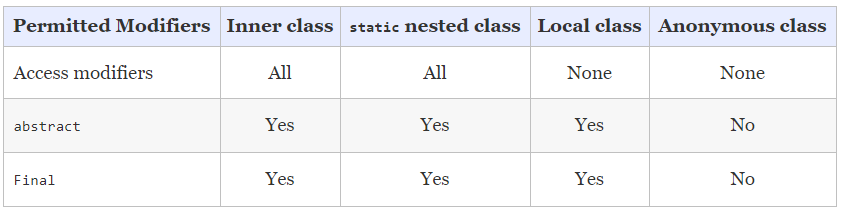
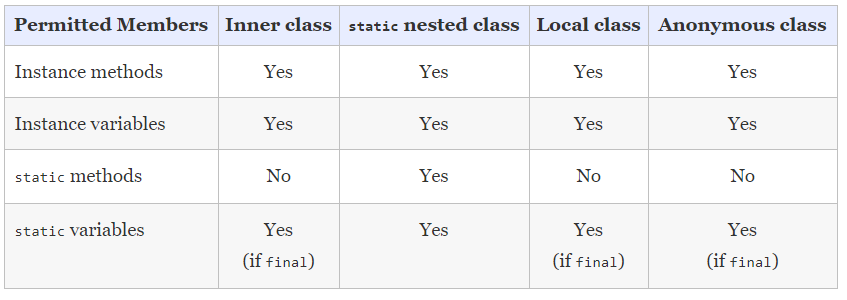
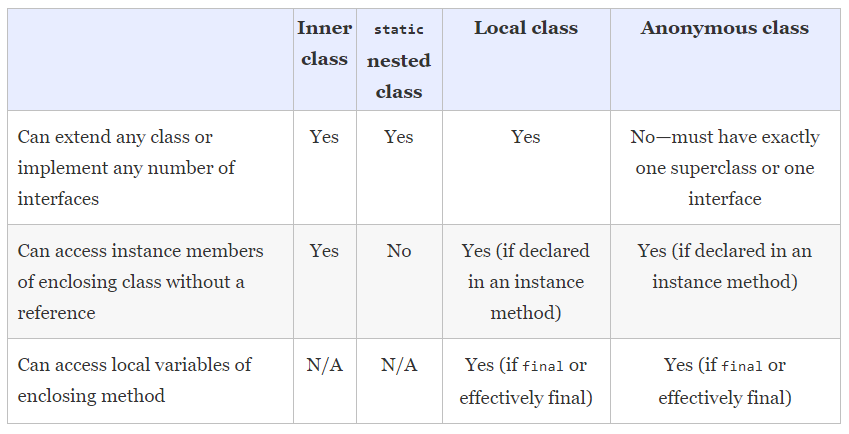
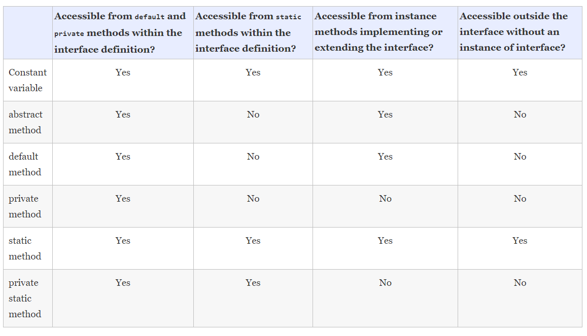
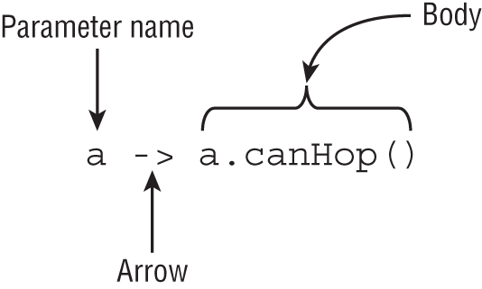
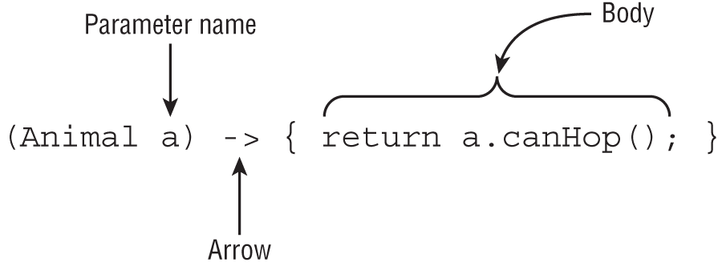

# Unit-12 Java Fundamentals  

## Applying the final Modifier

Marking a variable final means the value cannot be changed after it is assigned. Marking a method or class final means it cannot be overridden or extended, respectively

**Example 1:**
```java
final String cobra = "sss";
cobra = "ssssss"; //DOES NOT COMPILE
```  
<br/> 


**Example 2:**
```java
final StringBuilder cobra = new StringBuilder();
cobra.append("Hssssss");
cobra.append("Hssssss!!!");
cobra = new StringBuilder(); //DOES NOT COMPILE
```  
*The object reference is constant, but that doesn't mean the data in the class is constant.*    

<br/> 


**Example 3:**
```java
public class Panda {
   final static String name = "Ronda";
   static final int bamboo;
   static final double height; // DOES NOT COMPILE
   static { bamboo = 5;}
}
```    

<br/> 

### Writing Final Methods 
   


**Example 1:**
```java
public abstract class Animal {
   abstract void chew();
}
   
public class Hippo extends Animal {
   final void chew() {}
}
   
public class PygmyHippo extends Hippo {
   void chew() {} // DOES NOT COMPILE
}
```  
<br/> 
 
 **Example 2:**
```java
abstract class ZooKeeper {
   public abstract final void openZoo(); // DOES NOT COMPILE
}
``` 
### Marking Classes Final   

**Example 1:**
```java
public final class Reptile {}
   
public class Snake extends Reptile {} // DOES NOT COMPILE
```    

<br/> 
 
**Example 2:**
```java
public abstract final class Eagle {} // DOES NOT COMPILE
   
public final interface Hawk {} // DOES NOT COMPILE
```  
<br/> 
 

## ENUMS 

Using an enum is much better than using a bunch of constants because it provides type‐safe checking. 
  
With numeric or String constants, you can pass an invalid value and not find out until runtime. 


```java
public enum OnlyOne {
   ONCE(true);
   private OnlyOne(boolean b) {
      System.out.print("constructing,");
   }   
}
 
public class PrintTheOne {
   public static void main(String[] args) {
      System.out.print("begin,");
      OnlyOne firstCall = OnlyOne.ONCE;  // prints constructing,
      OnlyOne secondCall = OnlyOne.ONCE; // doesn't print anything
      System.out.print("end");
   }
}
```  
**Print:**
```
begin,constructing,end
```   

<br/> 

   

**The enum itself has an abstract method**  

```java 
public enum Season {
   WINTER {
      public String getHours() { return "10am-3pm"; }
   },
   SPRING {
      public String getHours() { return "9am-5pm"; }
   },
   SUMMER {
      public String getHours() { return "9am-7pm"; }
   },
   FALL {
      public String getHours() { return "9am-5pm"; }
   };
   public abstract String getHours();
}
```  

<br/> 
 

 If we don't want each and every enum value to have a method, we can create a default implementation and override it only for the special cases.   

 
```java
public enum Season {
   WINTER {
      public String getHours() { return "10am-3pm"; }
   },
   SUMMER {
      public String getHours() { return "9am-7pm"; }
   },
   SPRING, FALL;
   public String getHours() { return "9am-5pm"; }
}
```  

<br/> 


## Nested Classes

   
* **Inner class:** A non‐ static type defined at the member level of a class
* **Static nested class:** A static type defined at the member level of a class
* **Local class:** A class defined within a method body
* **Anonymous class:** A special case of a local class that does not have a name
  
Interfaces and enums can be declared as both inner classes and static nested classes, but not as local or anonymous classes.  
  
### **INNER CLASS**

* Can be declared *public*, *protected*, *package‐private (default)*, or *private*
* Can extend any class and implement interfaces
* Can be marked *abstract* or *final*
* Cannot declare *static* fields or methods, except for *static final* fields
* Can access members of the outer class including *private* members

**Create Inner Class**
```java
 Outer outer = new Outer();
 Inner inner1 = new Inner();
 Inner inner2 = outer.new Inner(); // create the inner class
```   
   

```java
public class Fox {
    private class Den {}
    public void goHome() {
        new Den();
    }
    public static void visitFriend() {
        new Den();  // DOES NOT COMPILE
    }
}

public class Squirrel {
    public void visitFox() {
        new Den();  // DOES NOT COMPILE
    }
}
```  
*The second call does not compile because it is called inside a static method.  
The last constructor call does not compile for two reasons. Even though it is an instance method, it is not an instance method inside the Fox class. Adding a Fox reference would not fix the problem entirely, though. Den is private and not accessible in the Squirrel class.*


### **STATIC NESTED CLASS** 
A static nested class is a static type defined at the member level.   
Unlike an inner class, a static nested class can be instantiated without an instance of the enclosing class.

- The nesting creates a namespace because the enclosing class name must be used to refer to it.
- It can be made private or use one of the other access modifiers to encapsulate it.
- The enclosing class can refer to the fields and methods of the static nested class.  

**Example 1: Inner Class**
```java 
public class Enclosing {
	int upperInt = 5;

	class Nested {
		public int price = 6;

		int getUpperInt() {
			return Enclosing.this.upperInt;  // Can access outclass variable
		}
	}

	public static void main(String[] args) {
		Enclosing e = new Enclosing();
		System.out.println(e.new Nested().price);  // Print 6
        System.out.println(new Nested().price);    // DOES NOT COMPILE !
	}
}
```  
***Error:** No enclosing instance of type Enclosing is accessible. Must qualify the allocation with an enclosing instance of type Enclosing (e.g. x.new A() where x is an instance of Enclosing).*  
  
**Example 2: Static Nested Class**
```java 
public class Enclosing {
	int upperInt = 5;

	static class Nested {
		public int price = 6;

		int getUpperInt() {
			return Enclosing.this.upperInt; // DOES NOT COMPILE !
		}
	}

	public static void main(String[] args) {
		Enclosing e = new Enclosing();		
		System.out.println(e.new Nested().price);	// DOES NOT COMPILE !
        System.out.println(new Nested().price); // Print 6	
	}
}
```  
***Error 1:** No enclosing instance of the type Enclosing is accessible in scope*  
static nested  classes cant access outclass variables directly.

***Error 2:** Illegal enclosing instance specification for type Enclosing.Nested*  

### **LOCAL CLASS**  

A local class is a nested class defined within a method.  

- They do not have an access modifier.
- They cannot be declared static and cannot declare static fields or methods, except for static final fields.
- They have access to all fields and methods of the enclosing class (when defined in an instance method).
- They can access local variables if the variables are final or effectively final.


```java
public class PrintNumbers {
	private int length = 5;

	public void calculate() {
		final int width = 20;
		class MyLocalClass {
			public void multiply() {
				System.out.print(length * width);
			}
		}
		MyLocalClass local = new MyLocalClass();
		local.multiply();
	}

	public static void main(String[] args) {
		PrintNumbers outer = new PrintNumbers();
		outer.calculate();
	}
}
```
**Print: 100** 

<br/> 


```java
public void processData() {
   final int length = 5;
   int width = 10;
   int height = 2;
   class VolumeCalculator {
      public int multiply() {
         return length * width * height; // DOES NOT COMPILE
      }
   }
   width = 2;
}
```  
*The length and height variables are final and effectively final, respectively, so neither causes a compilation issue. On the other hand, the width variable is reassigned during the method so it cannot be effectively final. For this reason, the local class declaration does not compile.*  

### **ANONYMOUS CLASS**  

An anonymous class is a specialized form of a local class that does not have a name.   
Anonymous classes are required to extend an existing class or implement an existing interface.

**Example 1:**
```java
public class ZooGiftShop {
	abstract class SaleTodayOnly {
		abstract int dollarsOff();
	}

	public int admission(int basePrice) {
		SaleTodayOnly sale = new SaleTodayOnly() {
			int dollarsOff() {
				return 3;
			}
		};
		return basePrice - sale.dollarsOff();
	}
}
``` 
<br/> 


**Example 2:** Convert this same example to implement an interface instead of extending an abstract class.

```java 
public class ZooGiftShop {
	interface SaleTodayOnly {
		int dollarsOff();
	}

	public int admission(int basePrice) {
		SaleTodayOnly sale = new SaleTodayOnly() {
			public int dollarsOff() {
				return 3;
			}
		};
		return basePrice - sale.dollarsOff();
	}
}
```
*public instead of using default access since interfaces require public methods.*

<br/> 

**Example 2** You can define them right where they are needed, even if that is an argument to another method.

```java 
public class ZooGiftShop {
	interface SaleTodayOnly {
		int dollarsOff();
	}

	public int pay() {
		return admission(5, new SaleTodayOnly() {
			public int dollarsOff() {
				return 3;
			}
		});
	}

	public int admission(int basePrice, SaleTodayOnly sale) {
		return basePrice - sale.dollarsOff();
	}
}
```    
<br/> 

**Example 3** : You can even define anonymous classes outside a method body.
 
```java
public class Gorilla {
   interface Climb {}
   Climb climbing = new Climb() {};
}
```
<br/> 


#### **ANONYMOUS CLASSES AND LAMBDA EXPRESSIONS**


**Example 1:** Without lambda expression. 
```java 
Button redButton = new Button();
redButton.setOnAction(new EventHandler<ActionEvent>() {
    public void handle(ActionEvent e) {
        System.out.println("Red button pressed!");
    }
});
```  
<br/> 

**Example 2:** Using lambda expression. 
```java
Button redButton = new Button();
redButton.setOnAction(e -> System.out.println("Red button pressed!"));
```  
The only restriction is that the variable type must be a functional interface.  

<br/> 


### **REVIEWING NESTED CLASSES**

**1- Modifiers in nested classes**  

  

<br/> 

**2- Members in nested classes**

  
  
<br/> 

**3- Nested class access rules**  

 

## Understanding Interface Members  

### **DEFAULT INTERFACE METHOD**  
- A *default* method may be declared only within an interface.
- A *default* method must be marked with the *default* keyword and include a method body.
- A *default* method is assumed to be *public*.
- A *default* method cannot be marked *abstract*, *final*, or *static*.
- A *default* method may be overridden by a class that implements the interface.
- If a class inherits two or more *default* methods with the same method signature, then the class must override the method.
  
#### **Inheriting Duplicate default Methods**

```java
public interface Walk {
   public default int getSpeed() { return 5; }
}
 
public interface Run {
   public default int getSpeed() { return 10; }
}
 
public class Cat implements Walk, Run {  // DOES NOT COMPILE
   public static void main(String[] args) {
      System.out.println(new Cat().getSpeed());
   }
}
```  
<br/> 

*By overriding the conflicting method, the ambiguity about which version of the method to call has been removed.*
```java
public class Cat implements Walk, Run {   // COMPILE !!
   public int getSpeed() { return 1; }
 
   public static void main(String[] args) {
      System.out.println(new Cat().getSpeed());
   }
}
```    
<br/> 

#### **Calling a Hidden default Method**  

```java 
public class Cat implements Walk, Run {
   public int getSpeed() {
      return 1;
   }
 
   public int getWalkSpeed() {
      return Walk.super.getSpeed();  // COMPILE
   }
 
   public static void main(String[] args) {
      System.out.println(new Cat().getWalkSpeed());
   }
}
```  

### **STATIC INTERFACE METHODS** 
 
- A static method must be marked with the static keyword and include a method body.
- A static method without an access modifier is assumed to be public.
- A static method cannot be marked abstract or final.
- A static method is not inherited and cannot be accessed in a class implementing the interface without a reference to the interface name.   

```java
public interface Hop {
   static int getJumpHeight() {
      return 8;
   }
}
```  
```java
public class Bunny implements Hop {
   public void printDetails() {
      System.out.println(getJumpHeight());  // DOES NOT COMPILE
   }
}
```  
```java
public class Bunny implements Hop {
   public void printDetails() {
      System.out.println(Hop.getJumpHeight()); // COMPILE !
   }
}
```  
### **PRIVATE INTERFACE METHODS**  
The answer is that private interface methods can be used to reduce code duplication. For example, let's say we had a Schedule interface with a bunch of default methods. In each default method, we want to check some value and log some information based on the hour value. We could copy and paste the same code into each method, or we could use a private interface method.   

```java
public interface Schedule {
   default void wakeUp()        { checkTime(7);  }
   default void haveBreakfast() { checkTime(9);  }
   default void haveLunch()     { checkTime(12); }
   default void workOut()       { checkTime(18); }
   private void checkTime(int hour) {
      if (hour> 17) {
         System.out.println("You're late!");
      } else {
         System.out.println("You have "+(17-hour)+" hours left "
               + "to make the appointment");
      }
   }
}
```

- A private interface method must be marked with the private modifier and include a method body.
- A private interface method may be called only by default and private (non‐ static) methods within the interface definition.

### **PRIVATE STATIC INTERFACE METHODS** 
The purpose of private static interface methods is to reduce code duplication in static methods within the interface declaration. Furthermore, because instance methods can access *static* methods within a class, they can also be accessed by *default* and *private* methods.  

```java
public interface Swim {
   private static void breathe(String type) {
      System.out.println("Inhale");
      System.out.println("Performing stroke: " + type);
      System.out.println("Exhale");
   }
   static void butterfly()        { breathe("butterfly");  }
   public static void freestyle() { breathe("freestyle");  }
   default void backstroke()      { breathe("backstroke"); }
   private void breaststroke()    { breathe("breaststroke"); }
}
```  

- A *private static* method must be marked with the *private* and *static* modifiers and include a method body.
- A *private static* interface method may be called only by other methods within the interface definition.
- Both *private* and *private static* methods can be called from *default* and *private* methods. 

### **REVIEWING INTERFACE MEMBERS** 


  

<br/> 


## Introducing Functional Programming

A *functional interface* is an interface that contains a single abstract method.

### **DEFINING A FUNCTIONAL INTERFACE**
* **Adding the annotation to a functional interface is optional**
```java
@FunctionalInterface
public interface Sprint {
   public void sprint(int speed);
}
 
public class Tiger implements Sprint {
   public void sprint(int speed) {
      System.out.println("Animal is sprinting fast! " + speed);
   }
}
```  
*In this example, the Sprint interface is a functional interface, because it contains exactly one abstract method, and the Tiger class is a valid class that implements the interface.*  


<br/> 

   

**Example:** which of the following are functional interfaces?

```java
public interface Sprint {
   public void sprint(int speed);
}
 
public interface Dash extends Sprint {}
 
public interface Skip extends Sprint {
   void skip();
}
 
public interface Sleep {
   private void snore() {}
   default int getZzz() { return 1; }
}
 
public interface Climb {
   void reach();
   default void fall() {}
   static int getBackUp() { return 100; }
   private static boolean checkHeight() { return true; }
}
```  
The Dash interface is a functional interface because it extends the Sprint interface and inherits the single abstract method sprint(). 

The Skip interface is not a valid functional interface because it has two abstract methods: the inherited sprint() method and the declared skip() method.   

The Sleep interface is also not a valid functional interface. Neither snore() nor getZzz() meet the criteria of a single abstract method.   

Climb interface is a functional interface. Despite defining a slew of methods, it contains only one abstract method: reach().  
  

### FUNCTIONAL INTERFACE WITH OBJECT METHODS


*If a functional interface includes an abstract method with the same signature as a public method found in Object, then those methods do not count toward the single abstract method test*   

* String toString()
* boolean equals(Object)
* int hashCode() 

**Example 1:** Is the Soar class a functional interface?

```java
public interface Soar {
   abstract String toString();
}
```
***It is not.** Since toString() is a public method implemented in Object, it does not count toward the single abstract method test.*  

<br/> 

**Example 2:**  
```java
public interface Dive {
   String toString();
   public boolean equals(Object o);
   public abstract int hashCode();
   public void dive();
}
```  
*The dive() method is the single abstract method, so it is a functional interface.*  


<br/> 

**OVERRIDING TOSTRING(), EQUALS(OBJECT), AND HASHCODE()**   
As a professional Java developer, it is important for you to know at least the basic rules for overriding each of these methods.

**toString():** The toString() method is called when you try to print an object or concatenate the object with a String. It is commonly overridden with a version that prints a unique description of the instance using its instance fields.  

**equals(Object):** The equals(Object) method is used to compare objects, with the default implementation just using the == operator. You should override the equals(Object) method anytime you want to conveniently compare elements for equality, especially if this requires checking numerous fields.    

**hashCode():** Any time you override equals(Object), you must override hashCode() to be consistent. This means that for any two objects, if a.equals(b) is true, then a.hashCode()==b.hashCode() must also be true. If they are not consistent, then this could lead to invalid data and side effects in hash‐based collections such as HashMap and HashSet.  

All of these methods provide a default implementation in Object, but if you want to make intelligent use out of them, then you should override them.

<br/>   

### **IMPLEMENTING FUNCTIONAL INTERFACES WITH LAMBDAS**  

Lambda expressions rely on the notion of deferred execution. Deferred execution means that code is specified now but runs later.  
**Any functional interface can be implemented as a lambda expression.**  
  
**Lambda definetion 1**  

  
  
<br/> 

**Lambda definetion 2**   



* As a fun fact, **s ‐> {}** is a valid lambda. If the return type of the functional interface method is void, then you don't need the semicolon or return statement.

**Example 1:** Valid definetions
```java
() -> new Duck()
d -> {return d.quack();}
(Duck d) -> d.quack()
(Animal a, Duck d) -> d.quack()
```  

<br/> 


**Example 2:** Invalid definetions
```java
3: a, b -> a.startsWith("test")         // DOES NOT COMPILE
4: Duck d -> d.canQuack();              // DOES NOT COMPILE
5: a -> { a.startsWith("test"); }       // DOES NOT COMPILE
6: a -> { return a.startsWith("test") } // DOES NOT COMPILE
7: (Swan s, t) -> s.compareTo(t) != 0   // DOES NOT COMPILE
```  
*Lines 3 and 4 require parentheses around each parameter list. Remember that the parentheses are optional only when there is one parameter and it doesn't have a type declared.*  

*Line 5 is missing the return keyword, which is required since we said the lambda must return a boolean. Line 6 is missing the semicolon inside of the braces, {}. *  

*Finally, line 7 is missing the parameter type for t. If the parameter type is specified for one of the parameters, then it must be specified for all of them.*   

<br/> 


#### **Parameter List**  
* ***var** can be used in a lambda parameter list*

```java
Predicate<String> p = x -> true;
Predicate<String> p = (var x) -> true;
Predicate<String> p = (String x) -> true;
```  

<br/>  

#### **Restrictions on Using *var* in the Parameter List**  

While you can use **var** inside a lambda parameter list, there is a rule you need to be aware of. If **var** is used for one of the types in the parameter list, then it must be used for all parameters in the list.  

```java
3: (var num) -> 1
4: var w -> 99
5: (var a, var b) -> "Hello"
6: (var a, Integer b) -> true
7: (String x, var y, Integer z) -> true
8: (var b, var k, var m) -> 3.14159
9: (var x, y) -> "goodbye"
```  

*Line 3 compiles and is similar to our previous examples.*  

*Line 4 does not compile because parentheses, (), are required when using the parameter name.*  

*Lines 5 and 8 compile because all of the parameters in the list use var.*  

*Lines 6 and 7 do not compile, though, because the parameter types include a mix of var and type names.* 

*Line 9 does not compile because the parameter type is missing for the second parameter, y.* 

*Even when using var for all the parameter types, each parameter type must be written out.*

--- 

#### **Variables Referenced from the Lambda Body**  
Lambda bodies are allowed to use static variables, instance variables, and local variables if they are *final* or *effectively final*.  
Lambdas follow the same rules for access as local and anonymous classes!

**Example 1:**  
```java
 class Crow {
     private String color;
     public void caw(String name) {
        String volume = "loudly";
       Predicate<String> p = s -> (name+volume+color).length()==10;
    }
 }
```   

**Example 2:**  
```java 
4:  public class Crow {
5:     private String color;
6:     public void caw(String name) {
7:        String volume = "loudly";
8:        color = "allowed";
9:        name = "not allowed";
10:       volume = "not allowed";
11:       Predicate<String> p =
12:          s -> (name+volume+color).length()==9; // DOES NOT COMPILE
13:    }
14: }
```  
*The values of name and v
annotations establish relationships that make it easier to manage data about our application.olume are assigned new values on lines 9 and 10. For this reason, the lambda expression declared on lines 11 and 12 does not compile since it references local variables that are not final or effectively final. If lines 9 and 10 were removed, then the class would compile.*  

<br/> <br/>  
  
