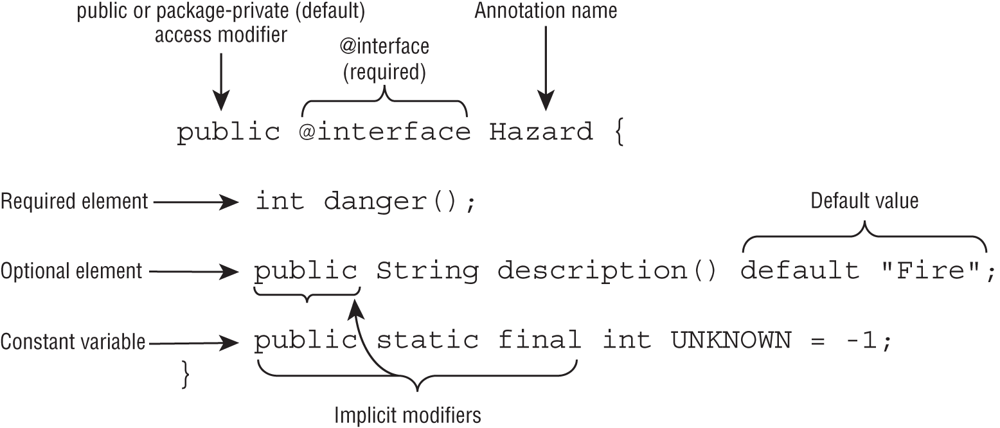
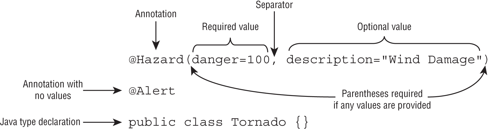

# Unit 13 - Annotations

 *A **marker annotation** is one that does not contain any elements.*

- Annotations function a lot like interfaces.
- Annotations establish relationships that make it easier to manage data about our application.
- An annotation ascribes custom information on the declaration where it is defined.
- Annotations are optional metadata and by themselves do not do anything


<br/> 

## Creating Custom Annotations

When declaring an annotation, any element without a default value is considered required. 

```java
public @interface Exercise {
   int hoursPerDay();
}
```  
```java
@Exercise(hoursPerDay=3) public class Cheetah {}
 
@Exercise hoursPerDay=0 public class Sloth {}     // DOES NOT COMPILE
 
@Exercise public class ZooEmployee {}             // DOES NOT COMPILE
```  

<br/> 


### **PROVIDING AN OPTIONAL ELEMENT**  

```java
public @interface Exercise {
   int hoursPerDay();
   int startHour() default 6;
}
```  
```java
@Exercise(startHour=5, hoursPerDay=3) public class Cheetah {}
 
@Exercise(hoursPerDay=0) public class Sloth {}
 
@Exercise(hoursPerDay=7, startHour="8")  // DOES NOT COMPILE
public class ZooEmployee {}
```
*ZooEmployee does not compile, becouse statHour element value must be integer.*

<br/> 

### **DEFINING A DEFAULT ELEMENT VALUE**  

The default value of an annotation cannot be just any value. Similar to case statement values, the default value of an annotation must be a non‐ null **constant expression**.

```java
public @interface BadAnnotation {
    String name() default new String("");   // DOES NOT COMPILE
    String address() default "";
    String title() default null;            // DOES NOT COMPILE
    int age() default Integer.parseInt("1") // DOES NOT COMPILE
    int count() default Integer.MAX_VALUE
}
```  
<br/> 

### **SELECTING AN ELEMENT TYPE**

Similar to a default element value, an annotation element cannot be declared with just any type. It must be a primitive type, a String, a Class, an enum, another annotation, or an array of any of these types.  

```java
public class Bear {}
 
public enum Size {SMALL, MEDIUM, LARGE}
 
public @interface Panda {
   Integer height();                    // DOES NOT COMPILE
   String[][] generalInfo();            // DOES NOT COMPILE
   Size size() default Size.SMALL;
   Bear friendlyBear();                 // DOES NOT COMPILE
   Exercise exercise() default @Exercise(hoursPerDay=2);
}
```    

The *height()* element does not compile. While primitive types like int and long are supported, wrapper classes like Integer and Long are not.   

The *generalInfo()* element also does not compile. The type *String[]* is supported, as it is an array of String values, but *String[][]* is not.   

The *friendlyBear()* element does not compile. The type of* friendlyBear()* is *Bear* (not Class).

To set a default value for *exercise()*, we use the *@Exercise* annotation. Remember, this is the only way to create an annotation value. Unlike instantiating a class, the *new* keyword is never used to create an annotation.

<br/> 

### **APPLYING ELEMENT MODIFIERS**
Like abstract interface methods, annotation elements are implicitly **abstract** and **public**.  


```java
public @interface Material {}
 
public @interface Fluffy {
   int cuteness();
   public abstract int softness() default 11;
   protected Material material();  // DOES NOT COMPILE
   private String friendly();      // DOES NOT COMPILE
   final boolean isBunny();        // DOES NOT COMPILE
}
```  
<br/> 

### **ADDING A CONSTANT VARIABLE**

Annotations can include constant variables that can be accessed by other classes without actually creating the annotation. 


```java
public @interface ElectricitySource {
   public int voltage();
   int MIN_VOLTAGE = 2;
   public static final int MAX_VOLTAGE = 18;
}
```  
.
```java
@ElectricitySource(voltage = 0)
public class House {
	public static void main(String... a) {
        System.out.println(Exercise.MIN_VOLTAGE);   // print 2
		System.out.println(Exercise.MAX_VOLTAGE);   // print 18
	}
}

```  
<br/> 
 
**Example 2:** 
```java
public @interface WaterSource {
   private int MIN_LEVEL = 2;                   // DOES NOT COMPILE !!
   protected static final int MAX_LEVEL = 18;  // DOES NOT COMPILE !!
}
```  
*Does not compile because only allowed **public** or **default-access**.*

<br/> 

### **REVIEWING ANNOTATION RULES** 

**1- Annotation declaration :**  
 

..   

**2- Using an annotation :**  
 

..  
..   


 

## Applying Annotations

### **USING ANNOTATIONS IN DECLARATIONS**

It can be applied to :

* Classes, interfaces, enums, and modules
* Variables ( static, instance, local)
* Methods and constructors
* Method, constructor, and lambda parameters
* Cast expressions
* Other annotations

**Example :**
```java
1:  @FunctionalInterface interface Speedster {
2:     void go(String name);
3:  } 
4:  @LongEars
5:  @Soft @Cuddly public class Rabbit {
6:     @Deprecated public Rabbit(@NotNull Integer size) {}
7:     
8:     @Speed(velocity="fast") public void eat(@Edible String input) {
9:        @Food(vegetarian=true) String m = (@Tasty String) "carrots";
10:        
11:       Speedster s1 = new @Racer Speedster() {
12:          public void go(@FirstName @NotEmpty String name) {
13:             System.out.print("Start! "+name);
14:          }
15:       };
16:       
17:       Speedster s2 = (@Valid String n) -> System.out.print(n);
18:    }
19: }
```  
..  
..  

### **MIXING REQUIRED AND OPTIONAL ELEMENTS**
```java
public @interface Swimmer {
   int armLength = 10;
   String stroke();
   String name();
   String favoriteStroke() default "Backstroke";
}
```  
```java
@Swimmer class Amphibian {}         // DOES NOT COMPILE
 
@Swimmer(favoriteStroke="Breaststroke", name="Sally") class Tadpole {}   // DOES NOT COMPILE
 
@Swimmer(stroke="FrogKick", name="Kermit") class Frog {}
 
@Swimmer(stroke="Butterfly", name="Kip", armLength=1) class Reptile {}  // DOES NOT COMPILE
 
@Swimmer(stroke="", name="", favoriteStroke="") class Snake {}          // DOES NOT COMPILE
```  

***Frog** provides all of the required elements and none of the optional ones, so it compiles. **Reptile** does not compile since **armLength** is a constant, not an element, and cannot be included in an annotation*

..  
..  

### **CREATING A *VALUE()* ELEMENT**  

- The annotation declaration must contain an element named value(), which may be optional or required.
- The annotation declaration must not contain any other elements that are required.
- The annotation usage must not provide values for any other elements.

**Example:**
```java
public @interface Injured {
   String veterinarian() default "unassigned";
   String value() default "foot";
   int age() default 1;
}
```  
```java
public abstract class Elephant {
   @Injured("Legs") public void fallDown() {}
   @Injured(value="Legs") public abstract int trip();
   @Injured String injuries[];
}
```  

..  

*Annotation is not valid as it provides more than one value*  :

```java
@Injured("Fur",age=2) public class Bear {}  // DOES NOT COMPILE
```  

..  
..   

### **PASSING AN ARRAY OF VALUES**
```java
public @interface Music {
   String[] genres();
}
```  
If we want to provide only one value to the array, we have a choice of two ways to write the annotation.
```java
public class Giraffe {
   @Music(genres={"Rock and roll"}) String mostDisliked;
   @Music(genres="Classical") String favorite;
}
```  
```java
public class Reindeer {
   @Music(genres="Blues","Jazz") String favorite;  // DOES NOT COMPILE
   @Music(genres=) String mostDisliked;            // DOES NOT COMPILE
   @Music(genres=null) String other;               // DOES NOT COMPILE
   @Music(genres={}) String alternate;
   @Music(genres="") String alternate2;
}
```  

..  
..  

#### **COMBINING SHORTHAND NOTATIONS**    


```java
public @interface Rhythm {
    String[] value();
}
```  
Each of the following four annotations is valid:
```java
public class Capybara {
    @Rhythm(value={"Swing"}) String favorite;
    @Rhythm(value="R&B") String secondFavorite;
    @Rhythm({"Classical"}) String mostDisliked;
    @Rhythm("Country") String lastDisliked;
}
```  

..  
..  


## Declaring Annotation‐Specific Annotations  

### **@Target**  

It help to liminig usage . 
Values for the @Target annotation  :

|ElementType |valueApplies to|
|-|-|
|TYPE	|Classes, interfaces, enums, annotations|
|FIELD	|Instance and static variables, enum values|
|METHOD	|Method declarations|
|PARAMETER	|Constructor, method, and lambda parameters|
|CONSTRUCTOR	|Constructor declarations|
|LOCAL_VARIABLE	|Local variables|
|ANNOTATION_TYPE	|Annotations|
|PACKAGE *	|Packages declared in package‐info.java|
|TYPE_PARAMETER *	|Parameterized types, generic declarations|
|TYPE_USE	|Able to be applied anywhere there is a Java type declared or used|
|MODULE *	|Modules|

\*  Applying these with annotations is out of scope for the exam.

**Even though the java.lang package is imported automatically by the compiler, the java.lang.annotation package is not.**  

..  
..  


### **@Retention**  

It detects how class storing.

|RetentionPolicy value| Description|
|-|-|
|SOURCE|	Used only in the source file, discarded by the compiler|
|CLASS|	Stored in the .class file but not available at runtime (default compiler behavior)|
|RUNTIME|	Stored in the .class file and available at runtime|  

 **Example :**
 ```java
 @interface Plumber {
	String value() default "Mario";
}

public class Team {
 
	@Plumber("")
	private String foreman = "Mario";
	@Plumber
	private String worker = "Kelly";
	@Plumber("Kelly")
	private String trainee;

	public static void main(String[] args) {
		var t = new Team();
		var fields = t.getClass().getDeclaredFields();
		for (Field field : fields)
			if (field.isAnnotationPresent(Plumber.class))
				System.out.print(field.getAnnotation(Plumber.class).value());
	}
}
 ``` 
**Print :** (nothing)  
It print anything because; 
The default retention policy for all annotations is RetentionPolicy.CLASS. This means the annotation information is discarded at compile time and not available at runtime.  

If *@Retention(RetentionPolicy.RUNTIME)* were added to the declaration of Plumber;  
**Print :**  
```
MarioKelly
```

..  
..  

### **@Documented**
It help to generate javadoc  

**JAVA VS. JAVADOC ANNOTATIONS**  

```java
public class ZooLightShow {

    /**
    * Performs a light show at the zoo.
    * 
    * @param      distance   length the light needs to travel.
    * @return     the result of the light show operation.
    * @author     Grace Hopper
    * @since      1.5
    * @deprecated Use EnhancedZooLightShow.lights() instead.
    */
    @Deprecated(since="1.5") public static String perform(int distance) {
        return "Beginning light show!";
    }
}
```   
The first, *@deprecated*, is a Javadoc annotation used inside a comment, while *@Deprecated* is a Java annotation applied to a class. Traditionally, Javadoc annotations are all lowercase, while Java annotations start with an uppercase letter.

..  
..  


### **@INHERITED**

 When this annotation is applied to a class, subclasses will inherit the annotation information found in the parent class.

```java
// Vertebrate.java
import java.lang.annotation.Inherited;

@Inherited public @interface Vertebrate {} 
 
// Mammal.java
@Vertebrate public class Mammal {}
 
// Dolphin.java
public class Dolphin extends Mammal {}
```   
In this example, the *@Vertebrate* annotation will be applied to both *Mammal* and *Dolphin* objects. Without the *@Inherited* annotation, *@Vertebrate* would apply only to *Mammal* instances.
..  
..  


### **@REPEATABLE**

The @Repeatable annotation is used when you want to specify an annotation more than once on a type. Generally, you use repeatable annotations when you want to apply the same annotation with different values.  


```java
public class Zoo {
   public static class Monkey {}
 
   @Risk(danger="Silly")
   @Risk(danger="Aggressive",level=5)
   @Risk(danger="Violent",level=10)
   private Monkey monkey;
}
```  

```java
public @interface Risk {
   String danger();
   int level() default 1;
}
```  
The Zoo class does not compile.  
* **Without the @Repeatable annotation, an annotation can be applied only once.**   

..   

```java
import java.lang.annotation.Repeatable;
 
@Repeatable  // DOES NOT COMPILE
public @interface Risk {
   String danger();
   int level() default 1;
}
```  

This code also does not compile, but this time because the @Repeatable annotation is not declared correctly.

* **To declare a @Repeatable annotation, you must define a containing annotation type value.**  

A containing annotation type is a separate annotation that defines a **value()** array element.  
..  
..  

```java
public @interface Risks {
   Risk[] value();
}
```  
```java
import java.lang.annotation.Repeatable;
 
@Repeatable(Risks.class)
public @interface Risk {
   String danger();
   int level() default 1;
}
```
*Zoo class will now compile.*    
- The repeatable annotation must be declared with @Repeatable and contain a value that refers to the containing type annotation.
- The containing type annotation must include an element named value(), which is a primitive array of the repeatable annotation type. 

..   
..   


**REPEATABLE ANNOTATIONS VS. AN ARRAY OF ANNOTATIONS**
```java
    @Risks({
       @Risk(danger="Silly"),
       @Risk(danger="Aggressive",level=5),
       @Risk(danger="Violent",level=10)
    })
    private Monkey monkey;
```  
*With this implementation, @Repeatable is not required in the Risk annotation declaration. The @Repeatable annotation is the preferred approach now, as it is easier than working with multiple nested statements.*

..   
..   


### **REVIEWING ANNOTATION‐SPECIFIC ANNOTATIONS**  

|Annotation|Marker annotation | Type of value() |Default compiler behavior (if annotation not present)|
|--|--|--|--|
|@Target	| No| Array of ElementType|	Annotation able to be applied to all locations except TYPE_USE and TYPE_PARAMETER|
|@Retention | No |RetentionPolicy |	RetentionPolicy.CLASS
|@Documented|Yes|—|Annotations are not included in the generated Javadoc.
|@Inherited	|Yes|—|Annotations in supertypes are not inherited.
|@Repeatable	|No|Annotation|	Annotation cannot be repeated.|  

..  
..  
--- - 

## Using Common Annotations 

### **@OVERRIDE**   
The @Override is a marker annotation that is used to indicate a method is overriding an inherited method.  

The overriding method must have the same signature, the same or broader access modifier, and a covariant return type, and not declare any new or broader checked exceptions.

..  


### **@FUNCTIONALINTERFACE**  
The @FunctionalInterface marker annotation can be applied to any valid functional interface.  

The compiler will report an error, though, if applied to anything other than a valid functional interface.

```java
@FunctionalInterface abstract class Reptile {
   abstract String getName();
}
 
@FunctionalInterface interface Slimy {}
 
@FunctionalInterface interface Scaley {
   boolean isSnake();
}
 
@FunctionalInterface interface Rough extends Scaley {
   void checkType();
}
 
@FunctionalInterface interface Smooth extends Scaley {
   boolean equals(Object unused);
}
```  

The *Reptile* declaration does not compile, because the *@FunctionalInterface* annotation can be applied only to interfaces.   

The *Slimy* interface does not compile, because it does not contain any abstract methods.  

The *Scaley* interface compiles, as it contains exactly one abstract method.

The *Rough* interface does not compile, because it contains two abstract methods, one of which it inherits from *Scaley*.  

The *Smooth* interface contains two abstract methods, although since one matches the signature of a method in *java.lang.Object*, it does compile.

..  
..  

### **@DEPRECATED**
It detects retiring code.  
The *@Deprecated* annotation does support two optional values: String *since()* and boolean *forRemoval()*. 

###  **@SUPPRESSWARNINGS**

Enter @SuppressWarnings. Applying this annotation to a class, method, or type basically tells the compiler, “I know what I am doing; do not warn me about this.”    

@SuppressWarnings requires a value.

It requires a String[] value() parameter:
|Value | Description |
|--|--|
|"deprecation"	|Ignore warnings related to types or methods marked with the @Deprecated annotation.|
|"unchecked"	|Ignore warnings related to the use of raw types, such as List instead of List<String>.|

### **@SAFEVARARGS**  

The @SafeVargs marker annotation indicates that a method does not perform any potential unsafe operations on its varargs parameter.  
The annotation can be applied only to methods that contain a varargs parameter and are not able to be overridden.(aka methods marked private, static, or final).  

*@SafeVarargs* annotation can be applied to a *constructor* or *private*, *static*, or *final* method.  
The @SafeVarargs annotation does not take a value.


```java
@SafeVarargs
public static void eat(int meal) {}         // DOES NOT COMPILE
 
@SafeVarargs
protected void drink(String… cup) {}      // DOES NOT COMPILE
 
@SafeVarargs void chew(boolean… food) {}  // DOES NOT COMPILE
```  

The eat() method is missing a varargs parameter, while the drink() and chew() methods are not marked static, final, or private.  

### **REVIEWING COMMON ANNOTATIONS**

|Annotation |Marker annotation|Type of value()|Optional members|
|--|--|--|--|
|@Override	|Yes|—|—|
|@FunctionalInterface |Yes|—|—|
|@Deprecated|No|—|String since(), boolean forRemoval()|
|@SuppressWarnings|No|String[]|—|
|@SafeVarargs|Yes|—|—| 

..   

**Applying common annotations**


|Annotation|Applies to|Compiler error when|
|--|--|--|
|@Override|Methods|Method signature does not match the signature of an inherited method
|@FunctionalInterface	|Interfaces|Interface does not contain a single abstract method
|@Deprecated	|Most Java declarations|—
|@SuppressWarnings	|Most Java declarations|—
|@SafeVarargs	|Methods, constructors |Method or constructor does not contain a varargs parameter or is applied to a method not marked *private, static, or final*
