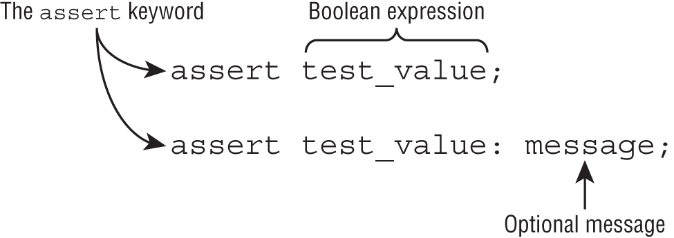
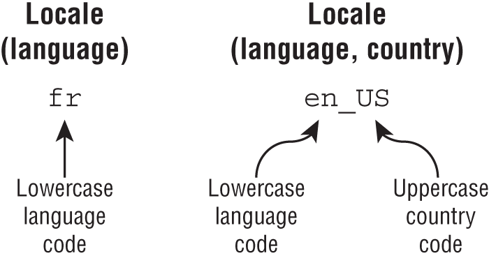

# Unit - 16 Exceptions, Assertions, and Localization

 

## Automating Resource Management

 

```java
try (String reptile = "lizard") {
}

```   
Inheriting AutoCloseable requires implementing a compatible close() method.
```java
interface AutoCloseable {
   public void close() throws Exception;
}
```  

**Example 1:**
```java
public class MyFileReader implements AutoCloseable {
   private String tag;
   public MyFileReader(String tag) { this.tag = tag;}
   
   @Override public void close() {
      System.out.println("Closed: "+tag);
   }
}
```   

```java
try (var bookReader = new MyFileReader("monkey")) {
   System.out.println("Try Block");
} finally {
   System.out.println("Finally Block");
}
```   
**Print :**
```
Try Block
Closed: monkey
Finally Block
```  

<br/> 
 

**Example 2:**
```java
try (var bookReader = new MyFileReader("1");
     var movieReader = new MyFileReader("2");
     var tvReader = new MyFileReader("3");) {
   System.out.println("Try Block");
} finally {
   System.out.println("Finally Block");
}
```   
**Print :**
```
Try Block
Closed: 3
Closed: 2
Closed: 1
Finally Block
```    

<br/> 
 

**Example 3:** Scope !

```java
try (Scanner s = new Scanner(System.in)) {
    s.nextLine();
} catch(Exception e) {
    s.nextInt(); // DOES NOT COMPILE
} finally {
    s.nextInt(); // DOES NOT COMPILE
}
```  

<br/> 
 

**Example 4:**
```java
public void relax() {
	final var bookReader = new MyFileReader("4");
	MyFileReader movieReader = new MyFileReader("5");
	try (bookReader; var tvReader = new MyFileReader("6"); movieReader) {
		System.out.println("Try Block");
	} finally {
		System.out.println("Finally Block");
	}
}
```

Variable *bookReader* declare as a **final**,
Variable *movieReader* declare an **effectively final**.  

Both of these resources can be used in a try‐with‐resources statement.

**Print :**
```
Try Block
Closed: 5
Closed: 6
Closed: 4
Finally Block
```   
<br/> 
 

**Example 5:**
```java
31: var writer = Files.newBufferedWriter(path);
32: try(writer) {  // DOES NOT COMPILE
33:    writer.append("Welcome to the zoo!");
34: }
35: writer = null;
```  
The *writer* variable is reassigned on line 35, resulting in the compiler not considering it *effectively final*.


<br/> 
 

**Example 5:** Trick question
  

```java
var writer = Files.newBufferedWriter(path);
writer.append("This write is permitted but a really bad idea!");
try(writer) {
    writer.append("Welcome to the zoo!");
}
writer.append("This write will fail!");  // IOException
```   
This code compiles but throws an exception on last line with the message Stream closed.

<br/> 


### **UNDERSTANDING SUPPRESSED EXCEPTIONS**

```java
public class JammedTurkeyCage implements AutoCloseable {
	public void close() throws IllegalStateException {
		throw new IllegalStateException("Cage door does not close");
	}

	public static void main(String[] args) {
		try (JammedTurkeyCage t = new JammedTurkeyCage()) {
			throw new IllegalStateException("Turkeys ran off");
		} catch (IllegalStateException e) {
			System.out.println("Caught: " + e.getMessage());
			for (Throwable t : e.getSuppressed())
				System.out.println("Suppressed: " + t.getMessage());
		}
	}
}
```   
**Print :**
```
Caught: Turkeys ran off
Suppressed: Cage door does not close
``` 

<br/> 
 

**Example 1:** 

```java
public static void main(String[] args) {
    try (JammedTurkeyCage t = new JammedTurkeyCage()) {
        throw new RuntimeException("Turkeys ran off");
    } catch (IllegalStateException e) {
        System.out.println("caught: " + e.getMessage());
    }
}
```
The primary exception is a *RuntimeException*. Since this does not match the catch clause.

**Print :**   
```java
Exception in thread "main" java.lang.RuntimeException: Turkeys ran off
   at JammedTurkeyCage.main(JammedTurkeyCage.java:7)
   Suppressed: java.lang.IllegalStateException: 
         Cage door does not close
      at JammedTurkeyCage.close(JammedTurkeyCage.java:3)
      at JammedTurkeyCage.main(JammedTurkeyCage.java:8)
```   

<br/> 
 

**Example 2:** 
```java
6:  try (JammedTurkeyCage t = new JammedTurkeyCage()) {
7:      throw new IllegalStateException("Turkeys ran off");
8:  } finally {
9:      throw new RuntimeException("and we couldn't find them");
10  }
```  
Line 7 throws an exception. Then Java tries to close the resource and adds a suppressed exception to it. Now we have a problem. The finally block runs after all this. Since line 9 also throws an exception, the previous exception from line 7 is lost, with the code printing the following:

```
Exception in thread "main" java.lang.RuntimeException:
   and we couldn't find them
   at JammedTurkeyCage.main(JammedTurkeyCage.java:9)
```   

<br/> 

🟡 **Example 3:** 
```java
public class FamilyCar {
	static class Door implements AutoCloseable {
		public void close() {
			System.out.println("IN DOOR");
			throw new IllegalAccessError();
		}
	}

	static class Window implements Closeable {
		public void close() {
			System.out.println("IN WINDOW");
			throw new ClassCastException();
		}
	}

	public static void main(String[] args) {
		var d = new Door();
		try (d; var w = new Window()) {
			System.out.println("IN TRY");
			int i = 1/0;
		} catch (Exception e) {		 
			e.printStackTrace();
			System.out.println("IN CATCH");
		} finally {
			System.out.println("IN FINALLY");
		}
	}
}
```
**Print :**
```java
IN WINDOW
IN DOOR
java.lang.ArithmeticException: / by zero
	at exam.unit16.exceptions.FamilyCar.main(FamilyCar.java:24)
	Suppressed: java.lang.ClassCastException
		at exam.unit16.exceptions.FamilyCar$Window.close(FamilyCar.java:16)
		at exam.unit16.exceptions.FamilyCar.main(FamilyCar.java:25)
	Suppressed: java.lang.IllegalAccessError
		at exam.unit16.exceptions.FamilyCar$Door.close(FamilyCar.java:9)
		at exam.unit16.exceptions.FamilyCar.main(FamilyCar.java:25)
IN CATCH
IN FINALLY
```


<br/> 


## Declaring Assertions

An *assertion* is a boolean expression that you place at a point in your code where you expect something to be true. An assert statement contains this statement along with an optional message.  


An assertion allows for detecting defects in the code.


*The syntax of assert statements :*  



When assertions are enabled and the boolean expression evaluates to false, then an AssertionError will be thrown at runtime.

**Example 1 :**
```java
assert 1 == age;
assert(2 == height);
assert 100.0 == length : "Problem with length";
assert ("Cecelia".equals(name)): "Failed to verify user data";
```   

**Example 2 :** Invalid definitions :
```java
assert(1);
assert x -> true;
assert 1==2 ? "Accept" : "Error";
assert.test(5> age);
```  

<br/> 


☝ *The three possible outcomes of an assert statement are as follows:*

- If assertions are disabled, Java skips the assertion and goes on in the code.
- If assertions are enabled and the boolean expression is true, then our assertion has been validated and nothing happens. The program continues to execute in its normal manner.
- If assertions are enabled and the boolean expression is false, then our assertion is invalid and an AssertionError is thrown.


<br/>


**Example 1:** Presuming assertions are enabled, an assertion is a shorter way of writing the following:
```java
if (!boolean_expression) 
    throw new AssertionError(error_message);
```   

<br/> 
  


**Example 2:**
```java
public class Party {
    public static void main(String[] args) {
        int numGuests = -5;
        assert numGuests> 0;
        System.out.println(numGuests);
    }
}
```   
```java
java –ea Party.java
```  
**Print :**
```java
Exception in thread "main" java.lang.AssertionError 
   at asserts.Assertions.main(Assertions.java:4)
```   

<br/> 


### **ENABLING ASSERTIONS**


```java
java -enableassertions Rectangle
```   
```java
java -ea Rectangle
```  
 
```java
java -ea:com.demos… my.programs.Main
```   
The ellipsis ( …) means any class in the specified package or subpackages. 

<br/> 
 

```java
java -ea:com.demos.TestColors my.programs.Main
```   
<br/> 
  


### **DISABLING ASSERTIONS**

Java offers the ‐disableassertions or ‐da flag for just such an occasion.
```java
java -ea:com.demos… -da:com.demos.TestColors my.programs.Main
```  

<br/> 

## Working with Dates and Times

### **FORMATTING DATES AND TIMES**

<br/> 
  

**Example 1:**
```java
LocalDate date = LocalDate.of(2020, Month.OCTOBER, 20);
System.out.println(date.getDayOfWeek());  // TUESDAY
System.out.println(date.getMonth());      // OCTOBER
System.out.println(date.getYear());       // 2020
System.out.println(date.getDayOfYear());  // 294
```   
<br/> 
  

**Example 2:**
```java
LocalDate date = LocalDate.of(2020, Month.OCTOBER, 20);
LocalTime time = LocalTime.of(11, 12, 34);
LocalDateTime dt = LocalDateTime.of(date, time);
 
System.out.println(date.format(DateTimeFormatter.ISO_LOCAL_DATE));
System.out.println(time.format(DateTimeFormatter.ISO_LOCAL_TIME));
System.out.println(dt.format(DateTimeFormatter.ISO_LOCAL_DATE_TIME));
```   

**Print :**  
```
2020-10-20
11:12:34
2020-10-20T11:12:34
```    

The DateTimeFormatter will throw an exception if it encounters an incompatible type.
```java
System.out.println(date.format(DateTimeFormatter.ISO_LOCAL_TIME)); // throw exception
System.out.println(time.format(DateTimeFormatter.ISO_LOCAL_DATE)); // throw exception
```   

#### **DateTimeFormatter**

```java
var f = DateTimeFormatter.ofPattern("MMMM dd, yyyy 'at' hh:mm");
System.out.println(dt.format(f));  // October 20, 2020 at 11:12  
``` 

<br/> 
  

#### **What about the number of symbols?** 
The number often dictates the format of the date/time part. Using M by itself outputs the minimum number of characters for a month, such as 1 for January, while using MM always outputs two digits, such as 01. Furthermore, using MMM prints the three‐letter abbreviation, such as Jul for July, while MMMM prints the full month name.

<br/> 
  


#### **THE DATE AND SIMPLEDATEFORMAT CLASSES**

```java
DateFormat s = new SimpleDateFormat("MMMM dd, yyyy 'at' hh:mm");
System.out.println(s.format(new Date()));  // October 20, 2020 at 06:15
```  

🔴 For the exam, the rules for defining a custom *DateTimeFormatter* and *SimpleDateFormat* symbols are the same.  
   

<br/> 
  

📺 **Common date/time symbols**
|Symbol|Meaning|Examples|
|--- |--- |--- |
|y|Year|20, 2020|
|M|Month|1, 01, Jan, January|
|d|Day|5, 05|
|h|Hour|9, 09|
|m|Minute|45|
|s|Second|52|
|a|a.m./p.m.|AM, PM|
|z|Time Zone Name|Eastern Standard Time, EST|
|Z|Time Zone Offset|‐0400|


<br/> <br/> 


📺 **Supported date/time symbols**

|Symbol|LocalDate|LocalTime|LocalDateTime|ZonedDateTime|
|--- |--- |--- |--- |--- |
|y|√||√|√|
|M|√||√|√|
|d|√||√|√|
|h||√|√|√|
|m||√|√|√|
|s||√|√|√|
|a||√|√|√|
|z||||√|
|Z||||√|

<br/> 
  

**Example :**
```java
var dt = LocalDateTime.of(2020, Month.OCTOBER, 20, 6, 15, 30);

var formatter2 = DateTimeFormatter.ofPattern("MM_yyyy_-_dd");
System.out.println(dt.format(formatter2));
 
var formatter3 = DateTimeFormatter.ofPattern("h:mm z");
System.out.println(dt.format(formatter3));
```  
**Print :**  
```java
10_2020_-_20
Exception in thread "main" java.time.DateTimeException:
   Unable to extract ZoneId from temporal 2020-10-20T06:15:30
```    

The *formatter3* throws an exception at runtime because the underlying *LocalDateTime* does not have a time zone specified.


<br/> 
  

#### **Selecting a format() Method**

*Date/time* classes contain a *format()*, also  *formatter* classes contain a *format()*.

```java
var dateTime = LocalDateTime.of(2020, Month.OCTOBER, 20, 6, 15, 30);
var formatter = DateTimeFormatter.ofPattern("MM/dd/yyyy hh:mm:ss");
 
System.out.println(dateTime.format(formatter)); // 10/20/2020 06:15:30
System.out.println(formatter.format(dateTime)); // 10/20/2020 06:15:30
```  

<br/> 
  

#### **Adding Custom Text Values**


<br/> 
  

**Example :1**
```java
var dt = LocalDateTime.of(2020, Month.OCTOBER, 20, 6, 15, 30);
 
var f1 = DateTimeFormatter.ofPattern("MMMM dd, yyyy ");
var f2 = DateTimeFormatter.ofPattern(" hh:mm");
System.out.println(dt.format(f1) + "at" + dt.format(f2));  
```      
<br/> 
  

**Example :2** You can escape the text by surrounding it with a pair of single **quotes ( ')**.
```java
var f = DateTimeFormatter.ofPattern("MMMM dd, yyyy 'at' hh:mm");
System.out.println(dt.format(f));  // October 20, 2020 at 06:15
```  

<br/> 
  

**Example :3**
```java
var g1 = DateTimeFormatter.ofPattern("MMMM dd', Party''s at' hh:mm");
System.out.println(dt.format(g1)); // October 20, Party's at 06:15
 
var g2 = DateTimeFormatter.ofPattern("'System format, hh:mm: 'hh:mm");
System.out.println(dt.format(g2)); // System format, hh:mm: 06:15
 
var g3 = DateTimeFormatter.ofPattern("'NEW! 'yyyy', yay!'");
System.out.println(dt.format(g3)); // NEW! 2020, yay!
```    
<br/> 
  

**Example :4** Without escaping the text values with single quotes, an exception will be thrown at runtime.
```java
DateTimeFormatter.ofPattern("The time is hh:mm");  // Exception thrown
DateTimeFormatter.ofPattern("'Time is: hh:mm: ");  // Exception thrown
```  


##  Supporting Internationalization and Localization  

### **PICKING A LOCALE**

*Locale formats*  



<br/>


These Locale identifiers is invalid
```
US    // Cannot have country without language
enUS  // Missing underscore
US_en // The country and language are reversed
EN    // Language must be lowercase
```    

<br/> 


**Examples :**
```java
System.out.println(Locale.GERMAN);  // de
System.out.println(Locale.GERMANY); // de_DE
```  
```java
System.out.println(new Locale("fr"));       // fr
System.out.println(new Locale("hi", "IN")); // hi_IN
```    
```java
Locale l1 = new Locale.Builder()
            .setLanguage("tr")
            .setRegion("TR")
            .build();

System.out.println(l1);  // tr_TR
```  

<br/>
<br/>  


### LOCALIZING NUMBERS  

Dollar Format->  $2.15   
Euro Format-> 2,15€   

Luckily, the java.text package includes classes to save the day.

```java
int attendeesPerYear = 3_200_000;
int attendeesPerMonth = attendeesPerYear / 12;
    
var us = NumberFormat.getInstance(Locale.US);
System.out.println(us.format(attendeesPerMonth));
    
var gr = NumberFormat.getInstance(Locale.GERMANY);
System.out.println(gr.format(attendeesPerMonth));
    
var ca = NumberFormat.getInstance(Locale.CANADA_FRENCH);
System.out.println(ca.format(attendeesPerMonth));
```      
**Print :**
```
266,666
266.666
266 666
```    
```java
double price = 48;
var myLocale = NumberFormat.getCurrencyInstance();
System.out.println(myLocale.format(price));
```    

If default locale of *en_US* for the United States, it outputs **$48.00**.  
Or default locale of *en_GB* for Great Britain, it outputs **£48.00**.  


<br/> 


### **Parsing Numbers**

```java
String s = "40.45";
 
var en = NumberFormat.getInstance(Locale.US);
System.out.println(en.parse(s));  // 40.45
 
var fr = NumberFormat.getInstance(Locale.FRANCE);
System.out.println(fr.parse(s));  // 40
```  

<br/> 


### **Writing a Custom Number Formatter**

📺 *DecimalFormat symbols*
|Symbol|Meaning|Examples|
|--- |--- |--- |
|#|Omit the position if no digit exists for it.|$2.2|
|0|Put a 0 in the position if no digit exists for it.|$002.20|


```java
double d = 1234567.467;
NumberFormat f1 = new DecimalFormat("###,###,###.0");
System.out.println(f1.format(d)); // 1,234,567.5

NumberFormat f2 = new DecimalFormat("000,000,000.00000");
System.out.println(f2.format(d)); // 001,234,567.46700

NumberFormat f3 = new DecimalFormat("$#,###,###.##");
System.out.println(f3.format(d)); // $1,234,567.47
``` 

<br/> 


### **LOCALIZING DATES**
```java
public static void print(DateTimeFormatter dtf, LocalDateTime dateTime, Locale locale) {
   System.out.println(dtf.format(dateTime) + ", " + dtf.withLocale(locale).format(dateTime));
}
public static void main(String[] args) {
   Locale.setDefault(new Locale("en", "US"));
   var italy = new Locale("it", "IT");
   var dt = LocalDateTime.of(2020, Month.OCTOBER, 20, 15, 12, 34);
 
   // 10/20/20, 20/10/20
   print(DateTimeFormatter.ofLocalizedDate(SHORT),dt,italy);
   
   // 3:12 PM, 15:12
   print(DateTimeFormatter.ofLocalizedTime(SHORT),dt,italy);
 
   // 10/20/20, 3:12 PM, 20/10/20, 15:12
   print(DateTimeFormatter.ofLocalizedDateTime(SHORT,SHORT),dt,italy);  
}
```  

### **SPECIFYING A LOCALE CATEGORY**

📺 Locale.Category values

|Value|Description|
|--- |--- |
|DISPLAY|Category used for displaying data about the locale|
|FORMAT|Category used for formatting dates, numbers, or currencies|

<br/> 


```java
var spain = new Locale("es", "ES");
var money = 1.23;

// Print with default locale
Locale.setDefault(new Locale("en", "US"));
printCurrency(spain, money);  // $1.23, Spanish

// Print with default locale and selected locale display
Locale.setDefault(Category.DISPLAY, spain);
printCurrency(spain, money);  // $1.23, espaÑol

// Print with default locale and selected locale format
Locale.setDefault(Category.FORMAT, spain);
printCurrency(spain, money);  // 1,23 €, espaÑol

public static void printCurrency(Locale locale, double money) {
    System.out.println(NumberFormat.getCurrencyInstance().format(money) + ", " + locale.getDisplayLanguage());
}
```    

<br/> 


## **Loading Properties with Resource Bundles**

### **CREATING A RESOURCE BUNDLE**  

```properties
Zoo_en.properties
hello=Hello
open=The zoo is open
 
Zoo_tr.properties
hello=Merhaba
open=Hayvanat bahçesi acildi
```     


```java
public static void printWelcomeMessage(Locale locale) {
    var rb = ResourceBundle.getBundle("Zoo", locale);
    System.out.println(rb.getString("hello") + ", " + rb.getString("open"));
}

var us = new Locale("en", "US");
var tr = new Locale("tr", "TR");
printWelcomeMessage(us); // Hello, The zoo is open
printWelcomeMessage(tr); // Merhaba, Hayvanat bahçesi acildi
```    

<br/> 


PICKING A RESOURCE BUNDLE

```java
ResourceBundle.getBundle("name");
ResourceBundle.getBundle("name", locale);
``` 
The first one uses the default locale.  

<br/>

**Example :** Find the appropriate resource bundle with the following code
```java
Locale.setDefault(new Locale("hi"));
ResourceBundle rb = ResourceBundle.getBundle("Zoo", new Locale("en"));
```  

**Answer :**   
Zoo_en.properties  
Zoo_hi.properties   
Zoo.properties     


<br/> 
 
### **SELECTING RESOURCE BUNDLE VALUES**

|Matching resource bundle|Properties files keys can come from|
|--- |--- |
|Zoo_fr_FR|Zoo_fr_FR.properties <br/> 
Zoo_fr.properties <br/> 
 Zoo.properties|
|||   

<br/> 

**Example :**
```properties
Zoo.properties
name=Vancouver Zoo
 
Zoo_en.properties
hello=Hello
open=is open
 
Zoo_en_US.properties
name=The Zoo
 
Zoo_en_CA.properties
visitors=Canada visitor
```  
```java
11: Locale.setDefault(new Locale("en", "US"));
12: Locale locale = new Locale("en", "CA");
13: ResourceBundle rb = ResourceBundle.getBundle("Zoo", locale);
14: System.out.print(rb.getString("hello"));
15: System.out.print(". ");
16: System.out.print(rb.getString("name"));
17: System.out.print(" ");
18: System.out.print(rb.getString("open"));
19: System.out.print(" ");
20: System.out.print(rb.getString("visitors"));
```    

The default locale is *en_US*, and the requested locale is *en_CA*. First, Java goes through the available resource bundles to find a match. It finds one right away with *Zoo_en_CA.properties*. This means the default locale of *en_US* is irrelevant.

*Line 14* doesn't find a match for the key hello in *Zoo_en_CA.properties*, so it goes up the hierarchy to *Zoo_en.properties*. *Line 16* doesn't find a match for name in either of the first two properties files, so it has to go all the way to the top of the hierarchy to *Zoo.properties*. *Line 18* has the same experience as *line 14*, using *Zoo_en.properties*. Finally, *line 20* has an easier job of it and finds a matching key in *Zoo_en_CA.properties*. 


🔴 If a property is not found in any resource bundle, Then, an exception is thrown. **MissingResourceException** at runtime.


### **FORMATTING MESSAGES**
**properties file**
```properties
helloByName=Hello, {0} and {1}
```  
```java
String format = rb.getString("helloByName");
System.out.print(MessageFormat.format(format, "Tammy", "Henry"));
```    
**Print :**
```java
Hello, Tammy and Henry
```  

<br/>
<br/>

### **USING THE PROPERTIES CLASS**

<br/>  

```java
import java.util.Properties;
public class ZooOptions {
   public static void main(String[] args) {
      var props = new Properties();
      props.setProperty("name", "Our zoo");
      props.setProperty("open", "10am");
   }
}
```    
<br/>

The Properties class is commonly used in handling values that may not exist.
```java
System.out.println(props.getProperty("camel"));         // null
System.out.println(props.getProperty("camel", "Bob"));  // Bob
```  
*If a key were passed that actually existed, both statements would have printed it.*

<br/>

<br/>

*The Properties class also includes a get() method, but only getProperty() allows for a default value.*
```java
props.get("open");                               // 10am
 
props.get("open", "The zoo will be open soon");  // DOES NOT COMPILE
```    


<br/>
<br/>
