# 1. Docker Engine

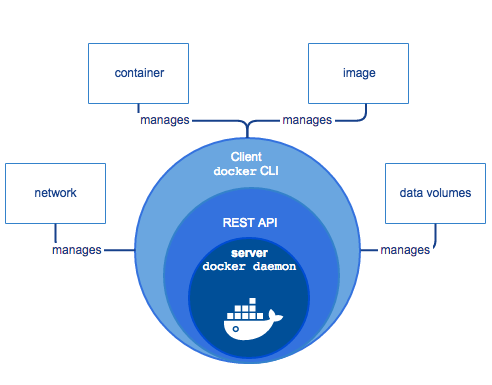

# 2. Docker CLI

- Docker cli windows ve mac te isletim sistemine kurulur fakat deamon linux'a kurulur.

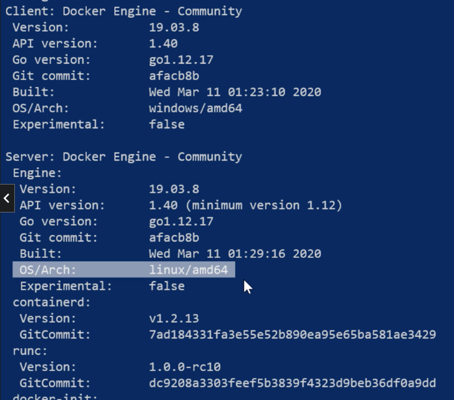

## 2.1. Commands

### 2.1.1. docker info

- docker hakkinda bilgiler verir. (container, images sayisi vs.)

### 2.1.2. docker container prune

- Tum containerlari siler.
-

### 2.1.3. docker image prune

- Tum image'leri siler.

```shell
docker image prune -a
```

### 2.1.4. cp

- Container icindeki bir dosyayi almak icin kullanilir.

```shell
docker cp myContainer:/usr/src/testFile . 
```

# 3. Containers

## 3.1. Container vs Virtual Machine

- Container icerisinde bir isletim sistemi kurulmasini gerektirmez, uzerinde oldugu bilgisayarin kernel'ini kullanir.
- VM ler kaynak tuketimi konusunda kotulerdir. Bir bilgisayarda 5VM %10 resource kullandi diyelim. Sistemin %50'lik
  kismi kullanilmamis olmaktadir.
- VM leri yonetmek daha zor

+ VM isletim sistemi izolasyonu yapar, Container ise uygulama izolasyonu
+ Container VM e gore cok hizli baslatilir. (Cunku VM kendi isletim sistemini ayaga kaldiracak, containar zaten uzerinde
  kullanildigi hali hazirdaki kerneli kullanir)
+ Container lari tasimak daha kolaydir, Image halinde tasinarak her yerde ayni calisir.

### 3.1.1. Play With Docker

- Browser uzerinden, kurulum gerekmeden 4 saat boyunca ve 5 instance'a kadar kullanabilecegimiz bir docker platformu.
- Bilgisayara kurulum yapmada problem varsa burasi kullanilabilir.

[play with docker](https://labs.play-with-docker.com/)

- Image'lar read only tutulur. Bir container olusturuldugunda, sadece o container'a ait **R/W Layer** olusturulur. Ve
  container'la ilgili tum degisiklikler burda tutulur.
- Biz cli ile container'i alttaki resim gibi ayri ayri katmanda degilde, bir butun olarak goruruz. Bunu Union File
  System'i saglamaktadir.
- Union File System ek olarak; hiz ve disk memory alani kazandirmaktadir.

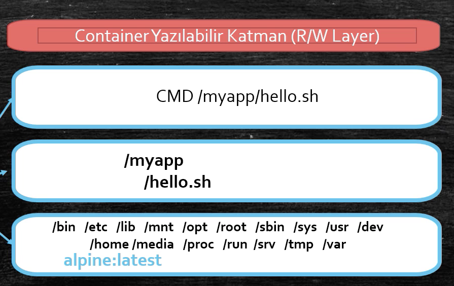

## 3.2. Docker Volume

- Ornegin bir container olusturduk ve uygulamanin loglarini, o container'a ait **R/W Layer** da sakliyor. Container down
  oldu ve yeni bir container yarattik. Peki o eski loglara nasil erisecegiz onlar kayboldu.
- Docker Volume bu sorunu cozer ve Container disi veri saklamaya yarar.
- Bir volume birden cok container a baglanabilir.
- Eger dolu bir volume container icindeki dolu bir folder'a mount edilirse, o folder'i ezer.
- Eger bos bir volume container icindeki dolu bir folder'a mount edilirse, o folder icindeki dosyalar o volume icine
  kopyalanir.

### 3.2.1. Create Volume

```shell
docker volume create myFirstTestVolume
```

### 3.2.2. Inspect Volume

```shell
 docker volume create myFirstTestVolume
```

```json
[
  {
    "CreatedAt": "2022-05-17T13:31:07Z",
    "Driver": "local",
    "Labels": {},
    "Mountpoint": "/var/lib/docker/volumes/myFirstTestVolume/_data",
    "Name": "myFirstTestVolume",
    "Options": {},
    "Scope": "local"
  }
]
```

### 3.2.3. Bind Volume to Container

- Bind example :

```shell
docker container run -v myFirstTestVolume:/testFolder alpine 
```

- Read only bind example :

```shell
docker container run -v myFirstTestVolume:/testFolder:ro alpine 
```

- Bind and enter inside of container :

```shell
docker container run -it -v myFirstTestVolume:/testFolder alpine sh
```

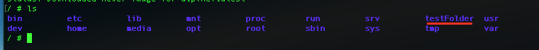

- Enter folder and create a text file than write something inside.

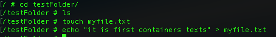

- Remove container and create new container with same volume. Even first container removed we can see same file and
  context same in the **new Container**.

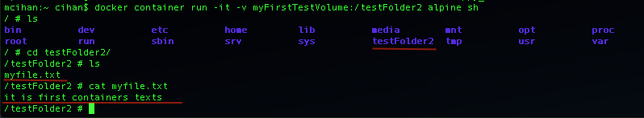

### 3.2.4. Bind Mounts

- Host ustundeki yada pc uzerindeki bir dosyayi container icerisine map edebiliriz. Buna **Bind Mounts** denir.
- Bu sayede container da calisan uygulamanin raporlarini local de bulunan c:\folder\index.html gibi bir dosyada surekli
  gorebiliriz. Container silinse bile bu dosyaya erisebiliriz.
- Yine bu sayede localde calistigimiz dosyalari container'a aktarirken kullanabiliriz. Ornegin containerda node
  uygulamaniz var, local de degisiklik yapip degisiklikleri direkt container'a yansitabiliriz.

Localde bulunan bir dosyayi nginx icerisine mount ettim ve localde her degistirdigimde direkt container icerisine
yansiyor :

```shell
docker container run -d -p 8181:80 -v /Users/cihan/git/my/docker-study/html:/usr/share/nginx/html --name nginxServer nginx
```

#### 3.2.4.1. TODO

- ❗❗ Belki aws uzerinde EKS de calisan bir nginx'e de bunu yapabilirim. Bunu bi arastir !!!!

## 3.3. Network

**Default 3 network vardir :**

- Bridge : default network'dur. Containerlar bringe uzerinden birbiriyle haberlesirler. (DNS cozmuyor)
- Host: container uzerinde bulundugu sistemin ag alt yapisini kullanir.
- None: container disariya acik degildir.

```shell
docker container run --name myNginxServer --net host nginx
```

- Kendi network'unu yaratma: (default brigde olarak yaratir, brigde de DNS cozmuyordu fakat bizim yarattigimizda default
  olarak cozuyor)

```shell
docker network create myNetwork1 
```

- detayli network yaratma (kendi ip ve gateway ile beraber)

```shell
docker network create --driver=bridge --subnet=10.10.0.0/16 --ip-range=10.10.10.0/24 --gateway=10.10.10.10 myNetwork2 
```

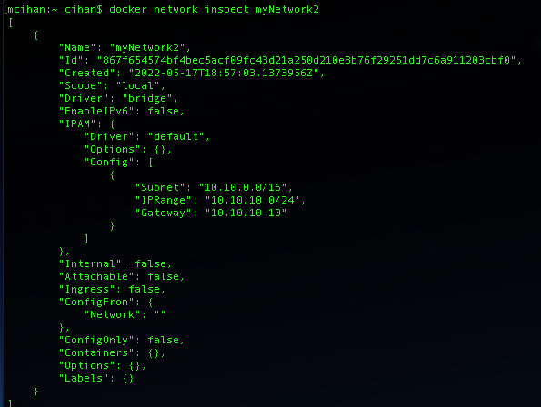

### 3.3.1. Port publishing

```shell
docker container run -p outsidePort:insidePort nginx
docker container run -p 8080:80 --publish 8090:8090 nginx
```

- default http portu acar, udp yada tcp icin asagidaki gibi yapilir:

```shell
docker container run -p 8080:80/udp nginx
```

### 3.3.2. Connect Network to Container

- Container'i olusturdugumuz network'e baglama:

```shell
docker network connect myNetwork myContainer
```

- Container'i olusturdugumuz network'ten koparma:

```shell
docker network connect myNetwork myContainer
```

## 3.4. Logging

- **STDIN**, **STDOUT**, **STDERR** : linux'un temel girdi ve cikti fonksiyonlaridir.
- Consola birsey yazdigimiz **STDIN** ile alinir, ```ls -l``` gibi bir komutun ciktisi da **STDOUT** ile basilir,
  komutlarda hata yaparsam bu da **STDERR** ile basilir.
- Docker container bunlari kullanarak loglarini basar ve bizde bu sayede consol'dan gorebiliriz.
- Eger containerda calisan uygulamanin loglarini **STDOUT** ile basmasi icin duzenleme yapilmasi gerekmektedir.
- NGINX uygulama loglarini ```var/log/nginx``` altinda access.log ve error.log olarak tutar. Nginx bu loglari nasil
  STDOUT ve STDERR'e basiyor:

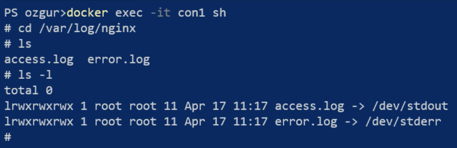

- Container in loglarini gorme:

```shell
docker logs myContainer
```

- Detayli Log gorme: ( bazi uygulamalar defaultta cok log gostermezler, detayli bu sekilde gorebiliriz)

```shell
docker logs --details myContainer
```

- Log zamaniyla beraber gorme: (yoksa)

```shell
docker logs -t myContainer
```

- Belirli bir zaman araligindaki loglari gorme: (yoksa)

```shell
docker logs -t --since 2022-05-16  --until 2022-05-18 myContainer
docker docker logs -t --since 2022-05-17T18:26:02.162508300Z  --until 2022-05-17T18:27:02.162508300Z myContainer
```

- Belirli satirda log gorme: (orn son 100 satir)

```shell
docker logs --tail 100 myContainer
```

- loglari canli akis olarak gosterme(komutu sonlandirmadan)

```shell
docker logs -f myContainer
```

### 3.4.1. Logging Driver

- Docker'in logging driver pluginlerini kullanarak, containerlarin loglarina tektek bakmaktansa bunlari merkezi bir log
  yapisinda tutabiliriz

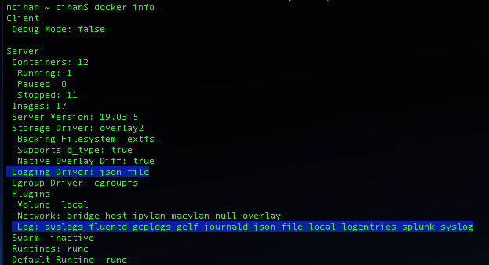

- Log driver'ini degistirmek istersek:(splunk olani yaptik)

```shell
docker container run --log-driver splunk myContainer
``` 

## 3.5. Trace Process

- linux'ta ```ps``` komutuyla o an calisan processleri gorebiriz, docker da bunun icin asagidaki komutu kullaniyoruz:

```shell
docker top myContainer
``` 

- linux'ta ```htop``` vs komutlariyla sistemin ne kadar cpu, ram, disk ve network kullandigini gorebiriz, docker da
  bunun icin asagidaki komutu kullaniyoruz:

- Tum containerler icin  :

```shell
docker stats
``` 

- Berlirli bir container icin:

```shell
docker stats myContainer
``` 

### 3.5.1. Limiting CPU & Memory

- Default olarak bir container bulundugu sistemin tum memory/cpu sunu kullanir. Bunun limitlenmesi gerekebilir!

- memory limitleme:

```shell
docker container run --memory=1024m nginx
``` 

- cpu limitleme:

```shell
docker container run --cpus=2 nginx
``` 

- belirlir cpu'lari kullandirma: (ornegin 8 cpu var, 1. ve 3. cpu yu kullandirmak istersek)

```shell
docker container run --cpuset-cpus="1,3" nginx
``` 

## 3.6. Environment

- Windows All Env

```shell
Get-ChildItem Env:
```

- Linux All Env

```shell
printenv
```

### 3.6.1. Docker Environments

- Environment gecme

```bash
docker container run --env MY_ENV=test1 -e MY_ENV2=test2 ubuntu
```

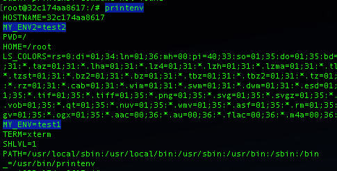

- Isletim sistemindeki environmenti gecme(exp: JAVA_HOME)

```bash
docker container run --env MY_ENV=JAVA_HOME ubuntu
```

- Bir file icerisindeki environment listesini gecme:

```bash
docker container run --env-file .\myFile.list ubuntu
```

# 4. Images

- Bir linux sistemini al, icindeki cekirdegi ve tum gereksiz uygulamalari cikar, icine calistirmak istedigin uygulamayi
  ve gerekli kutuphaneleri yukle koy ve paketle, bu bir image'dir.

## 4.1. Naming

```shell
RegistryUrl/repository:tag
docker.iu/ubuntu>:18.04
```

## 4.2. Dockerfile

- Dockerfile build edilirken eger stepler oncesinden uygulandiysa yeni build de docker var olani on bellekten alarak
  kullanir yani bastan build etmez. Ornegin ```FROM ubuntu:18.04``` ikinci build de bu kismi cacheden alir.
- Eger steplerden birinin icerigi degisirse o step ve sonraki stepleri bastan build eder. Bundan dolayi degismeyecek
  yada az degisecek seylerin ust kisimlara yazilmasi tavsiye edilir.

- Ayni image'i ikinci defa calistirdiginda;

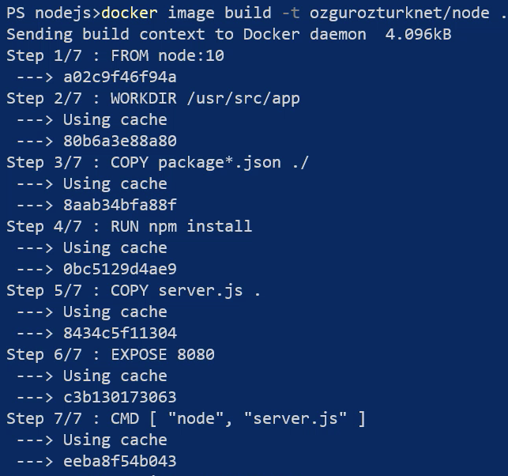

- server.js in icerigini degistirigimizde; o stepi ve sonrasini bastan build edecek.

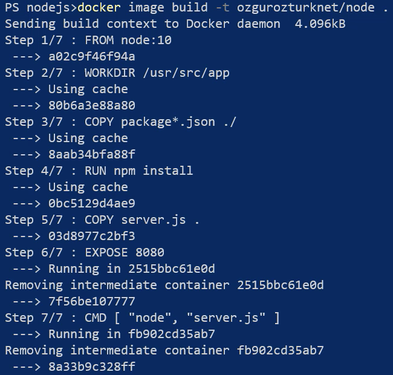

## 4.3. Commands

### 4.3.1. FROM

- Oluşturulacak imajın hangi imajdan oluşturulacağını belirten talimat. Dockerfile içerisinde geçmesi mecburi tek
  talimat budur. Mutlaka olmalıdır.   
  Ör: FROM ubuntu:18.04

### 4.3.2. LABEL

- İmaj metadata’sına key=value şeklinde değer çiftleri eklemek için kullanılır. Örneğin team=development şeklinde bir
  etiket eklenerek bu imajın development ekibinin kullanması için yaratıldığı belirtilebilir.

Ör: LABEL version:1.0.8

### 4.3.3. RUN

- İmaj oluşturulurken shell’de bir komut çalıştırmak istersek bu talimat kullanılır. Örneğin apt-get install xxx ile xxx
  isimli uygulamanın bu imaja yüklenmesi sağlanabilir.

Ör: RUN apt-get update

### 4.3.4. WORKDIR

- cd xxx komutuyla ile istediğimiz klasöre geçmek yerine bu talimat kullanılarak istediğimiz klasöre geçer ve oradan
  çalışmaya devam ederiz.

Ör: WORKDIR /usr/src/app

### 4.3.5. USER

- gireceğimiz komutları hangi kullanıcı ile çalıştırmasını istiyorsak bu talimat ile onu seçebiliriz.

Ör: USER poweruser

### 4.3.6. COPY

- İmaj içine dosya veya klasör kopyalamak için kullanırız

Ör: COPY /source /user/src/app

### 4.3.7. ADD

- COPY ile aynı işi yapar yani dosya ya da klasör kopyalarsınız. Fakat ADD bunun yanında dosya kaynağının bir url
  olmasına da izin verir. Ayrıca ADD ile kaynak olarak bir .tar dosyası belirtilirse bu dosya imaja .tar olarak
  sıkıştırılmış haliyle değil de açılarak kopyalanır.

Ör: ADD https://wordpress.org/latest.tar.gz /temp

### 4.3.8. ENV

- Imaj içinde environment variable tanımlamak için kullanılır

Ör: ENV TEMP_FOLDER="/temp"

### 4.3.9. ARG

- ARG ile de variable tanımlarsınız. Fakat bu variable sadece imaj oluşturulurken yani build aşamasında kullanılır.
  Imajın oluşturulmuş halinde bu variable bulunmaz. ENV ile imaj oluşturulduktan sonra da imaj içinde olmasını
  istediğiniz variable tanımlarsınız, ARG ile sadece oluştururken kullanmanız gereken variable tanımlarsınız.

Ör: ARG VERSION:1.0

### 4.3.10. VOLUME

- Imaj içerisinde volume tanımlanamızı sağlayan talimat. Eğer bu volume host sistemde varsa container bunu kullanır.
  Yoksa yeni volume oluşturur.

Ör: VOLUME /myvol

### 4.3.11. EXPOSE

- Bu imajdan oluşturulacak containerların hangi portlar üstünden erişilebileceğini yani hangi portların yayınlanacağını
  bu talimatla belirtirsiniz.

Ör: EXPOSE 80/tcp

### 4.3.12. ENTRYPOINT

- Bu talimat ile bir containerın çalıştırılabilir bir uygulama gibi ayarlanabilmesini sağlarsınız.

Ör: ENTRYPOINT ["/usr/sbin/apache2ctl", "-D", "FOREGROUND"]

### 4.3.13. CMD

- Bu imajdan container yaratıldığı zaman varsayılan olarak çalıştırmasını istediğiniz komutu bu talimat ile
  belirlersiniz.

Ör: CMD java merhaba

### 4.3.14. HEALTHCHECK

- Bu talimat ile Docker'a bir konteynerin hala çalışıp çalışmadığını kontrol etmesini söylebiliriz. Docker varsayılan
  olarak container içerisinde çalışan ilk processi izler ve o çalıştığı sürece container çalışmaya devam eder. Fakat
  process çalışsa bile onun düzgün işlem yapıp yapmadığına bakmaz. HEALTHCHECK ile buna bakabilme imkanına kavuşuruz.

Ör: HEALTHCHECK --interval=5m --timeout=3s CMD curl -f http://localhost/ || exit 1

### 4.3.15. SHELL

- Dockerfile'ın komutları işleyeceği shell'in hangisi olduğunu belirtiriz. Linux için varsayılan shell ["/bin/sh", "-c"]
  ,Windows için ["cmd", "/S", "/C"]. Bunları SHELL talimatı ile değiştirebiliriz.

Ör: SHELL ["powershell", "-command"]

### 4.3.16. RUN vs CMD

- **RUN**: image olusurken calisir
- **CMD**: container calismaya baslayinca calistirilir.

### 4.3.17. ENTRYPOINT VS CMD

- **CMD** ile yazilan komut imaga olustuktan sonra ezilebilir, Ornegin dockerfile'in son satiri boyle
  olsun  ```CMD echo 'hello'```,   
  ```docker run myImage echo 'no hello' ```  bu komut 'no hello' yazacaktir. **ENTRYPOINT** bunun olmasini engeller.
- Bir Dockerfile da bir **ENTRYPOINT** ya da **CMD** olmak zorundadur.
- Iki komut ayni anda yazilirsa, docker **ENTRYPOINT**'i calistirir ve **CMD** de yazili olanlari parametre olarak **
  ENTRYPOINT**'teki komuta ekler.

Ornegin;

```dockerfile
FROM centos:latest
ENTRYPOINT ["ping"]
CMD ["127.0.1.1"]
```

### 4.3.18. CMD: Exec vs Shell Forms

- **Exec Form :** ```CMD ["java", "App.java"]```
- **Shell Form :** ```CMD java App.java ```

1. Eğer komut Shell formunda girilirse Docker bu imajdan container yaratıldığı zaman bu komutu varsayılan shell'i
   çalıştırarak onun içerisinde girer. Bu nedenle containerda çalışan 1. Process yani pid1 bu shell process'i olur.
2. Eğer komut Exec formunda girildiyse Docker herhangi bir shell çalıştırmaz ve komut direk process olarak çalışır ve
   container'ın pidri o process olur.
3. Exec formunda çalıştırılan komutlar herhangi bir shell processi çalışmadı için Environment Variable gibi bazı
   değerlere erişemezler. Bunu göz önünde bulundurmak gerekir.
4. Eğer Entrypoint ve CMD birlikte kullanılacaksa Exec form kullanılmalıdır. Shell formu kullanıldığında CMD'deki
   komutlar ENTRYPOINT'e parametre olarak aktarılmaz.

### 4.3.19. Build ARG

- Dockerfile build olurken disardan arguman gecmeye yarar.
- Degisken tanimlama icin de kullanilabilinir,
- Genelde CI/CD de degisik imajlar olusturmak icin siklikla kullanilir.

```dockerfile
FROM ubuntu:latest
WORKDIR /temp
ARG VERSION=1.0.0
ADD https://www.python.org/ftp/python/${VERSION}/Python-${VERSION}.tgz .
CMD ls -al
```

- Run :

```shell
docker image build -t my_image_v1 --build-tag VERSION-3.7.1 .
```

### 4.3.20. ARG VS ENV

- **ENV** dockerfile icerisinde degisken olarak kullanilamiyor bu yuzden **ARG** kullanilmali.
- **ARG** ile yaratilan degiskenlere container'lar uzerinden erisilemez.

## 4.4. Docker **commit**

- Bir container'dan image olusturmak icin kullanilir.
- Ornegin bir ubuntu image'i cekip container olarak baslatip icerisinde wget ile wordpress i cekip kurduk ve bu
  container i image yapmak istedik, bu durumda commit kullanabiliriz

```shell
docker commit myContainerId  myhubname/containerName:version 
```

- Container'dan image olustururken komut girmek istersek:

```shell
docker commit -c 'CMD["command1"]' myContainerId  myhubname/containerName:version 
```

## 4.5. Docker Save - Load

- Bazi sunucular guvenlik sebebiyle vs internete kapali olabilirler. Bu durunda image olusturmak icin docker hub'a
  baglanamazlar. Bu sorunu cozmek icin docker **save** ve **load** komutlarini gelistirmistir.
- Docker **save** ile var olan bir image'i tar haline getirip. **load** ile de bu dosyayi image haline getirebiliriz.

Save : ```-o``` output demek

```shell
docker save myhubname/imageName:version -o myImage.tar
```

Load : ```-i``` image demek

```shell
docker load -i .\myImage.tar
```

## 4.6. Docker Image Registry

- Hep cekilen image'leri local'e cekip surekli burdan cekebiliriz.

**Cozumler**:

- Docker EE registry
- Microsoft registry cozumu
- AWS registry cozumu
- Artifactory : JFrog, Sonatype Nexus, Archiva

Image artifactoryDomain/imageAdi:versionu seklinde tag'lenir

```shell
docker image tag myhubname/imageName:version 127.0.0.1/my-image:latest
```

Image tag'i kullanilarak pushlandiginda direkt o artifaktoriye belirtilen image ismi versiyonuyla bir image
olusturulacaktir.

```shell
docker image push 127.0.0.1/my-image:latest
```

Yarattigimiz imagi cekmek icin:

```shell
docker pull 127.0.0.1/my-image:latest
```

## 4.7. Example 1 : Create HelloWorld Java App Image

- Dockerfile:

```dockerfile
FROM ubuntu:18.04
RUN apt-get update -y
RUN apt-get install default-jre -y
WORKDIR /hello
COPY ./app .
CMD ["java", "TestApp.java"]
```

- Create image:

```shell
docker image build -t hello-java-image .
```

- Run image:

```shell
docker run hello-java-image
```

# Compose

## CLI

### docker compose up

docker-compose.yml dosyasini ayaga kaldirir.

### docker compose down

- docker-compose.yml dosyasindeki servisleri kapatir sonrada siler.
- Network olusturulduysa onu da siler.
- Fakat volume'u silmez.

### docker compose config

docker-compose.yml dosyasinin icerisini gosterir. Ayni zamanda bu dosyayi calistirmadan once hata var mi bunu gormus
oluruz. Terraform da apply komutu gibi.

### docker compose images

Olusturulan servislerin hangi image'lar ile olusturuldugunu gosterir.

### docker compose exec

Exec ile ilgili servis icinde komut calistirilabilir.

### docker compose build

Compose dosyasinda kendi olusturdugun image i Dockerfile dan almak istersek kullaniriz.

```yaml
version: '3.7'

services:
  myService:
    build: .
```

- Image degistirilmezse, tekrar docker-compose up denildiginde var olan image tekrar olusturmaz, olani kullnir.
- Image i degistirdikten sonra degisiklikleri servise yansitmak icin asagidaki kod calistirilir.

```shell
docker-compose build 
```

```shell
docker-compose exec servisName komut

docker-compose exec userservice ls -a
```

# Swarm

- Container orkestrasyonu saglar.
- Docker swarm docker engine'e gomuludur, ek bir arac gerektirmez. Kubernates'a gore kurulumu cok sadedir.
- Kullanimi ve yonetimi kubernates'a gore oldukca basittir.
- Bir uygulama baslarken Swarm ile baslayip daha sonra kubernates'a donmek daha verimli olabilir.
- Swarm kullanmak icin asagidaki portlarin acik olmasi gerekir:
    + **TCP 2377 :** Cluster yonetimi icin
    + **TCP & UDP 7946 :** Node'lar arasi iletisim icin
    + **UDP 4789 :** Overlay network icin

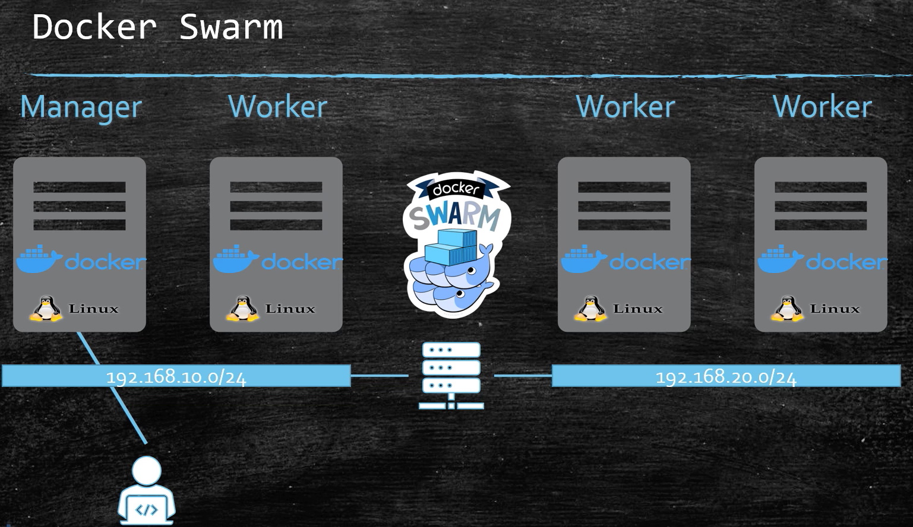

## How Does Swarm Work?

- Docker swarm'i bir makinede/host'ta init ettigimizde onu Manager yapariz.
- Diger node'lari manager'a subscrip ederek onlari worker yapariz.
- Biz Manager'a baglanip ona; 5 tane ngnix instance yaratmasini soyleriz.
- Manager bu 5 instance i worker'lara dagitir. Ornegin; 1. ve 2. worker'a 2'ser tane, 3. worker 1 tane ngnix instance'i
  yaratti.
- Manager worker'lar icin surekli healty check yapar.
- worker-3 disk kapasitesi vs coktu diyelim. Manager bunu anlar ve 3. worker'in uzerinde bulunan nginx instance'ini
  diger saglikli worker'lara tasir.
- Boylece biz **High Availability** olan 7/24 kesintisiz calisan bir container alt yapisini kullaniyor oluruz.

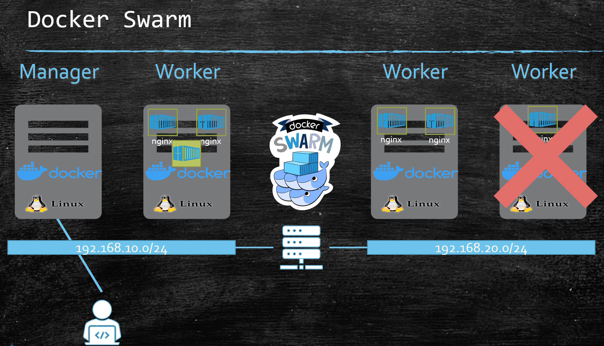

- Swarm da birden fazla Manager olabilir. Sadece 1 tanesi liderdir ve digerleri pasiftir. Pasif manager'lar istegi kabul
  ederler ama bu istekle ilgili bir worker calistirmazlar. Bunun yerine proxy gibi gelen istegi Leader'a aktarirlar ve
  Leader worker'i calistirir.
- Kisitlanmadikca manager node'lar da worker node gibi calisir. Yani uzerinde instance kaldirip is yaparlar. Ama bu
  production ortaminda kisitlanmalidir.
- Swarm Lider manager secimi icin **RAFT concensus** algoritmasini kullanir.
- Tek sayi secilmelidir. Kafka breaker'larda oldugu gibi.

## docker swarm init

```docker swarm init``` komutu calistirildigiktan anda; docker bu sistemi engine moddan alip swarm moda gecirir.

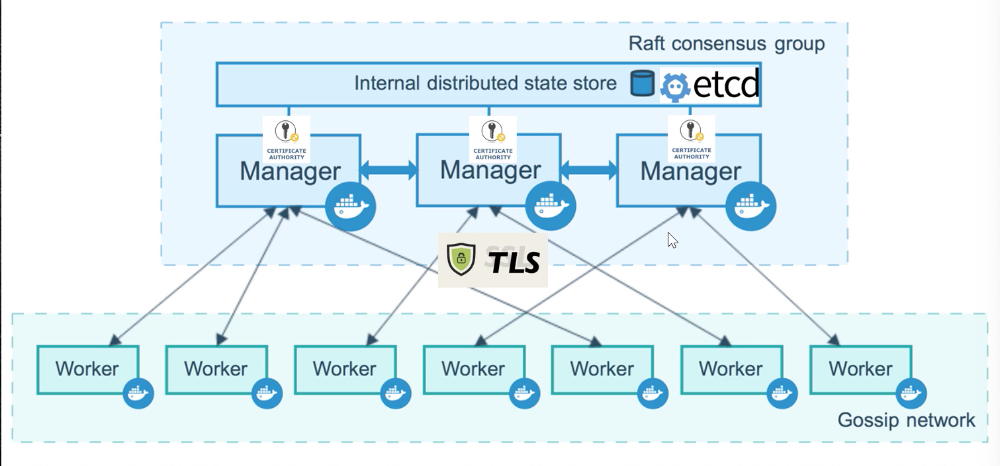

## **declarative vs imperative**

- imperative de yazilan komutta ornegin 5 nginx instance'i calissin dedik, eger 4 intance'a duserse sistem hata verip
  bizi uyarir ve bizim tekrar komut girerek bu durumu duzeltmemiz gerekir.
- Ayni durum icin declarative de sistem bizim deklare ettigimiz istek olana kadar kendi denemeler yaparak sistemi
  duzeltir.

## Docker service

- Swarm icerinde container komutu calistirilamaz onun yerine service konumutu calistirilir.

### docker service create

```shell
docker service create [OPTIONS] IMAGE [COMMAND] [ARG...]
```

- Var olan bir servisi scale etmek icin **scale** konutu kullanilir. Hem arttirip hem de azaltabililiriz.

### docker service scale

```shell
docker service scale myService=3
docker service scale myService=1
```

### docker service update

- Swarmda calisan bir servisin yeni bir versionunu gelistirdik ve bunu degistirmek istedik. Bu durumda servisi indirip
  bastan yeni servis olusturmaktandsa; Update komutunu kullanarak dusuk kesinti ile image vs guncelleyebiliriz.

```shell
docker service update ...
```

### docker service rollback

- Swarmda calistirdigimiz bir servis uzerinde degisiklik yaptigimizda hata aldik diyelim, bu durumda servisi eski hale
  getirmek icin rollback komutunu kullanabiliriz.

```shell
docker service rollback ...
```

## Overlay Network

- Farkli zonelarda calisan docker worker ve manager'lari ayni network icerisinde toplar. Makineler birbirlerindeki
  servislere direkt ismiyle erisebilir(DNS cozme gibi).

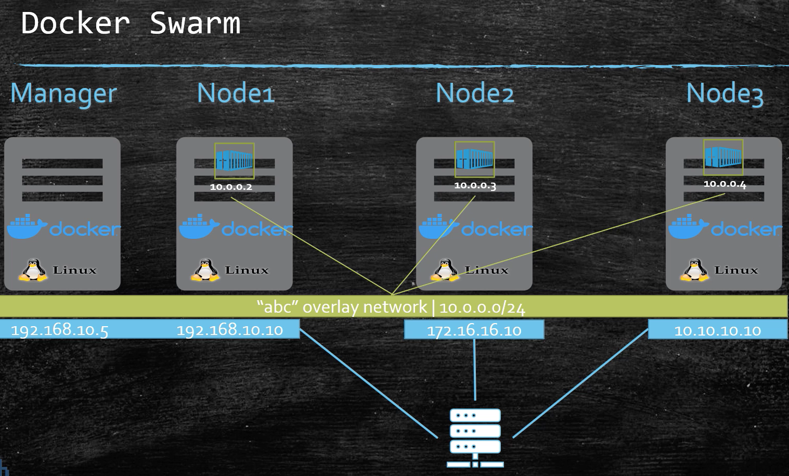

# 5. Linux

- Komutu arka planda calistirma

```shell
&
```

- Birden fazla komutu calistirma

```shell
komut1;komut2;komut3
```

- komut1 duzgun calisirsa komut2'yi de calistir

```shell
komut1 && komut2
cat abc.txt && echo 'abc.exist end we can read it!'
```

- komut1 duzgun calismazssa komut2'yi calistir

```shell
komut1 || komut2
cat abc.txt || echo 'abc.txt does not exist so we can not read it!'
```

- komut hakkinda detayli bilgi verme
```shell
man [command]
man pwd
```


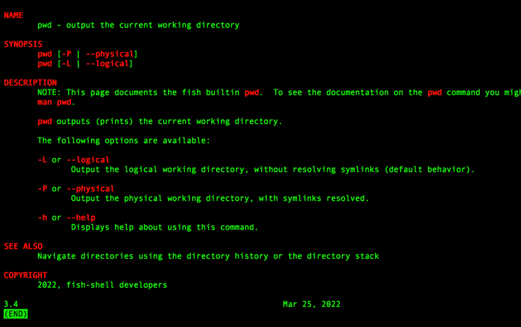

# 6. Note

# 7. TODO
