- [1. What is Kubernetes?](#1-what-is-kubernetes)
    - [1.1. Imperative vs Declarative Configuration](#11-imperative-vs-declarative-configuration)
- [2. Components](#2-components)
    - [2.1. Control Plane](#21-control-plane)
        - [2.1.1. kube-apiserver](#211-kube-apiserver)
        - [2.1.2. etcd](#212-etcd)
        - [2.1.3. kube-scheduler](#213-kube-scheduler)
        - [2.1.4. kube-controller-manager](#214-kube-controller-manager)
    - [2.2. Worker Nodes](#22-worker-nodes)
        - [2.2.1. kubelet](#221-kubelet)
        - [2.2.2. k-proxy](#222-k-proxy)
- [3. kubectl](#3-kubectl)
    - [3.1. config](#31-config)
    - [3.2. help](#32-help)
    - [3.3. -o](#33--o)
    - [3.4. explain](#34-explain)
- [4. Terminology](#4-terminology)
    - [4.1. Cluster](#41-cluster)
    - [4.2. Namespace](#42-namespace)
    - [4.3. Node](#43-node)
    - [4.4. Context](#44-context)
- [5. Objects](#5-objects)
    - [5.1. Log](#51-log)
    - [5.2. exec](#52-exec)
    - [5.3. delete](#53-delete)
    - [5.4. Pods](#54-pods)
        - [5.4.1. Pod Life Cycle](#541-pod-life-cycle)
        - [5.4.2. Get Pods](#542-get-pods)
        - [5.4.3. Create Pod](#543-create-pod)
        - [5.4.4. Edit Pod](#544-edit-pod)
        - [5.4.5. Delete Pod](#545-delete-pod)
        - [5.4.6. command](#546-command)
        - [5.4.7. See Details of Pod](#547-see-details-of-pod)
        - [5.4.8. Restart Policy](#548-restart-policy)
    - [5.5. Multi-container Pod](#55-multi-container-pod)
    - [5.6. Init Container](#56-init-container)
    - [5.7. label](#57-label)
        - [5.7.1. Default Pod Labels](#571-default-pod-labels)
        - [5.7.2. Equality-based Selector](#572-equality-based-selector)
        - [5.7.3. Set-based Selector](#573-set-based-selector)
        - [5.7.4. Add Label](#574-add-label)
            - [5.7.4.1. Add label all pods on the namespace](#5741-add-label-all-pods-on-the-namespace)
        - [5.7.5. Delete Label](#575-delete-label)
        - [5.7.6. Update Label](#576-update-label)
    - [5.8. Annotation](#58-annotation)
        - [5.8.1. Create](#581-create)
    - [5.9. Namespace](#59-namespace)
        - [5.9.1. Create](#591-create)
        - [5.9.2. List](#592-list)
        - [5.9.3. Set Current Namespace](#593-set-current-namespace)
        - [5.9.4. Delete Namespace](#594-delete-namespace)
    - [5.10. Replication Controller](#510-replication-controller)
    - [5.11. Deployment](#511-deployment)
        - [5.11.1. Create](#5111-create)
        - [5.11.2. Edit](#5112-edit)
            - [5.11.2.1. Edit Image](#51121-edit-image)
            - [5.11.2.2. Scale Pods](#51122-scale-pods)
        - [5.11.3. Delete](#5113-delete)
    - [5.12. ReplicaSet](#512-replicaset)
        - [5.12.1. List](#5121-list)
        - [5.12.2. Rollout](#5122-rollout)
        - [5.12.3. Create](#5123-create)
    - [5.13. Rollout & Rollback](#513-rollout--rollback)
        - [5.13.1. Strategy](#5131-strategy)
            - [5.13.1.1. Recreate](#51311-recreate)
            - [5.13.1.2. RollingUpdate](#51312-rollingupdate)
        - [5.13.2. Rolling](#5132-rolling)
        - [5.13.3. Status](#5133-status)
        - [5.13.4. Pause & Resume](#5134-pause--resume)
    - [5.14. Service](#514-service)
        - [5.14.1. ClusterIP](#5141-clusterip)
        - [5.14.2. NodePort](#5142-nodeport)
        - [5.14.3. LoadBalancer](#5143-loadbalancer)
        - [5.14.4. Endpoints](#5144-endpoints)
    - [5.15. Liveness probe](#515-liveness-probe)
        - [5.15.1. http](#5151-http)
        - [5.15.2. tcp](#5152-tcp)
        - [5.15.3. command line](#5153-command-line)
    - [5.16. Readiness probe](#516-readiness-probe)
        - [5.16.1. terminationGracePeriodSeconds](#5161-terminationgraceperiodseconds)
    - [5.17. Resource Limit](#517-resource-limit)
    - [5.18. Environment Variable](#518-environment-variable)
    - [5.19. Post-forward](#519-post-forward)
- [6. 102](#6-102)
    - [6.1. Volume](#61-volume)
        - [6.1.1. Emphemeral Volume](#611-emphemeral-volume)
        - [6.1.2. Persistent Volume](#612-persistent-volume)
            - [6.1.2.1. CSI - Container Storage Interface](#6121-csi---container-storage-interface)
    - [6.2. Storage Class](#62-storage-class)
    - [6.3. Secret](#63-secret)
        - [6.3.1. List Secret](#631-list-secret)
    - [6.4. ConfigMap](#64-configmap)
    - [6.5. Node Affinity](#65-node-affinity)
        - [6.5.1. requiredDuringSchedulingIgnoredDuringExecution](#651-requiredduringschedulingignoredduringexecution)
        - [6.5.2. preferredDuringSchedulingIgnoredDuringExecution](#652-preferredduringschedulingignoredduringexecution)
    - [6.6. Pod Affinity](#66-pod-affinity)
        - [6.6.1. Pod AntiAffinity](#661-pod-antiaffinity)
    - [6.7. Taint & Toleration](#67-taint--toleration)
        - [6.7.1. Taint Create](#671-taint-create)
        - [6.7.2. Master Node - Taint](#672-master-node---taint)
    - [6.8. DaemonSet](#68-daemonset)
    - [6.9. StatefulSet](#69-statefulset)
    - [6.10. Job](#610-job)
        - [6.10.1. List jobs](#6101-list-jobs)
    - [6.11. Cron Job](#611-cron-job)
- [7. Authentication](#7-authentication)
    - [7.1. Role](#71-role)
    - [7.2. Service Account](#72-service-account)
- [8. Ingress](#8-ingress)
- [9. Others](#9-others)
    - [9.1. Dashboard & GUI](#91-dashboard--gui)
    - [9.2. Static Pod](#92-static-pod)
    - [9.3. Network Policy](#93-network-policy)
    - [9.4. Heml](#94-heml)
    - [9.5. Monitoring](#95-monitoring)
    - [9.6. Service Mesh](#96-service-mesh)
        - [9.6.1. Istio](#961-istio)
        - [9.6.2. Linkerd](#962-linkerd)
    - [9.7. CRD - Custom Resource Definition](#97-crd---custom-resource-definition)
- [10. Link](#10-link)
- [11. TODO](#11-todo)

# 1. What is Kubernetes?

- Container Orchestration Platform
- Declarative Configuration
- Repair system/error/downs
- Open-source

## 1.1. Imperative vs Declarative Configuration

- Imperative : Stepler tek tek tanimlanir, ne yapilmasi gerektigini, islerin detaylarini, sisteme adim adim belirtiriz.
  Orn: Marangozdan 200x200x100 dolap istiyoruz. Marangoza 200x100 2 tane tahta al, civi al, sonra monte et gibi
  talimatlar veriyoruz.
- Declarative : Islerin detayina karismadan, sisteme ne istedigimizi soyleriz, isine karismayiz. Orn: Marangozdan
  200x200x100 dolap istiyoruz. Isin detaylariyla ilgilenmiyoruz.

# 2. Components

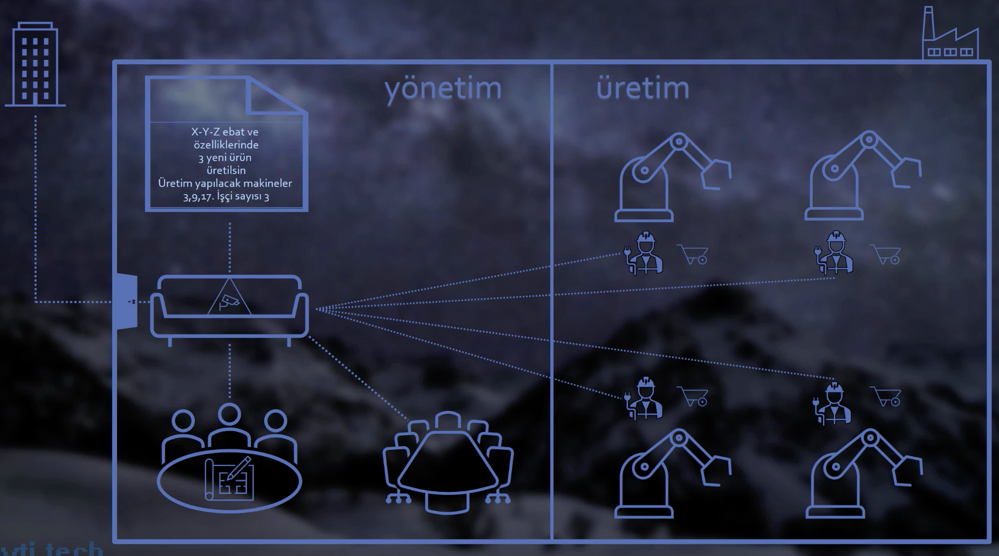

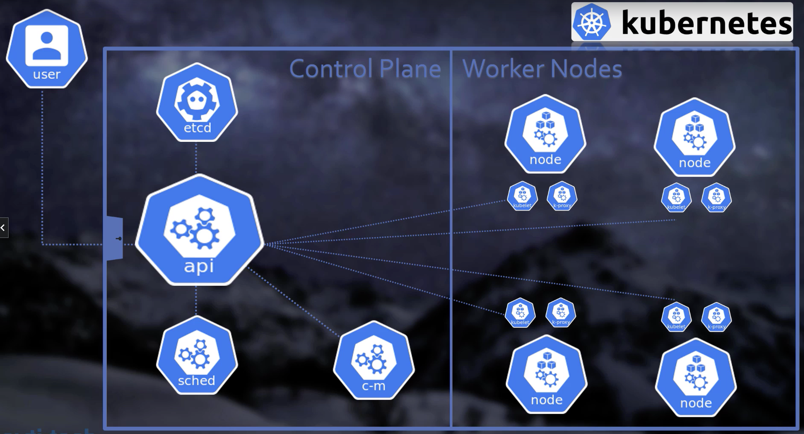

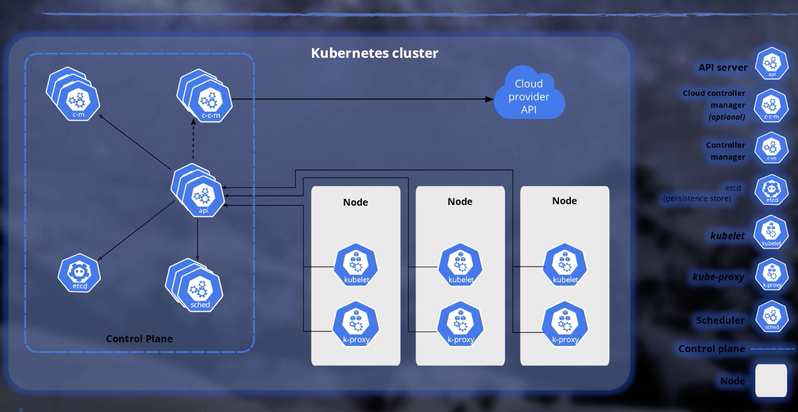

## 2.1. Control Plane

### 2.1.1. kube-apiserver

- Control plane'in en onemli parcasidir.
- Giris cikis noktasidir
- Diger tum komponent ve node bilesenlerinin direkt iletisim kurabildigi tek komponenttir.
- Authentication ve Autherization burda yapilir

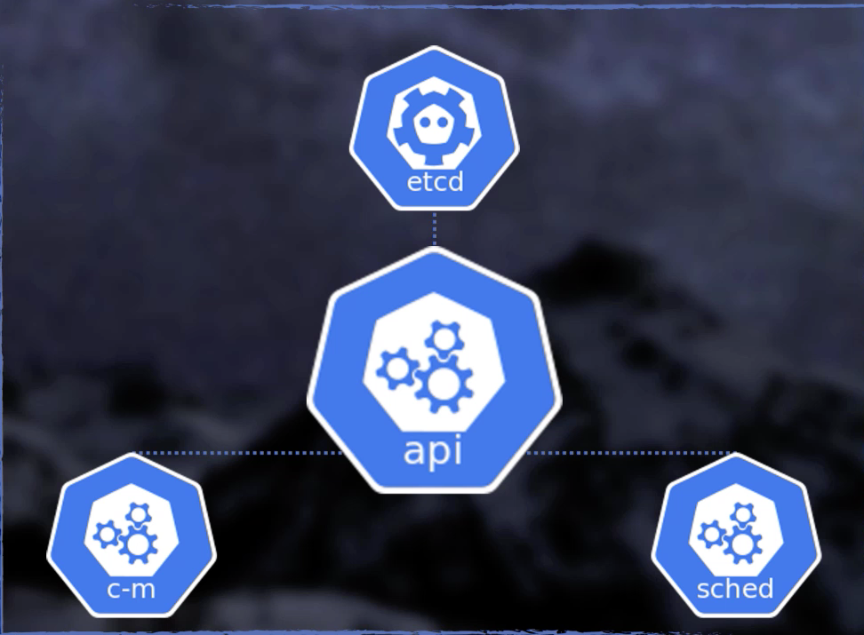

### 2.1.2. etcd

- Tum cluster verisi, metadata bilgileri ve kubernetes'te olusturulan tum objelerin bilgilerinin key-value olarak
  tutuldugu yerdir.
- Cluster'in mevcut durumuyla ilgili bilgileri tutar.
- Orn: Pano

### 2.1.3. kube-scheduler

- Yaratilacak olan Pod'un gereksinimlerine(cpu vs) uygun worker'i bulur.

### 2.1.4. kube-controller-manager

- Mevcut durumun etcd yer alan, istenilen duruma uygun olup olmadigini kontrol eder.
- Icerisinde birden cok kontroller barindirir:
    + Node controller
    + Job controller
    + Service Account & Token Controller
    + Endpoint Controller

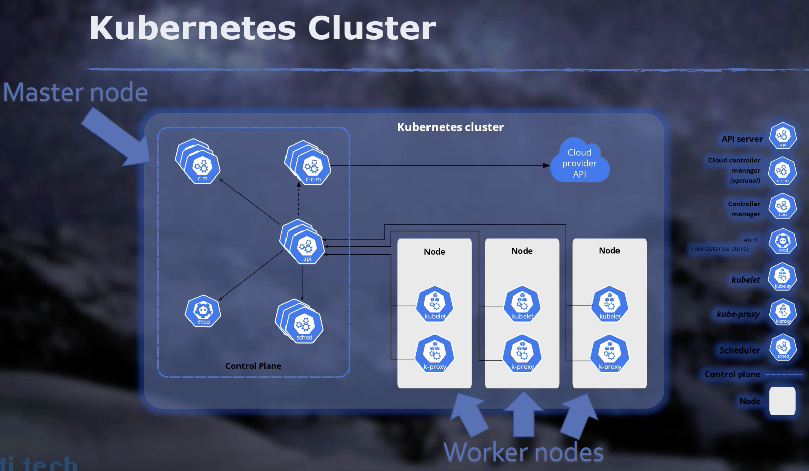

## 2.2. Worker Nodes

### 2.2.1. kubelet

- Pod icerisinde yer alan container'larin calismasini saglar.

### 2.2.2. k-proxy

- Ag kurallarini yonetir.

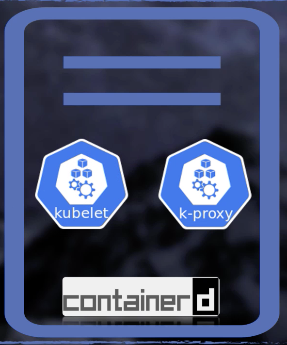

# 3. kubectl

## 3.1. config

- Baglanacagi kubernetas cluster bilgilerine config dosyasi araciligiyla erisir.
- Config dosyasi icerisinde baglanmak istedigimiz cluster bilgilerini ve bu clusterlara baglanmak icin kullanilacak
  kullanicilari belirleriz.
- Daha sonra bu baglanti bilgileri, kullanicilari ve namespace'leri ile bir context olustururuz.
- default olarak ```home/.kube/``` dizinindedir. Fakat KUBECONFIG environment'i ile bunu degistirebiliriz.


- ``` kubectl config``` komutu ile kullanilabilen sub-komutlar:

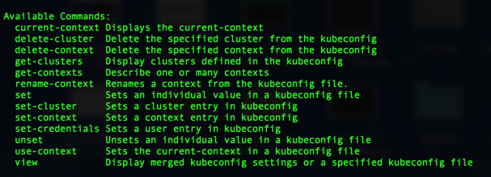

- ```kubectl config get-contexts  ``` ile contextleri aliriz. Current context'in onunde * isareti bulunur.
- ```kubectl config current-context  ``` Current context'in dondurur.
- ```kubectl config use-context [contextName] ``` istenilen context'e gecilir.
- ```kubectl get pods ``` bu ve bunun gibi komutlar default context'te calisir. **use-context** kullanmadan(context
  degistirmeden) baska bir namespace'de komut calistirmak istiyorsak; ```kubeclt get pods -n [namespace]``` seklinde
  kullanabiliriz.
- ```kubectl get pods -all-namespaces``` ya da  ```kubectl get pods -A``` komutu tum namespace'lerde calistirir.

## 3.2. help

- ```kubectl [command] --help ``` komutun kullanisini gosterir.

## 3.3. -o

- output'u detayli yada formatli gosterir.
- **-o wide** output'ta daha fazla kolon doner.
- **-o json** json olarak cikti verir . ```kubectl get pods -o json | jq -r ".item[].spec.containers[].name" ``` vb
  gibi **jq** kullanarak istedigimiz gibi bir sonuc donebiliriz.

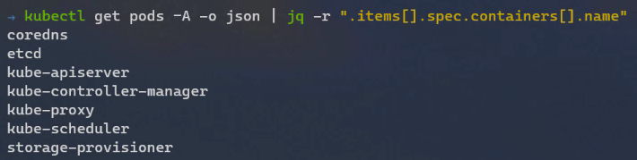

- **-o yaml** yaml olarak cikti verir.

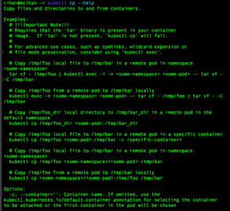

## 3.4. explain

- objenin bilgisini verir. **help** sadece komut bilgisini verir. Ornegin pod bir komut degil obje bundan dolayi help
  ise yaramaz onun yerine explain kullanmaliyiz.

# 4. Terminology

Context & Cluster & User

## 4.1. Cluster

Kubernetes tarafindan yonetilen node'lar birligidir. En az bir master ve bir worker olmalidir.

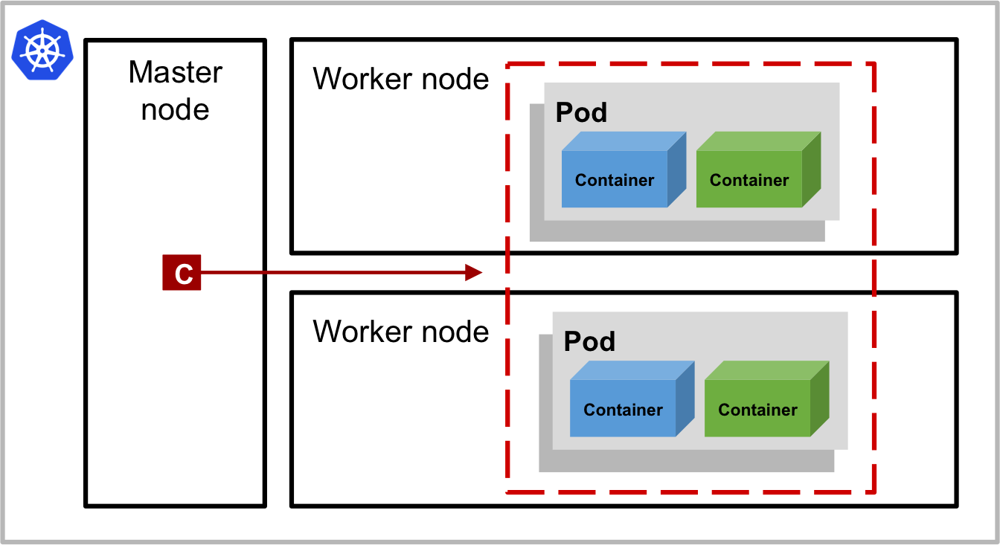

Bir projede asagidaki gibi Cluster'larimiz olabilir. Bu Cluster'dan biri minikube'deyken digeri AWS EKS' de olabilir.

- Deployment
- Staging
- Production

## 4.2. Namespace

Cluster uzerinde birden fazla sanal cluster'lar olusturulabilir. Buna namespace'denir. Farkli mamespace'ler kullanarak,
farkli bir calisma ortami yaratip, calisma ortamimizi diger ortamlardan izole etmis oluruz.

## 4.3. Node

Cluster'daki sanal yada gercek makinelerdir. Master yada worker olabilir.

## 4.4. Context

User - cluster map'ini certifikalariyla beraber tutan bir yapidir. Cluster'lara login olmayi ve cluster'lar arasi kolay
gecisi saglar.

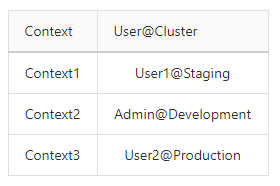

```yaml
contexts:
  - context:
      cluster: staging
      user: user1
    name: Context1
  - context:
      cluster: development
      user: admin
    name: Context2
  - context:
      cluster: development
      namespace: private
      user: user1
    name: Context4
...
```

# 5. Objects

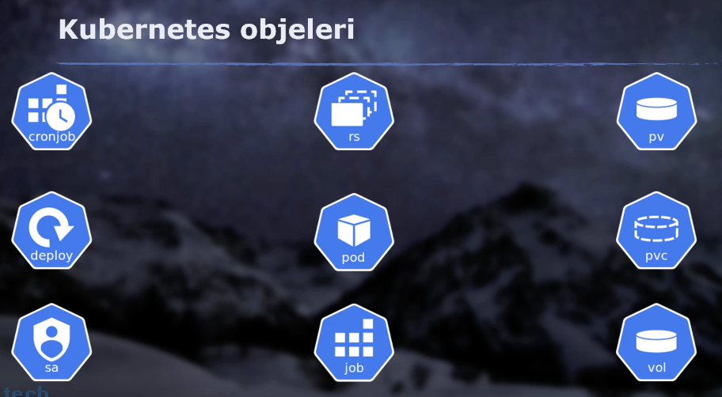

## 5.1. Log

```shell
kubectl logs [podName]

kubectl logs firstpod

kubectl logs -f firstpod # devamli log izlemek icin
```

## 5.2. exec

- Baglanmadan komut calistirmak icin:

```shell
kubectl exec [podName] -- [bash-command]
kubectl exec firstpod -- hostname
kubectl exec firstpod -- ls
```

- Pod icine baglanmak icin

```shell
kubectl exec -it [podName] -- /bin/sh

kubectl exec -it [podName] -- /bin/bash
```

- Pod icerisinde birden fazla container varsa;

```shell
kubectl exec -it [podName] -c [containerName] -- /bin/sh
```

## 5.3. delete

```shell
kubectl delete pod podName
```

## 5.4. Pods

- Kubernetes'te en kucuk objedir. Icerisinde container'lar calisir.

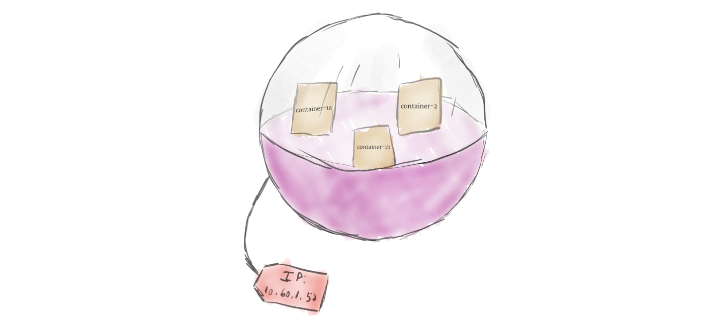

### 5.4.1. Pod Life Cycle

- Pending
- Creating
- ImagePullBackOff
- Running
- Succeeded / Failed
- CrashLoopBackOff : Restart Policy Always'se podu bastan tekrar yarattikca surekli hata aliyorsa bu statuye gecer.
  Mudehale edip duzeltilmesi gerekir.

### 5.4.2. Get Pods

```shell
kubectl get pods
```

- Detayli

```shell
kubectl get pods -o wide  
```

- Watching ile surekli izleme. (pod start olurken vs)

```shell
kubectl get pods -w
```

### 5.4.3. Create Pod

**Imperative :**

```shell
kubectl run firstpod --image=nginx --restart=Never
```

**Declerative :**

```shell
kubectl apply -f myPod.yaml
```

**myPod.yaml**

```yaml
apiVersion: v1
kind: Pod
metadata:
  name: mypod
  labels:
    app: devops
spec:
  containers:
    - name: my-nginx
      image: nginx:latest
      ports:
        - containerPort: 80
```

### 5.4.4. Edit Pod

- Var olan bir pod asagidaki komutlarla editlenebilir.

```shell
kubectl apply -f myPod.yaml
```

ya da

```shell
kubectl edit pods mypod
```

### 5.4.5. Delete Pod

- myPod.yaml icinde yarattigimiz tum podlari, asagidaki gibi tek komuta silebiliriz.

```shell
kubectl delete -f myPod.yaml
```

### 5.4.6. command

```yaml
apiVersion: v1
kind: Pod
metadata:
  name: succeededpod
spec:
  restartPolicy: Never
  containers:
    - name: succeedcontainer
      image: ubuntu:latest
      command: [ 'sh', '-c', 'echo "Hello, Kubernetes!" && sleep 20' ]
```

### 5.4.7. See Details of Pod

```shell
kubectl describe pods firstpod
```

Output :

```yaml
Name: firstpod
Namespace: default
Priority: 0
Node: docker-desktop/192.168.65.4
Start Time: Sat, 28 May 2022 20:04:39 +0300
Labels: run=firstpod
Annotations: <none>
Status: Running
IP: 10.1.0.10
IPs:
  IP: 10.1.0.10
Containers:
  firstpod:
    Container ID: docker://f39a3acccaad6d046565ced5e9168d936b8548d960bf5c7363433c1d096b5c12
    Image: nginx
    Image ID: docker-pullable://nginx@sha256:6860de7bf5f04336790fd390019a1ad7d8afb17b1066b9a6549f0c7cc0cdd894
    Port: <none>
    Host Port: <none>
    State: Running
      Started: Sat, 28 May 2022 20:04:58 +0300
    Ready: True
    Restart Count: 0
    Environment: <none>
    Mounts:
      /var/run/secrets/kubernetes.io/serviceaccount from kube-api-access-d9r8k (ro)
Conditions:
  Type              Status
  Initialized       True
  Ready             True
  ContainersReady   True
  PodScheduled      True
Volumes:
  kube-api-access-d9r8k:
    Type: Projected (a volume that contains injected data from multiple sources)
    TokenExpirationSeconds: 3607
    ConfigMapName: kube-root-ca.crt
    ConfigMapOptional: <nil>
    DownwardAPI: true
QoS Class: BestEffort
Node-Selectors: <none>
Tolerations: node.kubernetes.io/not-ready:NoExecute op=Exists for 300s
  node.kubernetes.io/unreachable:NoExecute op=Exists for 300s
Events:
  Type    Reason     Age    From               Message
  ----    ------     ----   ----               -------
  Normal  Scheduled  2m27s  default-scheduler  Successfully assigned default/firstpod to docker-desktop
  Normal  Pulling    2m27s  kubelet            Pulling image "nginx"
  Normal  Pulled     2m9s   kubelet            Successfully pulled image "nginx" in 17.4286969s
  Normal  Created    2m9s   kubelet            Created container firstpod
  Normal  Started    2m9s   kubelet            Started container firstpod
```

### 5.4.8. Restart Policy

- Always
- On-failure
- Never

## 5.5. Multi-container Pod

- Bir pod'un icerisinde bir container calistirilmasi tavsiye edilir. Bunun sebebi izolasyon ve scalebility'dir. Hem sql
  hemde web uygulamasini ayni podda calistirdik diyelim. Web uygulamasini scale ettigimde sql de gereksiz yere scale
  olmus olacak.
- Container'lar beraber yaratilip beraber silinirler.

```yaml
apiVersion: v1
kind: Pod
metadata:
  name: multicontainer
spec:
  containers:
    - name: webcontainer
      image: nginx
      ports:
        - containerPort: 80
      volumeMounts:
        - name: sharedvolume
          mountPath: /usr/share/nginx/html
    - name: sidecarcontainer
      image: busybox
      command: [ "/bin/sh" ]
      args: [ "-c", "while true; do wget -O /var/log/index.html https://raw.githubusercontent.com/ozgurozturknet/hello-world/master/index.html; sleep 15; done" ]
      volumeMounts:
        - name: sharedvolume
          mountPath: /var/log
  volumes:
    - name: sharedvolume
      emptyDir: { }
```

## 5.6. Init Container

- Ana uygulamanin container'inin calismasi icin yaplimasi gereken kurulum vs hepsinin init edilme asamasidir.
- Init islemi tamamlaninca init container kapanir ve ana uygulamanin container'i start olur.

```yaml
apiVersion: v1
kind: Pod
metadata:
  name: initcontainerpod
spec:
  containers:
    - name: appcontainer
      image: busybox
      command: [ 'sh', '-c', 'echo The app is running! && sleep 3600' ]
  initContainers:
    - name: initcontainer
      image: busybox
      command: [ 'sh', '-c', "until nslookup myservice; do echo waiting for myservice; sleep 2; done" ]
```

## 5.7. label

- label key'leri unique olmali,
- value 63 karakter olabilir.
- calisan pod'lari gruplandirmak icin kullanilabilir.
- Objeler arasinda iliski kurmakta kullanilir.

### 5.7.1. Default Pod Labels

**Bir Pod'da yer alan default Label'lar :**

```properties
beta.kubernetes.io/arch=amd64
beta.kubernetes.io/os=linux
kubernetes.io/arch=amd64
kubernetes.io/hostname=docker-desktop 
kubernetes.io/os=linux     
node-role.kubernetes.io/control-plane=
node-role.kubernetes.io/master=
node.kubernetes.io/exclude-from-external-load-balancers=
```

**Eger Pod bir Cloud Provider'da Calisiyorsa, Ek olarak asagidaki label'lar default olarak bulunur.**

- Bu iki label'la pod hangi region ve zone'da calisiyor anlayabiliriz.

```properties
topology.kubernetes.io/region=northeurope
topology.kubernetes.io/zone=northeurope-1
```

### 5.7.2. Equality-based Selector

- Esitlik temelinde calisir.

**Icerisinde 'app' label'i olan pod'lari listeleme :**

```shell
kubectl get pods -l "app" --show-labels
```

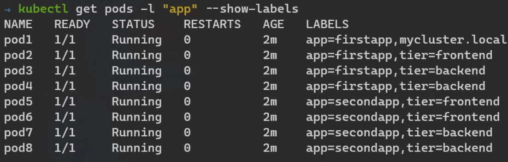

**'app' degeri 'firstapp' olan pod'lari listeleme :**

```shell
kubectl get pods -l "app=firstapp" --show-labels
```

**'app' degeri 'firstapp' ve 'tier' degeri 'devops' olan pod'lari listeleme :** **END** operator'u gibi

```shell
kubectl get pods -l "app=firstapp,tier=devops" --show-labels
```

### 5.7.3. Set-based Selector

- Atanmis/atanmamis sorgusu yapar.

**'app' degeri 'firstapp' olan pod'lari listeleme :**

```shell
kubectl get pods -l "app in (firstapp)" --show-labels
```

**'app' degeri 'firstapp' ya da 'secondapp' olan pod'lari listeleme :** **OR** operator'u gibi

```shell
kubectl get pods -l "app in (firstapp,secondapp)" --show-labels
```

**'app' degeri 'firstapp' ya da 'secondapp' olmayan pod'lari listeleme :** **OR** operator'u gibi

```shell
kubectl get pods -l "app notin (firstapp,secondapp)" --show-labels
```

### 5.7.4. Add Label

```shell
kubectl label pods [pod-name] [labels]

kubectl label pods mypod app=thirdapp
```

#### 5.7.4.1. Add label all pods on the namespace

```shell
kubectl label pods --all [labels]

kubectl label pods --all app=firstapp
 
```

### 5.7.5. Delete Label

```shell
kubectl label pods [pod-name] [labels-]

kubectl label pods mypod app-
```

### 5.7.6. Update Label

```shell
kubectl label --overwrite pods [pod-name] [labels]

kubectl label --overwrite pods mypod app=firstapp
```

## 5.8. Annotation

- Label da query edilmesi onemli veriler saklanirken annonation da daha onemsiz owner, email, release data vs
  metadatalar saklanir.

### 5.8.1. Create

**Imperative :**

```shell
kubectl annotate pods [pod-name] [annotations]

kubectl annotate pods mypod foo=bar
```

**Declerative :**

```yaml
apiVersion: v1
kind: Pod
metadata:
  name: annotationpod
  annotations:
    owner: "Cihan"
    notification-email: "admin@test.com"
    releasedate: "01.01.2021"
    nginx.ingress.kubernetes.io/force-ssl-redirect: "true"
spec:
  containers:
    - name: annotationcontainer
      image: nginx
      ports:
        - containerPort: 80
```

## 5.9. Namespace

- Ortamlari birbirinden izole etmemizi saglar

- **default** – Varsayılan namespaces
- **kube-system** – Kubernetes uygulamaları kullanır
- **kube-public** – Kubernetes API kullanır
- **kube-node-lease** – Kubernetes durumu bilgisini verir.

### 5.9.1. Create

```shell
kubectl create namespace [namespace-name]

kubectl create namespace mynamespace1
```

**Declerative :**

```yaml
apiVersion: v1
kind: Namespace
metadata:
  name: development
---
apiVersion: v1
kind: Pod
metadata:
  namespace: development
  name: namespacepod
spec:
  containers:
    - name: namespacecontainer
      image: nginx:latest
      ports:
        - containerPort: 80
```

### 5.9.2. List

**List namespace**

```shell
kubectl get namespaces
```

**List Pods in namespace**

```shell
kubectl get pods -n [namespace-name]
kubectl get pods -n development
```

**List All Pods in allnamespace**

```shell
kubectl get pods -A 
```

### 5.9.3. Set Current Namespace

```shell
kubectl config set-context.png --current --namespace=[namespace-name]
 
kubectl config set-context.png --current --namespace=development 
```

### 5.9.4. Delete Namespace

- namespace silindigi zaman icerisindeki label, pod vs hersey silinir.

```shell
kubectl delete namespaces [namespace-name]

kubectl delete namespaces development
```

## 5.10. Replication Controller

Hem deployment'in hem de replicaSet'in isini yapar, deprecate olmustur ve icerisinden deployment ve ReplicaSet diye iki
obje cikaritilmistir.

## 5.11. Deployment

- Bir veya daha fazla pod'u bizim belirledigimiz desire-state'e gore olusturan, daha sonra bu desire-state'i mevcut
  durumla karsilastirip gerekli duzenlemeleri yapan bir obje turudur.
- Ornegin 3 pod'lu bir ngnix tanimladik diyelim. Ngnix image'ini tek noktadan degistirip diger podlari
  guncelleyebiliriz. Bu guncellemeyi yaparken; once bir podu indir guncelle sonra digerine gec diyerek, kesintisiz bir
  deployment yapabiliriz.
- Tek bir pod bile yaratacak olsak, bunu deployment ile yaratmak daha faydali olacaktir!

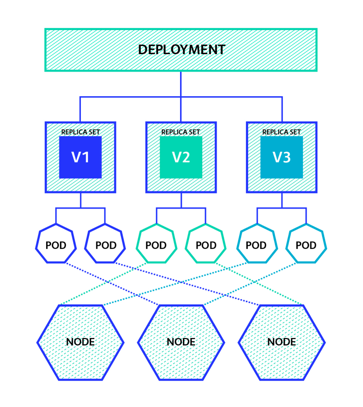

### 5.11.1. Create

**Imperative :**

```shell
kubectl create deployment fistdeployment --image=nginx:latest --replicas=2
```

**Declarative :**

- Label olmadan deploy edemeyiz.
- Deployment hangi podlarin kendisine ait oldugunu label kullanarak anlar.
- Ayni label'i baska deploymentlardaki pod'lara, yada singleton pod'lara verirsek deploymentlar karisir.

```yaml
apiVersion: apps/v1
kind: Deployment
metadata:
  name: firstdeployment
  labels:
    team: development
spec:
  replicas: 3
  selector:
    matchLabels:
      app: frontend
  template:
    metadata:
      labels:
        app: frontend
    spec:
      containers:
        - name: nginx
          image: nginx:latest
          ports:
            - containerPort: 80
```

- template kismi, pod tanimindan, apiVersion, kind ve metadata.name kismi cikarilmis halidir.

### 5.11.2. Edit

#### 5.11.2.1. Edit Image

```shell
kubectl set image deployment/[deployment-name] [image]

kubectl set image deployment/fistdeployment nginx=httpd
```

#### 5.11.2.2. Scale Pods

```shell
kubectl scale deployment [deployment-name] --replicas=2

kubectl scale deployment fistdeployment --replicas=5
```

### 5.11.3. Delete

```shell
kubectl delete deployment[deployment-name]

kubectl delete deployment fistdeployment
```

## 5.12. ReplicaSet

- X sayida pod olusturan, mevcut durumla istenen durum arasinda fark olursa bunu cozen obje turudur. (desire state'te
  kalmasini saglar)
- Deployment; template altinda olusturdugumuz podlari kendi olusturmaz, Bunun yerine replicaSet objesi olusturur ve
  podlar bu replicaSet objesi olusturur.
- Eger deployment taniminda bir degisiklik yapildiginda, ornegin image'i guncellersek, deployment bu yeni tanimla yeni
  bir replicaSet objesi daha yaratir. Eski replicaSet olusturdugu podlari tek tek silmeye baslar. Yeni replicaSet'te
  yeni pod'lari yaratir.
- Bu silme ve olusturma isleminin hangi sirayla ve nasil olacagini biz belirleyebiliriz. Bu bize herhangi bir kesinti
  olmadan uygulama guncelleme imkani sunar.

### 5.12.1. List

```shell
kubectl get replicaset
```

### 5.12.2. Rollout

1. Var olan replicaSet'e baktik. `firstdeployment-5864dcbff4` isimli replicanin icinde 3 pod calisiyor.

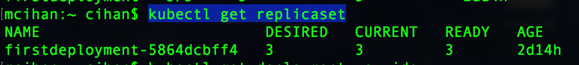

3. Deployment'taki Image'i degistirdik

```shell
kubectl set image deployment/firstdeployment nginx=httpd
```

3. Tekrar replicaSet'leri listeledigimizde; `firstdeployment-5864dcbff4` replicasindaki podlarin kapandigini
   , `firstdeployment-74d8f9b9c7` isimli yeni bir replicaSet olusturuldugunu ve icerisinde 3 pod'un calistirildigini
   gorduk.

4. Asagidaki komutu kullanarak **roll-out** yaptik ve sistemi bir onceki hale getirdik.

```shell
kubectl rollout undo deployment firstdeployment
```

5. Deployment bir onceki durumuna gecmis oldu.

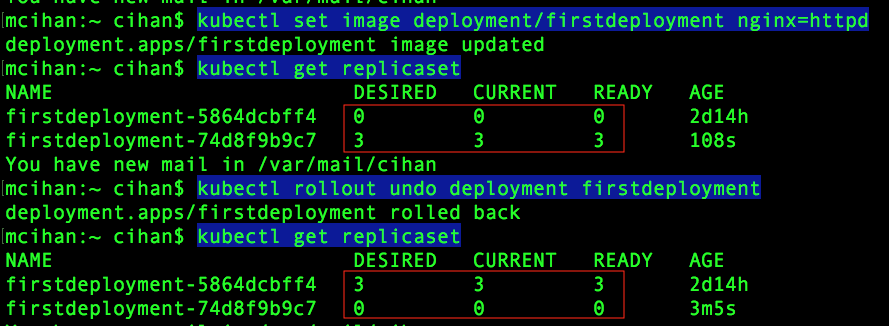

### 5.12.3. Create

- Kendi replicaSet'imizi yaratabiliriz, fakat bir degisiklik yaptigimizda, ornegin image degistirdigimizde; bu
  replicaSet guncellenmez, bundan dolayi deployment kullanmak daha faydalidir.

```yaml
apiVersion: apps/v1
kind: ReplicaSet
metadata:
  name: firstrs
  labels:
    app: rs
spec:
  replicas: 3
  selector:
    matchLabels:
      app: rs
  template:
    metadata:
      labels:
        app: rs
    spec:
      containers:
        - name: nginx
          image: nginx
```

## 5.13. Rollout & Rollback

**Definition :**

```yaml
apiVersion: apps/v1
kind: Deployment
metadata:
  name: rcdeployment
  labels:
    team: development
spec:
  replicas: 3
  selector:
    matchLabels:
      app: recreate
  strategy:
    type: Recreate
```

### 5.13.1. Strategy

- **strategy** alanini kullanarak deployment'i guncelledigimizde rollout'u nasil yapacagimizi belirleriz.
- Iki tur strategy var;  **Recreate** ve  **RollingUpdate**

#### 5.13.1.1. Recreate

- Deployment'ta degisiklik olursa, tum pod'lari sil ve silme islemi tamamlandiktan sonra yeni pod' lari ayaga kaldir.
- Production'da eski versiyonun ve yeni versionunun beraber calismasinin problem olacagi durumlarda yada major
  degisikliklerde kullanilmasi tavsiye edilir.
- Kisa sureli bir kesinti olur.

```yaml
...
spec:
  replicas: 3
  selector:
    matchLabels:
      app: recreate
  strategy:
    type: Recreate
```

#### 5.13.1.2. RollingUpdate

- Default stratejidir.
- Recreate'in tam tersidir. Deployment'ta degisiklik olursa, tum pod'lari silip yenilerini olusturma! Bunu asamali yap!
- Bu asamalari belirleyebilecegimiz 2 option vardir;
    + **maxUnavailable** : Bir degisiklik oldugunda en fazla burdaki sayi kadar podu sil. Ornegin alttaki yaml'da 2
      belirlenmis yani; degisiklik oldugunda 2 pod'u sil yenilerini yarattiginda 2 daha sil gibi. Sayi yerine yuzde de
      belirtilebilir.
    + **maxSurge** : Gecis sirasinda max pod sasisinin kac olabilecegini belirler. Ornegin alttaki yaml'da toplamda 10
      pod silinip, 10 yeni pod olusturulacak. Silme islemi yada yaratma isleminin hizlari farkli olabileceginden
      sistemde ayakta olan pod sayisi 20 bile olabilir. Burda pod sayisi icin desire-state'te belitilenden ne kadar
      fazla olabilecegini belirtiyoruz. 10 + 2 yani ayni anda 12 pod ayakta olabilir.
- Kesintisiz gecis icin idealdir. (**zero downtime** saglar)
- **Default strateji**'de, **strateji:** RollingUpdate, **maxUnavailable** ve  **maxSurge** degerleri de %25'tir.

```yaml
...
spec:
  replicas: 10
  selector:
    matchLabels:
      app: rolling
  strategy:
    type: RollingUpdate
    rollingUpdate:
      maxUnavailable: 2
      maxSurge: 2
```

### 5.13.2. Rolling

- Eger komutlarin sonuna `--record` koyulursa, o deployment icin yapilan butun degisiklikler komutlariyla beraber
  history de tutulur.

```shell
kubectl set image deployment/firstdeployment nginx=httpd --record
```

- **History goruntuleme**

```shell
kubectl rollout history deployment firstdeployment
```

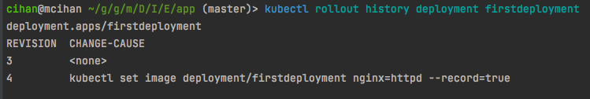

- **Rollout :** Bir onceki versiona donme

```shell
kubectl rollout undo deployment firstdeployment
```

- **Rollout :** Istenilen revisyona donme

```shell
kubectl rollout undo deployment firstdeployment --to-revision=3
```

### 5.13.3. Status

- Bir deployment'in uzerinde yapilan degisiklikleri canli olarak izleyebiliriz. Ozellikle prod ortaminda yeni versiyon
  deploy edildiginde bu komutla, neler oldugunu izleyebiliriz.

```shell
kubectl rollout status deployment firstdeployment -w
```

### 5.13.4. Pause & Resume

- Bu komutla, deployment durdurulabilir. Ornegin v1 den v2 ye gecerken hatalar almaya basladik, v1 e rollout yaparsak
  hatayi reproduce edemeyecegiz, bu gibi durumlarda deployment'i durdurmak icin kullanilir. Komut calistirildiginda kac
  yeni pod yaratildiysa yada kac eski pod silindiyse oyle kalir. Resume ile de devam ettirilir.

```shell
kubectl rollout pause deployment firstdeployment 
kubectl rollout resume deployment firstdeployment 
```

## 5.14. Service

- Servis discovery ve load balance'in hizmeti sunar.
- Pod'larin aralarinda yada disariyla haberlesmesinde olusan bazi sorunlari ele alir.

### 5.14.1. ClusterIP

- CulusterIP, Label Selector'lerle beraber podlarla iliskilendirilebilir. Bu sekilde pod unique bir DNS adresine sahip
  olur.

**Service :**

```yaml
apiVersion: v1
kind: Service
metadata:
  name: backend
spec:
  type: ClusterIP
  selector:
    app: backend
  ports:
    - protocol: TCP
      port: 5000
      targetPort: 5000
```

- port: dinlenen port, targetPort: export edilen porttur.
- label kullanarak pod'lari bulur ve trafigi o podlara yonlendirir.
- Yukardaki yaml da **app** label'inin degeri **backend** olan pod'lari bulup trafigi o podlara yonlendirecek.
- Yukardaki Service'in trafik yonlendirecegi ornek deployment objesi. Tum podlarin app: backend label'lari bulunmakta.

```yaml
apiVersion: apps/v1
kind: Deployment
metadata:
  name: backend
  labels:
    team: development
spec:
  replicas: 3
  selector:
    matchLabels:
      app: backend
  template:
    metadata:
      labels:
        app: backend
    spec:
      containers:
        - name: backend
          image: nginx
          ports:
            - containerPort: 5000
```

- Asagidaki komut ile yarattigimiz ClusterIP servisini goruyoruz. IP si 10.103.208.200

```shell
kubectl get service
```

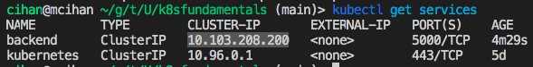

- Bir pod icerisine girip **backend** icin `nslookup` yapiyoruz. Address yukarda tanimladigimiz ClusterIP'nin IP si ile
  ayni. ClusterIP **backend** icin gelen trafigi aldi.
- Name kismi : `isim.namespace_ismi.svc.cluster_domain` seklindedir.
- Ayni namespace'de calisan podlar birbirlerini kisa isimleriyle cozebilirler fakar farkli namespace'ler icin **name**
  gereklidir.

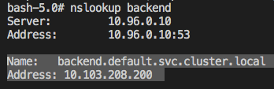

- Curl ile ustuste `backend` e erismeye calistigimizda, load balancer ile bu istekleri podlara dagittigini goruyoruz.

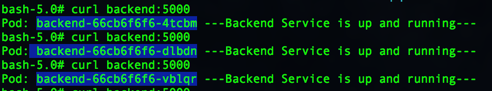

<br>

**Imprative :**

```shell
kubectl expose deployment [deployment-name] --type=[service-type] --name=[service-name]
kubectl expose deployment backend --type=ClusterIP --name=backend
```

### 5.14.2. NodePort

- NodePort, Label Selector'lerle beraber podlarla iliskilendirilebilir. Onune load balancer yada reverse proxy koyarak
  dis dunyadan podlara erisim saglanir.

```yaml
apiVersion: v1
kind: Service
metadata:
  name: frontend
spec:
  type: NodePort
  selector:
    app: frontend
  ports:
    - protocol: TCP
      port: 80
      targetPort: 80
```

### 5.14.3. LoadBalancer

- Cloud Service Provider'larda kullanilir.

```yaml
apiVersion: v1
kind: Service
metadata:
  name: frontendlb
spec:
  type: LoadBalancer
  selector:
    app: frontend
  ports:
    - protocol: TCP
      port: 80
      targetPort: 80
```

### 5.14.4. Endpoints

- Service yaratilirken arkada endpoints objesi yaratir.
- Endpoints objesi podlar silindiginde yada yenileri yaratildiginda dinamik olarak onlarin endpoint'lerini yonetir.

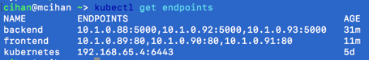

- frontend icin olan podlarin Addresses kisminda arka arkaya koyuldugu gorulmektedir.

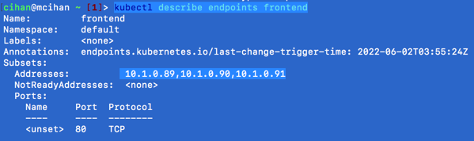

- Eger bir podu silersek bu kisimlar degisecektir.
- Podlari listeliyorum ve 10.1.0.91 IP li pod'u siliyorum.

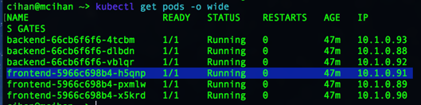

- Silinen pod yerine 10.1.0.04 IP'li yeni bir pod yaratildi.

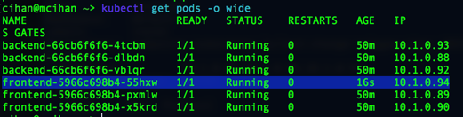

- Endpoint objesini kontrol ettigimizde, yeni pod'un endpoint'ini address kismina ekledigini goruyoruz.

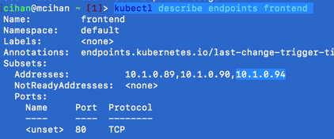

- Ya da scale ile var olan 3 pod'u 5 pod'a cikaralim. Yeni gelen podlarinda adress kismina eklendigini goruyoruz.

```shell
kubectl scale deployment frontend --replicas=5
```


- Bu sekilde Kubernetes ip yonetimini yapmaktadir.

## 5.15. Liveness probe

- Pod'un coktugu durumda kubelet pod'u tekrar ayaga kaldirir fakat pod ayakta ve uygulama isini yapamiyorsa bu durumda
  liveness probe kullanilir.
- http, tcp yada console komutu kullanarak uygulama saglikli mi anlamaya calisir. Eger bir cevap alamazsa uygulama
  restart edilir.

### 5.15.1. http

```yaml
livenessProbe:
  httpGet:
    path: /healthz
    port: 8080
    httpHeaders:
      - name: Custom-Header
        value: Awesome
  initialDelaySeconds: 3
  periodSeconds: 3
```

### 5.15.2. tcp

```yaml
livenessProbe:
  tcpSocket:
    port: 8080
  initialDelaySeconds: 15
  periodSeconds: 20
```

### 5.15.3. command line

```yaml
livenessProbe:
  exec:
    command:
      - cat
      - /tmp/healthy
  initialDelaySeconds: 5
  periodSeconds: 5
```

## 5.16. Readiness probe

- Yeni bir versiyonu deploy ettigimizde eski podlar silinip yenileri yaratilacak. Yeni pod'lar yaratildiginda; bu podun
  baska bir servis baglanmasi yada bir islem beklemesi gibi farkli business logic durumlarinda tam hazir olana kadar
  duzgun hizmet vermeyebilir. Bu pod'un tam hazir hale gelene kadar loadbalancer'a eklenmemesi lazim. Bunun icin
  readiness probe kullanilir.
- Http, tcp yada komut kullanilarak, health check'lerle uygulamanin hazir olup olmadigi kontrol edilir.

```yaml
readinessProbe:
  httpGet:
    path: /ready
    port: 80
  initialDelaySeconds: 20
  periodSeconds: 3
```

### 5.16.1. terminationGracePeriodSeconds

- pod'a silinme istegi geldiginde hemen kapanmaz. Ustundeki isleri bu field'da tanimlanan sureyle tamamlar ve kendini
  duzgun bir sekilde kapanir.
- default'u 30 sn dir.

## 5.17. Resource Limit

- Bir limit belirlenmezse Pod uzerinde bulundugu sistemin tum kaynaklarini(CPU, RAM, Memory) kullanir.
- Kesirli degerler tanimlanabilir. Orn 0.5 CPU.
- 1 cpu kullanmak icin; `cpu:"1"` = `cpu:"1000"`  = `cpu="1000m"`
- 1 cpu'nun %10'u icin; `cpu:"0.1"` = `cpu:"100"`  = `cpu="100m"`

```yaml
apiVersion: v1
kind: Pod
metadata:
  labels:
    test: requestlimit
  name: requestlimit
spec:
  containers:
    - name: requestlimit
      image: nginx
      resources:
        requests:
          memory: "64M"
          cpu: "250m"
        limits:
          memory: "256M"
          cpu: "0.5"
```

- **request** Pod yaratilirken sheduler bu pod icin bir node sececek, bu node'un sahip olmasi gereken minimum
  ozellikleri bu alanda belirtiyoruz. Yani yukardaki ornege gore en az 64M memory ve 250m CPU gerekmektedir.
- **limit** Bu container'in kullanabilecegi maksimim resource limitidir. Ram(memory) kapasitesi asilirsa, pod statusu
  **OOMKilled** statusune gecer ve pod restart edilir.

## 5.18. Environment Variable

```yaml
apiVersion: v1
kind: Pod
metadata:
  name: envpod
spec:
  containers:
    - name: envpod
      image: nginx
      ports:
        - containerPort: 80
      env:
        - name: USER
          value: "cihan"
        - name: database
          value: "testdb.example.com"
```

- pod'u yaratip environment'lari listeledigimizde yaml dosyasinda ekledigimiz env'lari gormus oluyoruz.

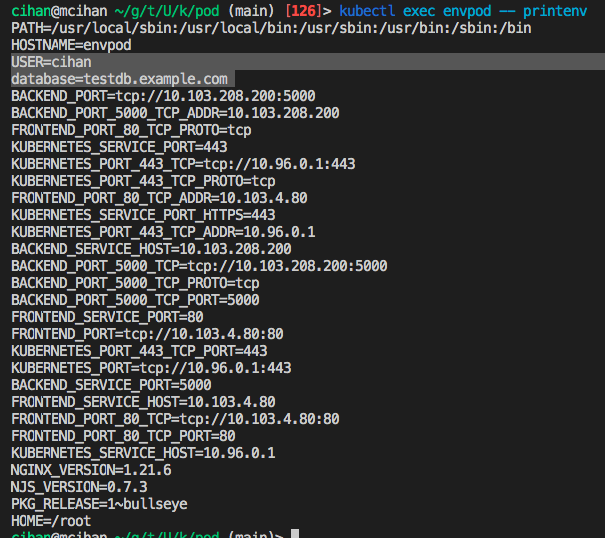

## 5.19. Post-forward

- kendi makinemizden pod icerisindeki bir porta yonlendirme yapmak icin kullanilir.

```shell
kubectl port-forward pod/[podname] [mycomputer-port]:[pod-container-port]

kubectl port-forward pod/mypod 8080:80
```

- yukaridaki ornekte kendi bilgisayarimda 8080 portuna gelen istekler, pod icerisinde 80 portuna yonlenecek.

# 6. 102

## 6.1. Volume

Iki cesit volume vardir;

- **Empheremal Volume :** Gecicidir
- **Persistent Volume :** Kalicidir.

### 6.1.1. Emphemeral Volume

- Gecici volume'lerdir, pod silinince bu volume'ler de silinir.
- Ayni pod icerisindeki butun container'lar bu volume'leri gorebilir.
- **emptyDir**: node uzerinde rasgele bos bir klasor olusturur, mount edilen dosyalar buraya yazilir.
- **hostDir**: node'da bulunan bir klasor yada file'in path'i verilir, mount edilen dosyalar buraya yazilir. 3 type'i
  vardir, bunlar _Directory_, _DirectoryOrCreate_, _FileOrCreate_ seklindedir.

**emptyDir Example :**

```yaml
apiVersion: v1
kind: Pod
metadata:
  name: emptydir
spec:
  containers:
    - name: frontend
      image: nginx
      volumeMounts:
        - name: cache-vol
          mountPath: /cache
  volumes:
    - name: cache-vol
      emptyDir: { }
```

<br>

**hosDir Example :**

```yaml
apiVersion: v1
kind: Pod
metadata:
  name: hostpath
spec:
  containers:
    - name: hostpathcontainer
      image: nginx
      volumeMounts:
        - name: directory-vol
          mountPath: /dir1
        - name: dircreate-vol
          mountPath: /cache
        - name: file-vol
          mountPath: /cache/config.json
  volumes:
    - name: directory-vol
      hostPath:
        path: /tmp
        type: Directory
    - name: dircreate-vol
      hostPath:
        path: /cache
        type: DirectoryOrCreate
    - name: file-vol
      hostPath:
        path: /cache/config.json
        type: FileOrCreate
```

### 6.1.2. Persistent Volume

- Cluster disindadir verileri kalici tutar. Pod, Node yada Cluster silinince silinmez.
- Eger baglanacagimiz depolama birimi Cloud Provider'daysa(AWS abs gibi) CSI icin yazilmis kendi driver'lari
  bulunmaktadir. Depolama birimini aldigimiz firmanin saglayacagi CSI driver'i sisteme yuklemek gereklidir.

#### 6.1.2.1. CSI - Container Storage Interface

- Kubernetes'in storage alt yapisinin nasil ayarlanmasi gerektigi belirten bir standarttir.
- Depolama cozumu uretenler bu standarta uygun driver yazarak kubernetes'in kendi alt yapisiyla da konusmasina olanak
  saglarlar.

## 6.2. Storage Class

- Persistent Volume icin manuel adimlarin onune gecmeyi saglar.
- Devop ekibi yuksek ssd'li storage yaratirken, test ekibi daha dusuk ve hhd'li storage yaratilabilinir.

## 6.3. Secret

- OAuth token, ssh, kullanici adi, password gibi hassas bilgilerin depolanmasina ve yonetilmesine olanak saglayan
  objedir. Gizli bilgileri secret'ta tutmak, pod taniminda yada container imajina koymaktan daha guvenli ve esnektir.
- Secret ile atanacak pod ayni namespace'de olmak zorundadir.

```yaml
apiVersion: v1
kind: Secret
metadata:
  name: mysecret
type: Opaque
stringData:
  db_server: db.example.com
  db_username: admin
  db_password: P@ssw0rd!
```

- default **type** Opaque'dir, OAuth, ssl gibi type'lari da vardir ama Opaque genel'dir ve genellikle yeterli
  olmaktadir.
- **stringData**: bu kisimda degerleri acik olarak yazabiliriz. Bunun yerine **data** field'ini kullansaydik verileri
  base 64 vs encoded halinde yazmamiz gerekirdi.

**Imperative Yaratma :**

```shell
kubectl create secret generic db-user-pass \
  --from-literal=username=devuser \
  --from-literal=password='S!B\*d$zDsb='
```

ya da file'dan olusturma

```shell
kubectl create secret generic --from-file=config .json
```

<br>

**Example :**

```shell
apiVersion: v1
kind: Pod
metadata:
  name: secretpodvolume
spec:
  containers:
  - name: secretcontainer
    image: nginx
    volumeMounts:
    - name: secret-vol
      mountPath: /secret
  volumes:
  - name: secret-vol
    secret:
      secretName: mysecret3
---
apiVersion: v1
kind: Pod
metadata:
  name: secretpodenv
spec:
  containers:
  - name: secretcontainer
    image: nginx
    env:
      - name: username
        valueFrom:
          secretKeyRef:
            name: mysecret3
            key: db_username
      - name: password
        valueFrom:
          secretKeyRef:
            name: mysecret3
            key: db_password
      - name: server
        valueFrom:
          secretKeyRef:
            name: mysecret3
            key: db_server
---
apiVersion: v1
kind: Pod
metadata:
  name: secretpodenvall
spec:
  containers:
  - name: secretcontainer
    image: nginx
    envFrom:
    - secretRef:
        name: mysecret3
```

### 6.3.1. List Secret

```shell
kubectl get secrets
```

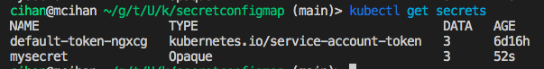

<br>

Detayli bakmak icin;

```shell
kubectl describe secret mysecret
```

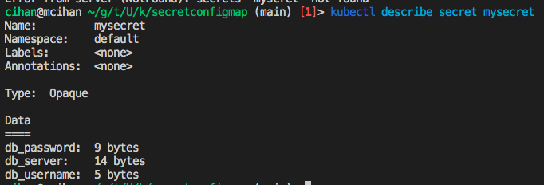

## 6.4. ConfigMap

- secret gibi ama hassas olmayan verileri tutar. Bu veriler environment tarzi verilerdir. Veriler key value seklinde
  yada bir key'in altinda birden fazla value seklinde tutulur.
- Ortam bazli environment set'i gibi dusunulebilir. Her bir ortam için bir config map yarattigimizda, Uygulamayı farklı
  bir ortama taşımak için sadece configmap ayarını değiştirmeniz yeterli olacaktir. Her bir değişkeni ayrı ayrı yeniden
  değiştirmenize gerek kalmaz.

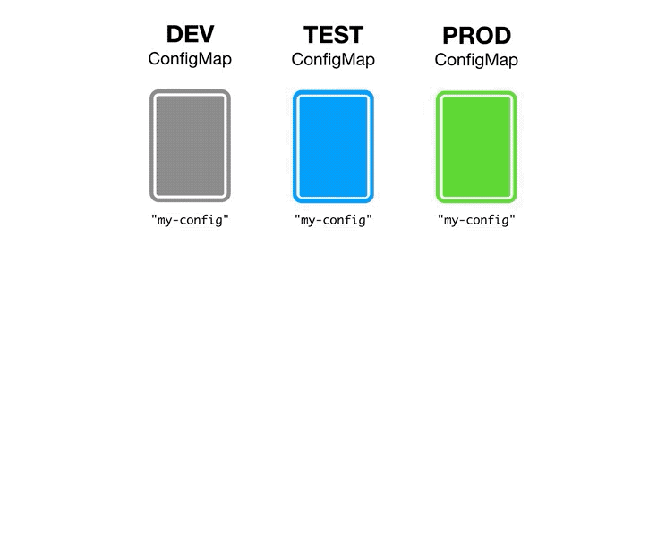

**Tanimi :**

```yaml
apiVersion: v1
kind: ConfigMap
metadata:
  name: myconfigmap
data:
  db_server: "db.example.com"
  database: "mydatabase"
  site.settings: |
    color=blue
    padding:25px
```

<br>

**Pod icinde kullanimi :**

```yaml
apiVersion: v1
kind: Pod
metadata:
  name: configmappod
spec:
  containers:
    - name: configmapcontainer
      image: nginx
      env:
        - name: DB_SERVER
          valueFrom:
            configMapKeyRef:
              name: myconfigmap
              key: db_server
        - name: DATABASE
          valueFrom:
            configMapKeyRef:
              name: myconfigmap
              key: database
      volumeMounts:
        - name: config-vol
          mountPath: "/config"
          readOnly: true
  volumes:
    - name: config-vol
      configMap:
        name: myconfigmap
```

<br>

**Detayli Listeleme :**

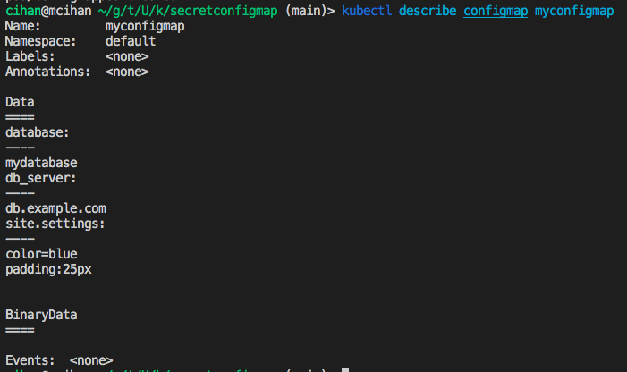

## 6.5. Node Affinity

- Label selector ile podlari hangi worker node'da calistiracagimizi belirleyebiliyoruz. Fakat Node Affinity bunun icin
  daha cok opsiyon sunar.

### 6.5.1. requiredDuringSchedulingIgnoredDuringExecution

- Sart saglandigi durumda pod'a bir worker bulunur, eger sart saglanmazsa pod pending durumunda kalir ve sart saglanana
  kadar bekler.

```yaml
apiVersion: v1
kind: Pod
metadata:
  name: nodeaffinitypod1
spec:
  containers:
    - name: nodeaffinity1
      image: nginx
  affinity:
    nodeAffinity:
      requiredDuringSchedulingIgnoredDuringExecution:
        nodeSelectorTerms:
          - matchExpressions:
              - key: app
                operator: In #In, NotIn, Exists, DoesNotExist
                values:
                  - blue
```

### 6.5.2. preferredDuringSchedulingIgnoredDuringExecution

- Sart saglandigi durumda pod'a bir worker bulunur, eger sart saglanmazsa, podu herhangi bir workerda calistirir.
- weight onceligi belirler. weigh'i buyuk olan onceliklidir.

```yaml
apiVersion: v1
kind: Pod
metadata:
  name: nodeaffinitypod2
spec:
  containers:
    - name: nodeaffinity2
      image: nginx
  affinity:
    nodeAffinity:
      preferredDuringSchedulingIgnoredDuringExecution:
        - weight: 1
          preference:
            matchExpressions:
              - key: app
                operator: In
                values:
                  - blue
        - weight: 2
          preference:
            matchExpressions:
              - key: app
                operator: In
                values:
                  - red
```

## 6.6. Pod Affinity

- Pod icin worker bulurken; baska podlarin nerde olduguna gore bulup o worker'da yaratilmasini saglar.
- Ornegin, asagidaki sekildeki gibi db ve frontend uygulamalarinin ayni zone'da calismasini istiyoruz, bu durumda **pod
  affinity** sayesinde, db pod'u nerde olustuysa frontend uygulama pod'unu da orda olustur gibi bir ayar yapabiliriz.

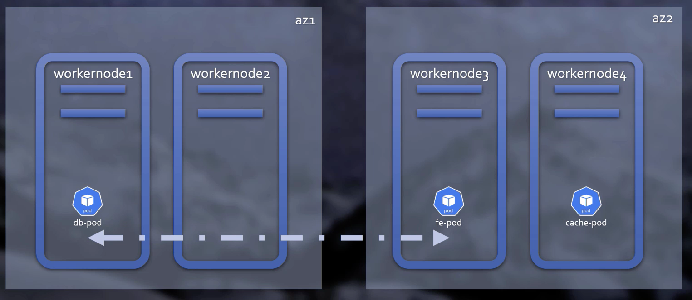

- **topologyKey** field'ini **kubernetes.io/hostname** olarak secersek, pod ayni worker node uzerinde calisacak.
- **topologyKey** field'ini **topology.kubernetes.io/zone** olarak secersek, pod ayni worker node uzerinde calismak
  zorunda degil demektir.

```yaml
apiVersion: v1
kind: Pod
metadata:
  name: cachepod
spec:
  affinity:
    podAffinity:
      requiredDuringSchedulingIgnoredDuringExecution:
        - labelSelector:
            matchExpressions:
              - key: app
                operator: In
                values:
                  - frontend
          topologyKey: kubernetes.io/hostname
```

### 6.6.1. Pod AntiAffinity

- Pod, secilen ozelliklerde olan podla ayni worker'da olmasin durumunda kullanilir.

```yaml
apiVersion: v1
kind: Pod
metadata:
  name: cachepod
spec:
  podAntiAffinity:
    preferredDuringSchedulingIgnoredDuringExecution:
      - weight: 100
        podAffinityTerm:
          labelSelector:
            matchExpressions:
              - key: deployment
                operator: In
                values:
                  - prod
          topologyKey: topology.kubernetes.io/zone
```

## 6.7. Taint & Toleration

- Belirli podlar yuksek resources ozelligine sahip worker'larda diger podlarda diger worker'larda calissin gibi bir
  belirleme yapmada kullanilir.

- Node Affinity yaptigi gibi yapmaz, su pod'a git su ozelliklerin oldugu yerde schedule ol demez. Schedule etmek icin
  sectigin worker node'un ustunde bu taint varsa onu tolere et der. Yani fark;
    + `Node Affinity` bu pod su worker node'da olusturulsun
    + `Taint & Toleration` worker nodu'un ustunde sadece su node'lar calisabilsin.

- Eger node da Taint: `noShedule` ise, bu node'da sadece bu tanima uygun **Toleration**'i bulunan pod'lar burada
  calisabilirler.

- Eger node da Taint: `preferNoShedule` ise, mumkunce **Toleretion**'i bulunmayan pod'lar burda calisamaz, ama pod icin
  uygun worker bulunamazsa bu node da calisabilirler.

- Eger node da Taint: `noExecute` ise, bu node'da sadece bu tanima uygun **Toleration**'i bulunan pod'lar burada
  calisabilirler. Ve eger bu node uzerinde daha onceden calisan ve uygun **Toleration**'i olmayan pod'lar silinir ve
  baska worker node'da yaratilirlar.

### 6.7.1. Taint Create

```shell
kubectl node [node-name] [key]:noSchedule

kubectl node [node-name] platform=production:noSchedule
kubectl node [node-name] color=blue:noExecute
```

```yaml
apiVersion: v1
kind: Pod
metadata:
  name: toleratedpod1
  labels:
    env: test
spec:
  containers:
    - name: toleratedcontainer1
      image: nginx
  tolerations:
    - key: "platform"
      operator: "Equal"
      value: "production"
      effect: "NoSchedule"
```

### 6.7.2. Master Node - Taint

- Normalde master node'larda pod calistirilmaz. Master node'larda  `node-role.kubernetes.io/master:NoSchedule` taint
  tanimi vardir.
- Eger bu **Toleration** bir pod'a eklenirse, bu pod Master'node da calisabilir.

## 6.8. DaemonSet

- Her node'da calismasini isteyebileceginiz(log toplama gibi) bir uygulamala isteniyorsa **DaemonSet** kullanilir.
- Isler cok kolaylasir, her node icin ayri ayri pod olusturup tekrar ayar yapmaniza gerek kalmaz.
- Her pod'u ilgilendiren bir uygulama deploy ediliyorsa bu direkt her pod'a config edilir her birine ayri ayri ayar
  yapmak gerekmez. Yeni bir pod eklendiginde de, o podu'u otomatik bulur ve ilgili ayarlari o pod icin de yapar.
- Yeni bir node eklendiginde de o node'u bulup uygulamayi create eder.

```yaml
apiVersion: apps/v1
kind: DaemonSet
metadata:
  name: logdaemonset
  labels:
    app: fluentd-logging
spec:
  selector:
    matchLabels:
      name: fluentd-elasticsearch
  template:
    metadata:
      labels:
        name: fluentd-elasticsearch
    spec:
      tolerations:
        # this toleration is to have the daemonset runnable on master nodes
        # remove it if your masters can't run pods
        - key: node-role.kubernetes.io/master
          effect: NoSchedule
      containers:
        - name: fluentd-elasticsearch
          image: quay.io/fluentd_elasticsearch/fluentd:v2.5.2
          resources:
            limits:
              memory: 200Mi
            requests:
              cpu: 100m
              memory: 200Mi
          volumeMounts:
            - name: varlog
              mountPath: /var/log
            - name: varlibdockercontainers
              mountPath: /var/lib/docker/containers
              readOnly: true
      terminationGracePeriodSeconds: 30
      volumes:
        - name: varlog
          hostPath:
            path: /var/log
        - name: varlibdockercontainers
          hostPath:
            path: /var/lib/docker/containers
```

## 6.9. StatefulSet

- Casssandra gibi state tutmasi gereken pod'lar icin kullanilir. StatefulSet olmadan Pod'lari scale edip hangisi master
  hangisi slave ayirmak manuel ve zor olacaktir.
- Yapi olarak deployment'a benzer. 3 yonden deployment'tan ayrilir:
    + Her pod'un kendisine ait bir PV'si vardir.(Persistent Volume )
    + Pod'lar sirayla olusturulup sirayla silinir. Bir pod icin readiness ve heatly check yapilmadan(pod tam ayaga
      kalkmadan) sonraki pod baslatilmaz. Pod hazir olunca diger siradaki pod baslatilir. Scale azaltildiginda da en son
      olusturulan pod silinir.
    + Olusturulan pod'lar statefulset_name-0, statefulset_name-1, statefulset_name-2 seklinde sirayla adlandirilir.
- Bir pod silindiginde, zaten bilgileri PV de tutuldugu icin ayni ozellikte ve isimde bir pod yaratilir ve bu sekilde
  pod state'ini kaybetmez.

```yaml
...
spec:
  clusterIP: None
  ports:
    - port: 9042
  selector:
    app: cassandra
...
```

- **clusterIP: None** ise, servis' headless oluyor. Bu servise gidilmek istenildiginde sadece 'cassandra' yazilarak
  gidilebilir. Arkada bir load balancer secilir ve node'lardan birinin ip'si doner.
- Ya da pod ismi yazilarak direkt su sekilde erisilebilir
  `[statefulsetname]-[podNumber].[statefulsetname]` `cassandra-0.cassandra`, `cassandra-1.cassandra`

<br>

<br>

<br>

## 6.10. Job

- Job, belirtilen sayida pod'un islemini basariyla yapip kapanmasini saglar. Islemini basariyla yapamazsa restart
  edilir. Is bittiginde pod'lari silmez.
- 2 senaryoda kullanilir;
    + Tek seferlik calisip kapanmasi gereken uygulamalar. Ornegin veri tabani olusturan scriptler gibi.
    + Kuyruk yada bucket'ta islenmesi gereken bir cok uygulamamiz oldugunda bunlari eritmek adina, bunlar eriyene kadar
      calisacak uygulamalari job seklinde deploy ederiz.

```yaml
apiVersion: batch/v1
kind: Job
metadata:
  name: pi
spec:
  parallelism: 2
  completions: 10
  backoffLimit: 5
  activeDeadlineSeconds: 100
  template:
    spec:
      containers:
        - name: pi
          image: perl
          command: [ "perl",  "-Mbignum=bpi", "-wle", "print bpi(2000)" ]
      restartPolicy: Never #OnFailure 
```

- **completions** : yaratilacak pod sayisi
- **parallelism** : pod yaratma islemini ayni anda kacar kacar yapilacagini belirtiyoruz. Yukardaki ornekte 2 pod
  calisir, isini yapar kapanir daha sonra yeni 2 pod olusur gibi gider ve 10 podu calistirir tamamlar.
- **backoffLimit** : en fazla kac hata alirsa job'i fail et ve kapat.
- **activeDeadlineSeconds** : eger islem istenen sn de bitmezse job'i fail et ve kapat.

### 6.10.1. List jobs

```shell
kubectl get jobs
```

## 6.11. Cron Job

- Linux cron job'u gibidir.
- Job'dan farki manual degilde cron'la otomatik tetkiklenmesidir.

```yaml
apiVersion: batch/v1beta1 # not stable until kubernetes 1.21.
kind: CronJob
metadata:
  name: hello
spec:
  schedule: "*/1 * * * *"
  jobTemplate:
    spec:
      template:
        spec:
          containers:
            - name: hello
              image: busybox
              imagePullPolicy: IfNotPresent
              command:
                - /bin/sh
                - -c
                - date; echo Hello from the Kubernetes cluster
          restartPolicy: OnFailure
#
# ┌───────────── minute (0 - 59)
# │ ┌───────────── hour (0 - 23)
# │ │ ┌───────────── day of the month (1 - 31)
# │ │ │ ┌───────────── month (1 - 12)
# │ │ │ │ ┌───────────── day of the week (0 - 6) (Sunday to Saturday;
# │ │ │ │ │                                   7 is also Sunday on some systems)
# │ │ │ │ │
# │ │ │ │ │
# * * * * *
#
# https://crontab.guru/
```

-----------------------------------------------------------------------------------------------------------------------

# 7. Authentication

- Cluster disinda yapilir. Service yada pod olusturuyor gibi bir kullanici yaratilamaz
- Kimlik dogrulamalar, asagidaki gibi alt yapilarda yapilir:
    + X509 Client Cert,
    + OpenId Connect
    + Static Token File
    + WebHook Token Authentication

**Create certificate :**

```shell
openssl genrsa -out cihan.key 2048
```

**Create CSR (Certificate Signing Request ) :**

```shell
openssl req -new -key cihan.key -out cihan.csr -subj "/CN=cihan@mail.com/O=developer" 
```

- CSR yaratilip kubernetes'e yuklendikten sonra admin'in bunu komutla onaylamasi gerekmektedir.

```shell
kubectl certificate approve [sertificate-name]
kubectl certificate approve cihan 
```

- Asagidaki komut'u kullanarak'ta Kubernetes'de olusturulan public key'i extract edip ilgili kisiye(developer vs)
  verebiliriz.

```shell
kubectl get csr myuser -o jsonpath='{.status.certificate}'| base64 -d > myuser.crt
```

- User (developer), bu sertifikayi config server'a ekleyerek yeni bir context yaratirsa, kubernetes cluster'a bu context
  uzerinden baglanabilir.

```shell
kubectl config set-credentials myuser --client-key=myuser.key --client-certificate=myuser.crt --embed-certs=true
```

- Olusturulan User'lar sifir role ile gelirler, pod'lari bile listeleyemezler.

## 7.1. Role

- **Role :** Sadece namespace icin gecerlidir.

```yaml
apiVersion: rbac.authorization.k8s.io/v1
kind: Role
metadata:
  namespace: default
  name: pod-reader
rules:
  - apiGroups: [ "" ] # "" indicates the core API group
      resources: [ "pods" ] # "services", "endpoints", "pods", "pods/log" etc.
      verbs: [ "get", "watch", "list" ] # "get", "list", "watch", "post", "put", "create", "update", "patch", "delete"
```

- **ClusterRole :** Tum cluster icin gecerlidir.

```yaml
  apiVersion: rbac.authorization.k8s.io/v1
  kind: ClusterRole
  metadata:
    name: secret-reader
  rules:
    - apiGroups: [ "" ]
      resources: [ "secrets" ]
      verbs: [ "get", "watch", "list" ]
```

## 7.2. Service Account

- Servislerin cluster uzerinde islem yapmasi icin yetkilendirilmesidir. Bir pod'a cluster islemlerini yap yetkisi
  verilebilir.
- Certifica temelli autherization user(bizler) icindi, **serviceAccount** objesi de benzer sekilde pod'lar icindir.

```yaml
apiVersion: v1
kind: ServiceAccount
metadata:
  name: testsa
  namespace: default
```

# 8. Ingress

- Normalde pod'lar icin load balancer'lar L4 seviyesinde calisir. Ayni pod icin 4 replica varsa bunlar arasinda load
  balancing yapar. Fakat bu L4 seviyesi load balancer'in iki dezavantaji vardir;
    1. Her service icin bir load balancer gerekir, 50 servis = 50 load balancer demek buda maliyetli olmaktadir.
    2. Path-based routing yapilamaz. Yani dis dunyadan website.com/home olarak gelenler X servisin e,
       website.com/contact ile gelenler Y servisine gitsin gibi bir ayarlama yapilamaz. Sadece ip/port base yonlendirme
       yapabilir.
- **Ingress** L7 Uygulama katmani load balancer'i sunar.
- Ingress'te asagidaki islemler yapilabilir.;
    + Load balancing
    + SSL sonlandirma
    + Path-name based routing
- Ingress Controller uygulamalari;
    + Nginx
    + HApproxy
    + Traefik

```yaml
apiVersion: networking.k8s.io/v1
kind: Ingress
metadata:
  name: appingress
  annotations:
    nginx.ingress.kubernetes.io/rewrite-target: /$1
spec:
  rules:
    - host: mydomain.com
      http:
        paths:
          - path: /blue
            pathType: Prefix
            backend:
              service:
                name: blueservice
                port:
                  number: 80
          - path: /green
            pathType: Prefix
            backend:
              service:
                name: greenservice
                port:
                  number: 80
```

# 9. Others

## 9.1. Dashboard & GUI

- Kubernates Dashboard
- Lens
- Headlamp

## 9.2. Static Pod

- Kubernetes'te bir pod'dur, kendi olusturulur. kubectl vs komut girmeden nasil olusturuluyor? Cevap: static bir yaml
  file'indan pod tanimini okuyor ve ona gore olusturuyor.
- Bizde ayni sekilde bir yaml dosyasi ile **kubectl** kullanmadan bir pod olusturabiliriz.
- `/etc/kubernetes/manifests` altinda, icerisinde pod tanimi olan bir yaml dosyasi biraktigimizda pod yaratilacak, bu
  dosyayi sildigimizde de pod silinecektir.

## 9.3. Network Policy

- Default'da her pod her pod'a erisebilir. Fakat biz sistemde fronend label'i olan podlar db pod'una erisemesin diye bir
  kural koymak istersek bunu Network Policy ile yapariz.

## 9.4. Heml

- Uygulamalari paket haline getirmemizi ve kubernetes uzerinde bu paketleri yuklemeye yarar. Linux'taki **Brew** gibi.
- Ornegin wordpress, msql, authentication iceren bir yapimiz var, bunu baska yerede kurmak istiyoruz. Bunlari tekrar
  tekrar bastan kurmaktansa, bir paket haline getirip, paketi istedimiz yere kurabiliriz, baskalari da bu paketi
  kullanabilir.
- Kurulmak istenen paket public hub olan [artifacthub.io](https://artifacthub.io/) dan da kurulabilir.

## 9.5. Monitoring

- Istatistikleri gostermek icin;

```shell
kubectl top node
kubectl top pods
```

- Genelde prometheus kullanilir.

## 9.6. Service Mesh

- Microservis'lerin birbiri arasindaki iletisimde, latency, fail durumu ve erisemediginde ne olacak vs gibi durumlara
  kubernetes mudehale etmiyor. Yada servisler arasi ecyrpted iletisimi saglamiyor. **service mesh** bu konu icin
  gelistirilmis bir kavramdir.
- Servis mesh'ler;
    + istio
    + Linkerd

### 9.6.1. Istio

- Google & IBM projesidir
- Open Source'dur
- **CNCF** projesi degildir. (Cloud Native Computing Foundation)
- Servisler arasi encryption'i saglar.
- Trafigi split etmeye yardimci olur, ornegin v1 ve v2 iki versiyon ciktik buna gore trafigi bu iki versiyona gore
  yonlendirebiliriz. Trafigin %80'ini v1'e %20'sini v2'ye gonder gibi ayarlamalar yapabiliriz.

### 9.6.2. Linkerd

- Istio nun sagladigi ozelliklerin %80 ini sahlar
- **CNCF** projesidir.

## 9.7. CRD - Custom Resource Definition

- Kubernetes'e pod, service, gibi yeni bize ozel custom bir obje olusturmamiza yarar.

**Example :**

```yaml
apiVersion: apiextensions.k8s.io/v1
kind: CustomResourceDefinition
metadata:
  # name must match the spec fields below, and be in the form: <plural>.<group>
  name: crontabs.stable.example.com
spec:
  # group name to use for REST API: /apis/<group>/<version>
  group: stable.example.com
  # list of versions supported by this CustomResourceDefinition
  versions:
    - name: v1
      # Each version can be enabled/disabled by Served flag.
      served: true
      # One and only one version must be marked as the storage version.
      storage: true
      schema:
        openAPIV3Schema:
          type: object
          properties:
            spec:
              type: object
              properties:
                cronSpec:
                  type: string
                image:
                  type: string
                replicas:
                  type: integer
  # either Namespaced or Cluster
  scope: Namespaced
  names:
    # plural name to be used in the URL: /apis/<group>/<version>/<plural>
    plural: crontabs
    # singular name to be used as an alias on the CLI and for display
    singular: crontab
    # kind is normally the CamelCased singular type. Your resource manifests use this.
    kind: CronTab
    # shortNames allow shorter string to match your resource on the CLI
    shortNames:
      - ct
```


# 10. Link

- [kubernates Document](https://kubernetes.io/docs/concepts/overview/working-with-objects/namespaces/)
- [kubernates blog 1](https://medium.com/codable/kubernetes-d090867428ca)
- [kubernates blog 2](https://medium.com/@berkkarabacak/kubernetes-nedir-kubernetes-konseptleri-949553ca33e)
- [kubernates blog 3](https://www.veribilimiokulu.com/pratik-bilgiler-ve-komutlar-11-kubernetes/)
- [kubernates blog 5)](http://www.mustafabektastepe.com/2020/01/18/kubernetes-nedir-nasil-calisir-nerede-kullanilir/)
- [context vs cluster](https://stackoverflow.com/questions/56299440/kubectl-context-vs-cluster)

# 11. TODO

- CSR : Certificate Signing Request

