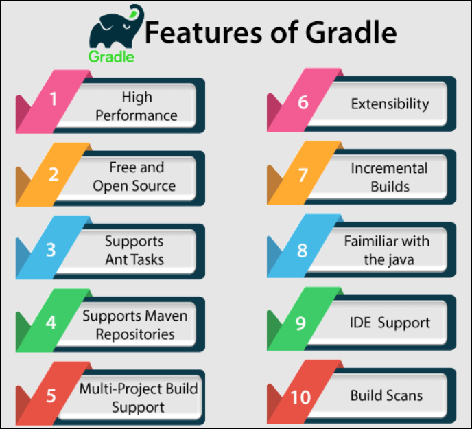

- [GRADLE](#gradle)
  - [Features of Gradle](#features-of-gradle)
  - [Objects](#objects)
    - [Standard project properties:](#standard-project-properties)
  - [Groovy JDK Methods](#groovy-jdk-methods)
  - [Tasks](#tasks)
    - [Locating Tasks](#locating-tasks)
    - [Adding Dependencies to Tasks](#adding-dependencies-to-tasks)
  - [Dependency Management](#dependency-management)
    - [Repositories](#repositories)
    - [Publishing Artifacts](#publishing-artifacts)
  - [Test](#test)
  - [Maven To Gradle](#maven-to-gradle)
    - [Convert Maven To Gradle](#convert-maven-to-gradle)
    - [Maven-publish Plugin](#maven-publish-plugin)
- [MAVEN](#maven)
- [MAVEN VS GRADLE](#maven-vs-gradle)


# GRADLE

Gradle is an open source and advanced build automation tool. It builds up on ANT, Maven and lvy repositories and supports groovy based Domain Specific Language (DSL) over the XML.


## Features of Gradle

- **Declarative builds and build-by-convention**
- **Gradle Wrapper** : 
Gradle Wrapper allows you to execute the Gradle builds on machines, where Gradle is not installed. This is useful for continuous integration of servers.
- **Ease of migration**
- **Deep API** : By using this API, you can monitor and customise its configuration and execution behavior to the core.




## Objects

### Standard project properties:

|Sr. No.|Name|Type|Default Value|
|--- |--- |--- |--- |
|1|project|Project|The Project instance|
|2|name|String|The name of the project directory.|
|3|path|String|The absolute path of the project.|
|4|description|String|A description for the project.|
|5|projectDir|File|The directory containing the build script.|
|6|buildDir|File|projectDir/build|
|7|group|Object|Unspecified|
|8|version|Object|Unspecified|
|9|ant|AntBuilder|An AntBuilder instance|

<br>  

**Example 1:**

```groovy
task hello{
    doLast{
        print 'hello world'
    }
}
```

```groovy
task hello  {
    print 'hello world2'
}
```
```groovy
tasks.create(name: 'hello')  {
    println "hello world3"
}
```

**run script**

```bash
gradle -q hello
```

<br>  

**Example 2:** Sequence

```groovy
task print{
    doLast{
        println 'it is doLast'
    }
    doFirst{
        println 'it is doFirst'
    }
}
```

**Print :**
```
it is doFirst
it is doLast
```

<br>  

**Example 3:** Variable

```groovy
task varTask {
    String name = "Cihan"
    println 'name : ' + name
    println 'Upper Case : ' + name.toUpperCase()
}
```

**Print :**
```
name : Cihan
Upper Case : CIHAN
```

<br>  

**Example 4:** Implicit Parameter

```groovy
task implicitParameter  {
    5.times {
        print "$it "
    }
}
```
it will pass value via **$it** and limit with **x.times**

**Print :**
```
0 1 2 3 4
```

## Groovy JDK Methods

**Example 1:** Implicit Parameter

```groovy
task eachFunc {
    String name = "Cihan"
    name.each(){
        println "$it"
    }
}
```

**Print :**
```
C
i
h
a
n

```

## Tasks
### Locating Tasks


**Example 1:** 

```groovy
task hello

println hello.name
println project.hello.name
```

**Print :**
```
hello
hello
```

<br>   

**Example 2:** 

```groovy
task hello

println tasks.hello.name
println tasks['hello'].name
```

**Print :**
```
hello
hello
```

<br>   

You can also access the task's path by using the tasks. For this, you can call the getByPath() method with a task name, or a relative path, or an absolute path.


**Example 3:** 

```groovy
project(':projectA') {
   task hello
}
task hello

println tasks.getByPath('hello').path
println tasks.getByPath(':hello').path
println tasks.getByPath('projectA:hello').path
println tasks.getByPath(':projectA:hello').path
```

**Print :**
```
:hello
:hello
:projectA:hello
:projectA:hello
```

<br>   

### Adding Dependencies to Tasks
**Example 1:**

```groovy
task taskX {
   println 'taskX'
}
task taskY(dependsOn: 'taskX') {
   println "taskY"
}
```
or
```groovy
task taskY {
   println 'taskY'
}
task taskX {
   println 'taskX'
}
taskY.dependsOn taskX
```


run command
```bash
gradle –q taskY
```

**Print :**
```
taskX
taskY
```

<br>

**Example 2:**

```groovy
task taskX << {
   println 'taskX'
}
taskX.dependsOn {
   tasks.findAll { 
    task -> task.name.startsWith('lib') 
   }
}
task lib1 << {
   println 'lib1'
}
task lib2 << {
   println 'lib2'
}
task notALib << {
   println 'notALib'
}
```

run command
```bash
gradle –q taskX
```

**Print :**
```
lib1
lib2
taskX
```

## Dependency Management

```groovy
apply plugin: 'java'

repositories {
   mavenCentral()
}

dependencies {
   compile group: 'org.hibernate', name: 'hibernate-core', version: '3.6.7.Final'
   testCompile group: 'junit', name: 'junit', version: '4.+'
}
```

<br>  

- **Compile :** The dependencies required to compile the production source of the project.

- **Runtime :** The dependencies required by the production classes at runtime. By default, it also includes the compile time dependencies.

- **Test Compile :** The dependencies required to compile the test source of the project. By default, it includes compiled production classes and the compile time dependencies.

- **Test Runtime :** The dependencies required to run the tests. By default, it includes runtime and test compile dependencies.


<br>  

### Repositories


```groovy
repositories {
   mavenCentral()
}
```
<br>   

```groovy
repositories {
   maven {
    url "http://repo.mycompany.com/maven2"
   }
}
```

### Publishing Artifacts

We can to tell Gradle, where to publish the artifacts.  While executing, Gradle will generate and upload a Pom.xml as per the project requirements.
```groovy
apply plugin: 'maven'

uploadArchives {
   repositories {
      mavenDeployer {
         repository(url: "file://localhost/tmp/myRepo/")
      }
   }
}
```


<br>   

**Some Commands**

|Sr. No.|Command|Description|
|--- |--- |--- |
|1|gradle –q help –task <task name>|Provides the usage information (such as path, type, description, group) about a specific task or multiple tasks.|
|2|gradle –q dependencies|Provides a list of dependencies of the selected project.|
|3|gradle -q api:dependencies --configuration <task name>|Provides the list of limited dependencies respective to configuration.|
|4|gradle –q buildEnvironment|Provides the list of build script dependencies.|
|5|gradle –q dependencyInsight|Provides an insight into a particular dependency.|
|6|Gradle –q properties|Provides the list of properties of the selected project.|

## Test


```groovy
apply plugin: 'java' // adds 'test' task

test {
   // enable TestNG support (default is JUnit)
   useTestNG()

   // set a system property for the test JVM(s)
   systemProperty 'some.prop', 'value'

   // explicitly include or exclude tests
   include 'org/foo/**'
   exclude 'org/boo/**'

   // show standard out and standard error of the test JVM(s) on the console
   testLogging.showStandardStreams = true

   // set heap size for the test JVM(s)
   minHeapSize = "128m"
   maxHeapSize = "512m"

   // set JVM arguments for the test JVM(s)
   jvmArgs '-XX:MaxPermSize=256m'
   
   // listen to events in the test execution lifecycle
   beforeTest { 
      descriptor → logger.lifecycle("Running test: " + descriptor)
   }

   // listen to standard out and standard error of the test JVM(s)
   onOutput { 
      descriptor, event → logger.lifecycle
         ("Test: " + descriptor + " produced standard out/err: " 
         + event.message )
   }
}
```

<br>  

## Maven To Gradle

### Convert Maven To Gradle

<br>   

**pom.xml**

```xml
<project xmlns = "http://maven.apache.org/POM/4.0.0" 
   xmlns:xsi = "http://www.w3.org/2001/XMLSchema-instance"
   xsi:schemaLocation = "http://maven.apache.org/POM/4.0.0
   http://maven.apache.org/xsd/maven-4.0.0.xsd">

<modelVersion>4.0.0</modelVersion>
<groupId>com.example.app</groupId>
<artifactId>example-app</artifactId>
<packaging>jar</packaging>

<version>1.0.0-SNAPSHOT</version>

   <dependencies>
      <dependency>
         <groupId>junit</groupId>
         <artifactId>junit</artifactId>

         <version>4.11</version>
         <scope>test</scope>
      </dependency>
   </dependencies>

</project>

```
Run command
```bash
gradle init --type pom
```

Converted **build.gradle** file

```groovy
apply plugin: 'java'
apply plugin: 'maven'

group = 'com.example.app'
version = '1.0.0-SNAPSHOT'

description = """"""

sourceCompatibility = 1.5
targetCompatibility = 1.5

repositories {
   maven { url "http://repo.maven.apache.org/maven2" }
}

dependencies {
   testCompile group: 'junit', name: 'junit', version:'4.11'
}
```


<br>   

### Maven-publish Plugin

```groovy
apply plugin: 'java'
apply plugin: 'maven-publish'

publishing {
   publications {
      mavenJava(MavenPublication) {
         from components.java
      }
   }

   repositories {
      maven {
         url "$buildDir/repo"
      }
   }
}
```
 
# MAVEN


# MAVEN VS GRADLE


