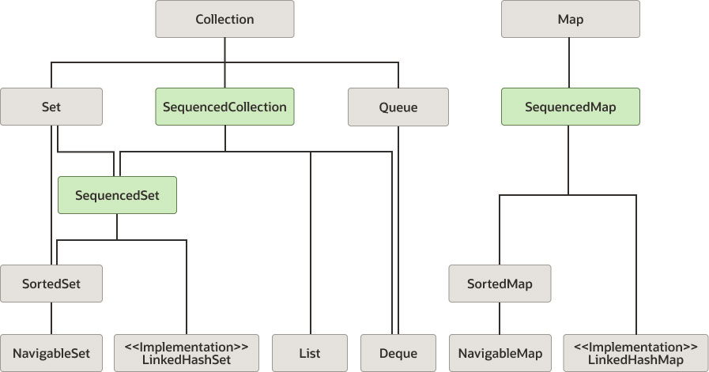
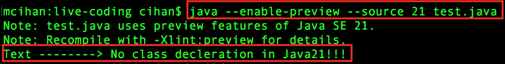

# JAVA 21 Features  <!-- omit in toc -->

- [1. String Template](#1-string-template)
- [2. Collections with Sequenced Interface](#2-collections-with-sequenced-interface)
- [3. Unnamed Classes and Instance Main Methods](#3-unnamed-classes-and-instance-main-methods)
- [4. Record Pattern Matching](#4-record-pattern-matching)
- [5. Switch Pattern Matching](#5-switch-pattern-matching)


## 1. String Template

**Before java21:** 

```java
String topic = "Java21";
String text = "This is Cihan's " + topic + " notes";

int x = 10;
int y = 20;
String result = x + " * " + y + " = " + (x * y);
```

**After:**
```java
String text = STR. "This is Cihan's \{topic} notes";

String result = STR. "\{x} * \{y} = \{x * y}";
```

print:
```
This is Cihan's Java21 notes

10 * 20 = 200
```


## 2. Collections with Sequenced Interface

In Java 21, the `SequencedCollection` interface is introduced to enable uniform methods for accessing elements of a collection with a stable iteration order. 
- This includes methods such as `getFirst()` and `getLast()`. It is inherited or implemented by interfaces like List (e.g., ArrayList, LinkedList), SortedSet, NavigableSet (e.g., TreeSet), and LinkedHashSet. 
- Additional methods include `addFirst(E)`, `addLast(E)`, `removeFirst()`, `removeLast()`. For immutable collections, modification methods throw an `UnsupportedOperationException`. 
- The `reversed()` method returns a view of the collection in reverse order.




### SequencedSet Interface <!-- omit in toc -->

- The `SequencedSet` interface inherits from Set and SequencedCollection. It provides no additional methods but overrides
- the `reversed()` method to replace the SequencedCollection return type with SequencedSet. 
- Additionally, `addFirst(E)` and `addLast(E)` have a special meaning in SequencedSet: if the element to be added is already in the set, it will be moved to the beginning or end of the set, respectively.

### SequencedMap Interface <!-- omit in toc -->

- In Java, collections (e.g., List, Set) and maps (e.g., HashMap) represent two separate class hierarchies. For ordered
maps, the new interface `SequencedMap` offers easy access to the first and last element of such a map. 
Methods include `firstEntry()`, `lastEntry()`, `pollFirstEntry()`, `pollLastEntry()`, `putFirst(K, V)`, `putLast(K, V)`,
and `reversed()`. 
- Additionally, there are methods for keys, values, and entries: `sequencedKeySet()` , `sequencedValues()`, `sequencedEntrySet()`.

### New Collections Methods <!-- omit in toc -->

- The Collections utility class has been extended with static utility methods for sequenced collections. These methods
include `newSequencedSetFromMap(SequencedMap map)`, `unmodifiableSequencedCollection(SequencedCollection c)`
, `Collections.unmodifiableSequencedMap(SequencedMap m)`, and `Collections.unmodifiableSequencedSet(SequencedSet s)`.


## 3. Unnamed Classes and Instance Main Methods

**Before Java21 :**

```java
public class Test {
    
    public static void main(String[] args) {
        System.out.println("Text --------> " + getText());
    }

    static String getText() {
        return "No class declaration in Java21!!!";
    }
}
```
**After :**  
```java
void main(String[] args) {
    System.out.println("Text --------> " + getText());
}

String getText() {
    return "No class declaration in Java21!!!";
}
```

Run the java class from terminal:




##  4. Record Pattern Matching

**Before Java 21**

```java
record Calculator(int x, int y) {}

if (obj instanceof Calculator c) {
    int x = c.x();
    int y = c.y();
    System.out.println(x * y); 
}  
```
**After :**

```java
 if (obj instanceof Calculator(int x, int y)) {
    System.out.println(x * y);
}
```


## 5. Switch Pattern Matching 

**Before Java21**

```java
public void print(Object obj) {
    switch (obj) {
        case Calculator c -> System.out.printf("Calculator params: %d/%d%n", c.x(), c.y());
        case String s   -> System.out.printf("It is String: %s", s);
        default         -> System.out.println("Other");
    }
}
```


**After :** Don't need c.x(), c.y(), just access like x, y

```java
public void print(Object obj) {
    switch (obj) {
        case Calculator(int x, int y) -> System.out.printf("Calculator params: %d/%d%n", x, y);
        case String s   -> System.out.printf("It is String: %s", s);
        default         -> System.out.println("Other");
    }
}
```


