- [1. What is Kafka?](#1-what-is-kafka)
- [2. Components](#2-components)
    - [2.1. Topic](#21-topic)
    - [2.2. Partition](#22-partition)
        - [2.2.1. Offset](#221-offset)
        - [2.2.2. Why kafka use Partition ?](#222-why-kafka-use-partition-)
    - [2.3. Broker](#23-broker)
    - [2.4. Producer](#24-producer)
    - [2.5. Consumer](#25-consumer)
        - [2.5.1. Consumer Group](#251-consumer-group)
- [3. Write Data](#3-write-data)
    - [3.1. Message Key](#31-message-key)
        - [3.1.1. Round Robin](#311-round-robin)
        - [3.1.2. Aggregation](#312-aggregation)
        - [3.1.3. Sorting & Event Sourcing](#313-sorting--event-sourcing)
    - [3.2. Replication](#32-replication)
    - [3.3. Producer Acknowledge](#33-producer-acknowledge)
        - [3.3.1. Fire and forget **(acks=0)**](#331-fire-and-forget-acks0)
        - [3.3.2. Asynchronous send **(acks=1)**](#332-asynchronous-send-acks1)
        - [3.3.3. Synchronous send **(acks=all, -1)**](#333-synchronous-send-acksall--1)
- [4. Read Data](#4-read-data)
    - [4.1. Reading Types(Message Delivery Semantics)](#41-reading-typesmessage-delivery-semantics)
        - [4.1.1. At Most Once](#411-at-most-once)
        - [4.1.2. At Least One](#412-at-least-one)
        - [4.1.3. Exactly One (Transactional)](#413-exactly-one-transactional)
- [5. Zookeeper](#5-zookeeper)
    - [5.0.1. Why Kafka Requires Zookeeper](#501-why-kafka-requires-zookeeper)
    - [5.1. Split Brain](#51-split-brain)
        - [5.1.1. Solving Split Brain](#511-solving-split-brain)
- [6. LINKS](#6-links)

# 1. What is Kafka?

Kafka is a high-performance distributed messaging system. It was developed by LinkedIn in 2011 and is an open-source project. Apache Kafka enables real-time data streaming with low latency for handling large volumes of data.

- Messages are stored in brokers.
- Zookeeper manages the brokers, selects the leader partition, and ensures brokers recognize each other.
- Producers and consumers need to have an odd number of replicas (e.g., 1, 3, 5, 7, etc.) to improve replication and prevent split-brain issues.
- Replication count must be equal to or greater than the number of brokers.


# 2. Components

## 2.1. Topic

- It's where messages are stored, similar to a table in a database.
- Kafka can have multiple topics, each identified by a name.
- Topics consist of one or more partitions.
- Data is written to disk; it doesn't use RAM.
- Data retention can be time-based or size-based.
  + **Time-based:** Data is typically retained for a certain period, and older data is removed after a specific duration. By default, data is stored for one week.
  + **Size-based:** Data retention can also be based on the size of the data. For example, if data exceeds a certain size threshold (e.g., 1GB), older data is deleted. However, this approach is not recommended because it's unpredictable and depends on traffic conditions. Data size can fluctuate rapidly, potentially reaching the storage limit in a short time, leading to data loss.


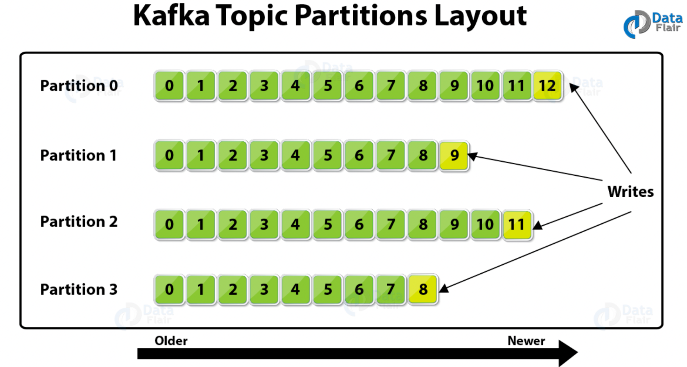

## 2.2. Partition

- Data is stored in partitions.
- The number of partitions is configurable.
- Data is written to partitions in a First-In, First-Out (FIFO) manner.
- Written data is immutable.


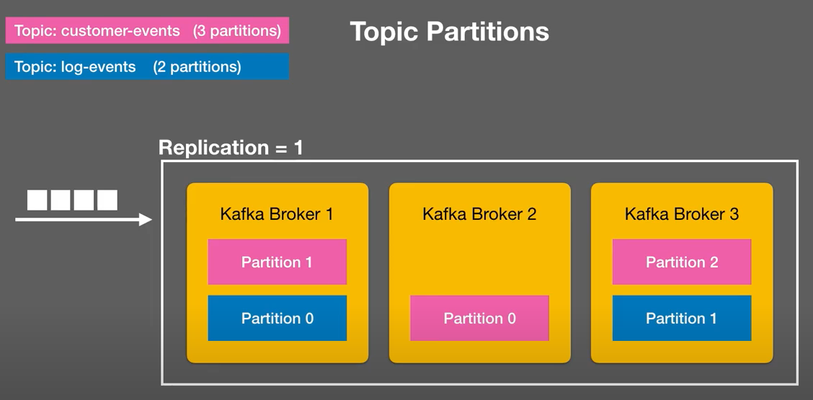

### 2.2.1. Offset

- The index of data within a partition.

### 2.2.2. Why kafka use Partition ?

- **Aggregation** yapilabilir. (Producer verilerinin belli ozelliklere gore toplanmasi )
- **sorting - eventsourcing** Verilerin sirali bir sekilde toplanmasi.
- **Parallelism**'i arttirarak daha hizli okuma/yazma yapmak.
- **Efficiency** - Verileri daha verimli saklamak.

## 2.3. Broker

- Topic ve partition'lari tutan sunuculardir.
- Birçok broker birlikte kafka cluster’ı oluşturur.
- Her broker'in kendisine ait bir id'si vardir.
- Bir broker’a bağlandığınızda, buna “**bootstrap broker**” denir ve tüm cluster’a bağlanmış olursunuz.
- Her broker sadece belirli topic partitionlarını içerir. Yani tüm veriyi tutmaz, çünkü Kafka dağıtık bir yapıdadır.
- Diger bir deyisle; Kafka dağıttık yapıda olduğu için tek bir broker topic’in tüm partition’larını barındırmaz. Her
  broker farklı partition’ı alır.

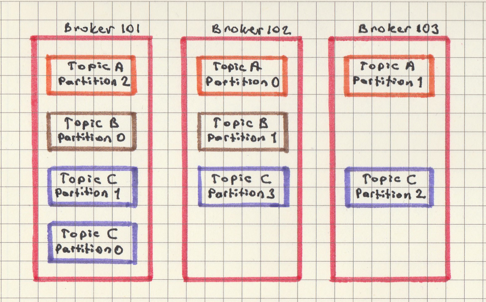

## 2.4. Producer

- Topic’lere veriyi yazarlar.
- Hangi broker ve partitiona yazacağını bilirler, cluster içerisindeki bir broker’a bağlanması yeterlidir.
- Mesaj anahtarı (message key) belirtilmişse, partition’a yazma işlemi anahtar değerine göre yapılır. Aynı anahtar
  değerine sahip mesajlar, aynı partition’a yazılır.

## 2.5. Consumer

- Topic’lerden veriyi okurlar.

### 2.5.1. Consumer Group

- Consumer’lar, veri okuma işlemini bir consumer group içerisinde yaparlar.
- **Tek bir consumer olsa bile, bu consumer yine de consumer group içerisindedir.**

- Her bir consumer, bir consumer group’a aittir.
- Bir partition’ı bir consumer group içerisinde sadece bir consumer okuyabilir.
- Partition'lar consumer'lara esit olarak dagitilir.

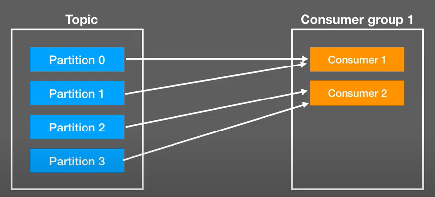

- Eger consumer sayisi partition'dan fazla ise, fazla olan consumer pasif olarak beklemeye gecer. Cunku **bir
  partition'i ayni isme sahip bir consumer okuyabilir**. Diger consumer'larda bir sorun olursa onun yerine aktif olur.

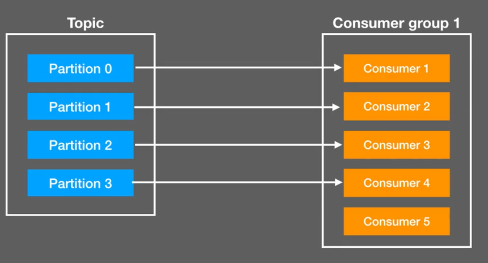

- Yeni consumer grubu eklendiginde, isimler farkli oldugu icin partition okurken bir karisiklik olmaz.

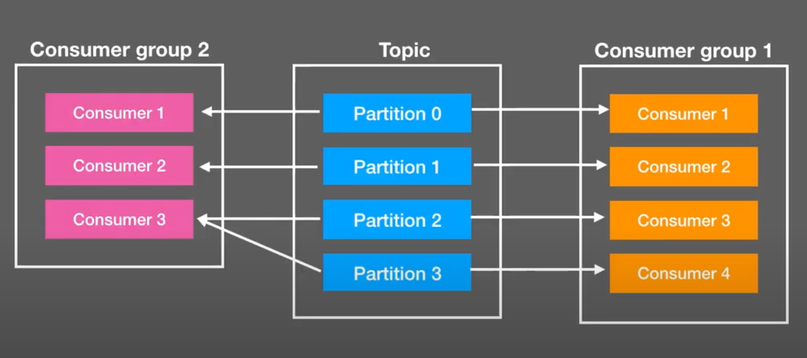

# 3. Write Data

## 3.1. Message Key

- Producer’lar mesajları iletirken bir **key** seçebilirler. Bu anahtarın türü String, number vs olabilir. Eğer bir
  anahtar belirlenmezse, veriler “**round robin**” yaklaşımıyla gönderilir.
- Message Key degistirilerek partition'lari istedigimiz gibi kullanabiliriz.

### 3.1.1. Round Robin

- Veriler sirasiyla 1-2-3 seklinde partitionlara dagitilir. Default yontemdir.

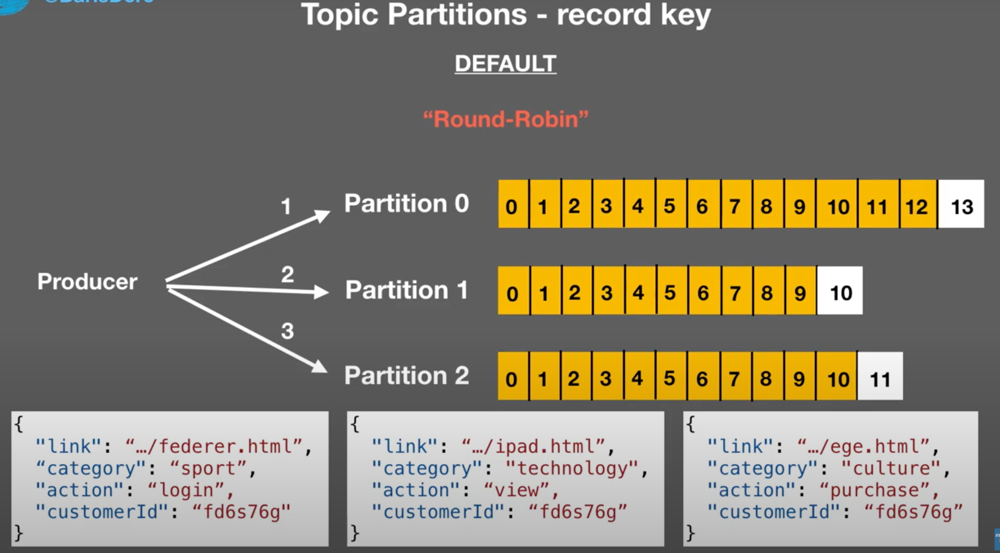

### 3.1.2. Aggregation

- Key degerinde catagory degeri verilir. Veriler partition'lara katagorisine gore yazilir. Yani mesagge'lar katagorilere
  gore toplanir.

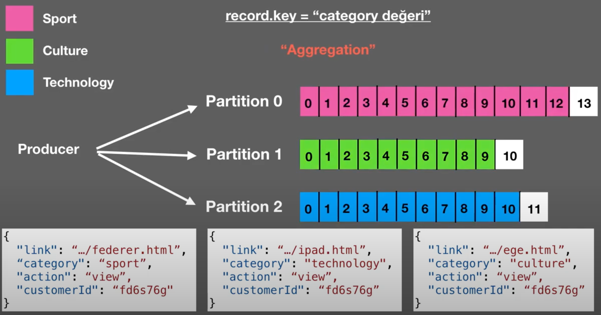

### 3.1.3. Sorting & Event Sourcing

- Key olarak userId kullandigimizi varsaylim. Message'leri user'in yaptigi event'lere gore topladigimiz anlamina
  geliyor. User'in her haraketini sirasiyla toplayabiliriz.

  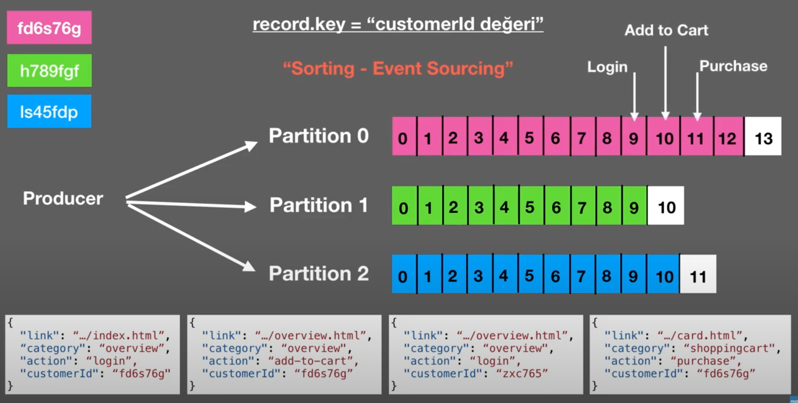

## 3.2. Replication

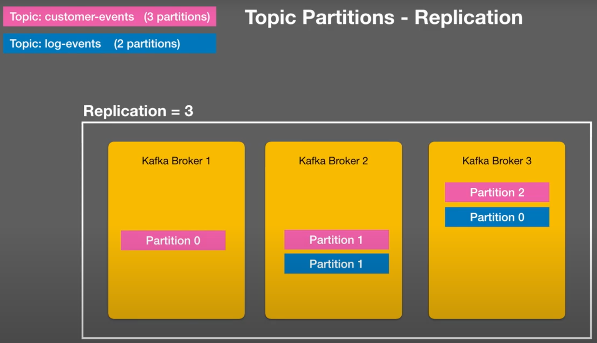

- 3'er replica yaptigimizda asagidaki gibi olur.
- Bir de kafka **Leader Partition**'i secer ve veri ilk lider partition'a yazilir ordan diger partition'lara dagitilir.
  Eger **Leader Partition** down olursa kafka yeni **Leader Partition** secer. **(Reelection)**

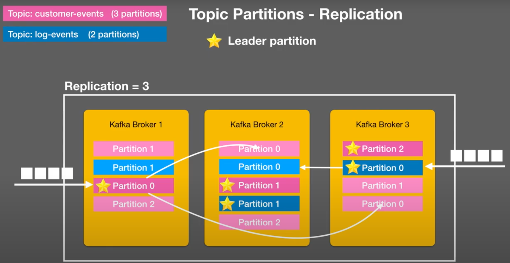

<br/> 

Ozetle Kafkaya veri yazilim asamalari su sekilde gerceklesir;

1. Kafkaya veri gondermek,
2. Verinin **Leader Partition**'a erisip saklanmasi
3. **Leader Partition**'in verileri diger kopya partitionlara dagitmasi.

Bu 3 asama tamamlaninda senkronasyon tamamlanir.

## 3.3. Producer Acknowledge

- Kafkada veri yazilim asamalarinda hangi asamanin beklenmesini ve tasdik edilmesi gerektiginin belirtilmesidir.

### 3.3.1. Fire and forget **(acks=0)**

- **En hizli ve en riskli olanidir. Mesaj kaybolma sansi yuksek.**
- Kafkaya gonder ve cavabi beklemeden devam et.
- Kafkaya veriyi gonderir gondermez, daha kafkaya vardigini beklemeden bir sonraki veriyle devam edilir.
- Mesaj herhangi asamada kaybolabilir. Kafkaya gonderirken, leader partition'a erisirken yada leader'dan copy
  partition'a giderken.

### 3.3.2. Asynchronous send **(acks=1)**

- **Orta hizli ve guvenli.Mesaj kaybolma sansi az.**
- Kafkaya gonder ve Leader'a yazana kadar bekle.
- Veri kaybolma sansi azdir. Leader partition'dan copy partition'a giderken kaybolabilir.
- Yanıt beklemez fakat “call-back” hizmeti vardır.
- Producer mesajı gönderirken, parametre olarak “**CallBack**” interface’inden türetilen bir sınıfı verirseniz, bu
  sınıfın ilişkisel metoduna kafka’dan yanıt geldiğinde geri çağrım yapılacaktır

### 3.3.3. Synchronous send **(acks=all, -1)**

- **En yavasi ve en guvenlisi. Mesaj kaybolma sansi yok.**
- 3 asama tamamlanip senkronasyon tamamlanana kadar beklenir, bitince yeni mesaj alinir.

# 4. Read Data

- Event okunur ve okunduktuktan sonra kafka'ya, okunduguna dair commit gonderilir. Boylece offset degisir ve zookeper
  icerisinde kaydedilir.
- Consume edilirken hata olustursa, offset pozisyonu tutuldugu icin, sonraki consumer kalan yerden devam eder.

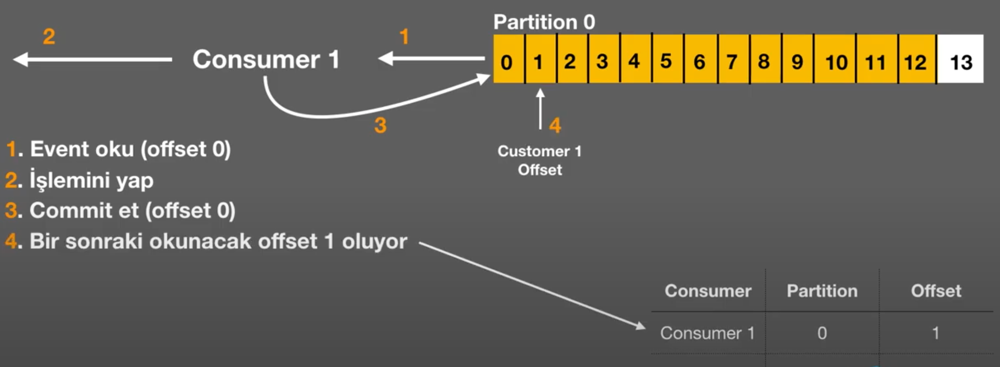

## 4.1. Reading Types(Message Delivery Semantics)

### 4.1.1. At Most Once

- En fazla bir kere.
- Consumer veriyi okur okumaz kafkaya commit eder.
- Fakat okuduktan sonra veriyi islerken hata alirsa o veri kaybolur, bir sonraki veriden devam edilir.
- Message'in kaybolma riski buyuktur.

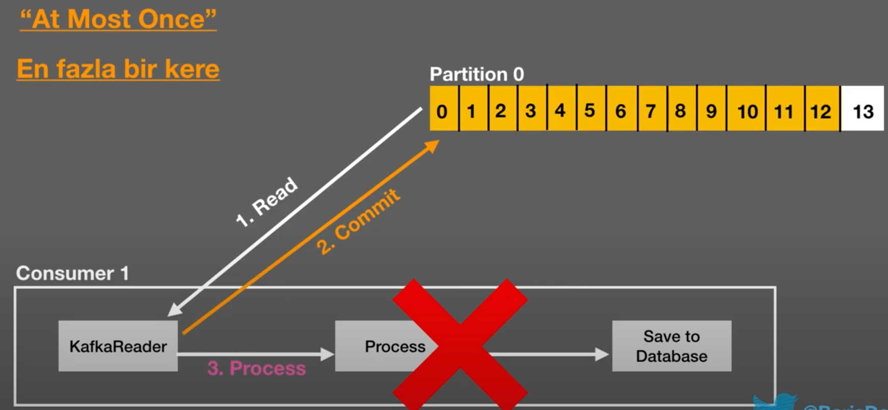

### 4.1.2. At Least One

- En az bir kere.
- Veri okunup db'ye yazilana kadar islem beklenir ve bitince commit edilir.
- Islemde herhangi bir hata olusursa consumer ayni mesaji tekrar basta okuyacaktir. Yani ayni message'in birden fazla
  onup islenme durumu olusabilir. Bundan dolayi mesaj işleme sürecimiz **idempotent** olmalıdır, yani duplike
  durumlarında sistemimiz etkilenmemelidir
- En cok kullanilan yontemdir.

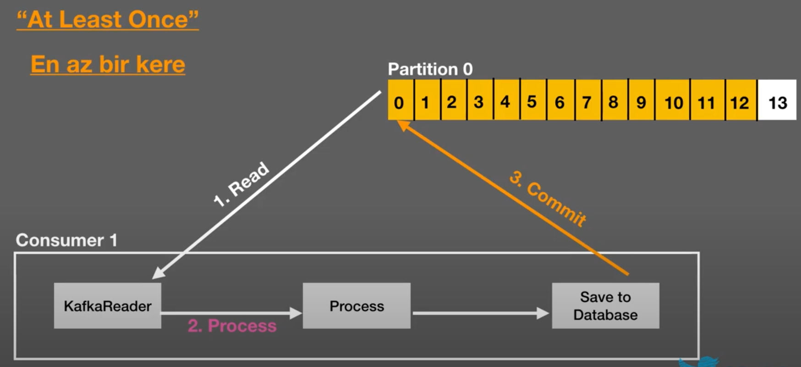

### 4.1.3. Exactly One (Transactional)

- Tam bir kere
- Message okur okunmaz bir transaction baslar.
- Islem bir kere yapiliyor, daha once yapilmis islemler tekrarlanmiyor
- Performansi yavaslatir.

# 5. Zookeeper

- Zookeeper brokerlari yonetir,
- Lider partition'i secer,
- Brokerlarin birbirini tanimasini,
- Yeni veya cokmus brokerlarin kesfedilmesi,
- Yeni eklenen topic'lerin kesfedilmesi saglar.

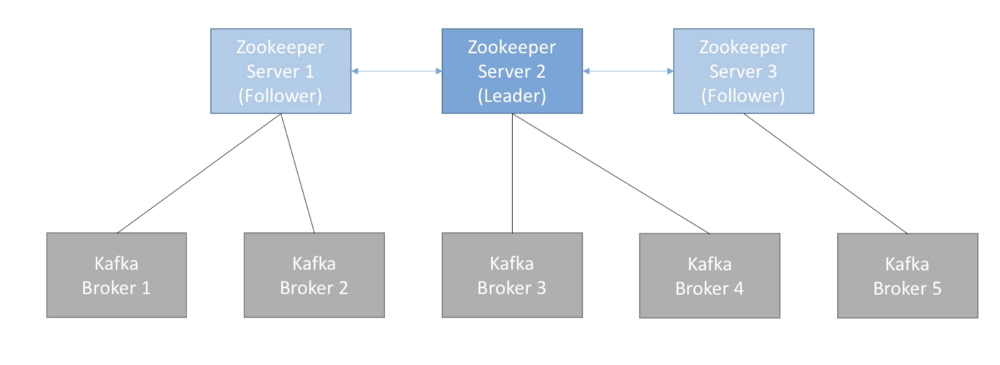

- Distributed Coordination Service.
- Synchronization, Serialization, Coordination
    + Race Coordination
    + Deadlock
    + Partial Failures
    + Inconsistencies (Sender / Receiver problems)
- Goals
    + Atomicity
    + Serialization
    + Reliability
    + Simple API
- Typical Uses
    + Configuration
    + Message Queue
    + Notification
    + Synchronization

      <br>

- Apache ZooKeeper is an open-source server for highly reliable distributed coordination of cloud applications.
- The goal is to make these systems easier to manage with improved, more reliable propagation of changes.
- Detect master
- Kısaca zookeeper, distributed uygulamalar geliştirmeye izin veren, distributed bir koordinasyon servisidir
  diyebiliriz. Bir başka değişle, multiple instance’lı distributed sistemleri configure etmeye yarayan open-source bir
  projedir diyebiliriz.

### 5.0.1. Why Kafka Requires Zookeeper

- Manage and Control to broker
- Choose leader partition
- Make brokers recognize each other. (Brokerlarin birbirini tanimasi)
- Discover deleted, shot downed brokers or added topics

- store leader and follower informations
- which nodes are up/available in cluster
- list of topics
- which topics are storing in which nodes and partition lists
- Quotas - how much data is each client allowed to read and write
- ACLs - who is allowed to read and write to which topic (old high level consumer) - Which consumer groups exist, who
  are their members and what is the latest offset each group got from each partition.

## 5.1. Split Brain

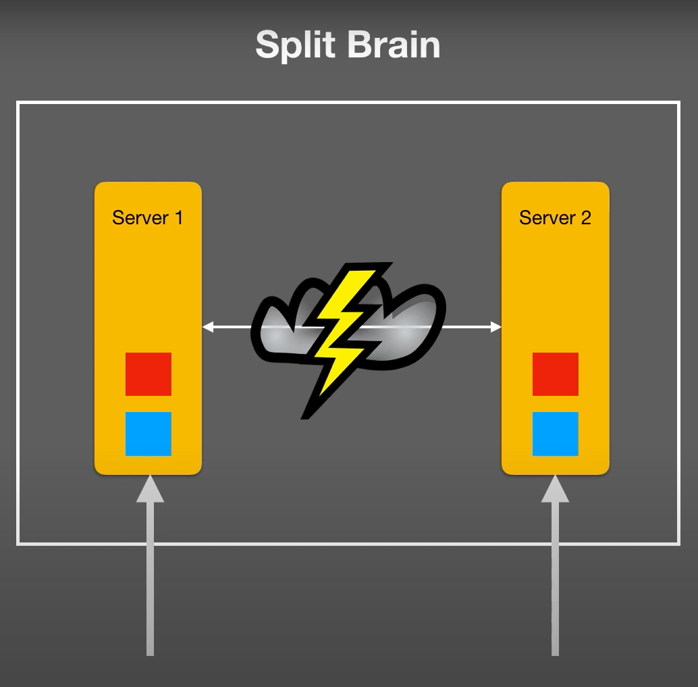

1. Iki brokerdan olusan bir sistemde iki arasindaki baglanti koptugunda ikiside islemleri yapmaya devam ediyor,
2. Ikisi arasindaki baglanti tekrar kuruldugunda hangisinin datasini temel almak gerekiyor.
3. Bu duruma **Split Brain** deniyor.

### 5.1.1. Solving Split Brain

- Revision or Version
- Use timestampt
- Quorum : olmasi gereken minimum kisi sayisi, exp: futbolda bir takimda min 7 kisi olmali(4 kirmizi kart), daha az
  olursa devam etmez. Bu problemde de broker sayisi buna gore belirlenir.

Eger TR de 3, US de 2 brokerimiz varsa, eger data-center'lar arasi baglanti koparsa data-center sayisi iki oldugu icin
yine split brain problemi ortaya cikar.


**Optimum Quorum sayisini belirleme:**
```n/2 + 1```
n = broker sayisi

**exp :**  5/2 +1 = 3, servers=3, Quorum=3, 2 coken servis tolere edilebilir.

# 6. LINKS

[Spring Cloud vs Spring Boot](https://www.educba.com/spring-cloud-vs-spring-boot/)
[Spring Cloud vs Spring Boot 2](https://www.javatpoint.com/spring-cloud-vs-spring-boot)
[Spring Cloud vs Spring Boot 3](https://onlineitguru.com/blog/spring-cloud-vs-spring-boot-what's-the-difference)