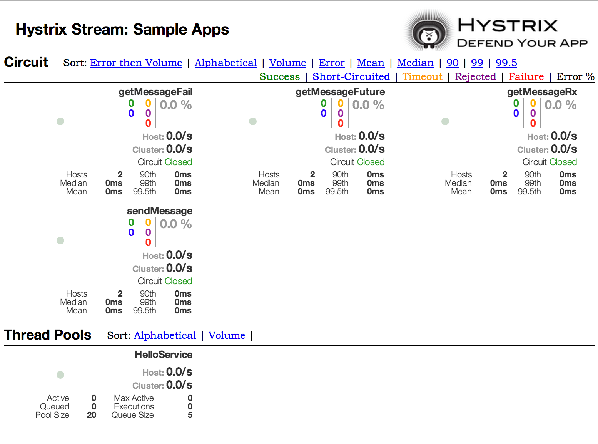
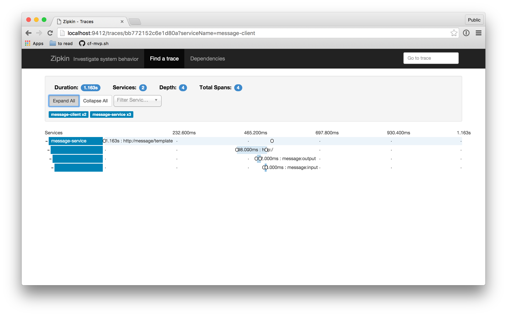

- [1. Microservices vs Monolithic](#1-microservices-vs-monolithic)
    - [1.1. Microservices](#11-microservices)
    - [1.2. Monolithic](#12-monolithic)
- [2. Spring Cloud - **NETFLIX**](#2-spring-cloud---netflix)
- [3. Spring Cloud](#3-spring-cloud)
    - [3.1. Solutions of Spring Cloud](#31-solutions-of-spring-cloud)
    - [3.2. Features of Spring Cloud](#32-features-of-spring-cloud)
    - [3.3. Advantages of Spring Cloud](#33-advantages-of-spring-cloud)
    - [3.4. Spring Cloud Components](#34-spring-cloud-components)
        - [3.4.1. Eureka Service](#341-eureka-service)
        - [3.4.2. Api Gateway](#342-api-gateway)
            - [3.4.2.1. Zuul Api Gateway](#3421-zuul-api-gateway)
            - [3.4.2.2. Spring Cloud Api Gateway](#3422-spring-cloud-api-gateway)
        - [3.4.3. Spring Cloud Bus](#343-spring-cloud-bus)
        - [3.4.4. SpringBoot Actuator](#344-springboot-actuator)
            - [3.4.4.1. Features](#3441-features)
        - [3.4.5. Circuit Breakers](#345-circuit-breakers)
            - [3.4.5.1. Netflix Hystrix](#3451-netflix-hystrix)
            - [3.4.5.2. Resilience4j](#3452-resilience4j)
        - [3.4.6. Logging / Tracing](#346-logging--tracing)
            - [3.4.6.1. Zipkin](#3461-zipkin)
            - [3.4.6.2. Spring Cloud Sleuth](#3462-spring-cloud-sleuth)
        - [3.4.7. Config Service](#347-config-service)
            - [3.4.7.1. Sequence of config](#3471-sequence-of-config)
    - [3.5. Spring Cloud vs Spring Boot](#35-spring-cloud-vs-spring-boot)
- [4. Kafka](#4-kafka)
    - [4.1. Split Brain](#41-split-brain)
        - [4.1.1. Solving Split Brain](#411-solving-split-brain)
    - [4.2. Apache Zookeeper](#42-apache-zookeeper)
    - [4.3. Why Kafka Requires Zookeeper](#43-why-kafka-requires-zookeeper)
    - [4.4. LINKS](#44-links)
- [5. MONITORING](#5-monitoring)
- [6. DB migrator](#6-db-migrator)

# 1. Microservices vs Monolithic

## 1.1. Microservices

|Advantage|Disadvantage|
|---|---|
|Small and focused on one domain or functionality|Slower to begin with|
|Independent|Slower to develop entire application if doing it alone|
|Easier to refactor, rework and use new technology|More complex architecture|

## 1.2. Monolithic

|Advantage|Disadvantage|
|---|---|
|It is easier to to begin with|Harder to maintain, harder to release changes|
|Faster initial development time|Difficult for new developers to understand|
|Easier to deploy 1 app, than 20 independent|All done with one technology|

# 2. Spring Cloud - **NETFLIX**

- **Eureka** : Service Discovery
- **Hystrix** : Circuit Breaker
- **Zuul** : Intelligent Routing (Api Gateway)
- **Ribbon :** Client Side Load Balancing

# 3. Spring Cloud

## 3.1. Solutions of Spring Cloud

- Distributed Messaging
- Load Balancing
- Circuit Breakers
- Routing
- Distributed Logging
- Service Registration
- Distributed Lock
- Centralized Configuration

## 3.2. Features of Spring Cloud

- **Intelligent routing and service discovery:**
  When it comes to developing MS, four services are crucial. One of them is service discovery. Each of these services is reliant on the others.

- **Service-to-Service Contact:**
  Register to call the endpoint to link all services in a series.

- **Load Balancing:**
  This is the distribution of network traffic. So, it is to the backend server in a correct manner.

- **Leadership Election:**
  The program works as a third-party system with another application.

- **Global Lock:**
  A global lock prevents two threads from accessing the same resource at the same time.

- **Distributed Messaging and Distributed Form.**

## 3.3. Advantages of Spring Cloud

- It is a cloud-service development framework.
- It's a Microservice-based architecture that needs to be set up.
- It allows for cross-service talk.
- It creates using the Boot framework.
- Development on the cloud-native platform
- Architecture based on services
- Advice between departments
- Modeled after the SB framework.
- It is cloud-independent.

## 3.4. Spring Cloud Components

| Problem | Components |
| --- | --- |
| Distributed Cloud Configuration | Spring Cloud Configuration, Spring Cloud Zookeeper, Spring Consul Config |
| Distributed Messaging | Spring Stream with Kafka, Spring Stream with RabbitMQ |
| Service Discovery | Spring Cloud Eureka, Spring Cloud Consul, Spring Cloud Zookeeper |
| Logging | Spring Cloud Zipkin, Spring Cloud Sleuth |
| Spring Service Communication | Spring Hystrix, Spring Ribbon, Spring Feign, Spring Zuul |

### 3.4.1. Eureka Service

- Eureka service help microservices find each other.
- We should not write other services url as hard coded. It is problem for other instances.

### 3.4.2. Api Gateway

- Authentication / Authorization
- Rate Limiter
- Circuit Breaker (Resilience4J lib), We can add timeout and retry policy here.
- Load Balanced
- Spring Cloud Api Gateway instead of Zuul Api Gateway

#### 3.4.2.1. Zuul Api Gateway

#### 3.4.2.2. Spring Cloud Api Gateway

### 3.4.3. Spring Cloud Bus

- When you use config service, other services fetch this configs only one time when they start up. So when we update config properties file we should restart all services. It is not very convenient.
- Spring Cloud Bus help us to push configuration changes to microservices while they are running and without restarting.
- It can use messaging queue like RabbitMQ.
- It uses **AMQP** (Advanced Message Queuing Protocol)
- Generally Spring Cloud Bus used in ConfigServices.

**Dependency :**

```xml 
<dependency>
    <groupId>org.springframework.cloud</groupId>
    <artifactId>spring-cloud-starter-bus-amqp</artifactId>
</dependency>
```

### 3.4.4. SpringBoot Actuator

- It helps us to monitor and manage out application when it is running,
- We can check health status
- See other details of system.
- Generally it added to api-gateway service.

#### 3.4.4.1. Features

- **/health** : Health check
- **/beans** : Display a complete list of Beans in your Microservice
- **/httptrace** : Display HTTP trace information (by default, the last 100 HTTP request-response exchanges)
- **/metrics**
- **/env**
- **/mapping** : Display a collated list of all **_@RequestMapping_** paths.

**All Features**

| ID  | Description |
| --- | --- |
| `auditevents` | Exposes audit events information for the current application. Requires an `AuditEventRepository` bean. |
| `beans` | Displays a complete list of all the Spring beans in your application. |
| `caches` | Exposes available caches. |
| `conditions` | Shows the conditions that were evaluated on configuration and auto-configuration classes and the reasons why they did or did not match. |
| `configprops` | Displays a collated list of all `@ConfigurationProperties`. |
| `env` | Exposes properties from Spring’s `ConfigurableEnvironment`. |
| `flyway` | Shows any Flyway database migrations that have been applied. Requires one or more `Flyway` beans. |
| `health` | Shows application health information. |
| `httptrace` | Displays HTTP trace information (by default, the last 100 HTTP request-response exchanges). Requires an `HttpTraceRepository` bean. |
| `info` | Displays arbitrary application info. |
| `integrationgraph` | Shows the Spring Integration graph. Requires a dependency on `spring-integration-core`. |
| `loggers` | Shows and modifies the configuration of loggers in the application. |
| `liquibase` | Shows any Liquibase database migrations that have been applied. Requires one or more `Liquibase` beans. |
| `metrics` | Shows “metrics” information for the current application. |
| `mappings` | Displays a collated list of all `@RequestMapping` paths. |
| `quartz` | Shows information about Quartz Scheduler jobs. |
| `scheduledtasks` | Displays the scheduled tasks in your application. |
| `sessions` | Allows retrieval and deletion of user sessions from a Spring Session-backed session store. Requires a servlet-based web application that uses Spring Session. |
| `shutdown` | Lets the application be gracefully shutdown. Disabled by default. |
| `startup` | Shows the startup steps data collected by the `ApplicationStartup`. Requires the `SpringApplication` to be configured with a `BufferingApplicationStartup`. |
| `threaddump` | Performs a thread dump. |

**Dependency :**

```xml 
 <dependency>
    <groupId>org.springframework.boot</groupId>
    <artifactId>spring-boot-starter-actuator</artifactId>
</dependency>
```

### 3.4.5. Circuit Breakers

#### 3.4.5.1. Netflix Hystrix

- Annotation is **@EnableCircuitBreaker**
- When an endpoint have a problem and always return error, Circuit Breaker create a fallback method and respond standard(maybe hardcoded) answers, so another microservices which are depended on didn't effect from problem(error).
- You can add fallback method to feign client

#### 3.4.5.2. Resilience4j

- You can add fallback method to feign client
- Can add @Retry annotation, so it will try to get success response.

**Hystrix Dashboard :**  


### 3.4.6. Logging / Tracing

#### 3.4.6.1. Zipkin

- It is a distributed tracing system. It helps gather timing data needed to troubleshoot latency problems in service architectures.
- Zipkin is a very efficient tool for distributed tracing in the microservices ecosystem.
- Also provide graphical user interface

#### 3.4.6.2. Spring Cloud Sleuth

- It is used to generate and attach the trace id, span id to the logs so that these can then be used by tools like Zipkin and ELK for storage and analysis

- **traceId** : Unique id for trace whole process
- **spanId** :  Unique id for trace for each step of process

**Zipkin Dashboard :**  


### 3.4.7. Config Service

- Annotation is **@EnableConfigService**
- It helps to manage configuration on one point. Central configuration.
- You can keep bootstrap.properties file on git.
- If a service want to fetch global properties, it should add **_spring.cloud.config.uri_** and **_spring.cloud.config.uri_** in their bootstrap.properties

#### 3.4.7.1. Sequence of config

❗TODO❗

- remote git application.properties
- native (file system) application.properties
- serviceName.properties
- profile.properties
- bootstrap.properties
- external environment like docker or java -jar -Dparam

**Dependency :**

```xml 
<dependency>
      <groupId>org.springframework.cloud</groupId>
      <artifactId>spring-cloud-config-server</artifactId>
</dependency>
```

## 3.5. Spring Cloud vs Spring Boot

- Microservice needs both technologies to make it easy to developer and maintain application.
- Spring cloud used for cloud application. Spring boot used for product – ready application.
- **Spring Cloud** is Configuration server technology and communicate with many services and collect in one Application. **Spring boot** is a java based framework to work con auto-configuration in Web Application.
- **Spring cloud** is part of **Spring boot**, where **Spring boot** is Stand-Alone, App-Centric Application framework.
- Spring Boot is a Java framework which is used for quicker application development, and is specifically used in Microservice architecture.
- Spring cloud is used for integrating these microservices so that they can easily work together in a distributed environment and can communicate with each other
- In fact, to avail maximum benefits like less development time, it is recommended to use Spring Boot along with Spring Cloud.


# 5. MONITORING

- Spring actuator
- Grafana
- Prometheus
- Dynatrace

# 6. DB migrator

- liquiebase
- Spring flyway


 
 