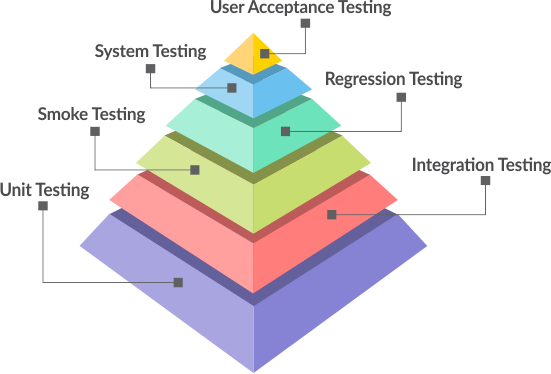
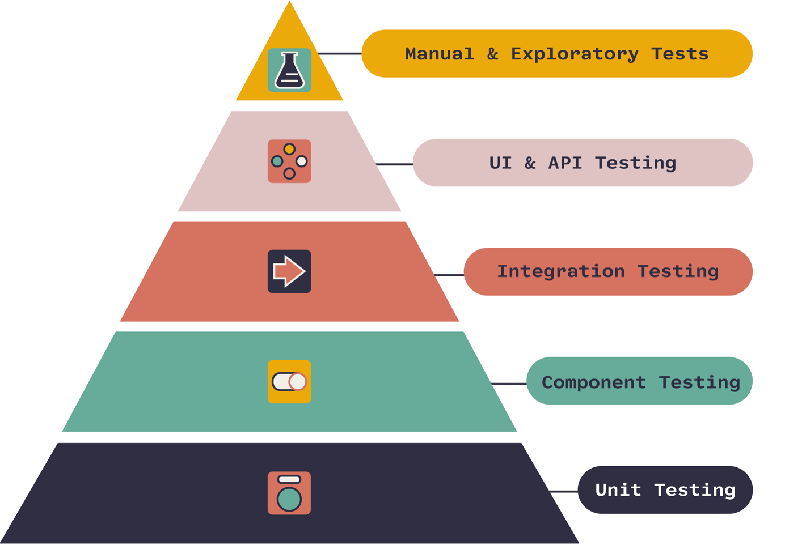
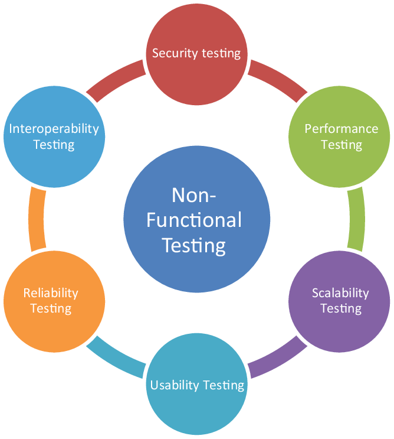

- [1. TYPES OF TEST](#1-types-of-test)
- [2. Functional Tests](#2-functional-tests)
    - [2.1. Unit Test](#21-unit-test)
        - [2.1.1. Why We Write Unit Test](#211-why-we-write-unit-test)
    - [2.2. Regression Testing](#22-regression-testing)
    - [2.3. System Test (Sistem Testi): Tüm sistemin entegre olduğu dış bileşenler ile birlikte gereksinimleri yerine getirip](#23-system-test-sistem-testi-tüm-sistemin-entegre-olduğu-dış-bileşenler-ile-birlikte-gereksinimleri-yerine-getirip)
    - [2.4. White Box Tests](#24-white-box-tests)
    - [2.5. Black Box Tests](#25-black-box-tests)
- [3. Non-Functional Test](#3-non-functional-test)
- [4. Test Strategies](#4-test-strategies)
    - [4.1. TDD](#41-tdd)
    - [4.2. Unit Test](#42-unit-test)
- [5. Test in Microservices](#5-test-in-microservices)
- [6. Test Double](#6-test-double)

# 1. TYPES OF TEST

- Unit Test
- Integration Test
- Smooth Test
- End-to-End test
- Acceptance Test
- Automation Test
- Regression Test
- Performance Tests
    + Load Test
    + Stress Test
    + Hacim
    + Dayaniklilik
    + Spike
    + Scalability Test

# 2. Functional Tests

- **Functional Requirements:** Fonksiyonel gereksinimler bir sistemin ne yapması gerektiğini belirler.
- User story'ler ornek verilebilir. Ornegin; login sayfasinin yapilmasi, user-password yanlis girerese hata
  gosterilmesi, sepete ekle modulunun yapilmasi gibi.





1. Unit Testing
2. Integration Testing
3. API testing
4. Regression Testing
5. White-box testing
6. Black-box testing
7. Smoke Testing
8. Acceptance Testing
9. UI testing

## 2.1. Unit Test

- Uygulamamızın küçük bir parçasını uygulamanın geri kalanından bağımsız bir şekilde çalıştırarak, bu parçanın
  davranışını doğrulayan bir metoddur.
- Unit testler production build sırasında kullandığımız maven, gradle, vb. build araçları tarafından varsayılan olarak
  çalıştırılırlar. Testlerde oluşacak herhangi bir hatada build işlemi hata verir ve tamamlanmaz. Build tamamlandıktan
  sonra üretilmiş olan son çıktıda ise test kodu bulunmaz. Yani canlı ortama (production) test kodu çıkmamış olur.

Unit test 3 asamadan olusur; **AAA (Arrange-act-assert) Pattern**

- **Arrange:** Input parametlerinin olusturuldu asamadir.
- **Act:** Testin yapildigi asamadir.
- **Assert:** Test sonucunun dogrulamasi yapildigi asamadir.
    + **_state-based:_** Test edilen kodun çıktılarının veya sistemde oluşturduğu durum (state) değişikliğinin kontrol
      edilmesi durumunda “state-based” test yazmış oluyoruz.
    + **_interaction-based:_** Test edilen kodun belirli fonksiyonları doğru şekilde tetiklediğini (doğru etkileşim)
      doğrulayan bir test yazdığımızda “interaction-based” bir test yazmış oluyoruz.

```java
@Test
void shouldFindByName(){
// Arrange
final var phoneBook=new PhoneBook();
        phoneBook.addPerson(new Person("James","Malkovic","+905554443321"));

// Act
final var result=phoneBook.findByName("John");

        // Assert
        assertEquals(1,result.size());
        }
```

### 2.1.1. Why We Write Unit Test

- Hataların erken fark edilmesini saglar,
- Kodu istenmeyen değişikliklerden korur. Kod degistiginde teste uyumsuz ise hata verir.
- Refactor'u kolaylastirir, refactor sirasinda hata olursa bulmak kolay olur,
- Hata bulmayı (Debugging) kolaylaştırır. Tum sistemi ayaga kaldirmaktansa kucuk bir kismi parametreler degistirilerek
  IDE sayesinde debug edilebilir.
- Önemli Bir CI (Continuous Integration, Sürekli Entegrasyon) Adımıdır
- Yazilimin kalitesini arttirmak icin.
- Kodun Dökümantasyonudur
- Daha hizli yazilim gelistirme olanak saglar. Eklenen birsey diger

## 2.2. Regression Testing

Bu test türü yazılım geliştirilirken yazılımda her hangi bir yerde değişiklik yaptığımız da sistemin diğer bölümlerini
beklenmedik şekilde etkilemediğinden emin olmak için tüm sistemin kara kutu (işlevsel ve işlevsel olmayan testlerinde
dahil olduğu) testini yaptığımız zamandır.

## 2.3. System Test (Sistem Testi): Tüm sistemin entegre olduğu dış bileşenler ile birlikte gereksinimleri yerine getirip

getiremediğinin test edilmesidir. Elle manuel olarak koşulacak testler olabileceği gibi yazılım ile otomatize edilmiş
test senaryoları da olabilir.

## 2.4. White Box Tests

Kodun içine girilerek kodun doğruluğu ve kalitesi test edilir. Bu test türünde kod erişimi zorunludur. Kod yapısı ve
tasarımına yönelik testler gerçekleştirilir

- Unit Test
- Integration Test

## 2.5. Black Box Tests

Kodun yapısı(structure), tasarımı(design) ve uygulanışı(implementation) ile ilgilenmez. Kara kutu testlerinde girdi ve
çıktı değişimine göre sistemin nasıl çalıştığı test edilir.

- Functional Test
- Non-Functional Test: Performance Test(Load Test, Stress Test)
- Regression Test
- Use case testing : User Acceptance, end-to-end user test

# 3. Non-Functional Test

- **Non-Functional Requirements:** Sistemin nasıl olması gerektiğini belirtirler
- Sistemin kalite ve karakteristiklerine odakladir.
- Ornegin; sistemin hizi/performansi, guvenli olmasi, erisilebilir olmasi.

1. Performance Tests
    + Load Tests
    + Stress Tests
2. Volume Tests
3. Security Tests
4. Scalability Testing
5. Upgrade & Installation Tests
6. Recovery Tests



# 4. Test Strategies

- TDD
- BDD

## 4.1. TDD

- TDD come from **Extreme Programming**

## 4.2. Unit Test

# 5. Test in Microservices

# 6. Test Double

Production için tasarlanmış bir bağımlılığın/nesnenin test amacıyla değiştirilmesi işinin genel adı literatüre Test
Double olarak geçmiş ve birçok Test Double çeşidi var. Mocking bu çeşitlerden sadece bir tanesi

Martin Fowler’ın sitesinde yazdığı diğer Test Double çeşileri:

- Dummy,
- Fake,
- Stub,
- Spy