- [1. DATABASES](#1-databases)
  - [1.1. CAP Theorem](#11-cap-theorem)
    - [1.1.1. Consistency](#111-consistency)
    - [1.1.2. Availability](#112-availability)
    - [1.1.3. Partition Tolerance](#113-partition-tolerance)
    - [1.1.4. **AP** ( Availability \& Partition Tolerance )](#114-ap--availability--partition-tolerance-)
    - [1.1.5. **CP** ( Consistency \& Partition Tolerance )](#115-cp--consistency--partition-tolerance-)
    - [1.1.6. **CA** ( Consistency \& Availability  )](#116-ca--consistency--availability--)
    - [1.1.7. OTHERS](#117-others)
    - [1.1.8. Links](#118-links)
  - [1.2. NoSQL](#12-nosql)
    - [1.2.1. Advantages](#121-advantages)
    - [1.2.2. Disadvantages](#122-disadvantages)
    - [1.2.3. Type of NoSQL](#123-type-of-nosql)
    - [1.2.4. Links](#124-links)
  - [1.3. SQL vs NoSQL](#13-sql-vs-nosql)
    - [1.3.1. Differences Between SQL and NoSQL](#131-differences-between-sql-and-nosql)
    - [1.3.2. Differences Between  Models](#132-differences-between--models)
    - [1.3.3. When to use SQL vs NoSQL](#133-when-to-use-sql-vs-nosql)
    - [1.3.4. Links](#134-links)
  - [1.4. ACID vs BASE](#14-acid-vs-base)
    - [1.4.1. ACID](#141-acid)
    - [1.4.2. BASE](#142-base)
    - [1.4.3. Comparing](#143-comparing)
    - [1.4.4. Example of ACID](#144-example-of-acid)
    - [1.4.5. Links](#145-links)
  - [1.5. Strong vs Eventual Consistency](#15-strong-vs-eventual-consistency)
    - [1.5.1. Links](#151-links)
  - [1.6. Optimistic vs Pessimistic Lock](#16-optimistic-vs-pessimistic-lock)
    - [1.6.1. Optimistic Locking](#161-optimistic-locking)
    - [1.6.2. Pessimistic Locking](#162-pessimistic-locking)
    - [1.6.3. Semantic Locking](#163-semantic-locking)
    - [1.6.4. Links](#164-links)
    - [1.6.5. TODO](#165-todo)
  - [1.7. Map Reduce](#17-map-reduce)
    - [1.7.1. Links](#171-links)
  - [1.8. DB normalization](#18-db-normalization)
    - [1.8.1. Benefits](#181-benefits)
  - [1.9. Distributed Storage Solutions](#19-distributed-storage-solutions)
    - [1.9.1. **Hadoop :**](#191-hadoop-)
- [2. NETWORKING](#2-networking)
  - [2.1. http vs http2 vs websockets](#21-http-vs-http2-vs-websockets)
    - [2.1.1. http vs http2 vs http3](#211-http-vs-http2-vs-http3)
    - [2.1.2. http vs websockets](#212-http-vs-websockets)
    - [2.1.3. TODO](#213-todo)
    - [2.1.4. Links](#214-links)
  - [2.2. TCP / IP (Transmission Control Protocol/Internet Protocol)](#22-tcp--ip-transmission-control-protocolinternet-protocol)
    - [2.2.1. TCP Layers](#221-tcp-layers)
    - [2.2.2. TCP vs OSI](#222-tcp-vs-osi)
  - [2.3. Security Protocols](#23-security-protocols)
    - [2.3.1. SSL/TLS  (Secure Sockets Layer / Transport Layer Security )](#231-ssltls--secure-sockets-layer--transport-layer-security-)
    - [2.3.2. How Does Work Https and TLS](#232-how-does-work-https-and-tls)
    - [2.3.3. SSH](#233-ssh)
      - [2.3.3.1. How does SSH work](#2331-how-does-ssh-work)
  - [2.4. TCP/UDP](#24-tcpudp)
  - [2.5. DNS lookup](#25-dns-lookup)
    - [2.5.1. Types](#251-types)
    - [2.5.2. Links](#252-links)
  - [2.6. Load Balancer](#26-load-balancer)
    - [2.6.1. L4 vs L7](#261-l4-vs-l7)
    - [2.6.2. Load Balancer Types](#262-load-balancer-types)
    - [2.6.3. Load Balancing Algorithms](#263-load-balancing-algorithms)
    - [2.6.4. Links](#264-links)
    - [2.6.5. TODO](#265-todo)
  - [2.7. ⏰ Public key infrastructure \& Certificate Authority](#27--public-key-infrastructure--certificate-authority)
  - [2.8. ⏰ Symmetric vs Asymmetric Key](#28--symmetric-vs-asymmetric-key)
- [3. CLOUD COMPUTING](#3-cloud-computing)
  - [3.1. CDN](#31-cdn)
    - [3.1.1. Advantages vs Disadvantages](#311-advantages-vs-disadvantages)
    - [3.1.2. When to use a CDN?](#312-when-to-use-a-cdn)
    - [3.1.3. Is a CDN a performance booster?](#313-is-a-cdn-a-performance-booster)
    - [3.1.4. More Detail](#314-more-detail)
    - [3.1.5. Links](#315-links)
  - [3.2. Forward Proxy Vs Reverse Proxy](#32-forward-proxy-vs-reverse-proxy)
    - [3.2.1. Forward proxy](#321-forward-proxy)
      - [3.2.1.1. Types of forward proxies](#3211-types-of-forward-proxies)
      - [3.2.1.2. What are forward proxies used for?](#3212-what-are-forward-proxies-used-for)
    - [3.2.2. Reverse Proxy](#322-reverse-proxy)
      - [3.2.2.1. Types of reverse proxies](#3221-types-of-reverse-proxies)
      - [3.2.2.2. What are reverse proxies used for?](#3222-what-are-reverse-proxies-used-for)
    - [3.2.3. The differences](#323-the-differences)
    - [3.2.4. Links](#324-links)
    - [3.2.5. NGNIX](#325-ngnix)
  - [3.3. Data Center / Racks / Hosts](#33-data-center--racks--hosts)
  - [3.4. Virtual Machines \& Containers](#34-virtual-machines--containers)
  - [3.5. Vertical vs Horizontal Scaling](#35-vertical-vs-horizontal-scaling)
  - [3.6. Bloom Filter \& Count-mit Sketch](#36-bloom-filter--count-mit-sketch)
  - [3.7. Partitioning vs Sharding Data](#37-partitioning-vs-sharding-data)
    - [3.7.1. Resistant Hashing](#371-resistant-hashing)
  - [3.8. Caching](#38-caching)
    - [3.8.1. Eviction Policy](#381-eviction-policy)
  - [3.9. CPU/Memory/Hard drive/Network Bandwidth](#39-cpumemoryhard-drivenetwork-bandwidth)
  - [3.10. Random vs Sequential read/write on disk](#310-random-vs-sequential-readwrite-on-disk)
  - [3.11. CDNs \& Edge](#311-cdns--edge)
  - [3.12. Paxos- Consensus over distributed hosts](#312-paxos--consensus-over-distributed-hosts)
    - [3.12.1. Leader Election](#3121-leader-election)
  - [3.13. Design Patterns \& Object Oriented Design](#313-design-patterns--object-oriented-design)
  - [3.14. Publish Subscriber Or Queue](#314-publish-subscriber-or-queue)
  - [3.15. Multi-threading, concurrency, lock, synchronization, CAS](#315-multi-threading-concurrency-lock-synchronization-cas)
  - [3.16. Microservices](#316-microservices)
    - [3.16.1. 12 Factors](#3161-12-factors)
- [4. BOOK](#4-book)
  - [4.1. Chapter 1 Scaling](#41-chapter-1-scaling)
    - [4.1.1. Database](#411-database)
      - [4.1.1.1. RDBMS](#4111-rdbms)
      - [4.1.1.2. NoSQL](#4112-nosql)
      - [4.1.1.3. RDBMS vs NoSQL](#4113-rdbms-vs-nosql)
    - [4.1.2. Vertical scaling vs horizontal scaling](#412-vertical-scaling-vs-horizontal-scaling)
      - [4.1.2.1. Vertical Scaling](#4121-vertical-scaling)
        - [4.1.2.1.1. Advantages](#41211-advantages)
        - [4.1.2.1.2. Disadvantages](#41212-disadvantages)
      - [4.1.2.2. Horizontal Scaling](#4122-horizontal-scaling)
    - [4.1.3. Database Replications](#413-database-replications)
      - [4.1.3.1. Advantages](#4131-advantages)
    - [4.1.4. Cache](#414-cache)
      - [4.1.4.1. Advantages](#4141-advantages)
      - [4.1.4.2. Considerations for using cache](#4142-considerations-for-using-cache)
    - [4.1.5. Content delivery network (CDN)](#415-content-delivery-network-cdn)
      - [4.1.5.1. Considerations of using a CDN](#4151-considerations-of-using-a-cdn)
  - [4.2. Consistent Hashing (Ring Hashing)](#42-consistent-hashing-ring-hashing)
  - [4.3. Design A Key Value Store](#43-design-a-key-value-store)
    - [4.3.1. Summary](#431-summary)
  - [4.4. News Feed (Time Line)](#44-news-feed-time-line)
    - [4.4.1. Fanout Write vs Fanout Read](#441-fanout-write-vs-fanout-read)
  - [4.5. Web Crawler](#45-web-crawler)
  - [4.6. Chat System](#46-chat-system)
    - [4.6.1. DB or No-SQL](#461-db-or-no-sql)
    - [4.6.2. Queue Reliability](#462-queue-reliability)
- [5. TODO](#5-todo)
- [6. NOTES](#6-notes)
- [7. WORDS](#7-words)

# 1. DATABASES

## 1.1. CAP Theorem

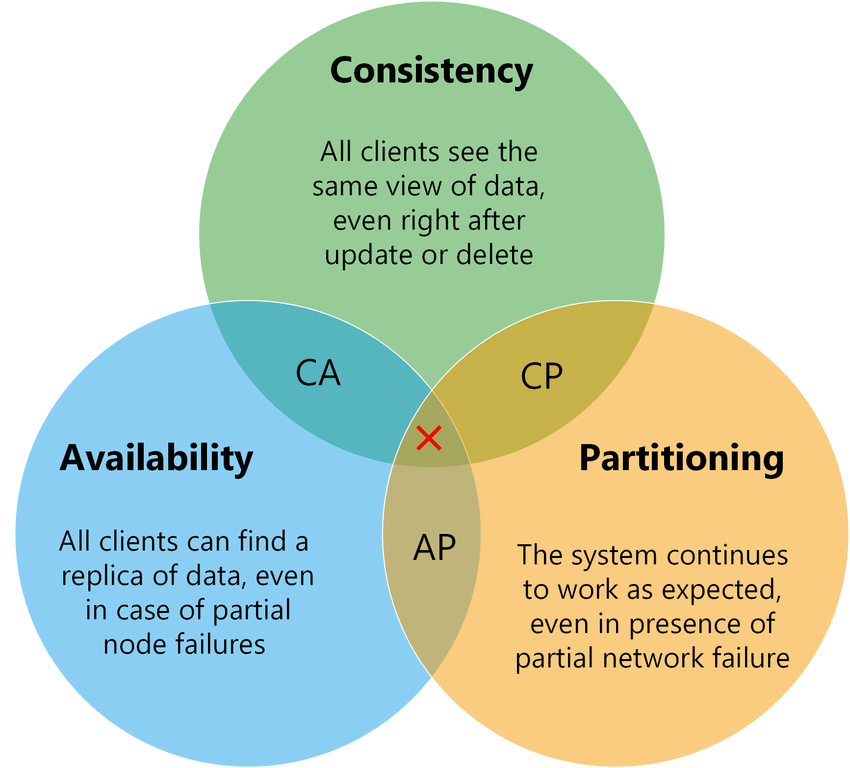

Bu teorem dağıtık bir sistemde Consistency, Availability ve Partition Tolerance özelliklerinin hepsinin aynı anda sağlanamayacağını teorik olarak ispatlamaya çalışır.

### 1.1.1. Consistency

Sisteme iletilen herhangi bir okuma isteği her koşulda ilgili kayıt için yapılmış olan son güncel değeri getirebiliyor olmalıdır. Eğer getirilemiyorsa hata verilmeli ve asla güncelliğinden şüphe edilen veriler talep eden taraflarla
paylaşılmamalıdır.

### 1.1.2. Availability

Dağıtık bir sistemin yapılan isteklere herhangi bir T anında cevap verebilmesi o sistemin yüksek erişebilirliğe sahip olduğu anlamına gelir. Herhangi bir clusterda bir node çalışamaz hale gelse dahi sistem diğer nodelar ile hayatını
sürdürebilmelidir

### 1.1.3. Partition Tolerance

Burada partition ile kastedilen aslında network bölünmesidir. Yani sisteminizin parçalarının farklı networklerde bulunma durumudur. Partition Tolerance ise nodelar arasında yaşanabilecek herhangi bir iletişim sorunu durumunda sistemin
hayatına devam edebilmesidir.

### 1.1.4. **AP** ( Availability & Partition Tolerance )

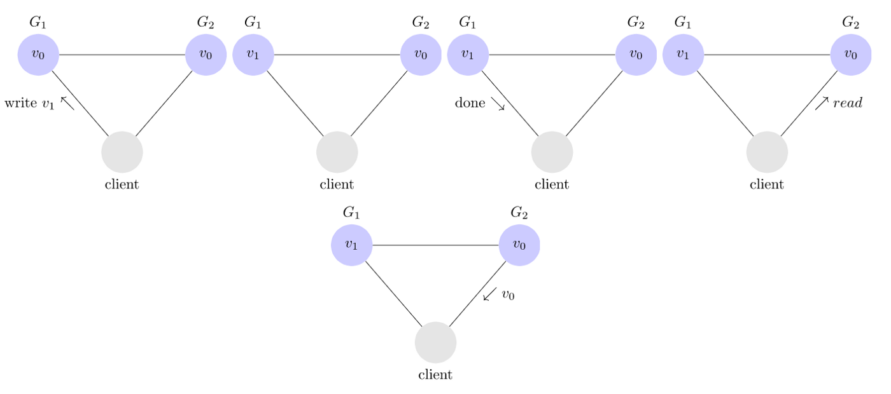

1. Her iki serverda da v0 versiyonlu bir kayit bulunmaktadir.
2. Client bu kayit uzerinde degisiklik yapip G1 servisine istek atar.
3. Tam bu esnada G1 ve G2 arasinda baglanti koptu ve G1 kendi uzerindeki degisiklikleri G2 ye gonderemiyor.
4. Islem G1 uzerinde basariyla tamamlanir ve verinin yeni versiyonu v1 olur.
5. Client okumak icin attigi istek G2 serverina duser ve bu datayi v0 olarak okur. Yani **Consistency** sorunu meydana gelmistir.

   **Example :** Cassandra

### 1.1.5. **CP** ( Consistency & Partition Tolerance )

1. Her iki serverda da v0 versiyonlu bir kayit bulunmaktadir.
2. Client bu kayit uzerinde degisiklik yapip G1 servisine istek atar.
3. Tam bu esnada G1 ve G2 arasinda baglanti koptu ve G1 kendi uzerindeki degisiklikleri G2 ye gonderemiyor.
4. G1 ve G2 arasinda iletisim sorunu oldugu icin G1 bu islemi iptal eder ve islemin basarisiz oldugunu client'a doner.
5. Sistemde tutarsızlık oluşmaması için işlem gerçekleştirilmemiş oldu ancak bu da erişilebilir olma durumunu etkiledi. G1 ile G2 arasındaki network sorunu düzelinceye kadar Client sistem üzerinde bir güncelleme yapamaz hale geldi. Yani **
   Availability** sorunu meydana gelmistir.

   Bu surecte okuma islemine devam edilebilir. (Stackoverflow bir keresinde boyle yapmisti, yazmayi kapatti ama okumaya izin verdi)

   **Example :** Redis, MongoDB

### 1.1.6. **CA** ( Consistency & Availability  )

Tüm değişiklikler aynı anda tüm düğümlerde görünür ve sistem tüm isteklere cevap verir. Ancak bir şekilde düğümler zarar görürse sistem kitlenir. İstemciler bloklanır. Bütün RDBMS'ler bu gruba dahildir. Tabi ki bu tarz durumlar için bazı
RDBMS teknolojilerinde sadece okumaya yönelik de olsa hizmet devam edebilmektedir. Çoğunlukla veri tutarlılığının her şeyden daha fazla ön planda olduğu sistemler için ideal durumdur. Mesela para transfer işlemleri böyledir.

**Example :** RDBMS (Oracle, MySql vs)

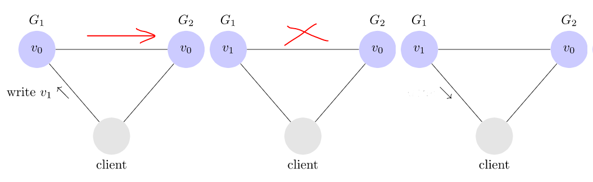

### 1.1.7. OTHERS

- NoSQL veritabanlarının doğuşunun bir nedeni de **Single Point of Failure** sorununun üstesinden kolayca gelebilmektir.
- Veri merkezinin tek bir network alt yapısı içerisinde bulunması da aslında bir çeşit single point of failure durumu yaratır.

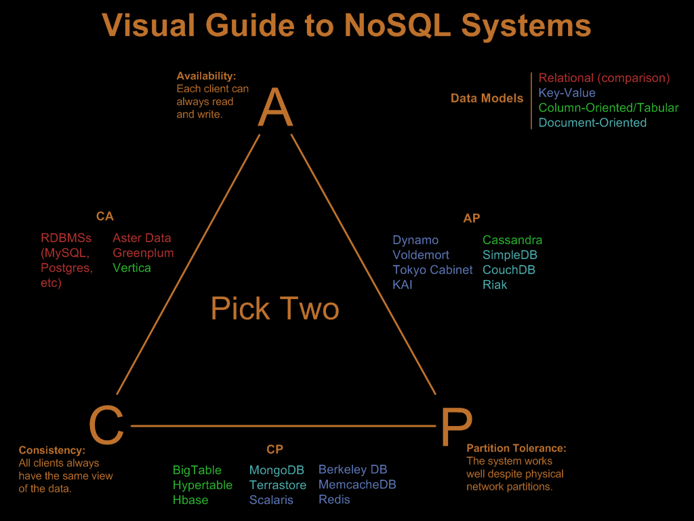

### 1.1.8. Links

- [blog 1](https://barisvelioglu.net/cap-teorem-nedir-53557407bdef)
- [blog 2 IBM](https://www.ibm.com/tr-tr/cloud/learn/cap-theorem)
- [blog 3](http://cagataykiziltan.net/cap-teoremi-acid-rdbms-ve-nosql-cozumleri-iliskisi/)

## 1.2. NoSQL

### 1.2.1. Advantages

- Scalability
- High Performance
- High availability
- **Flexible Data:** NoSQL databases are highly flexible as they can store and combine any type of data, both structured and unstructured, unlike relational databases that can store data in a structured way only.
- **Evolving Data Mode:** NoSQL databases allow you to dynamically update the schema to evolve with changing requirements while ensuring that it would cause no interruption or downtime to your application.
- Suitable for distributed systems

### 1.2.2. Disadvantages

- **Lack of Standardization :** There is no standard that defines rules and roles of NoSQL databases. Query Language is not standard.
- Backup of Database
- Consistency

- Tanimi **Not Only SQL** seklindedir.
- Dagitik mimarilerine cozum getirmektedir.
- Iliskisel degildir. Tablolar arasi Join yoktur

### 1.2.3. Type of NoSQL

- **Key Value :** Key-value seklinde bilgi tutar. **Exp:** DynamoDB
- **Wide Column :** Veriler geleneksel satir bazli olarak saklanir.
- **Document Based :** Dokuman tarzi JSON, XML, YAML gibi dosyalar saklanir.  **Exp:** MongoDB
- **Graph Based :** Veriler graph olarak ag gibi tutulur. **Exp:** Neo4J

| Data model | Performance | Scalability | Flexibility | Complexity | Functionality  |
| --- | --- | --- | --- | --- | --- |
| Key–value store | high | high | high | none | variable (none)  |
| Column-oriented store | high | high | moderate | low | minimal  |
| Document-oriented store | high | variable (high) | high | low | variable (low)  |
| Graph database | variable | variable | high | high | graph theory  |
| Relational database | variable | variable | low | moderate | relational algebra  |  

### 1.2.4. Links

- [blog 1](https://ravenfo.com/2021/07/07/dagitik-mimariler-sql-nosql-newsql-cap-teoremi/)
- [blog 2](https://technologypoint.in/advantages-and-disadvantages-of-nosql-databases/)
- [blog 3 Amazon](https://aws.amazon.com/tr/nosql/)
- [Type of NoSQL](https://en.wikipedia.org/wiki/NoSQL)

## 1.3. SQL vs NoSQL

### 1.3.1. Differences Between SQL and NoSQL

| Parameter | SQL | NOSQL |
| --- | --- | --- |
| Query Language | Structured query language (SQL) | No declarative query language |
| Type | table based  | document based, key-value, column based, graph  |
| Schema | predefined schema |dynamic schema for unstructured data. |
| Scaling | vertically scalable | horizontally scalable |
| Model | ACID | BASE & CAP |
| Best suited for | An ideal choice for the complex query intensive environment. | It is not good fit complex queries. |
| Hierarchical data storage | not suitable for hierarchical data storage. | More suitable for the hierarchical data  |
| Open-source | A mix of open-source like Postgres & MySQL, and commercial like Oracle Database. | Open-source |
| Consistency | It should be configured for strong consistency. | It depends on DBMS as some offers strong consistency like MongoDB, whereas others offer only offers eventual consistency, like Cassandra. |
| Best Used for | RDBMS database is the right option for solving ACID problems. | NoSQL is a best used for solving data availability problems |
| Network | Highly available network (Infiniband, Fabric Path, etc.) | Commodity network (Ethernet, etc.) |
| Storage Type | Highly Available Storage (SAN, RAID, etc.) | Commodity drives storage (standard HDDs, JBOD) |
| Best features | Cross-platform support, Secure and free | Easy to use, High performance, and Flexible tool. |
| Examples | Oracle, Postgres, and MS-SQL. | MongoDB, Redis, Neo4j, Cassandra, Hbase. |

### 1.3.2. Differences Between  Models

| SQL | MongoDB | DynamoDB | Cassandra  | Couchbase |  
| --- | --- | --- | --- | --- |  
| Table | Collection | Table | Table | Data bucket |  
| Row | Document | Item | Row | Document |  
| Column | Field | Attribute | Column | Field |  
| Primary key | ObjectId | Primary key  | Primary key | Document ID |  
| Index | Index | Secondary index | Index | Index |  
| View | View | Global secondary index | Materialized view | View |  
| Nested table or object | Embedded document | Map | Map | Map |  
| Array | Array | List | List | List |    

### 1.3.3. When to use SQL vs NoSQL

- If about 5 seconds downs time is ok for system, we can choose MongoDB. When an instance down, another up quickly. MongoDB support Consistency & Partition Tolerance. It only gives up availability for a short time.

### 1.3.4. Links

- [blog 1](https://www.talend.com/resources/sql-vs-nosql/)
- [Differences SQL & NoSQL](https://www.mongodb.com/nosql-explained/nosql-vs-sql)
- [When to use nosql](https://www.mongodb.com/nosql-explained/when-to-use-nosql)
- [read after](https://www.thorntech.com/sql-vs-nosql/)

**SQL**

- If consistency is critical in your System. (Banking App, money transfer vs)
- Small Project

**NoSQL**

- Graph or hierarchical data
- Distributed systems: Businesses growing extremely fast but lacking data schemata

## 1.4. ACID vs BASE

### 1.4.1. ACID

- **Atomicity :** The all or none principle. All operations in a transaction succeed or every operation is rolled back.
- **Consistency :** A processed transaction will never endanger the structural integrity of the database
- **Isolated :** Transactions do not contend with one anotherTransactions do not contend with one another
- **Durable :** Once the transaction has completed and the writes and updates have been written to the disk, it will remain in the system even if a system failure occurs.

### 1.4.2. BASE

- **Basic Availability :** There will be a response to every request even if the response is a system failure or does not successfully return the data. (Always accessible)
- **Soft-state :** The state of the system could change over time (even during times without input), because there may be changes going on due to "eventual consistency".
- **Eventual consistency :** The data might not be consistent immediately but eventually, it becomes consistent.

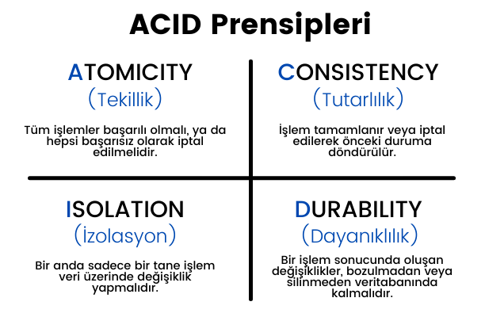

  

### 1.4.3. Comparing

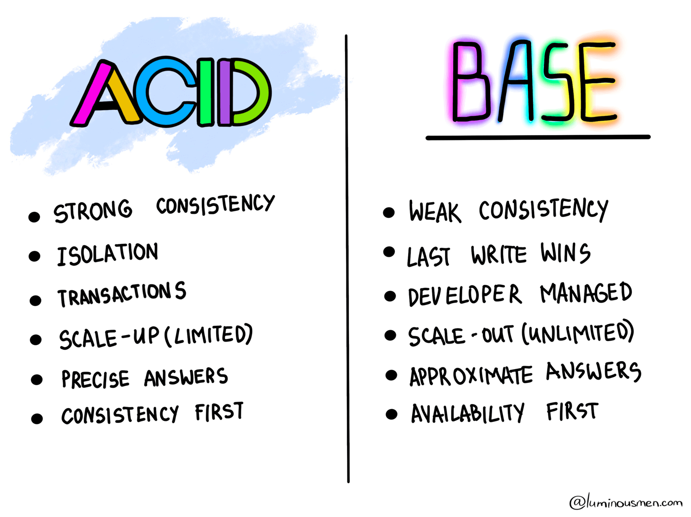

**Table 1:**

| ACID | BASE |
| --- | --- |
| Provides Vertical Scaling | Provides Horizontal Scaling |
| Strong Consistency | Weak Consistency – Stale Data OK |
| Isolation | Last Write Wins, availability first |
| Transaction | Programmer Managed |
| Available/Consistent | Available/Partition Tolerant |
| Robust Database/Simple Code | Simpler Database, Harder Code |
| Focus on “Commit” | Best Effort |
| Nested Transactions | Approximated Answers |
| Less Availability | Aggressive (optimistic) |
| Conservative (pessimistic) | Simpler |
| Difficult Evaluation(i.e Schema) | Faster, Easier evolution |
| High Maintenance Cost | Low Maintenance Cost |
| Expensive Joins and Relationship | Free from joins and Relationship |
| Examples: Oracle, MySQL, SQL Server, etc. | Example : DynamoDB, Cassandra, CouchDB, SimpleDB etc. |

   

**Table 2:**

| Criteria | ACID | BASE |
| --- | --- | --- |
| **Simplicity** | Simple | Complex |
| **Focus** | Commits | Best attempt |
| **Maintenance** | High | Low |
| **Consistency Of Data** | Strong | Weak/Loose |
| **Concurrency scheme** | Nested Transactions | Close to answer |
| **Scaling** | Vertical | Horizontal |
| **Implementation** | Easy to implement | Difficult to implement |
| **Upgrade** | Harder to upgrade | Easy to upgrade |
| **Type of database** | Robust | Simple |
| **Type of code** | Simple | Harder |
| **Time required for completion** | Less time | More time. |
| **Examples** | Oracle, MySQL, SQL Server, etc. | DynamoDB, Cassandra, CouchDB, SimpleDB etc. |

### 1.4.4. Example of ACID

1 document which had 2 pages content was sent to printer.

Transaction - document sent to printer;

- **atomicity** - printer prints 2 pages of a document or none
- **consistency** - printer prints half page and the page gets stuck. The printer restarts itself and prints 2 pages with all content
- **isolation** - while there were too many print outs in progress - printer prints the right content of the document
- **durability** - while printing, there was a power cut- printer again prints documents without any errors

### 1.4.5. Links

- [acid vs base](https://medium.com/geekculture/acid-vs-base-in-databases-1bcad774da26)
- [acid vs base 2](https://neo4j.com/blog/acid-vs-base-consistency-models-explained/)
- [acid vs base 3](https://luminousmen.com/post/acid-vs-base-comparison-of-two-design-philosophies/)
- [compare table 1](https://facingissuesonit.com/2020/02/26/acid-vs-base-database-transactions/)
- [compare table 2](https://www.geeksforgeeks.org/acid-model-vs-base-model-for-database/)
- [When to use SQL vs NoSQL](https://www.talend.com/resources/sql-vs-nosql/)
- [example of acid](https://stackoverflow.com/questions/3740280/how-do-acid-and-database-transactions-work)

## 1.5. Strong vs Eventual Consistency

- **Strong Consistency** offers **up-to-date** data but at the cost of **high latency**.
- While **Eventual consistency** offers **low latency** but may reply to read requests with **stale data** since all nodes of the database may not have the updated data.

### 1.5.1. Links

- [blog 1](https://hackernoon.com/eventual-vs-strong-consistency-in-distributed-databases-282fdad37cf7)
- [Examples](https://www.geeksforgeeks.org/eventual-vs-strong-consistency-in-distributed-databases/)

## 1.6. Optimistic vs Pessimistic Lock

### 1.6.1. Optimistic Locking

- Optimistic lock'ta lock'lanmış bir satırı, herkes çekebilir fakat herhangi bir thread bunu update etmeye kalktığında, eğer başkası önceden update etmiş ise, hata alır.
- Optimistic locking tamamen yazılımsal katmandaki logic ile yapılan bir özelliktir. **DB'nin desteklemesi gerekmez**.
- Optimistic Locking genellikle tabloya eklenen ekstra bir kolon yardımıyla sağlanır. Bu kolonda ilgili kaydın (satırın) versiyonu (1, 2, vb) ya da kaydın son değiştirilme tarihi tutulur. Bu kayıtla ilgili yapılacak Update ve Delete
  işlemlerinde kayıttaki versiyon kolonu WHERE olarak eklenerek ilgili kaydın başka bir Transaction tarafından değiştirilip değiştirilmediği kontrolü yapılır ve izolasyon sağlanmış olur.
- Optimistic Locking’in bütün uygulama boyunca uyulması gereken bir kontrat olduğuna dikkat etmek gerekir. Uygulamanın herhangi bir yerinde versiyon kolonuna dikkat edilmeden yapılacak güncellemeler kontratı ve dolayısıyla da data
  tutarlılığını bozar.
- Optimistic Locking’in çok fazla çakışma olmayan senaryolarda kullanılması daha anlamlıdır. Çakışma olasılığı yüksek olan senaryolarda başarılı olan Transaction dışındaki Transaction’ların Rollback yapılması gerekir ki bu da daha fazla
  efora sahip olabilir.

### 1.6.2. Pessimistic Locking

- DB'nin lock mekanizmasını desteklemesi gerekir. JPA bir satır okunduğunda, o satırı database tarafında lock konumuna geçirir. lock'lanan satır diğer uygulamalar tarafından okunamaz.
- Pessimistic, yani kötümser eş zamanlılık kontrolünde bir kullanıcı bir kaydı değiştirmek istediğinde o kayda kilit koyar ve o kaydı başkası değiştiremez. İlk değiştirmeye çalışan kişi kaydı değiştirdikten sonra değiştirilen kayıt
  üzerindeki kilit açılır ve diğer değiştirmek isteyenler artık değiştirebilir hale gelir.
- Pessimistic Locking de işlemler de session bazlı çalışır. Lock isteği yapıldığı anda başlar commit ya da rollback yapılana kadar kilitli kalır. Bunun birkaç tane sıkıntısı var. Birincisi performans sorunu denilebilir, bir diğer sorun da
  lock'un deadlock'a gebe olabilmesidir. Bunların yanında yönetimi zor olabilir, askıda kalan locklar olabilir

### 1.6.3. Semantic Locking

- Uygulama seviyesinde bir field ile kayitlarin atilmasini engelleyen bir business logic katmani yaklasimidir.
- Orneğin siparis pending statüsündeyse, gün sonu işleminin bu satırı hiçbir şekilde update etmemesi buna örnek verilebilir.

### 1.6.4. Links

- [blog 1](https://medium.com/@gokhansengun/rdbmslerde-optimistic-locking-cb68904dce92)
- [blog - Rahman Usta](https://kodedu.com/2012/10/jpahibernate-optimistic-ve-pessimistic-locking/)
- [blog - Yusuf](https://github.com/ysf0/tutorials/blob/master/tutorials/database.md#optimistic-vs-pessimistic)
- [Blog - Chris Richardson](https://chrisrichardson.net/post/microservices/2019/07/09/developing-sagas-part-1.html#what-is-the-semantic-lock-counter-measure)

### 1.6.5. TODO

- JPA Code Example for Optimistic and Pessimistic Lock. Also note the Spring Annotations.

## 1.7. Map Reduce

- MapReduce, büyük miktarda veriyi paralel olarak kumeyeyip guvenilir bir sekilde islenmesidir.
- The major advantage of MapReduce is that it is easy to scale data processing over multiple computing nodes.
- Verilerin butun halinde degilde parcalara ayrilip, bu parcalari mapleyip daha sonra paralel olarak islenirler. Biten parcalar tekrar birlestirilir,
- Paralel islendigi icin hizlidir.

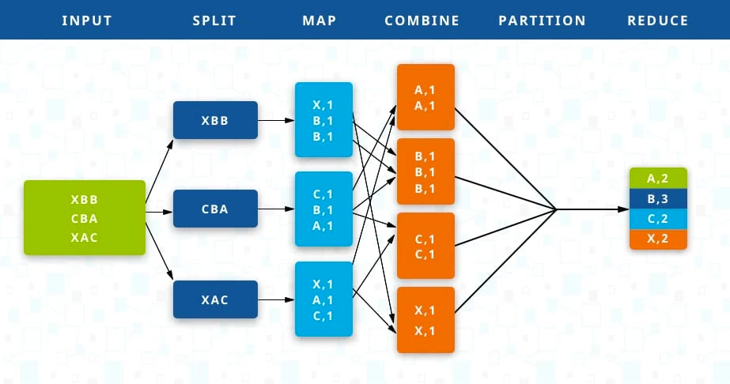

### 1.7.1. Links

- [blog](https://www.talend.com/resources/what-is-mapreduce/)
- [blog 2](https://www.tutorialspoint.com/hadoop/hadoop_mapreduce.htm)

## 1.8. DB normalization

Normalization is the process of reorganizing data in a database so that it meets two basic requirements:

- There is no redundancy of data, all data is stored in only one place.
- Data dependencies are logical,all related data items are stored together.

### 1.8.1. Benefits

- It is faster because of searching, sorting, and creating indexes.
- No redundancy, so save memory
- High Performance

## 1.9. Distributed Storage Solutions

- Services for scalable, available, secure, fast object storage
- Use cases: data lakes, websites backups, bit data
- Highly durable
- SLA : durability time. %99 durability means 3.65 days downtime in a year. %99.9999 means 30sn downtime in a year.
- AWS s3 glacier : archive data.
- If you want to private data storage you can use **Hadoop (HDFS)**, it is open-source.

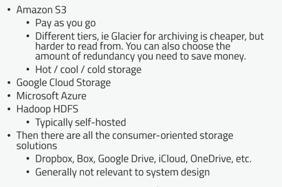

### 1.9.1. **Hadoop :**

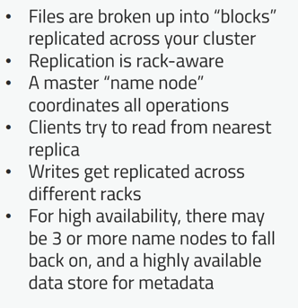

The **name node** coordinates how files are broken into blocks, and where those blocks are stored. In high availability settings, multiple name nodes may be present for failover.

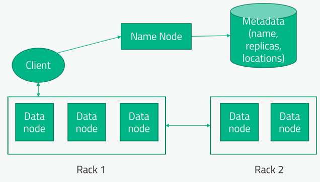

----------------------------------------------------------------------------------------------------------------------------------

# 2. NETWORKING

## 2.1. http vs http2 vs websockets

### 2.1.1. http vs http2 vs http3

- HTTP/1.1 ile HTTP/2 protokolleri arasındaki en büyük fark, HTTP/1.1 protokolünün her statik dosya için (css,js,resim,video vb.) ayrı istekler göndermesidir. Her dosya için tek tek istek gönderilmesi ve yanıtlanması açılma süresinin
  artmasına neden olur. HTTP/2 de ise gelen istekler toplu olarak alınarak, en hızlı şekilde yanıtlanmakta ve bu sayede açılış hızlarında ki gecikmelerin önüne geçilmektedir.

- HTTP3 QUIC(Quick UDP Internet Connection) protokolunu kullanir. UDP bazli oldugu icin hizlidir fakat paketlerin hepsini iletme konusunda dezavantaji vardir.

  

**Comparing :**

| **HTTP** |  **HTTP2** |  **HTTP3** |
| --- | --- | --- |
| run over **connection-oriented TCP** |run over **connection-oriented TCP**  | runs over QUIC, and QUIC runs over **connectionless UDP**  |
| Pros :   - Reliable and stable because of TCP | Pros :   - Reliable and stable because of TCP   - Concurrent requests can increase the load on the servers| Pros :   - Decrease in latency.   - Fast because of UDP  |
| Cons :   - |Cons :   - | Cons :   - Reliability issues. UDP applications tend to lack reliability. Packet loss |
| | Suitable for:   - With applications where response time isn’t critical.   - Where a reliable connection is needed (a strength of TCP) | Suitable for :   - Real-time applications such as online games   - Broadcast    - IoT(sensor)    - Web-based virtual reality    - Microservices: faster (or no) handshakes means faster traversal of the microservices mesh |

  

- **http vs http2 :**

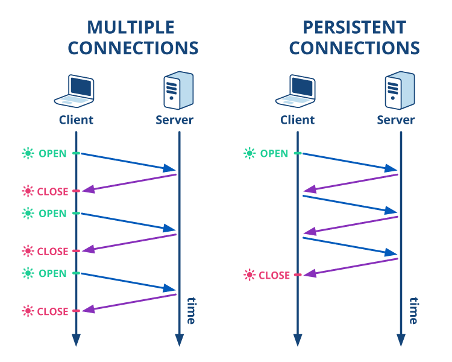

  

- **http vs http2 vs http3 :**

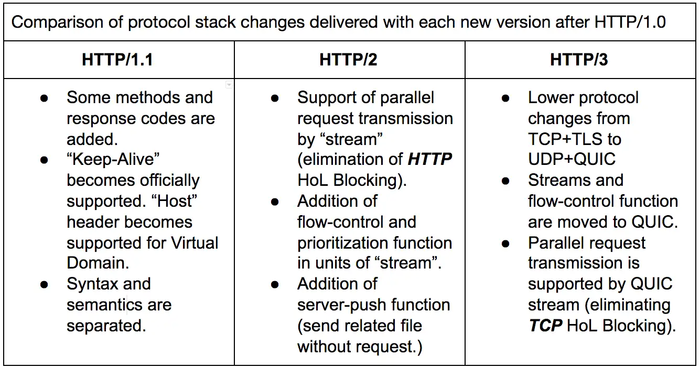

### 2.1.2. http vs websockets

| **FUNCTION** |  **WEB SOCKET** |  **HTTP** |
| --- | --- | --- |
| **
Definition** | Web Socket is a standard protocol for two-way data transfer between client and server. The Web Socket protocol is built over TCP. Web sockets are mainly used to push messages to a client in real time updates. | HTTP is a communication protocol of the world wide web. Http works as a request-response protocol in the client-server computing model. It is the most common version of HTTP used in modern web browsers and servers. |
| **Technology** | Full duplex | Half duplex |
| **Messaging** | Bi-directional and Stateful protocol | Unidirectional and Stateless protocol |
| **
Features** | −Moderate overhead to maintain and establish connection  −Minimum overhead per message  −Web socket keeps the connection open until state has died  −Frequent requests are very well handled by Web socket  −Web Socket uses WS protocol  −Faster than HTTP | −Moderate overhead to maintain and establish connection  −HTTP creates a short connection at the client and closes it once response is received from server  −Frequent requests deteriorate  performance of HTTP  −Http uses HTTP or https protocol for sending a request  −Slower than Web Socket |
| **Uses/Applications** | - All real time applications like trading, monitoring, notification services use Web Socket   - chat app, bitcoin, game| Simple RESTfull applications use HTTP |

### 2.1.3. TODO

- http/http2/http3 tablosunu doldur
- REST API icerisindeki header vs katmanlari incele
- Linkteki (!READ) olan blog'u incele

### 2.1.4. Links

[blog 1 turkish](https://www.hosting.com.tr/bilgi-bankasi/http-2-nedir-ne-ise-yarar/)
[blog 2 http2 vs http3 turkish](https://www.niobehosting.com/blog/http2-ve-http3-nedir/)
[! READ - http2 vs http3](https://ably.com/topic/http-2-vs-http-3)
[blog 3 rest vs web socket turkish](https://medium.com/frontend-development-with-js/http-request-response-ve-websocket-e3d4cc59d415)
[blog 4](https://ipwithease.com/web-socket-vs-http)

## 2.2. TCP / IP (Transmission Control Protocol/Internet Protocol)

internetin temel protokollerini içeren bir pakettir. Bir çok protokolün bir araya gelmesi ile oluşmuştur. TCP kısmı veri transferinde önemli noktaları belirtirken IP kısmı taşıma yolunu bulmayı belirtir.

Temel iletisim protokoludur. Internete bagli cihazlarin iletisim kurmasini saglar. IPv4 ve IPv6 ip versiyonlaridir. IPv4 32 bitlik adres uretilebilirken, IPv6 ile 128 bitlik ip tutulabilir.

### 2.2.1. TCP Layers

- **Application Layer** : Farklı sunucular üzerindeki süreç ve uygulamalar arasındaki iletişimi sağlar. (Örn: HTTP, FTP, SMTP, vs.)
- **Transport Layer** : Noktadan noktaya veri akışını sağlar. (TCP ve UDP)
- **Internet Layer** : Routerlar ile birbirine bağlanmış ağlar boyunca verinin kaynaktan hedefe yönlendirilmesini sağlar. Bu akışı sağlayan kaynak ve hedef adres bilgileri internet katmanında saklanır
- **Network Layer** : Uç sistem ile ağ arasındaki lojik arabirime ilişkin katmandır. Verilerin fiziksel olarak 1 ve 0’lara dönüştürülerek taşınması sağlanır. MAC

### 2.2.2. TCP vs OSI

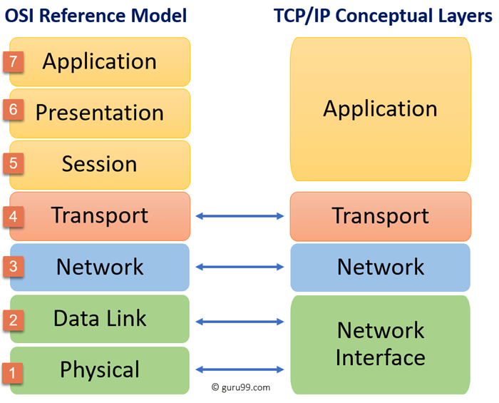

## 2.3. Security Protocols

- Kimlik Dogrulama, veri bicimlendirme, veri sifrelemelerle verileri korur.

### 2.3.1. SSL/TLS  (Secure Sockets Layer / Transport Layer Security )

Internet üzerinden hassas bilgi göndermek ve almak için modern bir şifreleme yöntemi kullanan güvenlik protokolüdür

Bilgisayarların ve kullanıcıların kimlik doğrulamaları asimetrik şifreler ile yapılmaktadır. Kullanıcılar karşılıklı bir biçimde kullandıkları simetrik anahtarlarla anlaşırlar.

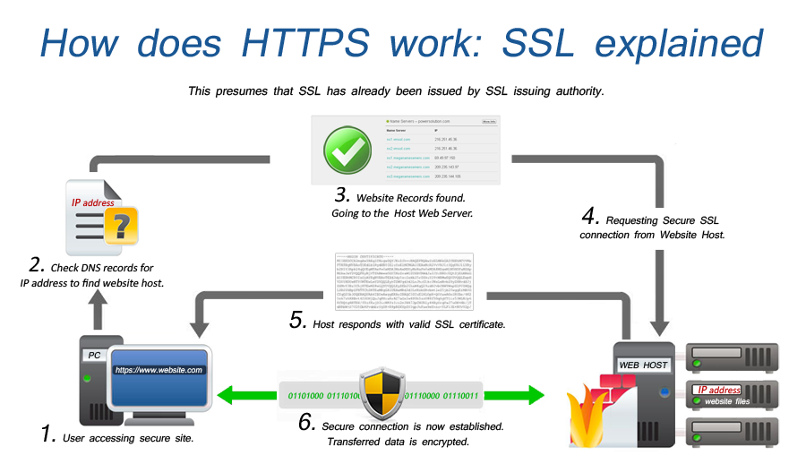

### 2.3.2. How Does Work Https and TLS

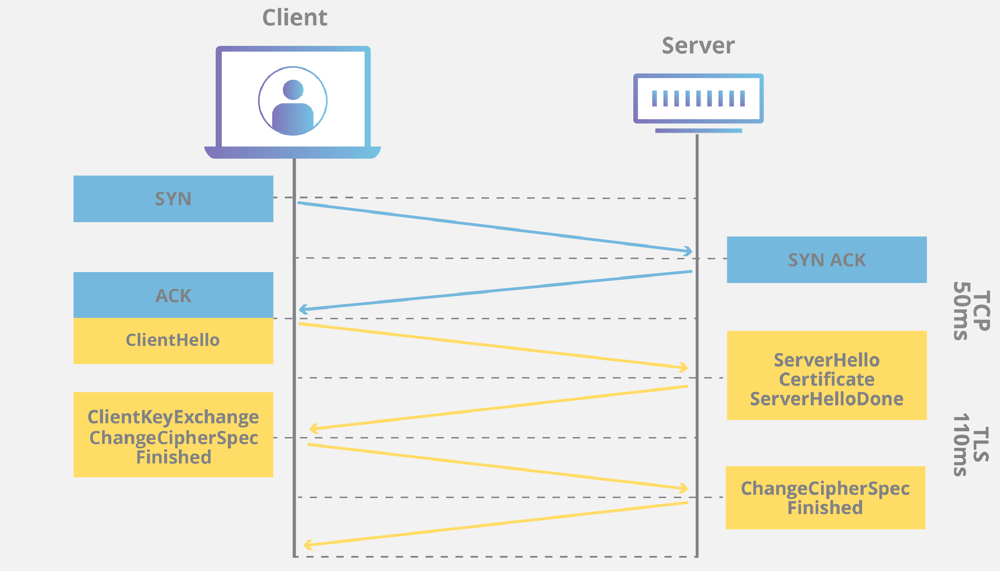

### 2.3.3. SSH

SH, şifreleme tekniğini kullanarak uzaktaki sunucuya giden & uzaktaki sunucudan gelen tüm iletişimlerin şifrelendiğinden emin olur.

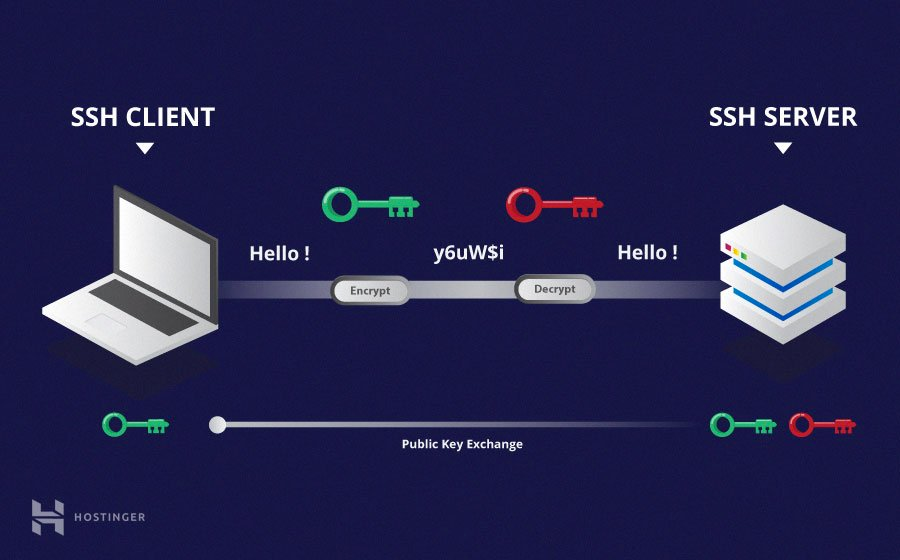

#### 2.3.3.1. How does SSH work

SSH, private ve public key olmak üzere 2 adet anahtar üzerinden çalışmaktadır. Bu anahtarlardan public key verileri şifreleyecek ve güvenli erişim talebinizi doğrulayacak şekilde, uzaktan erişim sağlamak istediğiniz sunucuya
yerleştirilmektedir. Private Key ise şifrelenmiş verileri çözmek üzere istemci tarafında bulundurulan ve gizliliğine oldukça önem verilmesi gereken anahtardır. Anahtar tabanlı kimlik doğrulamanın en temel kullanımı, otomasyonu güvenli hale
getirmektir. Otomasyonu sağlanmış SSH ile dosya aktarımları ve uygulamalar sorunsuz bir şekilde entegre edilebilmekte ve konfigürasyon yönetimi kolaylıkla gerçekleştirilebilmektedir.

## 2.4. TCP/UDP

|  Feature  |  TCP  |  UDP  |
| --- | --- | --- |
|  Connection status  |  Requires an established connection to transmit data (connection should be closed once transmission is complete)  |  Connectionless protocol with no requirements for opening, maintaining, or terminating a connection  |
|  Data sequencing  |  Able to sequence  |  Unable to sequence  |
|  Guaranteed delivery  |  Can guarantee delivery of data to the destination router  |  Cannot guarantee delivery of data to the destination  |
|  Retransmission of data  |  Retransmission of lost packets is possible  |  No retransmission of lost packets  |
|  Error checking  |  Extensive error checking and acknowledgment of data  |  Basic error checking mechanism using checksums  |
|  Method of transfer  |  Data is read as a byte stream; messages are transmitted to segment boundaries  |  UDP packets with defined boundaries; sent individually and checked for integrity on arrival  |
|  Speed  |  Slower than UDP  |  Faster than TCP  |
|  Broadcasting  |  Does not support Broadcasting  |  Does support Broadcasting  |
|  Optimal use  |  Used by HTTPS, HTTP, SMTP, POP, FTP, etc  |  Video conferencing, streaming, DNS, VoIP, etc  |   

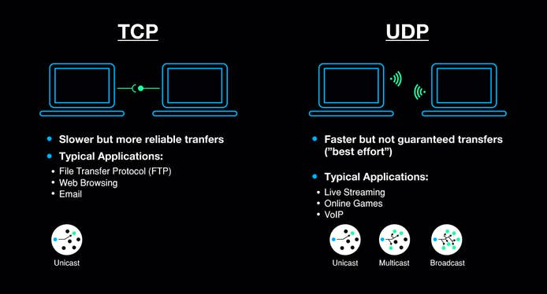

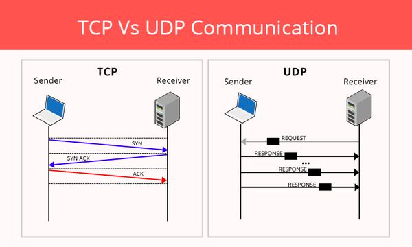

## 2.5. DNS lookup

The basic idea of DNS is that humans can't easily remember long strings of digits like machines can, but can much more easily remember words. So, when you type in a domain name like www.techopedia.com, the request is forwarded to a DNS
server (whether locally or at an ISP), which returns the corresponding IP address.

### 2.5.1. Types

- Forward DNS lookups
- Reverse DNS lookups

### 2.5.2. Links

[blog](https://www.techopedia.com/definition/29029/dns-lookup)

## 2.6. Load Balancer

- **Sticky Session :**  Aynı kullanıcının istekleri sürekli aynı sunucuya yönlendirilir ve buna Sticky Session adı verilir
- LB’ler userdan gelen TCP bağlantısını kendi sonlandirim arkada sunucu ile aralarında yeni bir TCP bağlantısı açarlar. Bu durumda sunucularda user IP loglamak istersek, user yerine IP’sini loglamış oluruz. LB üzerinde **X-Forwarded-For**
  header'ının set ederek sunucularda user IP'sine erisebiliriz.

### 2.6.1. L4 vs L7

**L4 :**

- OSI katmaninda layer4 (Transport Layer) seviyesinde calisir.
- IP ve TCP/UDP base calisir,
- Paketin gercek icerigini denetlemez,
- Bundan dolayi hizlidir,

**L7 :**

- OSI katmaninda layer7 (Application Layer) seviyesinde calisir.
- HTTP base calisir, header, cookie, message content ozelleklerinden faydalanir.
- SSL oturum kimlikleri vs paket iceginde detayli denetleme imkani sunar,
- Sticky Session ve cookie bazli islemler icin uygundur

### 2.6.2. Load Balancer Types

- Application Load Balancer
- Network Load Balancer
- Gateway Load Balancer
- Classic Load Balancer

### 2.6.3. Load Balancing Algorithms

- **Round Robin:** Gelen istekler sırayla sunucu grubuna dağıtılır. İlk olarak listedeki ilk sunucu kullanılır, sonraki sunucu seçimleri liste sonuna doğru devam eder.

- **Least Connections:** Yük dağıtımında en az bağlantıya sahip sunucu baz alınır. Trafiğin uzun oturumlarla sonuçlandığı durumlarda önerilir.

- **Source (IP Hash):** Yük dengeleyici istemcinin IP adresini, hangi sunucunun isteği alacağını belirlemek için kullanır. Bu yöntemle bir kullanıcı sürekli aynı sunucuya bağlanır.

### 2.6.4. Links

[blog 1 turkish](https://medium.com/@gokhansengun/load-balancer-nedir-ve-ne-i%C5%9Fe-yarar-32d608f98ef9)  
[blog 2 turkish](https://www.mshowto.org/load-balancing-yuk-dengeleme-nedir-ve-nasil-calisir.html)  
[! blog 3 read after: LB types](https://aws.amazon.com/elasticloadbalancing/features/)
[!! blog 4 read after: LB types and algorithms](https://www.appviewx.com/education-center/load-balancer-and-types/)
[blog 5 loadbalancer algorihms, turkish](https://www.vargonen.com/blog/load-balancing-nedir-load-balancer-nasil-hangi-durumlarda-kullanilir/)

### 2.6.5. TODO

- Load Balancer turlerini arastir ornekleriyle yaz. Ngix, F5 vs
- Load Balancing Algorithmalarini detaylandir

----------------------------------------------------------------------------------------------------------------------------------

## 2.7. ⏰ Public key infrastructure & Certificate Authority

## 2.8. ⏰ Symmetric vs Asymmetric Key

# 3. CLOUD COMPUTING

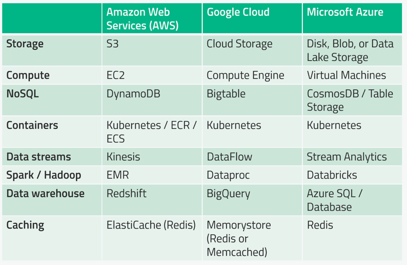

## 3.1. CDN

A **content delivery network**, or **content distribution network** (CDN), is a geographically distributed network of proxy servers and their data centers. The goal is to provide high availability and performance by distributing the service
spatially relative to end users.

### 3.1.1. Advantages vs Disadvantages

**Advantages :**

- The main advantage is an increase in the speed with which the content is delivered to the users.
- It is secure and avoid DDOS attacks.

**Disadvantages :**

- it costs money, and it adds a bit of complexity to your deployment procedures.

### 3.1.2. When to use a CDN?

- It will be most effective when you have a popular public website with some type of static content (images, scripts, CSS, etc.).

### 3.1.3. Is a CDN a performance booster?

In general, yes. When a specific request is made by a user, the server closest to that user (in terms of the minimum number of nodes between the server and the user) is dynamically determined. This optimizes the speed with which the content
is delivered to that user.

### 3.1.4. More Detail

Html, css, js ve media içeriklerini statik olarak bünyesinde barındırır, optimize eder ve ziyaretçiye cografi olarak en yakin yerden en hızlı sürede ulaştırılmasını sağlar.

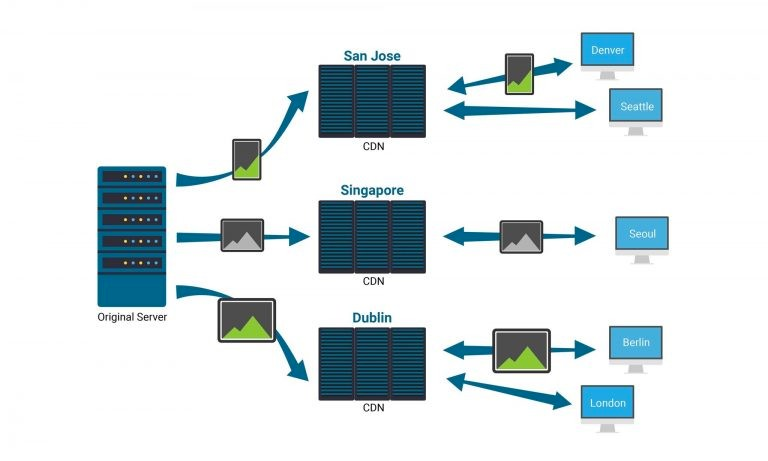  
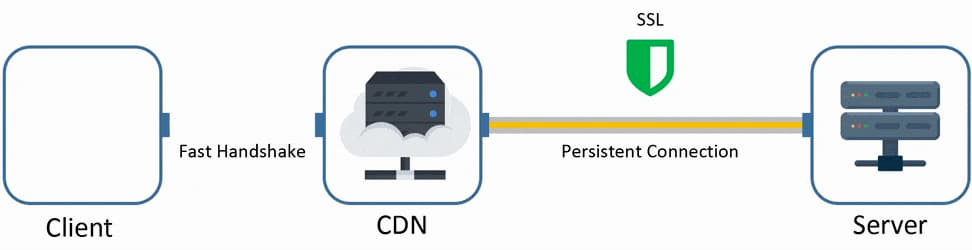  
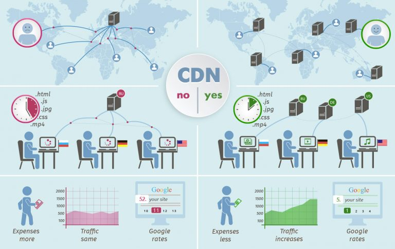

### 3.1.5. Links

- [stackoverflow](https://stackoverflow.com/questions/2145277/what-are-the-advantages-and-disadvantages-of-using-a-content-delivery-network-c)
- [wikipedia](https://en.wikipedia.org/wiki/Content_delivery_network)
- [turkish blog](https://www.hosting.com.tr/blog/cdn/)

## 3.2. Forward Proxy Vs Reverse Proxy

### 3.2.1. Forward proxy

**Forward Proxy:** Acting on behalf of a requestor (or service consumer)

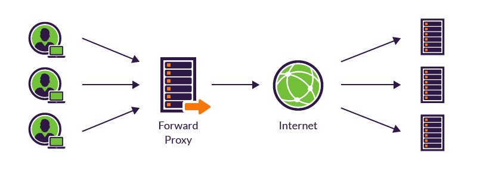

#### 3.2.1.1. Types of forward proxies

1. **Residential proxies :** These proxies have a real IP address provided by an Internet Service Provider (ISP) with a physical location.
2. **Datacenter proxies :** This proxy type isn’t affiliated with an ISP, as IP addresses come from secondary sources like data centers.

#### 3.2.1.2. What are forward proxies used for?

- **Accessing restricted geo-locations.**
- **Ensuring anonymity :**  A forward proxy server acts as an additional safety layer that hides the web server’s real IP address by using one of its own.
- **Web scraping** (Veri toplama)

### 3.2.2. Reverse Proxy

**Reverse Proxy:** Acting on behalf of service/content producer.

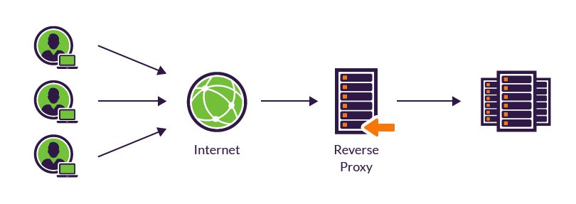

#### 3.2.2.1. Types of reverse proxies

1. **Regular reverse proxies :** This proxy type intercepts the request from a client, directs it to the server to process it, and then sends it back to the client. This proxy type is mainly used for security purposes.
2. **Load balancers :** This proxy is a reverse proxy subtype that leads to multiple backend instances instead of one. It is capable of distributing the traffic among multiple other servers and managing client-server communication between
   all of them

#### 3.2.2.2. What are reverse proxies used for?

1. Load balancing.
2. Caching
3. Anonymity and security

### 3.2.3. The differences

- The key difference between a forward proxy and a reverse proxy is that the first one is used by a client, e.g., a user inside a private network, while the second one is used by an internet server. A forward proxy can be positioned in the
  private network together with the user, or it can be online.
- Forward proxies ensure that websites never communicate directly with a user. On the other hand, reverse proxies ensure that users would not communicate directly with a back-end server.
- In effect, whereas a forward proxy hides the identities of clients, a reverse proxy hides the identities of servers.

### 3.2.4. Links

- [blog1](https://oxylabs.io/blog/reverse-proxy-vs-forward-proxy)
- [stackoverflow](https://stackoverflow.com/questions/224664/whats-the-difference-between-a-proxy-server-and-a-reverse-proxy-server)
- [blog2 Turkish](https://www.limonhost.net/makaleler/nedir/proxy-nedir-proxy-ayarlari-nasil-yapilir/)
- [blog3 Turkish](https://sabuhi-gurbani.medium.com/forward-reverse-proxy-ve-cdn-teknolojisi-a5e4b9161ab8)
- [More Detail Github Turkish](https://github.com/muratcabuk/derinlemesine-nginx/blob/master/1.reverse-proxy.md)

### 3.2.5. NGNIX

## 3.3. Data Center / Racks / Hosts

## 3.4. Virtual Machines & Containers

## 3.5. Vertical vs Horizontal Scaling

## 3.6. Bloom Filter & Count-mit Sketch

## 3.7. Partitioning vs Sharding Data

### 3.7.1. Resistant Hashing

## 3.8. Caching

- If reads are more than writes like wikipedia or e-commerce, caching is very beneficial.
- How long I hang onto this data without it being considered stale?
- Application can have hotspot problem. (Celebrity Problem )
- **Cold-start problem:** When your cache down, when it up again it will be empty so all traffic will be access db directy so it can crach your db. **Solution of Cold-start :** Have a separate procedure for warming up the cache before you
  actually expose it to the outside world. Have a process for actually artificially sending traffic to the caching layer for simulated requests.
- Expiration Policy : If it is too short, cache can't be effective,

### 3.8.1. Eviction Policy

Decide when you call cache miss.

- LRU (Least Recently Used): It is most commonly used, and evicts data that hasn't been accessed in the longest amount of time once memory for the cache fills up.
- LFU (Least Frequently Used)
- FIFO (First In Fist Out)

**LRU :**    
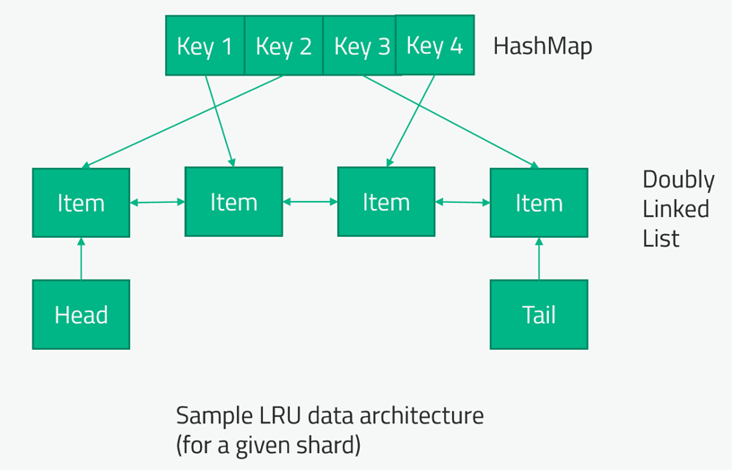

- Get data from Head, evict data from tail

## 3.9. CPU/Memory/Hard drive/Network Bandwidth

## 3.10. Random vs Sequential read/write on disk

## 3.11. CDNs & Edge

## 3.12. Paxos- Consensus over distributed hosts

### 3.12.1. Leader Election

## 3.13. Design Patterns & Object Oriented Design

## 3.14. Publish Subscriber Or Queue

## 3.15. Multi-threading, concurrency, lock, synchronization, CAS

## 3.16. Microservices

### 3.16.1. 12 Factors

- [link](https://12factor.net/)

----------------------------------------------------------------------------------------------------------------------------------

# 4. BOOK

## 4.1. Chapter 1 Scaling

### 4.1.1. Database

#### 4.1.1.1. RDBMS

#### 4.1.1.2. NoSQL

These databases are grouped into four categories:

- key-value stores
- graph stores
- column stores
- document stores
-

Join operations are generally not supported in non-relational databases

#### 4.1.1.3. RDBMS vs NoSQL

Relational databases are the best option because they have been around for over 40 years and historically, they have worked well.

**Non-relational databases might be the right choice if:**

- Your application requires super-low latency.
- Your data are unstructured, or you do not have any relational data.
- You only need to serialize and deserialize data (JSON, XML, YAML, etc.).
- You need to store a massive amount of data.

### 4.1.2. Vertical scaling vs horizontal scaling

#### 4.1.2.1. Vertical Scaling

##### 4.1.2.1.1. Advantages

- It is a great option when traffic is low,
- Simple

##### 4.1.2.1.2. Disadvantages

- Vertical scaling has a hard limit. It is impossible to add unlimited CPU and memory to a single server.
- Vertical scaling does not have failover and redundancy. If one server goes down, the website/app goes down with it completely.

#### 4.1.2.2. Horizontal Scaling

Horizontal scaling is more desirable for large scale applications

### 4.1.3. Database Replications

#### 4.1.3.1. Advantages

- Better performance
- Reliability
- High availability

### 4.1.4. Cache

A cache is a temporary storage area that stores the result of expensive responses or frequently accessed data in memory so that subsequent requests are served more quickly.

#### 4.1.4.1. Advantages

- Better system performance,
- To reduce database workloads,
- To scale the cache tier independently

**Read-through cache model :**

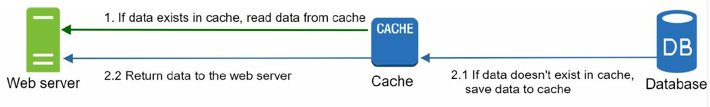

#### 4.1.4.2. Considerations for using cache

- **Decide when to use cache**. Consider using cache when data is read frequently but modified infrequently. Since cached data is stored in volatile memory, a cache server is not ideal for persisting data. For instance, if a cache server
  restarts, **all the data in memory is lost**. Thus, important data should be saved in persistent data stores.
- **Expiration policy**. It is a good practice to implement an expiration policy. Once cached data is expired, it is removed from the cache. When there is no expiration policy, cached data will be stored in the memory permanently
- **Consistency:** maintaining consistency between the data store and cache is challenging
- **Mitigating failures:** A single cache server represents a potential single point of failure
  **(SPOF)**
- **Eviction Policy:** Once the cache is full, any requests to add items to the cache might cause existing items to be removed. This is called **cache eviction**. Least-recently-used (LRU) is the most popular cache eviction policy. Other
  eviction policies, such as the Least Frequently Used (LFU) or First in First Out (FIFO),

### 4.1.5. Content delivery network (CDN)

A CDN is a network of geographically dispersed servers used to deliver static content.

#### 4.1.5.1. Considerations of using a CDN

- Cost
- Setting an appropriate cache expiry
- CDN fallback: to cope with CDN failure
- Invalidating files

## 4.2. Consistent Hashing (Ring Hashing)

Load balances, replaceted db'lerde, data storage'larda (memcache, redis), sharding de kullanilir

## 4.3. Design A Key Value Store

- Conflict resolution = ayni anda redise ayni key ile farkli daha yazildiginda hangi datayi esas kabul edecegiz.
  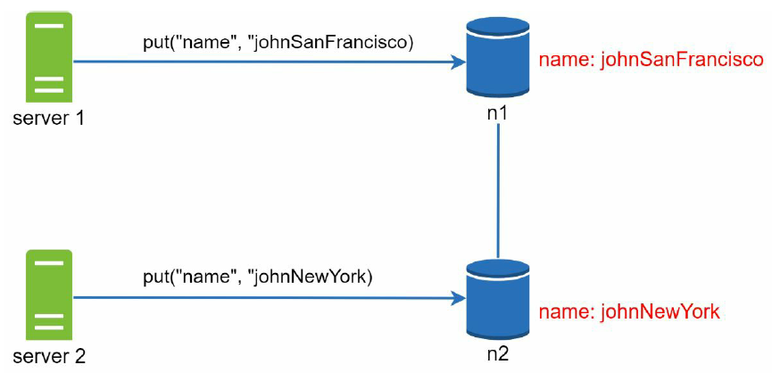
- Conflict resolution algoritmalari: "Latest write wins", "Vector Clock"
- CRDT algorithm : google doc'ta ayni anda iki kisinin dosyayi editlemesini sagliyor
- Serializibility: Serverlara gelen eventleri zamana gore siraya yerlestirmek.
- **Gossip Protokol** (check **Heartbeat**) : Diger servisler(node'lar) down olmusmu anlamak icin hepsina sormak.
  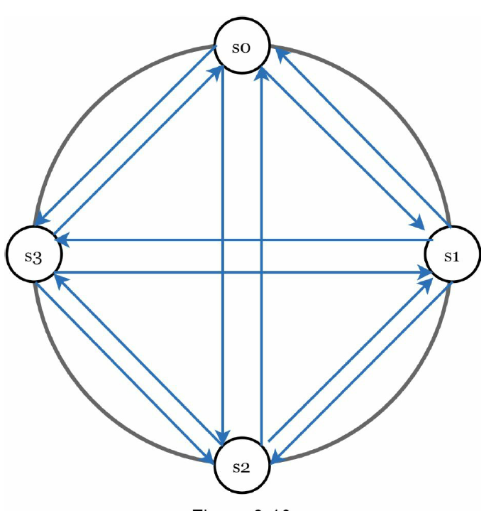
  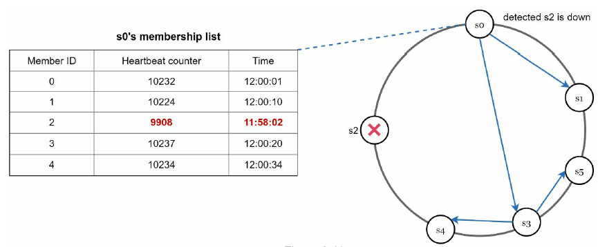
- Merkle Tree : Datayi partition'lara bolup, butun datayi hashliyoruz, sonra o hash diger serverlardaki hash ile aynimi o kontrol ediliyor. Ayni olmayan bucket'ler icin senkronizasyon yapilir
  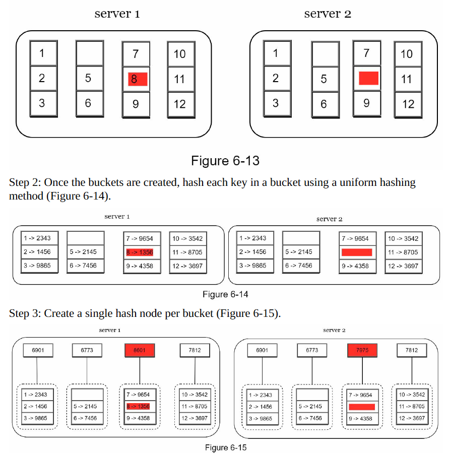
  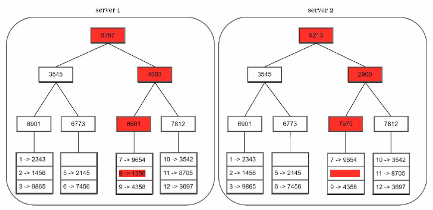
- Merkle Tree file system de de kullanilir. Once klasorler'in hashlerine bakilir ayni degilse icindeki klasorlere yada file'lara bakilir.
- **Bloom Filter** : Partion'in icererisinde o key var mi yok mu onu doner, genelde %95 ihtimalle dogru doner. Chrome zararli site kucuk bir partition/db tutar ve bunu bloom filter ile kontrol ederek bize zararli olduguyla ilgili uyari
  doner.

### 4.3.1. Summary

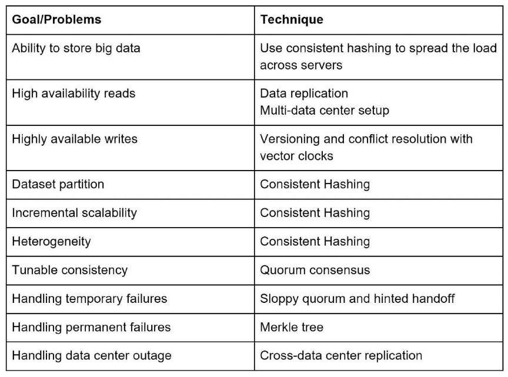

## 4.4. News Feed (Time Line)

### 4.4.1. Fanout Write vs Fanout Read

- **Fanout Write**: news yaratildiginda tum takipcilerin time line'inana yazilir (daha takipci giris yapmadan news'lar hazir olmus olacak)[**pre-computed**]. Faydasi: takipci siteye giris yapinca hizli bir sekilde time linelari alir.
  Zarari: eger takipcilerin cogu aktif degilse bosuna timeline lara yazilmis olur. Buyuk news'ler icin (ornegin Justen Biber'dan) hotkey problemleri olusur

- **Fanout Read**: Takipci giris yaptiktan sonra ilgili kisinin news'ini alir. Faydasi sisteme cok girmeyen kullanicilar icin bosuna bellek ve cpu harcanmamis olunur, hotkey problemi engellenmis olur. Zarari: news feed leri cekmek zaman
  alacak.

## 4.5. Web Crawler

- **honeypot** search bot'lari tuzaga dusurmek icin kullanilan bir yapi. Search bot donguye giriyor ve cikamiyor vs.

## 4.6. Chat System

### 4.6.1. DB or No-SQL

Selecting the correct storage system that supports all of our use cases is crucial. We recommend key-value stores for the following reasons:

- Key-value stores allow easy horizontal scaling.
- Key-value stores provide very low latency to access data.
- Relational databases do not handle long tail of data well. When the indexes grow large, random access is expensive.
- Key-value stores are adopted by other proven reliable chat applications. For example, both Facebook messenger and Discord use key-value stores. Facebook messenger uses HBase, and Discord uses Cassandra .

### 4.6.2. Queue Reliability

**Queue Delivery :**

- at most once: 0 or 1 : ya mesaj gider yada gitmez
- at least once: 1 & N : en az bir mesaj gider, daha fazlasi da gidebilir
- ordering: cok onemli degilse order a dikkat edilme garantisi verilmeyebilir
- **Dead letter queue** : patlayan mesajlari sonradan islenmek yada incelenmek icin baska bir queue ya atilmasidir.
- Queue de bekleyen mesajlari monitor edin. Queue size ve bir mesaji queue ya koyuldugunda consume edilmesi ne kadar suruyor. (mean time in queue)

# 5. TODO

- Redealection strategies
- (**Eviction Policy**) : background ?

# 6. NOTES

- google cloud load balancer global ip adresine sahip, en yakindaki region'a aktarim yapar ve orda outage varsa BGP/BCP ile baska yerlere aktarilir
- cassandra da bir sorgunun tum node lara gitmesi engellenir.
- book ch2 yazilim muhendislerine cok cikmiyor ama cikarsa sasirma!
- Microservice kullaniliyorsa; API GATEWAY ile authentication firewall, whitelist ve rate limiter kontrol edilebilir
- Maglev google'in drive icin kullandigi load balancer.
- Amazon S3 supports same-region and cross-region replication.

# 7. WORDS

- **RDBMS =** Traditional Relational Database
- **NoSQL =** Non-Relational Database
- **Master/Slave =**  Original/Copies = Lead/Follower
- **CND =** content delivery network
- **SPOF =** A single point of failure is a part of a system that, if it fails, will stop the entire system from working
- **Fast Read** = **Stale Read** =? **out-of-date** => Bayatlamis veriyi okumak
- **News Feed** = Time line
- **Cold Storage** : like AWS S3 Glacier

